# 실습전 준비사항

## 1. 리전 변경

- AWS 웹 과닐 콘솔 접근
  - 서울리전으로 변경

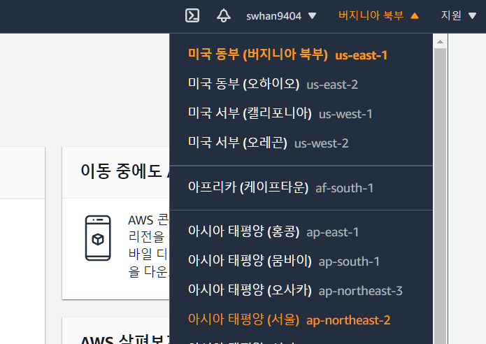


## 2. SSH 키페어 생성 

- EC2 검색 - 콘솔

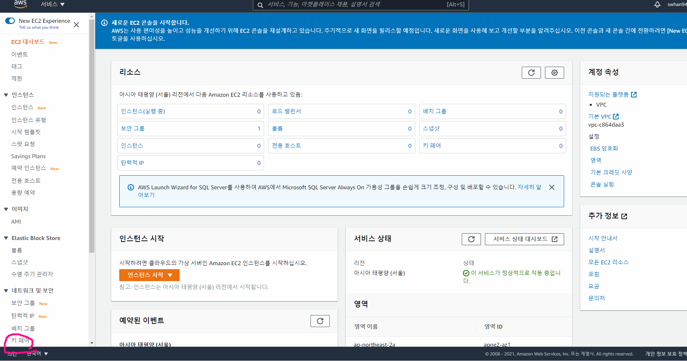

- 키페어 생성
  - 파일형식 pem으로 하는 것을 추천

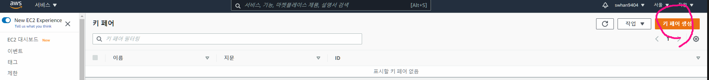

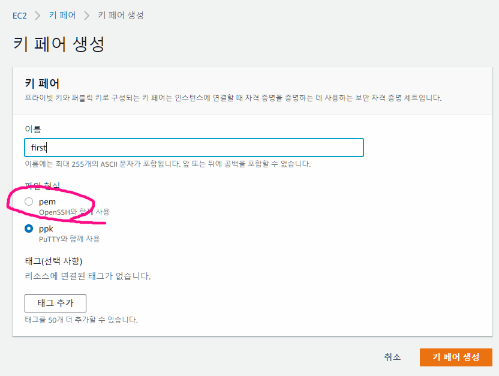


#### SSH

- Secure Shell Protocol
- 네트워크 프로토콜 중 하나로 컴퓨터와 컴퓨터가 인터넷과 같은 Public Network를 통해 서로 통신을 할 때 보안적으로 안전하게 통신을 하기 위해 사용하는 프로토콜
  - 데이터 전송
  - 원격 제어
- Private Key와 Public Key
  - SSH는 다른 컴퓨터와 통신을 하기 위해 접속을 할 때 우리가 일반적으로 사용하는 비밀번호의 입력을 통한 접속을 하지 않습니다.
  - 기본적으로 SSH는 한 쌍의 Key를 통해 접속하려는 컴퓨터와 인증 과정을 거치게 됩니다. Private Key와 Public Key 로 이루어진 한 쌍의 Key로 구성됩니다.
  - Public Key
    - 이 Public Key를 통해 메시지를 전송하기 전 암호화를 하게 됩니다.
    - Public Key로는 암호화는 가능하지만 복호화는 불가능
  - Private Key
    - Private Key는 절대로 외부에 노출이 되어서는 안되는 Key로 본인의 컴퓨터 내부에 저장하게 되어있습니다.
    - Private Key를 통해 암호화된 메시지를 복호화 할 수 있습니다.


## 3.VPC 존재 확인

- VPC 검색
  - 가상 프라이빗 클라우드 - VPC


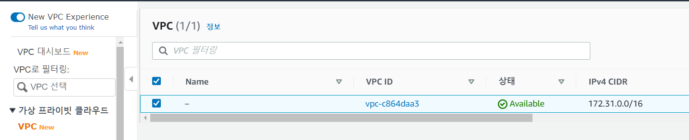


### 3.1 만약 기본 VPC 가 없을경우 만드는 법

- VPC 검색하면 들어와지는 VPC 대시보드
  - VPC 마법사 시작 > 버튼 클릭

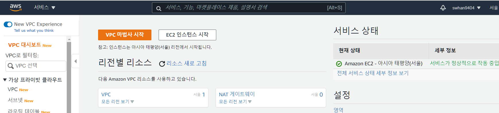


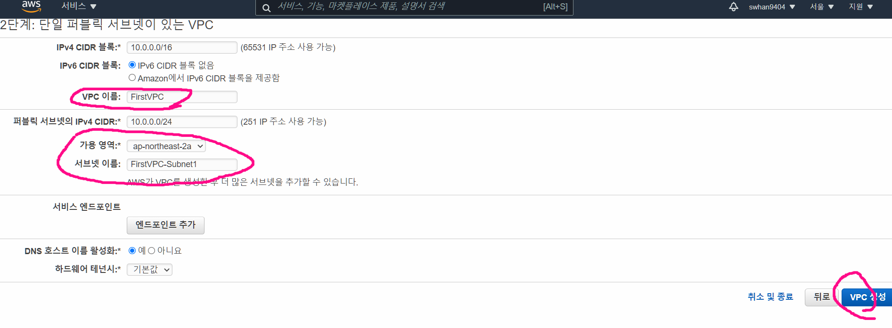

# 실습

- EC2 배포방법
  1. AWS Management Console
  2. AWS CLI
  3. AWS SDK

- 실습 목표

  - EC2 배포 

  - EC2 에 Web 서비스 올리기
  - Web에서 접속하기

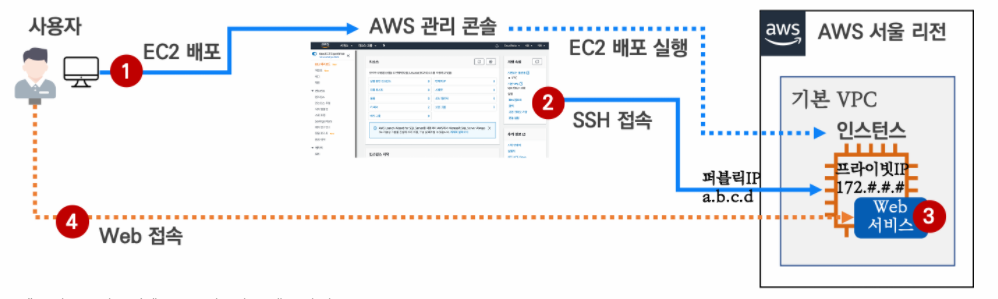


## EC2 배포

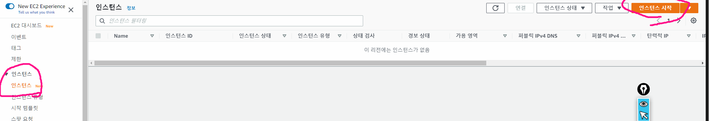

- 단계 1 : Amazon Machine Image(AMI) 선택 → 'Amazon Linux 2 AMI : 64bit(x86)' 선택
  - AMI는 인스턴스를 시작하는 데 필요한 소프트웨어 구성(운영 체제, 애플리케이션 서버, 애플리케이션)이 포함된 템플릿
  - '**프리 티어만**' 클릭 시 무료로 제공 가능한 운영체제만 필터링 됨
  - Amazon Linux 에 대한 설명
    - https://docs.aws.amazon.com/ko_kr/AWSEC2/latest/UserGuide/amazon-linux-ami-basics.html
    - https://aws.amazon.com/ko/amazon-linux-2/

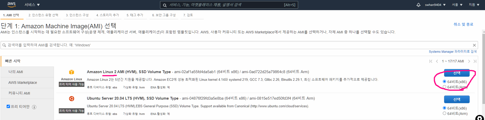

- 단계 2 : 인스턴스 유형 선택 → 't2.micro vCPU(1) MEM(1GiB)' 선택

  - 인스턴스는 애플리케이션을 실행할 수 있는 가상 서버입니다
  - 이러한 인스턴스에는 CPU, 메모리, 스토리지 및 네트워킹 용량의 다양한 조합이 있으며, 애플리케이션에 사용할 적절한 리소스 조합을 유연하게 선택할 수 있습니다

  - GiB 란?

    - 기가 이진 바이트(Giga Binary Byte)
    - 1GiB = 2^30 바이트 
    - 기존 GB는 10진법을 기준으로 만들어져서(10^9) 실제로 용량이 931.3GiB 밖에 되지 않는다. 좀 더 명확한 표기를 위해 GB 대신 사용

    

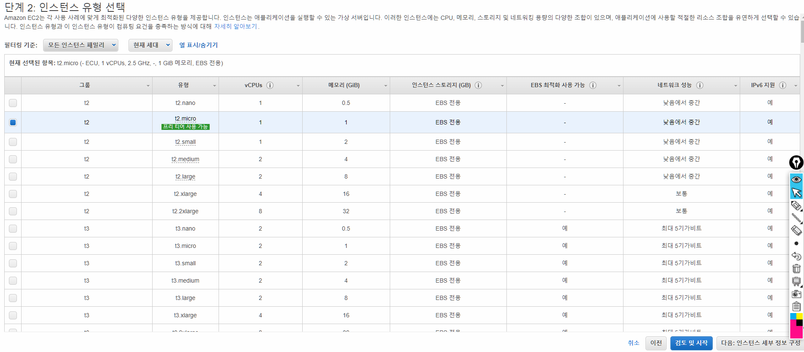

- 단계 3 : 인스턴스 세부 정보 구성 → '기본값 그대로 두고' 하단 

  - 중요한 설정 내용만 설명 및 확인 : 인스턴스 개수(1) , 네트워크, 퍼블릭 IP 자동 할당(서브넷 사용 설정 - 활성화)
    - 인스턴스 갯수 - 서버 갯수
    - 퍼블릭 IP 자동 할당 - 비활성하게 되면 EC2를 접속할 수 없게됨
  -  네트워크 IP란?
    - IP 는 OSI 7 Layer 중 3계층에 속하며 쉽게 전 세계 인터넷 네트워크를 경유하여 통신하기 위한 주소와 같다
    - IP 는 0.0.0.0 ~ 255.255.255.255 있다.
    - IP 는 공인 IP주소(Public IP, 인터넷 통한 통신 가능)와 사설 IP주소(Private IP, 인터넷 통한 통신 블가능)가 있다
      - 공인 IP 주소 : 집주소
      - 사설 IP 주소 : 나의 방
        - **사설 IP**는 10.0.0.0/8, 172.16.0.0/12 , 192.168.0.0/16 대역 내에서 사용할 수 있다
        - 사설 IP는 NAT 도움을 받아서 인터넷 통신을 할 수 있다

  

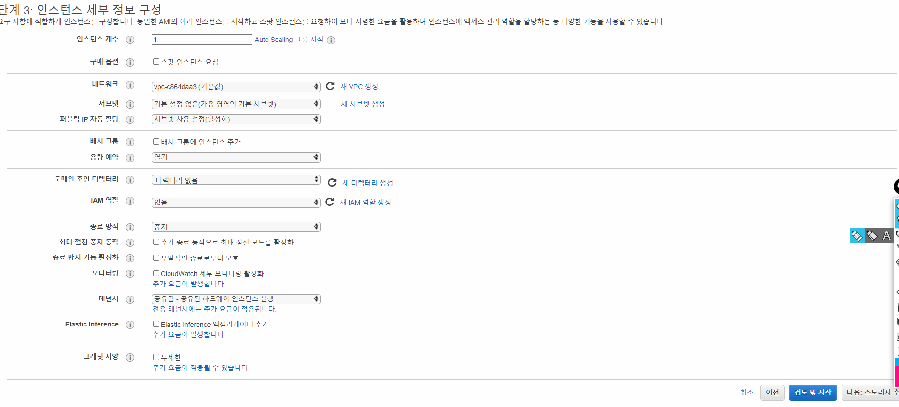

- 단계 4 : 스토리지 추가 선택 → '기본값 그대로 두고' 하단 
  - 중요한 설정 내용만 설명 및 확인 : **크기**(8 GiB) , 볼륨 유형(범형 SSD - gp2)
  - 인스턴스가 다음 스토리지 디바이스 설정으로 시작됩니다.
  - **추가 EBS 볼륨** 및 인스턴스 스토어 볼륨을 인스턴스에 연결하거나 **루트 볼륨**의 설정을 편집할 수 있습니다.
    - EBS : 블록 스토리지 - SSD나 HDD와 같다고 생각하면 됨
    - https://docs.aws.amazon.com/ko_kr/AWSEC2/latest/UserGuide/ebs-volume-types.html


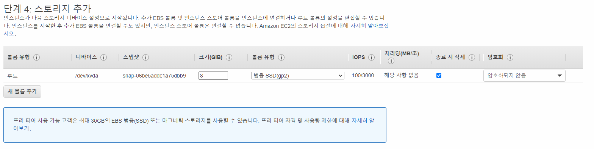


- 단계 5 : 태그 추가 → 아래 '키 값' 입력 후 
  - 태그 지정 시 인스턴스, 이미지 및 기타 Amazon EC2 리소스를 쉽게 관리할 수 있습니다. 지정한 태그에 따라 특정 리소스를 빠르게 식별할 수 있습니다.
    - https://docs.aws.amazon.com/ko_kr/AWSEC2/latest/UserGuide/Using_Tags.html
  - 키 : Name & 값 : FirstServer


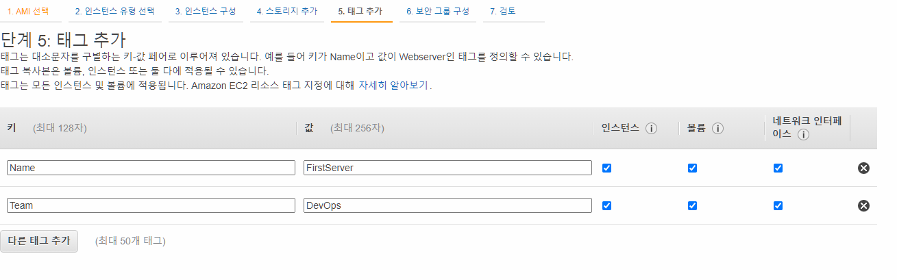


- 단계 6 : 보안 그룹 구성 → 새 보안 그룹 생성(체크 확인) → 아래 유형(SSH), 소스 '위치 무관' 선택 후 검토 및 시작
  - 보안 그룹은 인스턴스에 대한 트래픽을 제어하는 방화벽 규칙 세트입니다. 이 페이지에서는 특정 트래픽을 인스턴스에 도달하도록 허용할 규칙을 추가할 수 있습니다.
  - 포트란?
    - 인터넷 통신으로 상대방 목적지까지  IP 정보를 통해 전달 > 서비스에 맞춰 해당 포트로 들어감
    - OSI 4 Layer 는 Port(포트)는 크게 TCP 와 UDP 로 구성되며 포트 범호는 0~65535 사용 할 수 있다
  - 포트 번호들의 의미
    - 80 : HTTP
    - 22 : SSH
    - 23 : Telenet
  - 데이터 전송을 사용하기 위한 프로토콜 TCP 와 UDP
    - TCP : 연결을 갖고 나서, 이루어지는 방식
      - 특정 사용자 하고만 데이터를 주고받는 방식
      - 터넷상에서 데이터를 메세지의 형태로 보내기 위해 IP와 함께 사용하는 프로토콜
    - UDP : 연결을 갖지 않고 데이터를 주고 받는 방식
      - 데이터를 데이터그램 단위로 처리하는 프로토콜
      - 방송에서 주로 사용

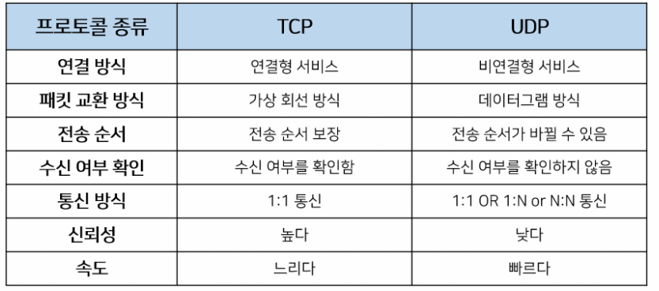

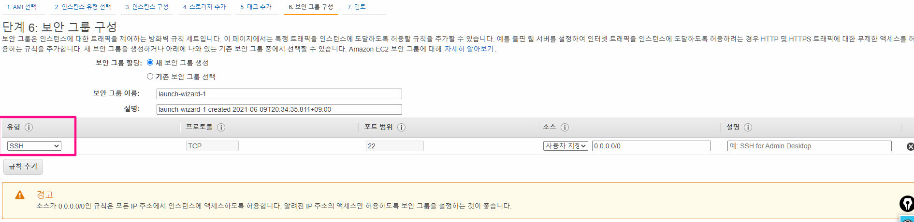


- 단계 7 : 시작하기 ⇒ (SSH 키 관련 선택) 기존 키 페어 선택 또는 새 키 페어 생성 : 기존 키 페어 선택 후 자신의 SSH 키 페어 선택 후 체크 후 인스턴스 시작 클릭


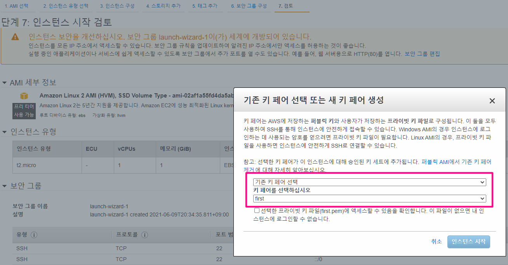


- 단계 8 : 인스턴스 생성 확인
  - 생성된 인스턴스 선택 후 하단에 '세부 정보'에서 퍼블릭 IP 주소와 프라이빗 IP 주소 확인


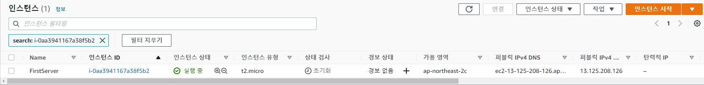

## EC2 로 접속하기

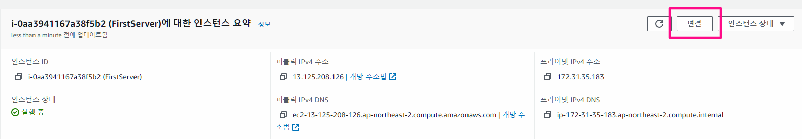

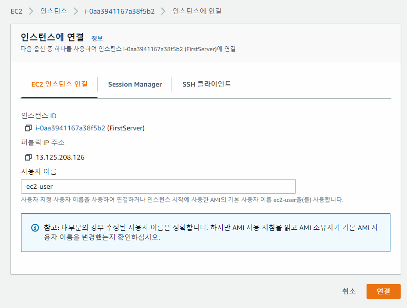

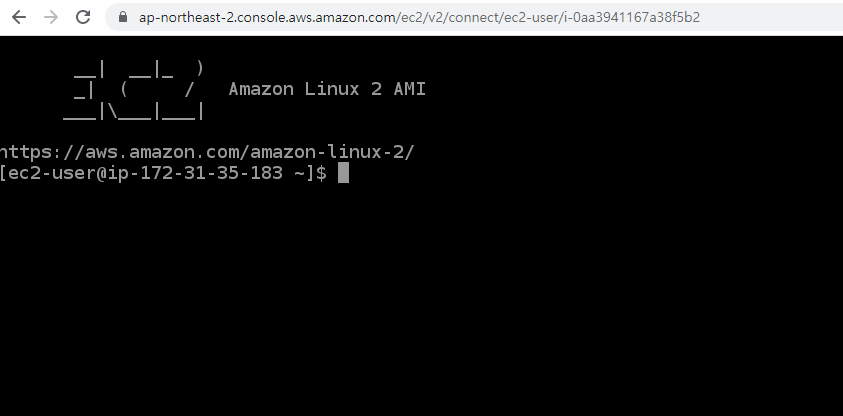


```bash
# 실습의 편리를 위해서 root 계정으로 전환합니다.
# 실제 현업에서 root(관리자, 수퍼유저)로 사용은 되도록 금합니다. 하지만 실습의 경우이니 편리성을 위해서 관리자로 전환하여 진행합니다.
[ec2-user@ip-172-31-46-221 ~]$ sudo su -

# Web 서비스를 설치합니다.
# yum :  Yellow dog Updater, Modified의 약자로 RPM 기반의 시스템을 위한 자동 업데이터 겸 패키지 설치/제거 도구
# httpd : HTTP 데몬(HTTP Daemon), 즉 httpd는 웹 서버의 백그라운드에서 실행되어, 들어오는 서버 요청을 대기하는 소프트웨어 프로그램
[root@ip-172-31-46-221 ~]# yum install httpd -y

# Web 서비스를 실행합니다. (httpd 실행)
# systemd의 용도는 프로세스를 관리하고 유닛(Unit)으로 서비스를 제어하는 시스템 자원 통합 관리 도구
[root@ip-172-31-46-221 ~]# systemctl start httpd

# 웹 페이지를 구성합니다.
# 기본 웹 페이지 디렉터리는 /var/www/html 이다.
# 아래 명령어는 본문 내용을 담아서 index.html 파일을 생성한다
## (심화) Apache는 파일에 접근 시에 디렉토리만 지정될 경우에 기본으로 반환하는 파일을 "DirectoryIndex"로 지정하며 보통 'index.html' 포함됨
# echo 는 문자열을 터미널에 출력하는 역할
# > 파일 은 터미널에 출력될 문자를 파일에 적는 역할
[root@ip-172-31-46-221 ~]# echo "<h1>Test Web Server</h1>" > /var/www/html/index.html

# ls 로 파일 생성 확인
# 디렉토리 내용 출력
[root@ip-172-31-46-223 ~]# ls /var/www/html/
index.html

# cat 로 생성된 파일 내용 확인
# cat : 파일 내용 출력
[root@ip-172-31-46-223 ~]# cat /var/www/html/index.html
<h1>Test Web Server</h1>

# curl(CLI 웹 요청 명령어) 명령어로 웹 접속을 확인합니다. 
# curl : url에 요청보내기
[root@ip-172-31-46-221 ~]# curl localhost
<h1>Test Web Server</h1>

# 웹 서비스 동작 확인 - TCP 80(HTTP)를 사용
# ss : 포트 확인 명령어
# -t : tcp 포트 확인
# -l : LISTEN 포트 확인
# -n : 호스트/포트/사용자 이름을 숫자로 표시
[root@ip-172-31-46-223 ~]# ss -tl
State           Recv-Q           Send-Q                      Local Address:Port                       Peer Address:Port
...
LISTEN          0                128                                     *:http                                  *:*

[root@ip-172-31-46-223 ~]# ss -tln
State           Recv-Q           Send-Q                      Local Address:Port                       Peer Address:Port
...
LISTEN          0                128                                     *:80                                    *:*

# index.html 수정 방법
# vi /var/www/html/index.html
# a 눌러서 삽입으로 바꾸고 내용 수정 후
# esc 누르고 :wq 엔터(수정 저장 후 나가기)
[root@ip-172-31-46-223 ~]# vi /var/www/html/index.html
```


## 접근실패

- 퍼블릭 IPv4 DNS 로 접속하기
  - 웹 브라우저에서 해당 EC2의 퍼블릭 IP 로 접속 시도 ⇒ 접속 안됨

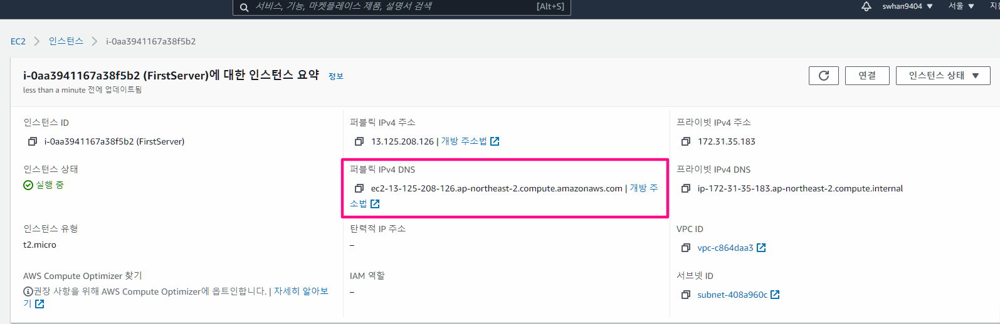


- 접속 실패 이유
  - 보안그룹에 HTTP 인바운드를 열지 않아서
- 보안
  - 인바운드에 80 포트를 모두에게 여는 것으로 수정

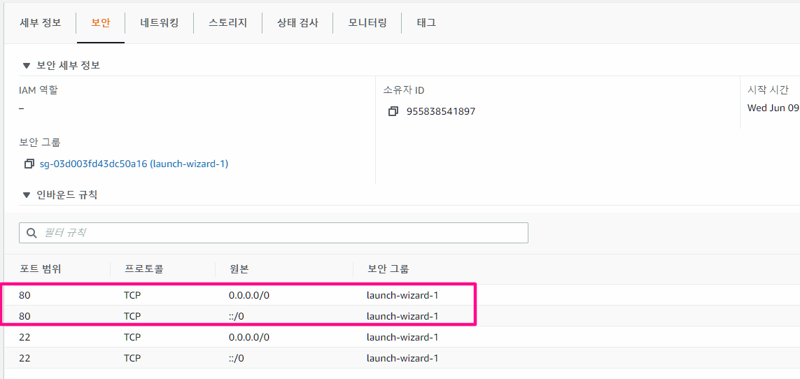


- 접속 성공

undefined


- EC2의 포트 내용 확인하기

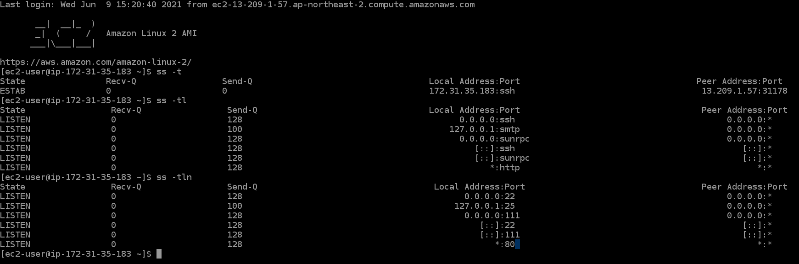


## EC2 지우기

- 놔두면 비용이 청구될 수 있기 때문에 삭제하기

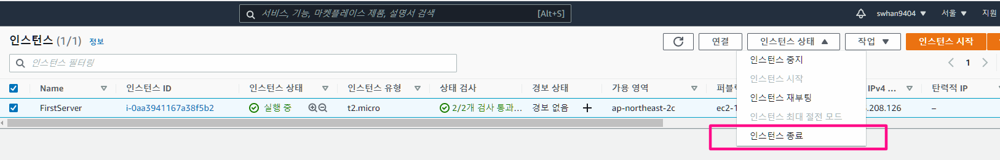


