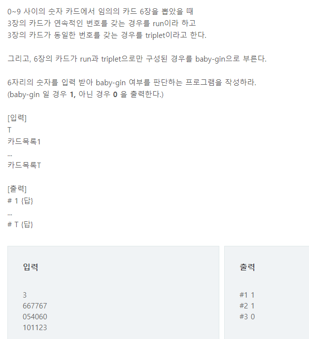

- 주의할 사항
  - 정렬로 풀려고 시도할 경우 123123 과 같은 예제를 해결 할 수 없음
  - 모든 경우를 세려면 완전탐색을 할 수 밖에 없음

 
## 나의 풀이
- tmp_case 에 6자리카드로 만들어질 경우의  수를 그때 그때 담음
  - tmp_case[i] 로 각 자리를 초기화 하면서 선택
  - isSelected를 이용하여 각자리가 사용되었는지 확인하면서 선택
  - 완전탐색을 위해서 isSelected[i]를 False로 중간에 바꿔줌 
    - 의미 : for문 다음 인덱스로 넘어갈때 tmp_case[i]가 초기화 되니 isSelected도 초기화 시켜줘야함
- tmp_case가 6자리가 꽉 채워질 경우 3자리씩 끊어서 triplet인지 run 인지 확인
  - 조건이 다 통과되면 all_case에 넣어둠
- 마지막에 all_case의 원소 갯수를 확인하여 baby-gin이 있었는지 확인

```python
import sys
sys.stdin = open("input.txt")

T = int(input())

for tc in range(1, T+1):
    inp_arr = list(map(int, list(input())))
    all_case = []
    tmp_case = [0] * len(inp_arr)
    isSelected = [0] * len(inp_arr)

    # 케이스 만들어서 돌리기
    def make_case(n):
        if n == len(inp_arr):
            if check(tmp_case):
                if tmp_case not in all_case:  # 이 조건은 사실 없어도됨
                    all_case.append(list(tmp_case))
            return

        for i in range(len(inp_arr)):
            if not isSelected[i]:
                tmp_case[n] = inp_arr[i]
                isSelected[i] = 1
                make_case(n + 1)
                isSelected[i] = 0

    # 케이스 확인
    def check(inp_arr):
        check1 = False
        check2 = False

        if inp_arr[0] == inp_arr[1] and inp_arr[1] == inp_arr[2]:
            check1 = True

        if inp_arr[3] == inp_arr[4] and inp_arr[4] == inp_arr[5]:
            check2 = True

        if inp_arr[0] + 1 == inp_arr[1] and inp_arr[1] + 1 == inp_arr[2]:
            check1 = True

        if inp_arr[3] + 1 == inp_arr[4] and inp_arr[4] + 1 == inp_arr[5]:
            check2 = True

        return check1 and check2

    make_case(0)
    # print(all_case)
    result = 1 if all_case else 0
    print("#{} {}".format(tc, result))


```


## 또다른 풀이

- 입력받은 수의 구성성분을 분석
  - 각 숫자가 총 몇번 쓰였는지 counting 하여 저장
- triplet이 있는지 counting 저장한 곳에서 확인
- triplet을 뺴고 남은 것들로 run이 되는지 확인

> 먼저 풀이와 다른것
>
> - 이 방법은 완전탐색이 아니기 때문에 걸리는 시간이 굉장히 짧게 걸리고 메모리도 훨씬 적게씀

```python
import sys
sys.stdin = open("input.txt")

T = int(input())


for tc in range(1, T+1):
    num = int(input()) # Baby Gin 확인할 6자리 수
    c = [0]* 12 # 6자리 수로부터 각 자리수를 추출하여 개수를 누적할 리스트 ( 하단에 i+2 때문에 11자리까지 생성)

    for i in range(6) :
        c[num % 10] += 1
        num //=10

    i = 0
    tri = run =0

    while i < 10 :
        if c[i] >= 3 : # triplet 조사후 데이터 삭제
            c[i] -= 3
            tri +=1
            continue
        if c[i] >=1 and c[i+1] >=1 and c[i+2] >=1 : #run 조사후 데이터 삭제
            c[i] -=1
            c[i+1] -=1
            c[i+2] -=1
            run +=1
            continue
        i+=1

    if run + tri == 2 :
        result = 1
    else :
        result =0

    print("#{} {}".format(tc, result))
```
