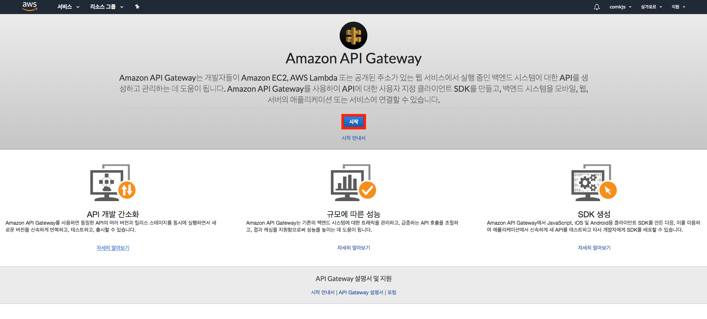
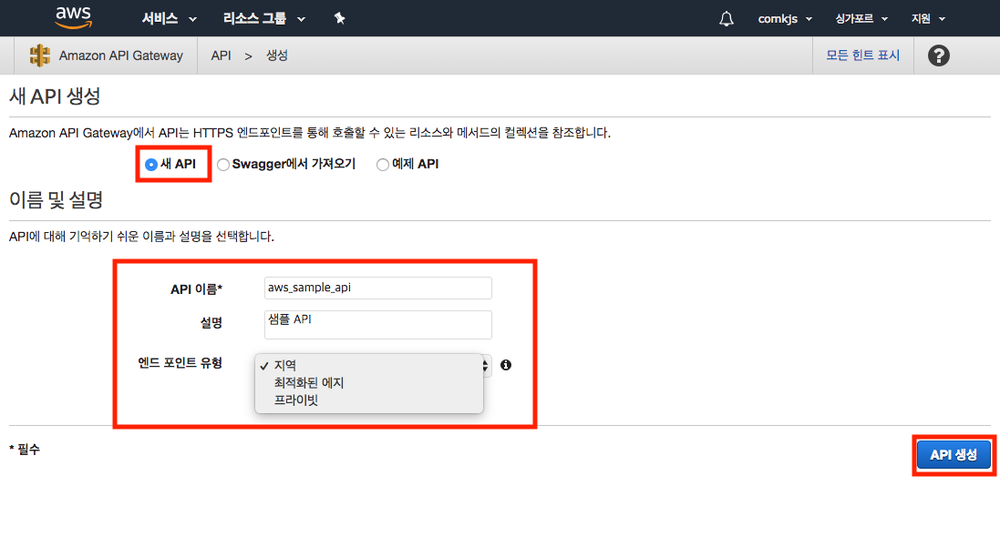
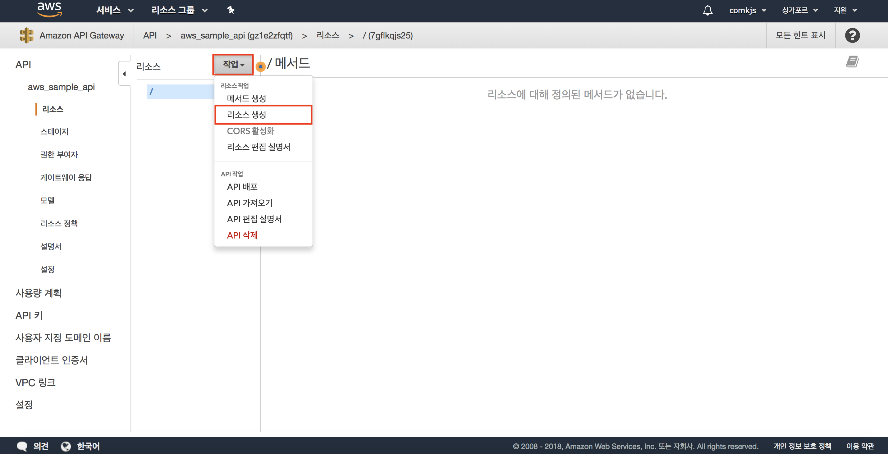
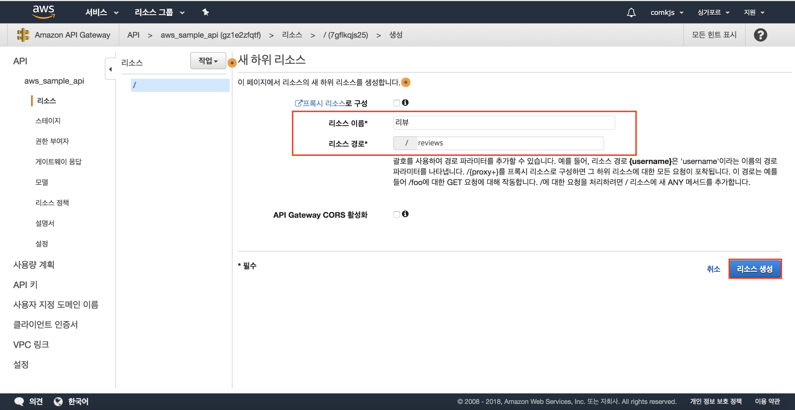
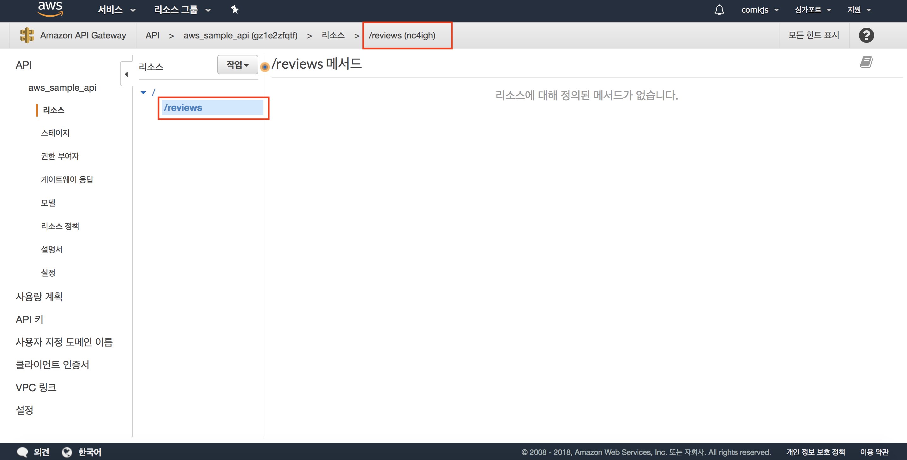
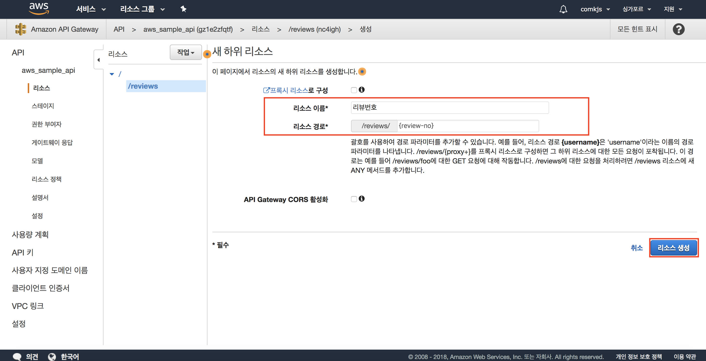
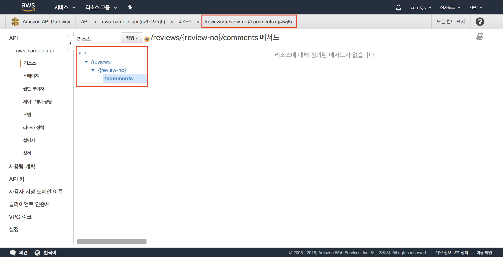
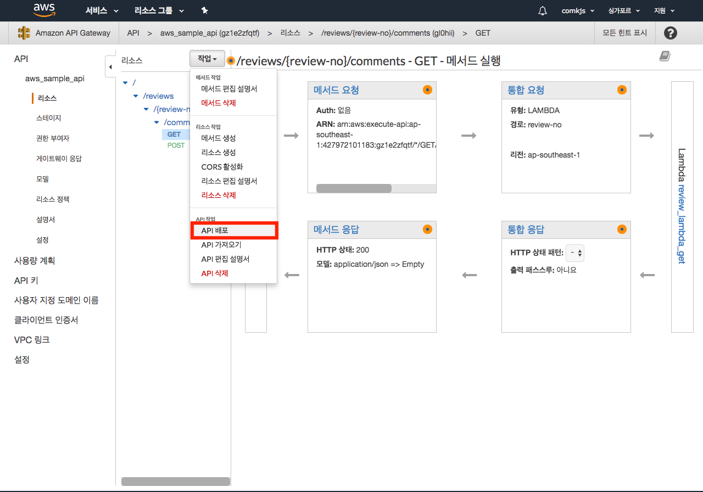
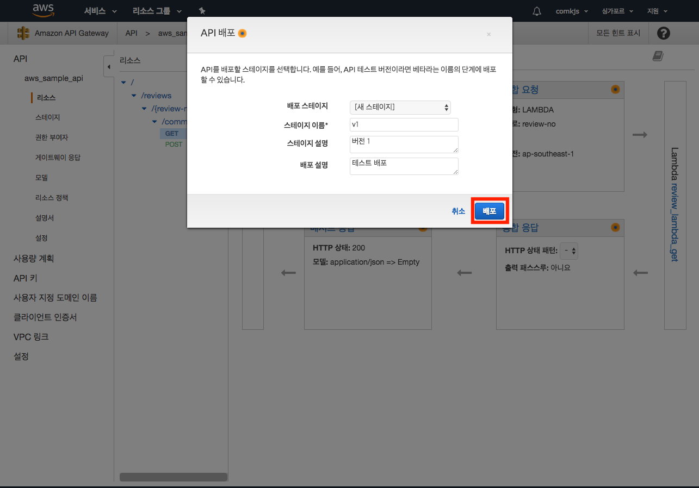
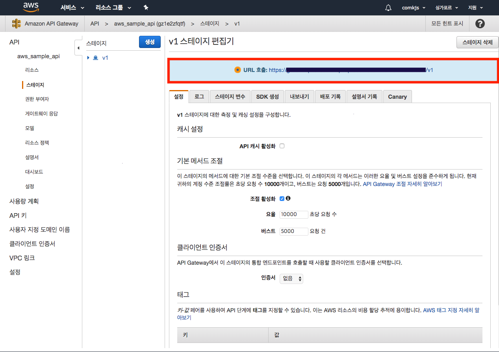

# AWS API Gateway

> API Gateway는 규모에 상관없이 API 생성, 유지 관리, 모니터링과 보호를 할 수 잇는 서비스

## API Gateway의 장점

1. APi 개발 간소화 : 새로운 버전을 신속하게 반복하고, 테스트하고 , 출시할 수 있다.
2. 규모에 다른 성능 : 벡엔드 시스템에 대한 트래픽 관리하여 유동적으로 API 호출하여 성능을 높이는데 도움이 됨
3. SDK 생성 : 사용자 지정 SDK를 만들어 애플리케이션에서 신속하게 API를 테스트하고 배포할 수 있다. (SDK : Software development kit 소프트웨어 개발 키트)

## API 생성하기
### API 생성 시작
https://console.aws.amazon.com/apigateway/home?region=us-east-1#/welcome

검색할 시에 이 화면이 아닌 다른 화면이 나오는데 위의 링크로 타거나 해본적이 없지만 REST API로 만들면 될듯..?

### 엔드포인트 유형지정
- 엔드 포인트 유형

1. 지역 : 현재 리전에 배포
2. 최적화된 에지 : CloudFront 네트워크에 배포
3. 프라이빗 : VPC에서만 엑세스 가능

### 리소스 생성

> 리소스는 호출할 수 있는 특정 URL
>
> 리소스 경로에 `{}`가 포함되어 있으면 경로 파라미터를 나타냄. ( `{review-no}`)

### 배포- 스테이지 생성
> 스테이지 상세 정보에 API 호출 주소가 생성되게 됨.

