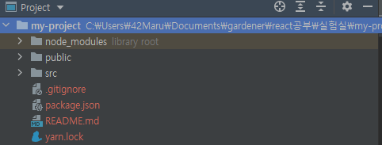

# CRA(Create-React-App)

> 리액트 프로젝트를 시작하는데 필요한 개발 환경을 세팅 해주는 도구(toolchain)

- CRA는 리액트로 웹 애플리케이션을 만들기 위한 환경을 제공
  - 바벨과 웹팩
  - 테스트 시스템
  - ES6+ 문법
  - CSS 후처리 등
- Javascript에서의 빌드 툴체인의 구성
  1. Package Manager
     - yarn이나 npm 같은 것으로, 패키지를 쉽게 설치하거나 업데이트하도록 도와줌
  2. bundler
     - webpack과 Parcel 같은 것으로, 모듈 번들링을 통해 로드시간을 최적화
  3. compiler
     - babel과 같은 것으로, 이전 브라우저에서 여전히 작동하는 최신 Javascript 코드를 작성할 수 있도록 도와줌


## CRA 설치

1. react-app 설치
   - `npx create-react-app my-project`
   - npx란? 
     - npm과 함께 제공되는 패키지 실행 도구
   - 여기서 npx를 쓰는 이유? - `npm`으로 `global`하게 설치하게되면 여러가지 문제가 생깁니다
     - 자주 사용하지 않는 무거운 패키지가 로컬 스토리지에 남게 됩니다.
     - 로컬 스토리지에 있는 패키지도 새로운 버전이 나왔을 시 이미 존재한 패키지를 제거하고 다시 설치해야 합니다.
   - 하지만 `npx`를 사용하면 이 문제를 해결할 수 있습니다. npx는 최신 버전에 해당하는 패키지를 설치하여 실행하고, 실행된 이후에 해당 패키지를 제거
2. my-project 폴더 진입
   - `cd my-project`
3. 로컬 서버 띄우기
   - `npm start`


## 폴더 및 파일 세팅 구성




### 폴더들

**1. node.modules**

- CRA 를 구성하는 모든 패키지 소스 코드가 존재하는 폴더


**2. public 폴더**

- index.html
  - src 폴더의 index.js에 대응되는 것으로, HTML 탬플릿 파일
  - 이 파일이 직접 표시되는 것은 아니지만, index.js에 의해 읽어들여지고 랜더링된 결과가 표시되게 된다.(index.html 이름을 바꿀시 오류가 발생)
  - `<div id="root"></div>`
- manifest.json
  - 웹앱 매니페스트란 앱에 대한 정보를 담고 JSON 파일
  - 경색은 어떠한 색인지, 앱의 이름은 무엇인지, 홈스크린 화면에 추가할 때 아이콘은 어떤 것인지 등의 정보
- robots.txt
  - 역할
    1. 웹사이트 내의 특정 콘텐츠, 웹페이지, 서브 폴더, 디렉토리로의 크롤러 접근 제어
    2. 사이트 맵 위치 전달
    3. 검색 크롤러에 의한 과부하 방지 
  - 만약 이 파일에 아무런 내용도 지정하지 않으면 검색엔진의 크롤링 로봇들은 웹사이트에서 확인할 수 있는 모든 콘텐츠를 색인하고 검색 결과에 노출
- 이미지 파일들
- (추가)data - mock data 관리
  - mock data란 가짜 데이터 파일로, 실제 API에서 받아온 데이터가 아닌 프론트앤드 개발자가 필요에 의해 샘플로 만들어본 데이터를 의미함
  - `fetch('http://localhost:3002/data/data.json')` 이런 방식으로 fetch를 통하여 데이터를 받아올 수 있음


**3. src 폴더**

- `index.js`
  - React의 시작 (Entry Point)
  - `ReactDOM.render( <App /> , document.getElementById('root'))`
    - ReactDOM.render 함수의 인자는 두 개
    - 첫 번째 인자는 화면에 보여주고 싶은 컴포넌트
    - 두 번째 인자는 화면에 보여주고 싶은 컴포넌트의 위치
  - (이름 함부로 수정하면 안 됨)
- `App.js`
  - 현재 화면에 보여지고 있는 초기 컴포넌트
  - React Router 를 적용 후에는 `<Routes />` 컴포넌트가 최상위 컴포넌트로 그 자리에 위치하게 된다.

- (추가)components - 공통 컴포넌트 관리
- (추가)pages - 페이지 단위의 컴포넌트 폴더로 구성
- (추가)styles 폴더
  - `reset.scss` - css 초기화
  - `commom.scss` - 공통으로 사용하는 css 속성 정의 (ex. font-family, theme color)
- 참고) components vs. pages
  - 여러 페이지에서 동시에 사용되는 컴포넌트의 경우 components 폴더에서 관리함.
    (ex. Header, Nav, Footer)
  - 페이지 컴포넌트의 경우 pages 폴더에서 관리함.
  - 해당 페이지 내에서만 사용하는 컴포넌트의 경우 해당 페이지 컴포넌트 폴더 하위에서 관리함.


### 그 외 파일

**1. package.json**

- CRA 기본 패키지 외 추가로 설치된 라이브러리/패키지 정보(종류, 버전)가 기록되는 파일
- 모든 프로젝트마다 package.json 하나씩 존재
- `"dependencies"`

  - 리액트를 사용하기 위한 모든 패키지 리스트, 버전 확인 가능
  - 실제 코드는 `node.modules` 폴더에 존재
  - 왜 node.modules 와 package.json 에서 이중으로 패키지를 관리할까?
    - 실제 내가 작성한 코드, 내가 설치한 패키지는 내 로컬에만 존재
    - github 에 올릴 때 내가 작성한 코드와 함께 package.json(추가로 설치한 패키지 정보)을 넘긴다.
    - 다른 사람이 그것을 (pull) 받아서 npm install 만 입력하면 package.json 에 기록되어 있는 패키지의 이름과 버전 정보를 확인하여 자동으로 설치한다.
  - 버전에 `^`를 붙이게 되면 package manaager는 새로운 버전이 배포 되었는지 체크
- 새로운 Library(package) 설치 시

  - 누군가 만든 소스코드를 다운받는 것
  - npm으로 설치 (ex. npm install slider)
  - 설치 시 node modules 에 자동으로 설치됨
  - 하지만 package.json - dependencies 에 추가 자동으로 되는 건 아님.
    - 그래서, npm install slider —-save
    - —-save 까지 작성해야 dependencies 에 추가됨
    - npm 버전이 업그레이드 됨에 따라 자동으로 추가되는 경우가 많지만 여전히 불안한 패키지들이 존재하기 때문에 패키지 설치 시 —-save 까지 입력하는 것을 권장
- yarn과 npm 차이
  - npm, yarn 둘 다 `package.json`에 버전을 명시하고 의존성은 추적 관리
  - yarn은 자동은 yarn.lock 파일을 생성/ npm 은 `npm shrinkwrap`커맨드로 생성
- `"scripts"`
  - run : 프로젝트를 development mode(개발 모드) 실행을 위한 명령어. `npm run start`.
  - build : 프로젝트 production mode(배포 모드) 실행을 위한 명령어. 서비스 상용화.
- `package.json` 과 `package-lock.json` 차이
  - package.json 에는 "~3.3.8" 으로 적혀있지만, package-lock.json 에는 "3.3.16"으로 정확한 버전명이 적혀있습니다.
  - `package-lock.json` 은 개발자들이 동일한 `node_module` 트리를 생성해서 같은 의존성을 설치할 수 있도록 보장해주는 고마운 녀석


**2. .gitignore**

- `.gitignore` 파일에 github 에 올리고 싶지 않은 폴더와 파일을 작성할 수 있다.
- `push` 를 해도 `.gitignore` 파일에 작성된 폴더와 파일은 올라가지 않는다


# CRA에 typescript 적용하기

1. 프로젝트 만들기

   `npx create-react-app my-app --template typescript`

2. Type script용 모듈들 다운로드

   `npm install --save typescript @types/node @types/react @types/react-dom @types/jest`


## Eslint 설정

- ESLint는 ES + Lint
  - ES는 EcmaScript, 즉 자바스크립트를 의미하는 것 
  - Lint는 보푸라기라는 뜻인데 프로그래밍 쪽에서는 에러가 있는 코드에 표시를 달아놓는 것을 의미
  - ESLint는 사용자가 직접 정의한대로 코드를 점검하고, 에러가 있으면 표시해줍니다. 또 문법 에러뿐만 아니라 코딩 스타일도 정할 수 있어서 팀원끼리 협업을 할 때 좋음

- `npm i --save-dev @typescript-eslint/parser @typescript-eslint/eslint-plugin eslint-plugin-react`
  - @typescript-eslint/parser
    - eslint가 typescript를 lint 할 수 있도록 허용해주는 parser
  - @typescript-eslint/eslint-plugin
    - typescript에 구체화된 ESLINT rule들을 잔뜩 포함하는 플러그인
  - eslint-plugin-react
    - react에서 타입스크립트를 사용하려면 eslint-plugin-react 의존성 필요

- 루트폴더에 .eslintrc.json 을 만들고 아래 코드를 저장

```json
{
  "parser": "@typescript-eslint/parser",
  "plugins": ["@typescript-eslint"],
  "extends": [
    "plugin:react/recommended", // Uses the recommended rules from @eslint-plugin-react
    "plugin:@typescript-eslint/recommended"
  ],
  "parserOptions": {
    "ecmaVersion": 6,
    "sourceType": "module",
    "ecmaFeatures": {
      "jsx": true
    }
  },
  "rules": {
    "semi": 2
  },
  "settings": {
    "react": {
      "version": "detect"
    }
  }
}
```


## Prettier 설정

- prettier: 코드 포매팅을 자동으로 해주는 라이브러리

- `npm i --save-dev eslint-config-prettier eslint-plugin-prettier`
  - eslint-config-prettier
    - prettier와 prettier와 충돌을 일으키는 ESLint 규칙들을 비활성화 시키는 config
  - eslint-plugin-prettier
    - ESLint 규칙에 따라 작동하게 해주는 플러그인
- 루트 폴더에  .prettierrc 파일 만들고 

```json
{
  "singleQuote": true,
  "semi": true,
  "useTabs": false,
  "tabWidth": 2,
  "trailingComma": "all",
  "printWidth": 80
}
```

-  .prettierrc 이후 .eslintrc.js 파일을 수정

```json
{
  "parser": "@typescript-eslint/parser",
  "plugins": ["@typescript-eslint"],
  "extends": [
    "plugin:react/recommended", // Uses the recommended rules from @eslint-plugin-react
    "plugin:@typescript-eslint/recommended",
    "prettier/@typescript-eslint",
    "plugin:prettier/recommended"
  ],
  "parserOptions": {
    "ecmaVersion": 6,
    "sourceType": "module",
    "ecmaFeatures": {
      "jsx": true
    }
  },
  "rules": {
    "semi": 2,
    "@typescript-eslint/explicit-function-return-type": [
      "warn",
      { "allowTypedFunctionExpressions": true }
    ]
  },
  "settings": {
    "react": {
      "version": "detect"
    }
  }
}
```

