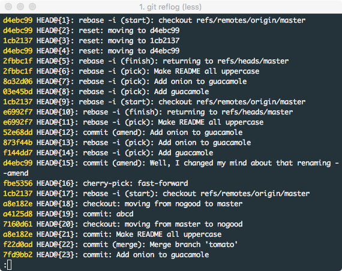
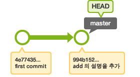
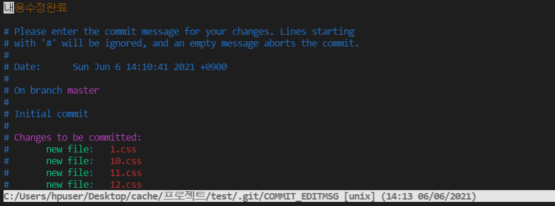
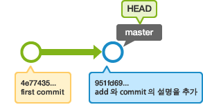

# git 

## filter-branch

- 필요 상황
  - remote에 올리지 말아야할 file이나 내용가 올라간 상황
    - 보안 파일, 패스워드, 비밀번호
    - 해당 파일의 수정내역만 모든 commit에서 제거하여 commit 을 수정함

### filter-branch란?

- 필터를 제공해서 필터에 적용된 파일만 가지고 히스토리를 다시 구축하는 기능
- 특정 디렉터리가 하나의 프로젝트가 되는 구조라면 디렉터리 하나만 분리하면 별도의 프로젝트를 만들 수 있게 되는데, 이런 경우에는 filter-branch로 쉽게 분리할 수 있다.
  - `--subdirectory-filter` 
    - 특정 디렉터리만 분리
  - `--index-filter`
    - 원하는 파일만 분리

### git History에서 특정 파일 삭제하기

- `git filter-branch -f --index-filter 'git rm --cached --ignore-unmatch 삭제하고자하는 file명' --prune-empty -- --all`
  - 지금까지의 모든 commit에서 특정파일 기록을 다 지우고 다시 저장
- `git push --force --all`
  - 해당 명령어 를 통해서 강제 push 를 하게되면 remote 역시 해당 file 의 history 가 삭제

## stash

- 필요 상황
  - 자신이 어떤 작업을 하던 중에 다른 요청이 들어와 하던 작업을 멈추고 잠시 브랜치를 변경해야 할 일이 생김	
    - 브랜치를 바꾸려면 아직 완료되지 않은 일을 commit해야함
    - 하지만, 완료되지 않은 일을 commit 하는 것은 껄끄럽다.
- 상황 예시
  - git commit -m "merge전 임시저장" 이런 식으로 commit 남기는 부분들을 없앨 수 있다.
  - 자신이 다른 branch 에서 작업을 하다가 늦게 다른 branch에서 작업을 한 것을 알아챔 
    - 그래서 지금 작업한 것을 다른 branch의 history에 남기지 않고, 자신의 branch에 옮겨야하는 상황

### git stash 란?

- 아직 마무리 하지 않은 일을 잠시 스택에 저장할 수 있도록 하는 명령어
- 이를 통해 아직 완료하지 않은 일을 commit 하지 않고 나중에 다시 꺼내와 마무리 할 수 있다.

- git stash 명령을 사용하면 워킹 디렉토리에서 수정한 파일들만 저장한다.
- `stash`란 아래에 해당하는 파일들을 보관해두는 장소이다.
  1. Modified이면서 Tracked 상태인 파일
     - Tracked 상태인 파일을 수정한 경우
     - Trackedc 과거에 이미 commit하여 스냅샷에 넣어진 관리 대상 상태의 파일
  2. Staging Area에 있는 파일(Staged 상태의 파일)
     - git add 명령을 실행한 경우
     - Staged 상태로 만들려면 git add 명령을 실행해야 한다.
     - git add는 파일을 새로 추적할 떄도 사용하고 수정한 파일을 staged 상태로 만들때도 사용한다.

### 사용 방법

1. `git stash` 나 `git stash save`
   - 새로운 stash를 스택에 만들어 하던 작업을 임시로 저장
   - 이를 통해 working directory 는 깨끗해진다.
2. `git stash list` 
   - stash 목록 확인하는 방법
   - 여러번 stash를 했다면 위의 명령어를 통해 저장한 stash 목록을 확인할 수 있다.
3. `git stash apply`
   - stack 맨 위의(가장 최근의) stash를 가져와서 적용한다.
   - `git stash apply stash이름` 
     - 이렇게 하면 특정한 stash를 선정해서 적용할 수도 있음
   - 만약 stash 를 하면서 git add 도 같이 사용해서 Staged 상태로 만들어주고 싶다면,
     - `git stash apply --index`
     - 를 통하여 Staged 상태까지 저장할 수 있다.
   - 수정했던 파일들을 복원할 떄는 반드시  stash했을 때와 같은 브랜치일 필요는 없다.
   - 만약 다른 작업 중이던 브랜치에 이전의 작업들을 추가했을 경우 충돌이 있으면 알려준다.
4. `git stash drop`
   - stash 제거하기
   - apply 는 단순히 stash를 적요하는 것으로, 해당 stash는 스택에 여전히 남아있다. 스택에 남아있는 stash는 drop을 통해 없앨 수 있다.
   - `git stash pop` 
     - 만약 적용과 동시에 스택에서 해당 stash를 제거하고 싶으면 이 명령어를 사용하면 된다.
5. `git stash show -p | git apply -R`
   - 실수로 잘못 stash 적용한 것을 되돌리고 싶으면 위의 명령어를 이용한다.
   - 의미
     - 가장 최근의 stash를 사용하여 패치를 만들고,
     - 그것을 거꾸로 적용한다.
   - `git stash show -p stash이름 | git apply -R`
     - stash 이름(ex. stash@{2})에 해당하는 stash를 이용하여 거꾸로 적용한다.
   - 매우 길기 때문에 alias로 등록해서 편하게 사용하면 좋다
     - `git config --global alias.stash-unapply '!git stash show -p | git apply -R`
       - stash-unapply 라는 별칭을 주어 간단하게 사용하게 만들기
       - `git stash-unapply` 로 사용하면 된다.

## reflog

- 필요 상황
  - 실수로 `git reset` 이나 `git reset` 으로 커밋을 삭제해 버렸다.
  - 이것을 복구하기 위해 사용
- git의 commit 은 세이브 포인트랑 같다.
- git reflog 명령어를 이용하면 hard-reset 도 되돌릴 수 있다.
- 거의 모든 상황에서 커밋은 복구될 수 있다.

### git reflog란?

- 참조(reference)의 기록(log)를 보여주는 명령
- git 이력은 보관되고 있는데 이러한 이력을 볼 수 있게 해주는 명령어 이다.

### 사용방법

1.  `git reflog` 
   - 명령어로 삭제된 commit id를 확인한다.
2. `git reset --hard 커밋id` 
   - 를 사용하여 해당 commit 으로 reset 한다.

###  branch 복구하기

1. `git reflog` 또는 `git reflog |grep 브랜치명` 으로 log확인
2. `git checkout -b <삭제한 브랜치명> <커밋해시id>`

## git amend

- 필요 상황

  - 최근에 commit 한 내용에 방금 수정한 변경사항(git add) 를 추가적으로 넣고 싶다.
    - 실제적으로는 commit 에 내용이 추가되는 것이 아닌 최근 commit 위에 새로운 commit이 덮어씌워지는 것이다.
  - commit 의 메세지를 변경하고 싶다.

  

### 사용방법

1. `git add .`
   - 변경사항을 staging 하기
2. `git commit --amend`
   - 아래와 같은 vim창이 뜨게 됨
   - `a` 를 눌러 add 모드 로 변경
   - 저기서 commit message를 수정
   - esc 누르고 `:wq` 로 변경사항 저장하고 나오기

