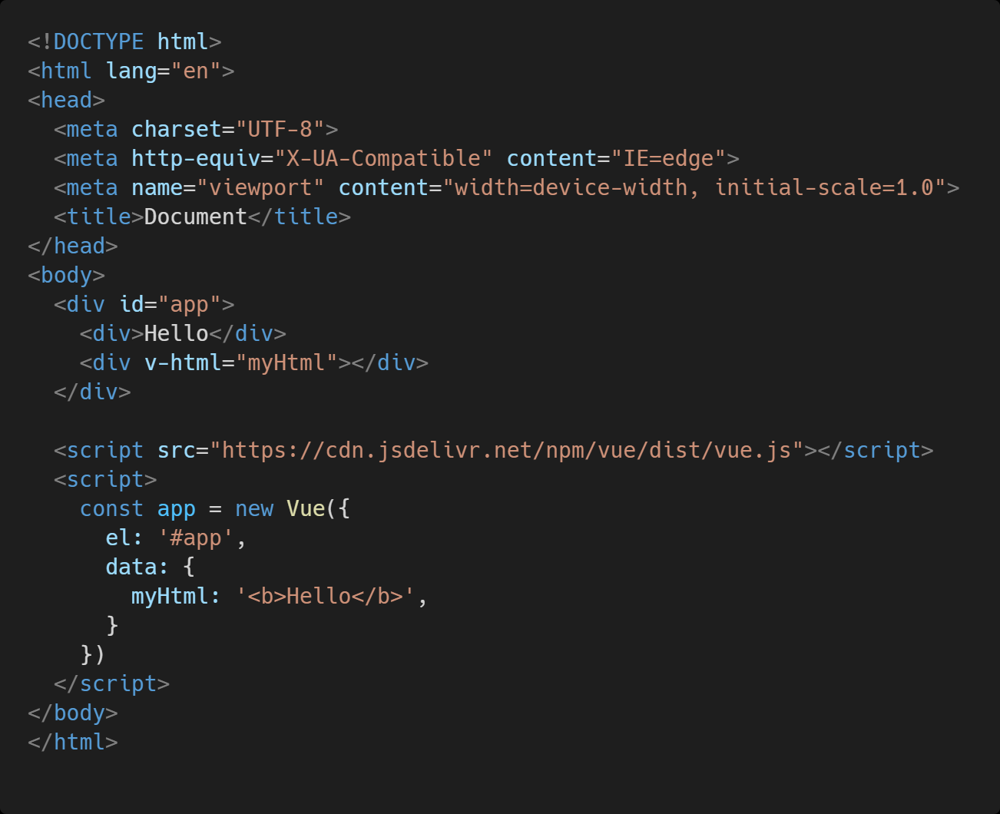
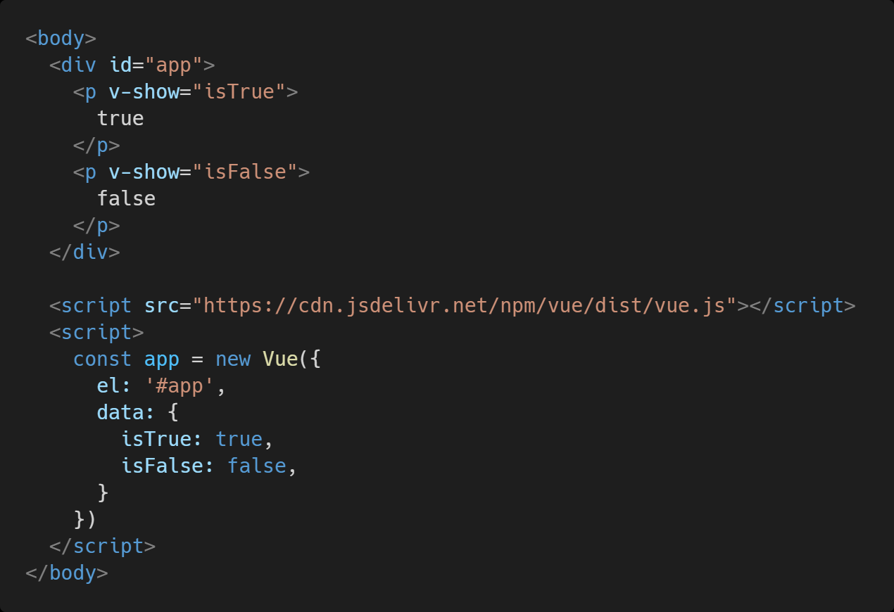
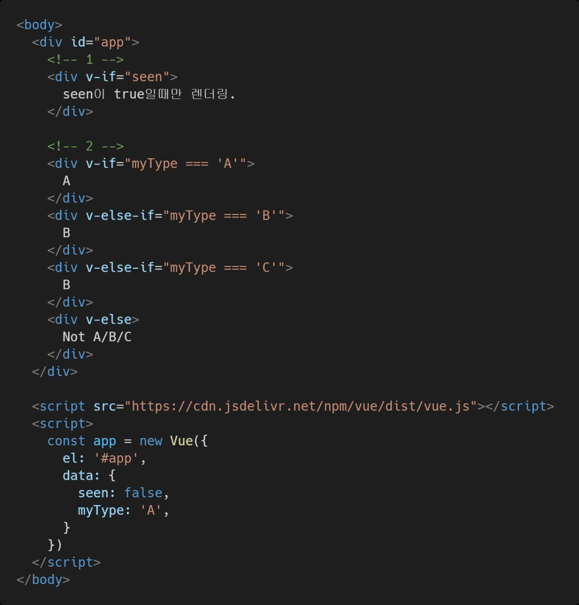
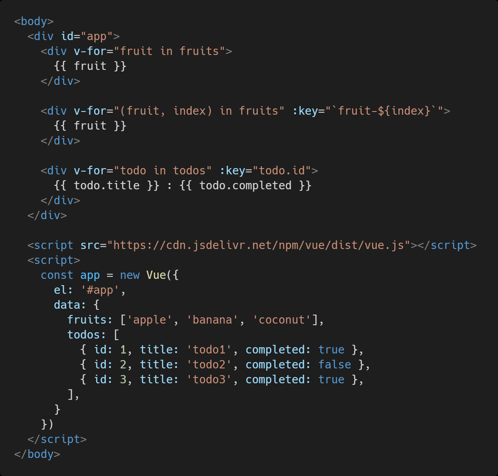
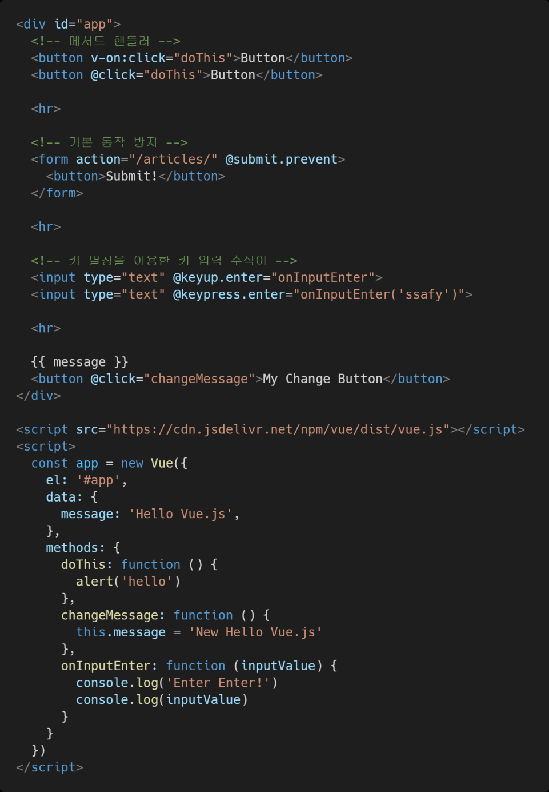
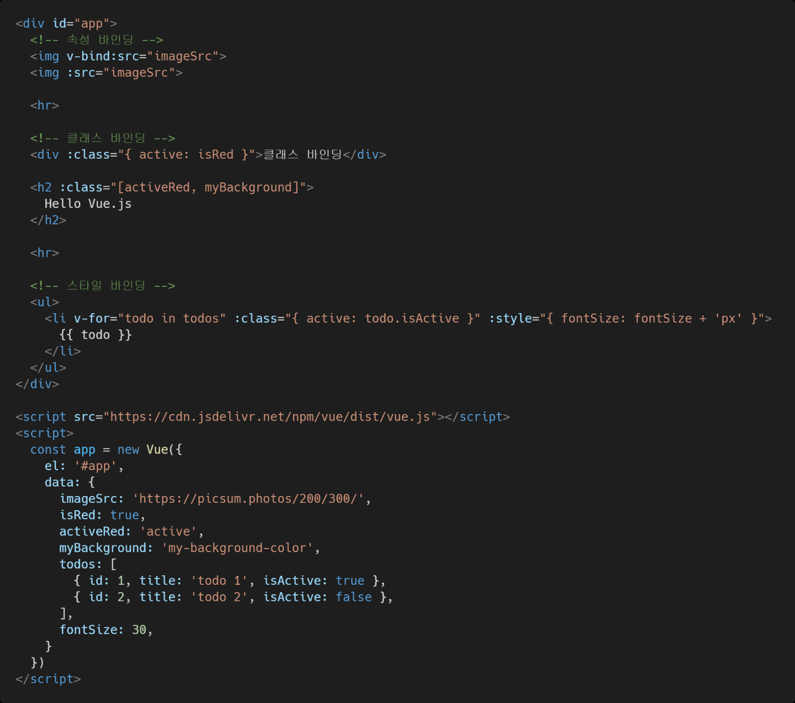
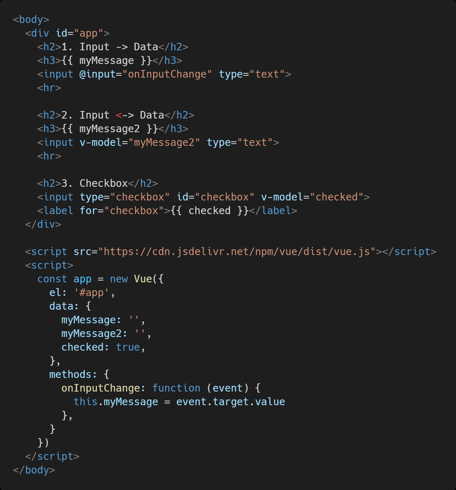
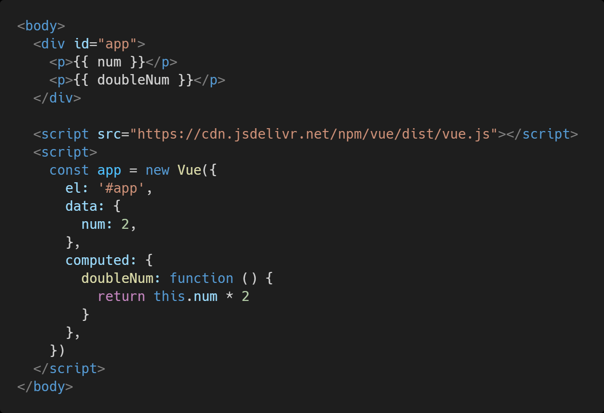
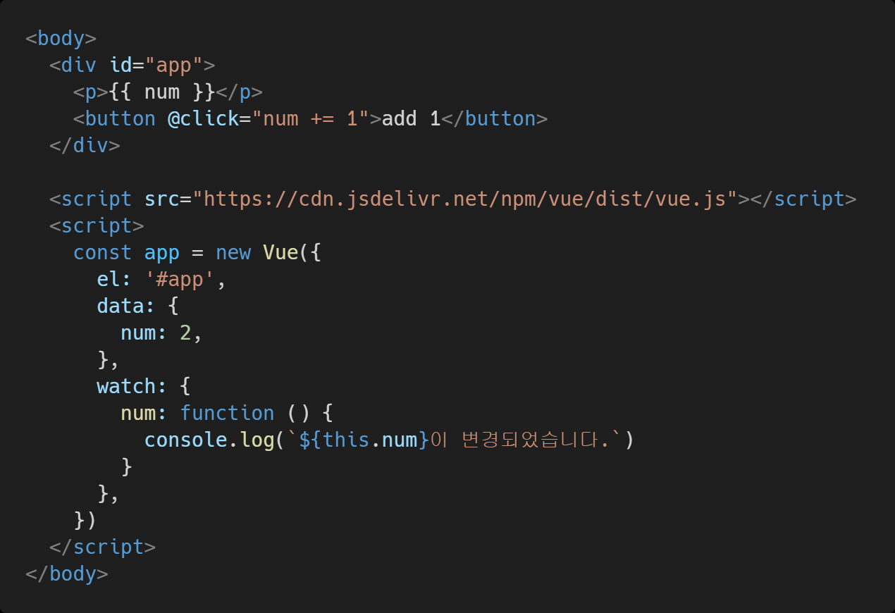
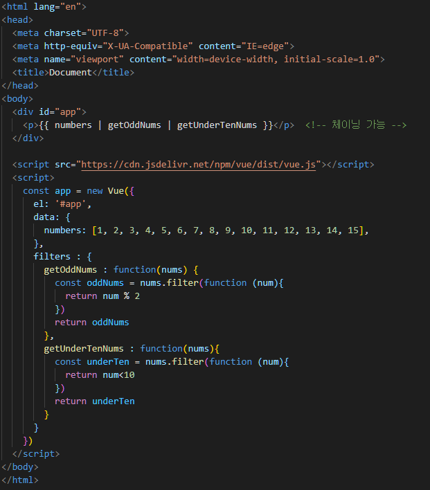

# 사용해보기

- CDN

  - 개발버전, 도움되는 콘솔 경고를 포함
    `<script src="https://cdn.jsdelivr.net/npm/vue/dist/vue.js"></script>`
  - 상용버전, 속도와 용량이 최적화됨.
    `<script src="https://cdn.jsdelivr.net/npm/vue"></script>`


## Template Syntax

- 랜더링 된 DOM을 기본 Vue 인스턴스의 데이터에 선언적으로 바인딩할 수 있는 HTML 기반 템플릿 구문을 사용
  1. Interpolation(보간법)
  2. Directive(직접 바인딩)


### Interpolation(보간법)

- `<div id="app">{{message}}</div>` 
  - 와 같이 `{{ }}`  사용
  - `{{ message.split('').reverse().join('') }}`
    - 처럼 JS 표현식도 안에 사용할 수 있음.
    - 이렇게 하면 글씨가 순서가 거꾸로 됨

```html
<html>
  <!-- 2. 선언적 렌더링 -->
  <h2>선언적 렌더링</h2>
  <div id="app">{{message}}</div> <!-- 안녕하세요 -->
    
  <!-- 1. Vue CDN -->
  <script src="https://cdn.jsdelivr.net/npm/vue/dist/vue.js"></script>
  <script>
    // 2. 선언적 렌더링
    var app = new Vue({
      el : '#app',
      data : {
        message : "안녕하세요"
      }
    })
  </script>
    
</html>
```


### 디렉티브

- v-접두사가 있는 특수속성

- 속성값은 단일 JS표현식이 됨(v-for 제외)

- 표현식 값이 변경될 때 반응적으로 DOM에 적용하는 역할을 함

- 전달인자(Arguments)

  - `:` (콜론)을 통해 전달인자를 받을 수도 있음

- 수식어( Modifiers)

  - `.` (점)으로 표시되는 특수 접미사
  - 디렉티브를 특별한 방법으로 바인딩 해야 함을 나타냄
  - https://kr.vuejs.org/v2/guide/events.html#%EC%9D%B4%EB%B2%A4%ED%8A%B8-%EC%88%98%EC%8B%9D%EC%96%B4
  - 이벤트 수식어는 총 6가지가 존재
    1. `.stop`
    2. `.prevent`
    3. `.capture`
    4. .`self`
    5. `.once`
    6. `.passive`

  

```vue
<!-- 클릭 이벤트 전파가 중단됩니다 -->
<a v-on:click.stop="doThis"></a>

<!-- 제출 이벤트가 페이지를 다시 로드 하지 않습니다 -->
<form v-on:submit.prevent="onSubmit"></form>

<!-- 수식어는 체이닝 가능합니다 -->
<a v-on:click.stop.prevent="doThat"></a>

<!-- 단순히 수식어만 사용할 수 있습니다 -->
<form v-on:submit.prevent></form>

<!-- 이벤트 리스너를 추가할 때 캡처모드를 사용합니다 -->
<!-- 즉, 내부 엘리먼트를 대상으로 하는 이벤트가 해당 엘리먼트에서 처리되기 전에 여기서 처리합니다. -->
<div v-on:click.capture="doThis">...</div>


<!-- event.target이 엘리먼트 자체인 경우에만 트리거를 처리합니다 -->
<!-- 자식 엘리먼트에서는 안됩니다 -->
<div v-on:click.self="doThat">...</div>
```


## v-접두사

### v-text

- 엘리먼트의 textContent를 업데이트
- 내부적으로 interpolation 문법이 v-text로 컴파일 됨

```vue
<!-- 2개가 동일 함 -->
<p v-text ="message"></p>
<p>{{ message }}</p>
```


### v-html

- 엘리먼트의 innerHTML을 업데이트
  - XSS 공격에 취약할 수 있음
- 임의로 사용자로부터 입력받은 내용은 v-html에 '절대' 사용금지




### v-show

- 조건부 랜더링 중 하나
- 엘리먼트는 항상 렌더링 되고 DOM에 남아있음
- 단순히 엘리먼트에 display CSS 속성을 토글




### v-if, v-else-if, v-else

- 조건부 렌더링 중 하나
- 조건에 따라 블록을 렌더링
- 디렉티브의 표현이 true일 때만 렌더링
- 엘리먼트 및 포함된 디렉티브는 토글하는 동안 삭제되고 다시 작성됨





### v-for 

- 원본 데이터를 기반으로 엘리먼트 또는 템플릿 블록을 여러번 렌더링
- `item in items` 구문을 사용
- item 위치의 변수를 각 요소에서 사용할 수 있음
  - 객체의 경우는 key
- v-for 사용시 반드시 key 속성을 요소에 작성 
  - https://kr.vuejs.org/v2/style-guide/#v-for-%EC%97%90-key-%EC%A7%80%EC%A0%95-%ED%95%84%EC%88%98
- v-if 와 함께 사용하는 경우 v-for는 v-if보다 우선순위가 높음
  - https://kr.vuejs.org/v2/style-guide/#v-if%EC%99%80-v-for%EB%A5%BC-%EB%8F%99%EC%8B%9C%EC%97%90-%EC%82%AC%EC%9A%A9%ED%95%98%EC%A7%80-%EB%A7%88%EC%84%B8%EC%9A%94-%ED%95%84%EC%88%98





### v-on

- 엘리먼트에 이벤트 리스너를 연결
- 이벤트 유형은 전달인자로 표시
- 특정 이벤트가 발생했을 때, 주어진 코드가 실행 됨
- 약어(shorthand)
  - `@`
  - `v-on:click` -> `@click`





### v-bind

- HTML 요소의 속성에 Vue의 상태 데이터를 값으로 할당
- Object 형태로 사용하면 value가 true인 key가 class 바인딩 값으로 할당
- 약어(shorthand)
  - `:`  (콜론)
  - `v-bind:href` -> `:href`





### v-model

- HTML form 요소의 값과 data를 양방향 바인딩
- 수식어
  - `.lazy`
    - input 대신 change 이벤트 이후에 동기화
  - `.number`
    - 문자열을 숫자로 변경
  - `.trim`
    - 입력에 대한 trim을 진행




## Option/data - 'computed'

- 데이터를 기반으로 하는 계산된 속성
- 함수의 형태로 정의하지만 함수가 아닌 함수의 반환 값이 바인딩 됨
- 종속된 대상을 따라 저장(캐싱) 됨
- 종속된 대상이 변경될 때만 함수를 실행
- 즉, Date.now()처럼 아무 곳에도 의존하지 않는 computed 속성의 경우 절대로 업데이트되지 않음
- 반드시 반환 값이 있어야함




### computed와 method 비교

- computed 속성 대신 methods에 함수를 정의할 수도 있음
  - 최종 결과에 대해 두 가지 접근 방식은 서로 동일
- 차이점은 computed 속성은 종속 대상을 따라 저장(캐싱) 됨
- 즉, computed는 종속된 대상이 변경되지 않는 한 computed에 작성된 함수를 여러번 호출해도 계산을 다시 하지 않고 계산되어 있던 결과를 반환
- 이에 비해 methods 를 호출하면 랜더링을 다시 할떄마다 항상 함수를 실행하면서 중복된 호출마다 전부 다시 연산
  - 반복해서 많이 쓰일 경우 비효율적


## Option/data - watch

- 데이터를 감시
- 데이터에 변화가 일어 났을 때 실행되는 함수




## Option/methods - filter

- https://vuejs.org/v2/api/#Vue-filter

- 필터는 자바스크립트 표현식 마지막에 “파이프(|)”심볼과 함께 추가하여 사용

- 중괄호 보간법, v-bind 표현에서만 사용이 가능

  - 중괄호 보간법
    `{{ message | capitalize }}`

  - v-bind 표현

    `<div v-bind:id="rawId | filterId"></div>`





# Vue의 라이프 사이클

- 어떤 Vue 인스턴스나 컴포넌트가 생성될 때, 미리 사전에 정의된 몇 단계의 과정을 거치게 되는데 이를 **라이프사이클(lifecycle)**이라 합니다. 
  - 다시 말해, Vue 인스턴스가 생성된 후 우리 눈에 보여지고, 사라지기까지의 단계를 일컫는 말입니다.
- https://kr.vuejs.org/v2/guide/instance.html#%EB%9D%BC%EC%9D%B4%ED%94%84%EC%82%AC%EC%9D%B4%ED%81%B4-%EB%8B%A4%EC%9D%B4%EC%96%B4%EA%B7%B8%EB%9E%A8
- 라이프 사이클
  1. 생성(create)
  2. DOM에 부착(mount)
  3. 업데이트(update)
  4. 없어짐(destroy)
- 이 과정에서 Vue는 각각의 단계에서, Vue를 사용하는 사람들을 위해 훅(Hook)을 할 수 있도록 API를 제공
  - 일반적으로 많이 사용하는 종류로는 `beforeCreate`, `created`, `beforeMount`, `mounted`, `beforeUpdate`, `updated`, `beforeDestroy`, `destroyed`가 있음


## beforeCreate

- 이름처럼 가장 먼저 실행되는 **beforeCreate**훅입니다.
- 발생시점 : Vue 인스턴스가 초기화 된 직후에 발생됩니다. 
- 특징
  - 컴포넌트가 DOM에 추가되기도 전이어서 `this.$el`에 접근할 수 없습니다. 
  - 또한 data, event, watcher에도 접근하기 전이라 `data, methods`에도 접근할 수 없습니다.

```js
var app = new Vue({
    el: '#app',
    data() {
        return {
            msg: 'hello';
        }
    },
    beforeCreate(function() {
        console.log(this.msg); // undefined
    })
})
```


## created (중요)

- 발생시점 : Vue 인스턴스가 생성 후 발생됩니다. 
- 특징
  -  `data`를 반응형으로 추적할 수 있게 되며 `computed, methods, watch` 등이 활성화되어 접근이 가능하게 됩니다
  - 하지만 아직까지 DOM에는 추가되지 않은 상태
  - `data`에 직접 접근이 가능하기 때문에, 컴포넌트 초기에 외부에서 받아온 값들로 `data`를 세팅해야 하거나 이벤트 리스너를 선언해야 한다면 이 단계에서 하는 것이 가장 적절

```js
var app = new Vue({
    el: '#app',
    data() {
        return {
            msg: 'hello';
        }
    },
    created(function() {
        console.log(this.msg); // hello
    })
})
```


## beforeMount

- 발생시점 : DOM에 부착하기 직전에 호출되는 **beforeMount**훅
- 특징
  - 이 단계 전에서 템플릿이 있는지 없는지 확인한 후 템플릿을 렌더링 한 상태
  - 가상 DOM이 생성되어 있으나 실제 DOM에 부착되지는 않은 상태

```js
var app = new Vue({
    el: '#app',
    beforeMount(function() {
        console.log('beforeMount');
    })
})
```


## mounted (중요)

- 발생시점 :  가상 DOM의 내용이 실제 DOM에 부착되고 난 이후에 실행
- 특징
  - `this.$el`을 비롯한 `data, computed, methods, watch` 등 모든 요소에 접근이 가능
  - 부모 컴포넌트의 mounted훅은 항상 자식 컴포넌트의 mounted훅 이후에 발생
    - 하지만 자식 컴포넌트가 서버에서 비동기로 데이터를 받아오는 경우처럼, 부모의 mounted훅이 모든 자식 컴포넌트가 마운트 된 상태를 보장하지는 않습니다.
    - `this.$nextTick`을 이용한다면, 모든 화면이 렌더링 된 이후에 실행되므로 마운트 상태를 보장할 수 있습니다.

```js
var app = new Vue({
    el: '#app',
    mounted(function() {
        this.$nextTick(function() {
            // 모든 화면이 렌더링된 후 실행합니다.
        })
    })
})
```


## beforeUpdate

- 발생시점 : 컴포넌트에서 사용되는 `data`의 값이 변해서, DOM에도 그 변화를 적용시켜야 할 때 변화 직전에 호출
- 특징
  - 변할 값을 이용해 가상 DOM을 렌더링하기 전이지만, 이 값을 이용해 작업할 수는 있습니다.
  - 이 훅에서 값들을 추가적으로 변화시키더라도 랜더링을 추가로 호출하지는 않습니다.

``` js
var app = new Vue({
    el: '#app',
    beforeUpdate(function() {
        console.log('beforeUpdate');
    })
})
```


## updated

- 발생시점 : 가상 DOM을 렌더링 하고 실제 DOM이 변경된 이후에 호출
- 특징
  - 변경된 값들을 DOM을 이용해 접근하고 싶다면, updated훅이 가장 적절
  - 다만 이 훅에서 `data`를 변경하는 것은 무한 루프를 일으킬 수 있으므로 이 훅에서는 데이터를 직접 바꾸어서는 안됩니다.
  - mounted훅과 마찬가지로, `this.$nextTick`을 이용해, 모든 화면이 업데이트 된 이후의 상태를 보장할 수 있습니다.

```js
var app = new Vue({
    el: '#app',
    updated(function() {
        console.log('Update');
    })
})
```


## beforeDestroy

- 발생시점 : 해당 인스턴스가 해체되기 직전
- 특징
  - 아직 해체되기 이전이므로, 인스턴스는 완전하게 작동하기 때문에 모든 속성에 접근이 가능
    - 이벤트 리스너를 해제하는 등 인스턴스가 사라지기 전에 해야할 일들을 처리하면 됩니다.

```js
var app = new Vue({
    el: '#app',
    beforeDestroy(function() {
        console.log('beforeDestroy');
    })
})
```


## destroyed

- 발생시점 : 인스턴스가 해체되고 난 직후
- 특징
  - 해체가 끝난 이후기 때문에, 인스턴스의 속성에 접근할 수 없습니다
  - 또한 하위 Vue 인스턴스 역시 삭제됨

```js
var app = new Vue({
    el: '#app',
    destroyed(function() {
        console.log('destroyed');
    })
})
```

