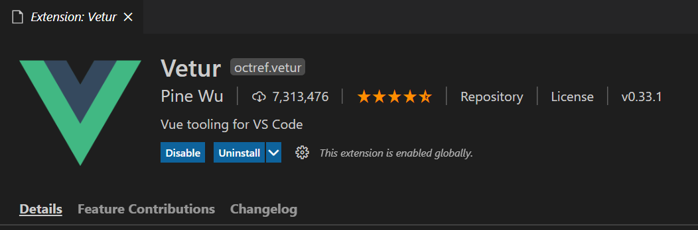
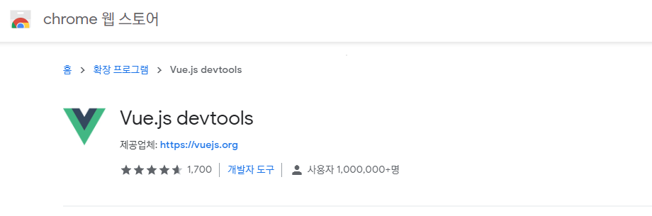
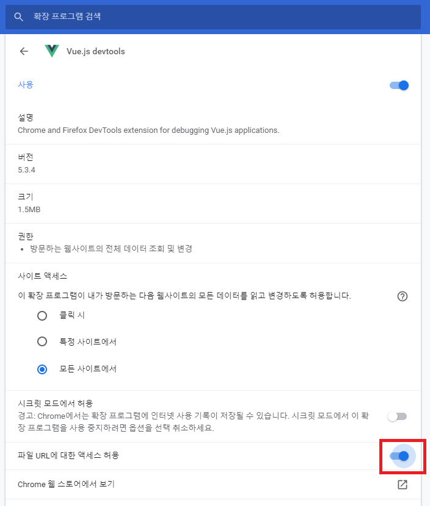

## vscode Vetur extension 설치

## chrome extension 설치

1. [Google extension](https://chrome.google.com/webstore/category/extensions?_feature=google) 접속

2. `vue.js devtools` 설치

3. 브라우저 우측 상단 - devtools 오른쪽 클릭 - 확장 프로그램 관리

.png)

4. 파일 URL에 대한 엑세스 허용 - 활성화

