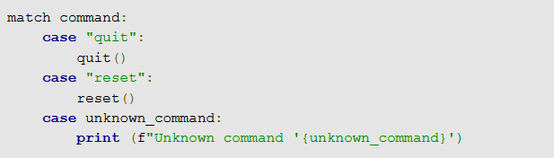
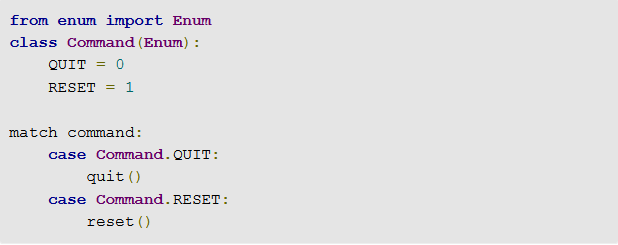
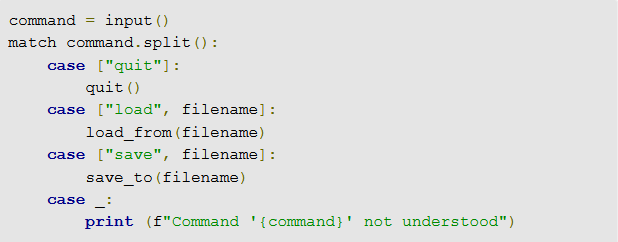
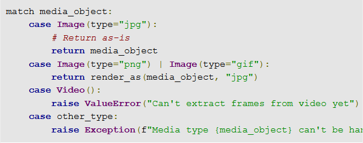

# 왜 패턴 매칭이 나왔는가?

- Python은 다른 언어에는 플로우 제어(flow control)가 명확하지 않다.

  - 플로우 제어 : 하나의 값을 가져와, 여러 가능한 조건 중 하나에 대해 명쾌하게 매칭할 수 있는 방법
  - C와 C++는 switch/case 구성이, 러스트(Rust)에서는 ‘[패턴 매칭](https://doc.rust-lang.org/book/ch18-00-patterns.html)’이 여기에 해당

- Python이 이를 처리 하는 방법

  1. if/elif/else 연쇄 표현식을 쓰는 방법

  2. 매칭할 값을 사전에 키로 저장하고, 이 값들을 사용하는 것이다.

  - 잘 작동하는 경우가 많지만, 이런 성질 때문에 구성과 유지관리가 번거로울 수 있다.

- 파이썬에 switch/case 같은 구문을 추가하려는 많은 계획들이 실패한 후, 파이썬 언어를 만든 ‘구이도 반 로섬’과 여러 사람들이 제안한 파이썬 ‘3.10: [구조적 패턴 매칭](https://www.python.org/dev/peps/pep-0634/)(Structural Pattern Matching)’에 대한 제안이 최근 수락 됨.

# 파이썬의 구조적 패턴 매칭

- 구조적 패턴 매칭은 파이썬에 match/case 명령문과 패턴 구문을 도입한다. 
- match/case 명령문에는 switch/case와 동일한 원칙이 적용된다. 
- 객체를 가져와, 이 객체를 하나 이상의 매칭 패턴에 대해 테스트하고, 매칭되면 조치를 취한다.
- 매칭의 일부나 전부를 캡처해 다시 사용할 수 있다. 위 예제에서 case unknown_command의 경우, 다시 사용할 수 있도록 unknown_command 변수에서 값을 ‘캡처’한다.

## 작동방식

- 각 case 명령문 다음에는 매칭할 패턴이 위치한다. 위 예제는 간단한 문자열을 매칭 대상으로 사용하고 있지만, 더 복잡한 매칭도 가능하다.

- 파이썬은 맨위부터 맨아래까지 case 목록을 조사해 매칭을 수행한다.
  - 첫 번째 매칭에서 파이썬은 해당되는 case 블록의 명령물을 실행한 다음 match 블록의 끝으로 건너뛴다. 
- case 사이에 ‘fall-through’가 없지만, 하나의 case 블록에서 여러 가능한 case를 처리하는 자신만의 논리를 만들 수 있다

## 파이썬 구조적 패턴 매칭으로 변수에 대해 매칭

- case 명령문에 변수 이름을 나열한다고 해서, 명명한 변수 내용에 대해 매칭이 되는 것은 아니다. case의 변수들은 매칭할 값을 캡처하는 데 사용된다.
- 변수의 내용에 대해 매칭하기 원한다면, 변수를 이넘(Enum, 열거형) 같이 점이 있는 이름으로 표시해야 한다. 다음을 예로 들 수 있다.

- 반드시 Enum을 사용하지 않아도 된다. 점이라는 속성을 가진 이름이면 된다. 그렇지만 이넘이 파이썬에서 가장 친숙한 방식으로 사용되는 경우가 많다.

## 파이썬 구조적 패턴 매칭으로 여러 요소에 대해 매칭

- 패턴 매칭을 효과적으로 사용하기 위해서는 사전 조회의 대체재로만 사용하지 않는 것이 아주 중요하다.
- 매칭하고자 하는 부분의 구조를 설명해야 한다. 이 경우, 매칭하려는 요소의 수나 조합을 토대로 매칭을 수행할 수 있다.

- 예제 - 사용자는 명령을 입력하면서, 그 다음에 선택적으로 파일 이름을 입력

  - case [“quit”] : 매칭하려는 대상이 입력을 분할하여 파생된 “quit” 항목만 있는 목록인지 테스트한다.
  - case [“load”, filename] : 첫 번째 분할 요소가 문자열 “load” 인지, 다음 두 번째 문자열이 있는지 테스트한다. 이 경우, 두 번째 문자열을 변수 filename에 저장해 추가 작업에 사용한다. case [“save”, filename]:의 경우도 마찬가지이다.
  - Case_ :는 와일드카드 매치. 현재까지 다른 매칭이 이뤄지지 않은 경우 매칭된다. 밑줄 변수인 _는 어느 것에도 구속되지 않는다. 이름인 _는 case가 와일드카드인 match 명령에 대한 신호로 사용된다. case 블록의 본문에서 변수 command를 참조하는 이유가 여기에 있다. 캡처 된 것이 없기 때문이다.

## 패턴 매칭의 패턴

- case “a”
  -  단일 값 “a”에 대해 매칭한다.

- case [“a”, “b”]
  -  집합 [“a”, “b”]에 대해 매칭한다.
- case [“a”, value1]
  -  2개 값을 가진 집합에 대해 매칭을 하고, 2번째 값을 캡처 변수인 value1에 위치시킨다.
- case [“a”, *values]
  -  1개 이상의 값을 가진 집합에 대해 매칭한다. 다른 값들은 values에 저장한다. 집합 당 별표 표시된 항목을 하나만 포함할 수 있다(파이썬 함수에서 별표 인수를 사용할 수 있기 때문임).
- case (“a”|“b”|“c”)
  - or 연산자(|)를 사용, 하나의 case 블록에서 여러 케이스를 처리할 수 있다. 여기서, 우리는 “a”, “b”, 또는 “c”에 대해 매칭한다.
- case (“a”|“b”|“c”) as letter
  - 매칭한 항목을 변수 letter에 넣는 것을 제외하고는 위와 동일하다.
- case [“a”, value] if `<expression>`
  - expression이 ‘참’인 경우에만 캡처를 매칭한다. 표현식에 캡처 변수를 사용할 수 있다. 예를 들어 if value in valid_values를 사용한다면, case는 캡처한 값 value가 집합인 valid_values에 실제 위치한 경우에만 유효하다.
- case [“z”,_]
  -  “z” 로 시작하는 모든 항목의 집합이 매칭한다.

## 파이썬 구조적 패턴 매칭으로 객체에 대해 매칭

- 파이썬 구조적 패턴 매칭 시스템에서 가장 발전된 기능은 특정 속성을 가진 객체 대해 매칭을 하는 기능이다. 
- 예시 ) 특정 애플리케이션에서 .jpg 파일로 변환하고 함수에서 반환하려는 media_object라는 객체를 작업하고 있다고 가정해본다.
  -  처음에는 type 속성이 “jpg”로 설정된 Image 객체에 대해 매칭을 한다
  - 두 번째에는 type이 “png”인지 “gif”인지 매칭을 한다
  - 세 번째에는 속성에 관계없이 모든 type의 Video를 매칭한다
  - 마지막은 모든 것이 실패했을 때 모든 것을 캡처하는 것

# 효과적인 이용방법

- 파이썬 구조적 패턴 매칭의 핵심은 매칭을 하려는 *구조적* case를 포괄하는 매칭을 작성하는 것이다.
  - 구조적 패턴 매칭의 진짜 가치는 특정한 하나의 객체나 몇몇 객체가 아닌 객체의 패턴에 대해 매칭을 할 수 있다는 것이다.
- 매칭의 순서도 중요하다. 가장 먼저 테스트하는 매칭이 전체 매칭의 효율성과 정확성에 영향을 미친다. 
  - 긴 if/elif/else 체인을 만든 사람들 가운데 대부분은 이를 알 것이다. 
  - 패턴 매칭의 경우, 복잡성이 초래될 수 있기 때문에 순서를 신중히 고민해야 한다. 
    - 가장 구체적인 매칭을 가장 먼저 처리한다. 
    - 그리고 가장 일반적인 매칭은 마지막에 처리한다.
- 마지막으로 간단한 if/elif/else 체인이나 사전 조회로 해결할 수 있는 문제가 있다면, 이 두 가지를 이용하는 것이 좋다. 패턴 매칭은 강력하지만 보편적이지는 않다. 문제에 적합할 때 사용하는 것이 좋다.