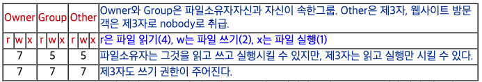

> 모든 명령어는 명령어 뒤에 --help 옵션을 주면 자세한 사용 방법이 나온다.

# 디렉토리 관련

## pwd

- print working directory
  - 현재 작업중인 디렉토리 정보 출력

```shell
$ pwd
/home/TIL
```


## cd

- change directory
  - 경로 이동
  - 절대 경로와 상대 경로로 이동 가능함

```shell
$ cd /home/TIL/211027
$ pwd
/home/TIL/211027


$ cd ..
$ pwd
/home/TIL
```


## ls

- list
  - 디렉토리 목록 확인

```shell
$ ls  
00신입을위한리눅스명령어top10.md
01_기본명령어.md

$ ls -l
total 32
-rw-r--r--@ 1 seungwoonhan  staff  8959 10 27 13:47 00신입을위한리눅스명령어top10.md
-rw-r--r--@ 1 seungwoonhan  staff   569 10 27 13:58 01_기본명령어.md

$ ls -a
.
..
.DS_Store
00신입을위한리눅스명령어top10.md
01_기본명령어.md


$ ls -al
total 48
drwxr-xr-x  5 seungwoonhan  staff   160 10 27 13:59 .
drwxr-xr-x@ 7 seungwoonhan  staff   224 10 27 13:49 ..
-rw-r--r--@ 1 seungwoonhan  staff  6148 10 27 13:50 .DS_Store
-rw-r--r--@ 1 seungwoonhan  staff  8959 10 27 13:47 00신입을위한리눅스명령어top10.md
-rw-r--r--@ 1 seungwoonhan  staff   849 10 27 13:59 01_기본명령어.md
```


### ls 주요 옵션

- ls -l : 파일들의 상세정보를 나타냅니다.

- ls -a : 숨어있는 파일들도 표시합니다.

- ls -t : 파일들을 생성된 시간별로(최신것 부터) 표시합니다.

- ls -rt : 파일들을 오래된 시간부터 표시합니다.

- ls -F : 파일을 표시할 때 마지막에 유형을 나타내는 파일명을 끝에 표시합니다. ( '/' - 디렉토리 , '*' - 실행파일 , '@' - 링크 )

- - 각 옵션들은 자유자재로 합성해서 사용가능합니다.
  - ex) ls -lrt : 파일들의 상세정보를 나타내며, 오래된 것부터 포시합니다.


### ls -l 명령어에 나오는 정보들


영역별 의미

- 1영역 : 종류

  - 일반 파일(-)
  - 디렉토리(d) 
  - 블록 디바이스(b) 
  - 문자 디바이스(c) 
  - 링크(l)

- 2영역(*) : 접근 모드 

  - 1~3자리 : 소유주의 권한

    4~6자리 : 그룹의 권한

    7~9자리 : 그 외 사용자의 권한

  - read(r)

    write(w)

    excute(x) : 실행가능함

- 3영역 : 하드 링크의 수 - 이 문서에 연결된 하드 링크의 수를 나타낸다. 윈도우의 바로가기와 유사한 개념이다.

- 4영역 : 소유자

- 5영역 : 그룹

- 6영역 : 크기(Byte)

- 7영역 : 최종 수정 시각

- 8영역 : 이름



## cp

- copy
  - 파일 혹은 디렉토리 복사
  - 디렉토리를 복사할떄는 -r 옵션을 주어야함

```shell
$ ls
testdir/  testfile


$ cp testfile1 testfile_cp
$ ls
testdir/  testfile  testfile_cp


$ cp -r testdir testdir_cp
$ ls
testdir/  testdir_cp/  testfile  testfile_cp
```


## mv

- move

  - 파일 혹은 디렉토리 이동

    실제로 원하는 위치로 이동할때도 사용하지만, 이름을 변경하는 용도로도 사용한다.

    cp와는 달리 디렉토리를 이동할때도 별다른 옵션이 필요 없다.

```shell
$ ls
testdir/  testfile

# 이름변경
$ mv testfile testfile_mv
$ ls
testdir/  testfile_mv

# 파일 이동
$ mv testfile_mv testdir/
$ ls
testdir/


$ ls testdir/
testfile
```


## mkdir

- make directory
  - 디렉토리 생성
- `-p` 옵션을 주면 하위 디렉토리까지 한번에 생성 가능

```shell
$ ls
testfile


$ mkdir testdir
$ ls
testdir/  testfile


$ mkdir -p a/b/c/d/e/
$ ls -R a/
a/:
b/

a/b:
c/

a/b/c:
d/

a/b/c/d:
e/
```


## rm

- remove
  - 파일이나 디렉토리를 삭제
- `-r` 옵션 : 디렉토리를 삭제할 경우 사용해야함
  - 디렉토리를 삭제할 경우 하위 디렉토리까지 모두 삭제됨으로 주의
- `-f` 옵션 : 사용자에게 삭제 여부를 묻지 않고 바로 삭제

```shell
$ ls
testdir/  testfile1  testfile2


$ rm -f testfile1
$ ls
testdir/  testfile2


$ rm -rf testdir/
$ ls
testfile2
```


# 파일 관련

## touch

- 파일이나 디렉토리의 최근 업데이트 일자를 현재 시간으로 변경한다.
- 파일이나 디렉토리가 존재하지 않으면 빈 파일을 만든다

```shell
$ ls -l
total 0
-rw-r--r-- 1 itholic 197121 0 11월  6 22:08 testfile1


$ touch testfile1
$ ls -l
total 0
-rw-r--r-- 1 itholic 197121 0 11월  6 22:43 testfile1


$ touch testfile2
$ ls -l
total 0
-rw-r--r-- 1 itholic 197121 0 11월  6 22:43 testfile1
-rw-r--r-- 1 itholic 197121 0 11월  6 22:44 testfile2
```


## cat

- concatenate
- 사용 용도
  1. 파일의 내용을 출력
  2. 파일 여러개를 합쳐서 하나의 파일로
  3. 기존 한 파일의 내용을 다른 파일에 덧붙이기

```shell
$ ls
file1  file2  file3


$ cat file1
1


$ cat file2
2


$ cat file3
3

# 2 파일 여러개 합쳐서 하나의 파일로
$ cat file1 file2 > file1_2
$ ls
file1  file1_2  file2  file3


$ cat file1_2
1
2

# 기존 파일의 내용을 다른 파일에 덧붙이기 ( >> )
$ cat file1 >> file2
$ cat file2
2
1

# 파일에 내용 덧붙이기 ( > )
$ cat > file4
hello
world
(작성이 끝나면 ctrl +d 로 파일 저장)


$ cat file4
hello
world

```


### redirection( >, >>, < )

- redirection 은 리눅스 스트림의 방향을 조정하는 명령어 입니다.

```shell
# 명령 > 파일 : 명령의 결과를 파일로 저장합니다.
$ cat fname1 fname2 > fname3  # fname1,fname2 를 출력하고 fname3 이라는 파일에 저장합니다.

# 명령 >> 파일 : 명령의 결과를 파일에 추가합니다.
$ cat fname4 >> fname3 # fname3 에 fname4 의 내용을 추가합니다.

# 명령 < 파일 : 파일의 데이터를 명령에 입력합니다.
$ cat < fname1 # fname1 의 내용을 출력합니다.
$ cat < fname1 > fname2 # fname1 의 내용을 출력하는 결과물을 fname2 에 저장합니다.
```


## head

- 파일의 앞부분을 보고싶은 줄 수만큼 보여준다.
  - 옵션을 지정하지 않는다면 상위 10줄을 보여줌

```shell
$ cat testfile
1
2
3
4
5
6
7
8
9
10
11
12
13
14
15


$ head -3 testfile
1
2
3


$ head testfile
1
2
3
4
5
6
7
8
9
10
```


## tail

- 파일의 뒷부분을 보고싶은 줄 수만큼 보여줌
  - 옵션을 지정하지 않으면 파일 하위 10줄을 보여준다
- `-f` 옵션을 주면, 파일내용을 화면에 계속 띄워주고, 파일이 변하게되면 새롭게 업데이트된 내용을 갱신해줌
  - 주로 실시간으로 내용이 추가되는 로그파일의 모니터링을 할 때 유용하게 사용됨

```shell
$ tail -100f logs/error.log
```


## find

- 특정파일이나 디렉토리를 검색
  - find [검색경로] -name [파일명]


```shell
$ ls
dir1/  dir3/  file1  file3  picture1.jpg  picture3.jpg
dir2/  dir4/  file2  file4  picture2.jpg  picture4.jpg

# file1 이름의 파일 찾기
$ find ./ -name 'file1'
./file1

# jpg 확장자의 파일 찾기
$ find ./ -name "*.jpg"
./picture1.jpg
./picture2.jpg
./picture3.jpg
./picture4.jpg

# jpg 확장자 찾아서 지우기
$ find ./ -name "*.jpg" -exec rm {} \;
$ ls
dir1/  dir2/  dir3/  dir4/  file1  file2  file3  file4

# -type d : directory 검색
$ find ./ -type d
./
./dir1
./dir2
./dir3
./dir4

# -type f : file 검색
$ find ./ -type f
./file1
./file2
./file3
./file4

# find 결과값에 해당하는 파일이 몇개 존재하는지
$ find ./ -type f | wc -l
4

# txt확장자 파일들에서 "hi" 라는 문자열을 "hello"로 변경
find ./ -name "*.txt" -exec sed -i 's/hi/hello/g' {} \;
```


## tar

- Tap ARchiver
  - 여러개의 파일을 하나로 묶거나 풀때 사용
- 옵션

```shell
-f     : 대상 tar 아카이브 지정. (기본 옵션)
-c     : tar 아카이브 생성. 기존 아카이브 덮어 쓰기. (파일 묶을 때 사용)
-x     : tar 아카이브에서 파일 추출. (파일 풀 때 사용)
-v     : 처리되는 과정(파일 정보)을 자세하게 나열.
-z     : gzip 압축 적용 옵션.
-j     : bzip2 압축 적용 옵션.
-t     : tar 아카이브에 포함된 내용 확인.
-C     : 대상 디렉토리 경로 지정.
-A     : 지정된 파일을 tar 아카이브에 추가.
-d     : tar 아카이브와 파일 시스템 간 차이점 검색.
-r     : tar 아카이브의 마지막에 파일들 추가.
-u     : tar 아카이브의 마지막에 파일들 추가.
-k     : tar 아카이브 추출 시, 기존 파일 유지.
-U     : tar 아카이브 추출 전, 기존 파일 삭제.
-w     : 모든 진행 과정에 대해 확인 요청. (interactive)
-e     : 첫 번째 에러 발생 시 중지.
```

- 사용 예제

```shell
# 현재 디렉토리의 모든 파일과 디렉토리를 tar로 묶기
$ tar cvf T.tar *

# 대상 디렉토리를 포함한 모든 파일과 디렉토리르 tar로 묶기
$ tar cvf T.tar [PATH]

# 파일들을 지정하여 tar 로 압축하기
$ tar cvf T.tar [FILE_1] [FILE_2]

# tar 파일 현재 디렉토리에 풀기
$ tar xvf T.tar

# tar 파일 지정 디렉토리에 풀기
$ tar xvf T.tar -C [PATH]

```

