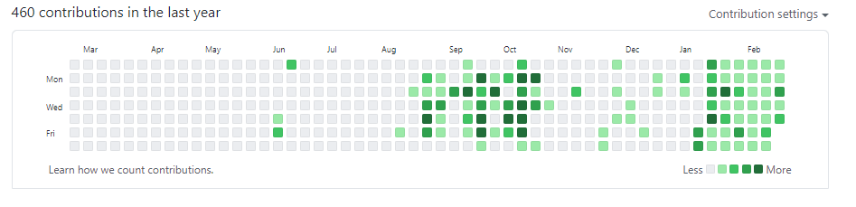

나는 처음에 1일 1commit을 하는 것은 무의미한 행동이라고 생각했다. 하지만 인터넷에 어떤 글을 보고 그 맘을 변하게 되었는데 현재 그 글은 어디있는지 찾을 수가 없지만, 핵심 내용은 이것이었다.
- 1일 1커밋은 효율적은 행동은 아니다. 하지만, 1일 1commit이 끊기는 것을 막기 위해, 아무리 힘들어도 하루에 단 1줄이라도 코드를 쳐서 gitHub에 올리게 된다면 이 행동에는 의미가 있다.
- 무엇을 하기위해 1일 1commit을 하는 것이 아니다. 이것은 하나의 게임이다. 매일매일 넓어지는 잔디밭의 크기를 보면서 무언가를 해 나가고 있다는 만족감을 준다.
- 이 행동을 계속 하다보면, 슬럼프가 왔을 때도 "습관처럼 개발한다"는 것이 멘탈의 흔들림과 관계없이 매일 배움의 자리로 자신을 이끌 수 있다.

그렇게 시작된 나의 commit 이 딱 6주를 맞이했다. 1일 1commit을 하면서 여러가지를 느꼈다.
- 1일 1commit을 유지하기 위해 코드를 한 줄이라도 치다보면, 궁금한 부분들이 보이고, 코드 한줄치기 위해 앉았는데도 불구하고 계속 앉아서 코딩을 하게 되었다.
- 힘들고 지치더라도, 이 잔디밭에 절대 빈공간이 생기면 안된다는 사명감이 생겨서 컴퓨터를 하고 있지 않을 때도, gitHub에 이번에는 어떤 코드를 넣어볼까 하고 고민하는 자신을 발견할 수 있었다.

일단 목표는 저 첫페이지에 보이는 1년치 commit을 전부 초록색 잔디밭으로 채우는 것이다. 하고나면 얼마나 기분이 짜릿할지 상상만해도 즐겁다.
