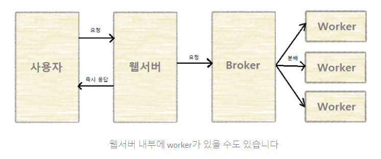

# 왜 궁금하게 되었는가?

- 당근마켓 python 웹/서버 개발자에게 요구하는 기술에서 봄
  https://boards.greenhouse.io/daangn/jobs/4300805003
  - 이런 일을 해요
    - 머신러닝 어드민 웹/서버 개발
    - 머신러닝 기능을 웹에서 테스트 확인
    - 데이터 탐색/수집 UI
    - 비동기 작업 처리
    - 머신러닝 기능 내부 API 개발
  - 이런 분을 찾아요
    - Python, SQL 언어에 능숙한 분
    - CSS, Javascript 웹 프론트 개발 경험
    - Redis, memcache를 활용한 개발 경험
    - 비동기 작업 개발 경험 (예: Celery)
    - gRPC / REST API 구현 능력
  - 딥러닝에 대한 이해
    이런 분이라면 더 좋아요!
    - 딥러닝 모델을 사용자 서비스에 적용

# Celery란?

`Celery` 는 `Python` 동시성 프로그래밍에서 가장 많이 사용하는 방법 중 하나이며, 분산 메시지 전달을 기반으로 동작하는 비동기 작업 큐(Asynchronous Task/Job Queue)이다.

- 비동기 작업 

  비동기 작업은 즉각적인 결과(응답)를 제공하기 어려운 작업을 수행할 때 활용 될 수 있다.
  예를 들어 대용량 작업을 동시에 처리하거나 사용자 요청(HTTP)에 무거운 연산이 포함되는 경우를 들 수 있다.
  보통 비동기 작업을 요청하고 나면, 즉시 응답을 받지 않아도 계속 다른 일을 수행할 수 있기 때문에 동시 작업이 가능하다.
  하지만 작업마다 소요되는 시간이 다르고, 실행 환경도 달라 중복 작업이 발생하지 않아야 하며 작업이 누락되지 않도록 하는 것도 매우 중요하다.

- 브로커와 메세지 전달

  이렇게 대기중인 `작업(Job)`을 관리하고, `작업자(Worker)`에서 제대로 전달되기 위해서는 중간 단계에서 관장하는 시스템이 필요하다.
  이 때 등장하는 개념이 `브로커(Broker)`이다. 브로커는 작업 메세지를 전달받은 대기열(Queue)에 보관했다가 적절한 작업자(Worker)가 메세지를 가져가서 작업(Job)을 수행하게 된다.
  이 과정에서 Celery는 메세지를 전달하는 역할(Publisher)과 메시지를 가져와 작업을 수행하는 역할(Worker)을 담당하게 된다.

Celery는 파이썬으로 작성 되었으며, **Django**와도 잘 호환된다. 기존에 Django에서 사용하기 위한 별도의 라이브러리 형태([django-celery](https://github.com/celery/django-celery))로 있었는데 Celery 3.1 부터 Celery를 설치하는 것만으로 Django에서 Celery를 사용할 수 있게 되었다.

# 왜 Celery를 생각했을까?

Django로 API 서버를 개발하고 운영하면서 사용자 요청에 포함될 필요가 없는 불필요한 과정이나 매우 무거운 쿼리 실행을 포함하는 경우가 있다.
예를 들어 `회원 가입 축하 이메일 발송`, `어드민 주문내역 엑셀 다운로드` 같은 기능이 해당된다.
이 API 에 포함된 외부 연동이나 무거운 작업들은 Celery Task로 정의해서 브로커(RabbitMQ)와 컨슈머(Celery Worker)를 이용해 비동기로 처리함으로써 사용자에게 가능한 빠른 응답 결과를 제공할 수 있을 것이다.

celery를 사용하는 방법에 대한 추가적인 내용 : https://jonnung.dev/python/2018/12/22/celery-distributed-task-queue/