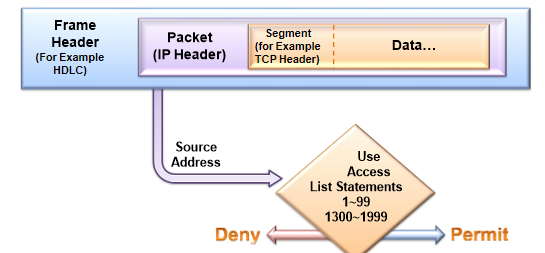
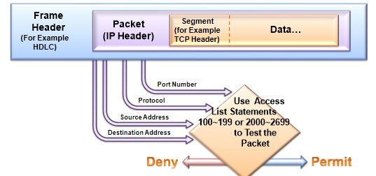
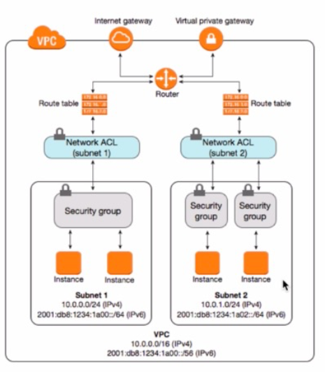

# ACL

> Access Control Lists
>
> 네트워크에 접근여부를 허용할지 말지를 결정하는 리스트 (필터링이라고 보면 된다.)

- 설명

  - 1개 이상의 서브넷 내부와 외부의 트래픽을 제어하기 위한 방화벽 역할을 하는 VPC를 위한 선택적 보안 계층

    -  보안 그룹과 비슷한 규칙으로 네트워크 ACL을 설정하여 VPC에 보안 계층을 더 추가할 수 있습니다.

  - 특정 패킷을 차단하거나 허용할 때 사용하는 네트워크에서 방화벽(라우터의 방화벽)과 같은 일을 합니다.

    ACL은 트래픽을 필터링하고 IP주소와 서브넷을 정의합니다. ACL을 설정하기 위해서는 출발지와 목적지, permit과 deny, in과 out의 설정을 먼저 고려해야합니다.

- 왜 필요한가?

  - L3 Device는 전송하고자 하는 패킷의 목적지 IP 주소에 대한 경로 정보가 자신의 Routing Table에 등록되어 있는 경우 기본적으로 해당 패킷을 전송 처리한다. (Routing 수행)
  - 하지만 보안적인 관점에서 모든 패킷을 전송하는 것은 위험할 수 있다. 공격과 관련된  패킷 혹은 불필요한 패킷의 경우 전송을 차단할 필요가 있다. 이를 수행하는 Device가 Firewall(방화벽)이다. 
  - Firewall을 사용할 수 없는 경우에는 Router에 Access Control List(ACL)를 구성하게 되면 기본적은 방화벽 기능을 사용할 수 있다. (Packet Filtering을 활용하여 네트워크에서 Packet 이동을 제어할 수 있다.)
  - 하지만 물리계층에서 어플리케이션 계층까지 완벽히 막을 수 없기 때문에 더 많은 보안기능이 있는 firewall같은 전문 보안 장비를 사용하는 것이 좋다

## ACL 의 규칙

1. ACL은 윗줄부터 순서대로 수행된다. 때문에 ACL은 좁은 범위 설정이 먼저 되어야 한다.

   - 만약 다음 처럼 넓은 범위를 먼저 설정하게 되면 모든 Packet이 허용되게 된다. (필터링 효과가 없다.)

2. ACL의 마지막은 deny any 가 생략되어 있다. 즉, 마지막에 permit any가 없을 경우 ACL 조건에 없는 모든 address는 deny 된다.

3. numbered ACL은 순서대로 입력되기 때문에 중간 삽입이나 중간 삭제가 불가능하다.

   즉, 중간에 리스트가 틀렸어도 중간 삽입, 수정, 삭제가 불가능하다.

   수정이 필요한 경우 no access-list <번호>로 모두 삭제 후 다시 입력한다. ( 특정 access-list 한 줄을 삭제하면 해당 번호의 모든 내용이 삭제된다! )

4. Interface에 별 다른 ACL이 정의가 되어있지 않으면 아무런 필터링이 동작하지 않는다.

## ACL의 종류

> 어떻게 패킷을 필터링을 하느냐에 따라 표준 ACL과 확장 ACL로 나뉘어진다.

### 표준ACL

- 출발지 IP주소(L3헤더 > IP 헤더의 Source Address를 조건으로 패킷을 분류 )만 참조하여 패킷을 필터링
  -  Permit이면 패킷을 정해진 경로로 전송하고 
     Deny면 패킷의 흐름을 막은 다음 'Host Unreachable'이라는 ICMP 메시지를 뿌려준다.
- 검사 결과에 따라 전체 Protocol Suite에 대한 Packet 출력을 허용하거나 거부한다.
- 표준 ACL의 사용 list-number 1~99, 1300~1999 번호 사용
- 단점
  - 패킷 자체를 막기 때문에 특정 서비스를 막고 싶어도 다른 서비스들 까지 모두 막음

**[Standard ACL 작성순서]**

1. list-number는 1-99까지의 번호를 사용한다. (1-99까지가 standard ACL의 번호이다.)

2. 조건에 맞는 패킷을 permit할지 deny할지 결정한다.

3. 조건을 넣는다. standard ACL의 조건은 source address, 그리고 뒤에 source address에 대한 wildcard mask를 넣는다. source address를 넣지 않고 any라고 입력하면 특정 출발지 주소가 아닌 모든 주소에 2번의 수행 내용을 적용한다.

### 확장ACL

- L3헤더(IP 헤더)의 Source Address, Destination Address, Protocol, TTL 등의 정보와 L4헤더(TCP/UDP)의 Source Port, Destination Port, TCP Flag 등의 좀더 자세한 정보를 기반으로 패킷을 분류 후 정책 정의. 
- Extended ACL의 사용 list-number는 100-199까지 사용

**[Extended ACL 작성순서]**

1. list-number는 100-199까지의 번호를 사용한다.
   (100-199까지가 Extended ACL의 번호이다.)

2. 조건에 맞는 트래픽을 permit할지 deny할지 결정한다.

3. 필터링을 할 프로토콜을 정의한다. (TCP, UDP, IP 등)

4. Source address를 지정한다.

5. Destination address를 지정한다.

6. 목적지 TCP/UDP 포트 이름 및 번호를 지정한다.

## ACL의 작동방식

**1) Inbound 설정**

- 패킷이 라우터 내부로 들어올 때 필터링 여부를 결정

- 라우터 인터페이스로 패킷이 들어올 경우 수신 인터페이스에 ACL이 설정되어 있는지 확인하고 설정이 되어있지 않으면 그냥 통과시킨다

- 만약 ACL이 설정돼 있다면 들어온 패킷의 정보와 ACL에 설정 내용을 비교해서 통과 여부를 결정한다.

  (조건과 일치하고 permit이면 통과, deny면 통과 X)

 

 

**2) Outbound 설정**

- 패킷이 라우터 외부로 나갈 때 필터링 여부를 결정한다.

- 라우터 인터페이스에서 패킷이 나갈 경우 인터페이스에 ACL이 설정되어 있는지 확인하고 설정이 되어있지 않으면 그냥 보낸다.

- 만약 ACL이 설정돼 있다면 나가는 패킷의 정보와 ACL에 설정 내용을 비교해서 통과 여부를 결정한다.

  (조건과 일치하고 permit이면 통과, deny면 통과 X)

 

**[Well Known Port]**

1) TCP : FTP(20, 21), Telnet(23), SMTP(25), HTTP(80), HTTPs(443)

2) UDP : DNS(53), TFTP(69), DHCP(67, 68)

## 보안그룹과 네트워크 ACL 비교

- 보안그룹

  - 인스턴스 레벨의 보안.  e.g.) EC2에 필요한 SSH, HTTP, HTTPS 등의 Allow

  - Allow만 있고 나머지는 모두 Deny이기에 별도의 Deny 설정은 없음

  - 나가는 것을 Allow 하면 들어오는 것도 자동 Allow

    -> Inbound /Outbound 따로 설정

- 네트워크 ACL

  - 서브넷 보안 

    -> 특정 서브넷에 TCP 22 포트 Allow -> Subnet Associations에서 설정

  - 나가는 트래픽, 들어오는 트래픽 따로따로 Allow/Deny 설정 

    -> Inbound Rules/Outbound Rules 따로 설정

  - ALLOW/DENY 따로 설정 설정

  - 서브넷 내에 있는 모든 인스턴스에 바로 적용 

**[공통점]**

- VPC 내 적용하는 보안이다.

- 트래픽은 아래 순서대로 진입된다.

  - Client -> 인터넷 게이트 웨이(혹은 버추얼 프라이빗 게이트 웨이) 

    -> VPC -> 라우터 -> 라우터 테이블

    -> NACL -> 서브넷 진입 -> Security Group -> Instance로 전달된다.

    
