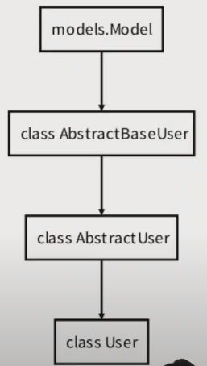
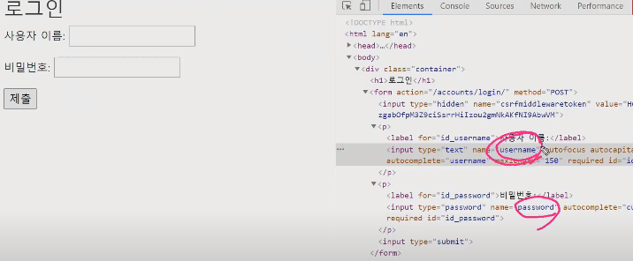
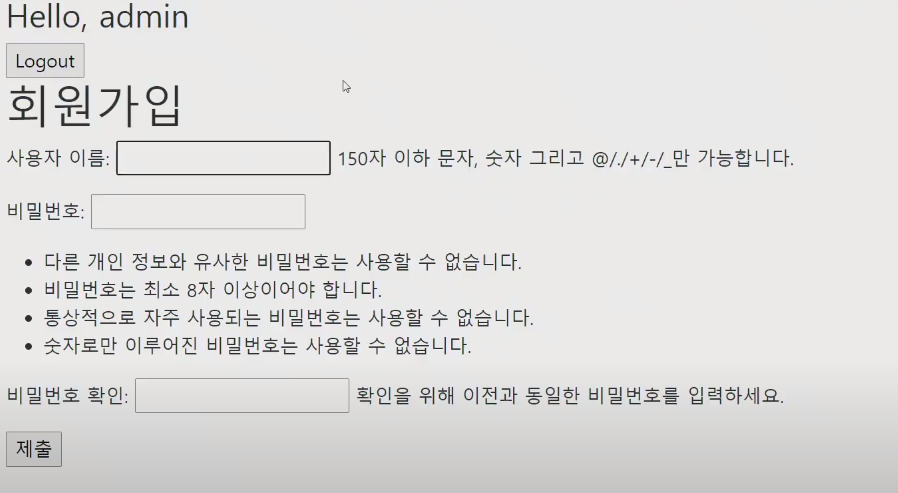
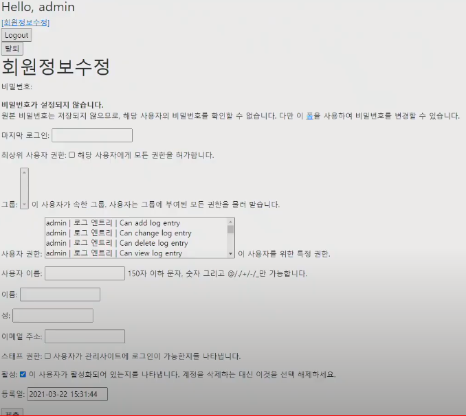
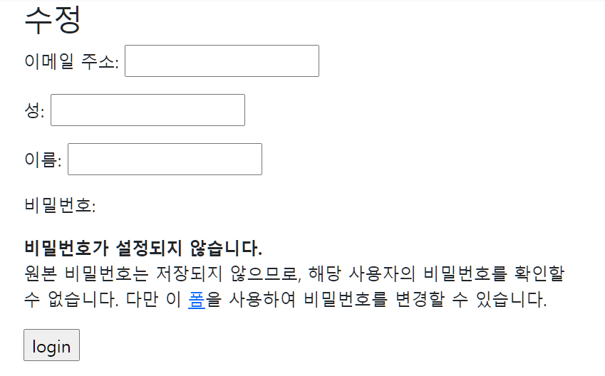

# Django Auth

- Authentication
  - 인증
  - 자신이 누구라고 주장하는 사람의 신원을 확인하는 것
- Authorization
  - 권한, 허가
  - 가고싶은 곳으로 가도록 혹은 원하는 정보를 얻도록 허용하는 과정
- Django Authentication System
  - 인증(authentication)과 권한(authorization) 부여를 함께 제공하며, django에서는 이러한 기능이 어느정도 결합되어 있기 때문에 일반적으로 **authentication system(인증시스템)** 이라고 함
  - 크게 `User object`와 `Web request`에 대한 인증시스템으로 구성
  - https://docs.djangoproject.com/en/3.1/topics/auth/default/
  - https://docs.djangoproject.com/en/3.1/topics/auth/
- Authentication Built-in Forms
  - django는 기본적으로 인증에 관련된 built-in form들을 제공
  - 회원가입(UserCreationForm), 로그인(AuthenticationForm) 등
  - `AuthenticationForm` 은 `forms.form`의 상속을 받아 만들어지게된다.
  - https://github.com/django/django/blob/main/django/contrib/auth/forms.py
- Authentication in Web request
  - Django는 세션과 미들웨어를 사용하여 인증시스템을 request 객체에 연결
  - 이를 통해 사용자를 나타내는 모든 요청에 `request.user`를 제공
  - `request.user` 는 현재 사용자가 로그인하지 않은 경우 `AnonymousUser` 클래스의 인스턴스로 설정되며, 그렇지 않으면 `User` 클래스의 인스턴스로 설정됨
    - 이 정보는 context로 따로 넘겨주지 않아도 Django가 넘겨주게 되는데, `프로젝트.settings.py` 에서 `TEMPLATES.OPTIONS.context_processors` 에서 확인할 수 있다.
      - `'django.template.context_processors.request',`
- 로그인
  - 로그인은 Session(세션)을 Create 하는 로직과 같음
  - login()
    - Request 객체와 User 객체를 통해 로그인 진행
    - Django의 session framework를 통해 사용자의 ID를 세션에 저장
- 로그아웃 
  - 로그아웃은 세션을 Delete하는 로직과 같음
  - logout()
    - request 객체를 받으며 return이 없음
    - 현재 요청에 대한 DB의 세션 데이터를 삭제하고 클라이언트 쿠키에서도 `sessionid`를 삭제

## 개념

### HTTP(HyperText Transfer Protocol)

- HTML 문서와 같은 리소스들을 가져올 수 있도록 해주는 프로토콜(규칙, 약속)
- 웹에서 이루는 모든 데이터 교환의 기초
- 특징
  - 비연결지향(connectionless) : 서버는 응답 후 접속을 끊음
  - 무상태(stateless) : 접속이 끊어지면 클라이언트와 서버간의 통신이 끝나며 상태를 저장하지 않음

### Cookie(쿠키)

- HTTP 쿠키 : `클라이언트의 로컬에 저장`되는 키-값의 작은 데이터 파일

- 세션을 유지하는 방식 중 가장 대표적인 방식

- 웹 페이지에 접속하면 요청한 웹 페이지를 받으며 쿠키를 로컬에 저장하고, 클라이언트가 재요청시마다 웹 페이지 요청과 함께 쿠키 값도 같이 전송

  - 기본적으로 브라우저는 수천개, 수만개를 가질 수 있다.
  - 하지만, 웹 사이트를 방문할 때마다 갖고 있는 모든 쿠키를 전달하는 것은 아니다.
  - 해당 웹사이트에서 발급한 쿠키만 포함해서 요청을 보낸다.
    - Domain이라는 데이터에다가 보낼 웹사이트 주소를 적어놓음

- 쿠키 확인

- F12 - Application - Storage - Cookies

- 사용 목적

  - 세션관리
    - 아이디 자동완성, 공지 하루 안보기, 팝업 체크, 비로그인 장바구니 담기 등
    - 편의를 위하되 지워지거나 유출되어도 큰 문제 없을 정보들을 저장
  - 개인화
    - 사용자 선호, 테마 등의 세팅
  - 트래킹
    - 사용자 행동을 기록 및 분석하는 용도

- HTTP 쿠키는 상태가 있는 세션을 만들도록 해준다.

- Cookie lifetime(라이프타임, 일생) - 파기시점 존재 유무로 구분

  - Session Cookie
    - 현재 세션(current session)이 종료되면 삭제
    - 브라우저는 현재 세션이 종료되는 시기를 정의
      - 일반적으로 브라우저를 종료할 떄 함께 삭제되는 쿠키
    - 일부 브라우저는 다시 시작할 떄 세션 복원(session restoring)을 사용해 계속 지속될 수 있도록 함
  - Parmanent cookie(유통기한 있는 쿠키)
    - `Expires` 속성에 지정된 날짜 혹은 Max-Age 속성에 지정된 기간이 지나면 삭제
    - 브라우저를 종료하거나 컴퓨터를 재시작하더라도 남아있는 쿠키

- `프로젝트.settings.py` 에서 SESSION_COOKIE_AGE 로 쿠키 유통기한 설정 가능

  ```python
  DAY_IN_SECONDS = 86400 # 가독성을 좋게 하기 위한 변수
  SESSION_COOKIE_AGE = DAY_IN_SECONDS * 2 # 그냥 132800 로 입력해도 되지만, 이렇게 표기하면 더 가독성이 좋아짐
  ```

  


### Session(세션)

- 사이트와 특정 브라우저 사이의 "state"(상태)를 유지시키는 것
- 클라이언트가 서버에 접속하면 서버가 특정 session id를 발급하고 클라이언트는 `서버에 session id를 쿠키를 사용해 클라이언트 로컬에 저장`, 클라이언트가 다시 서버에 접속할 때 해당 쿠키(session id가 저장된)를 이용해 서버에 session id를 전달
- Django는 session id를 포함하는 쿠키를 사용해서 각각의 브라우저와 사이트가 연결된 세션을 알아냄. 
  - 세션 정보는 django DB의 django_session 테이블에 저장
- 주로 로그인 상태 유지에 사용


### User

- User Objects
  - django 인증 시스템의 핵심
  - Users가 django 인증 시스템에서 표현되는 모델
  - 일반적으로 사이트와 상호작용하는 사람들을 나타냄
  - django 인증 시스템에서는 오직 하나의 User Class 만 존재
  - AbstractUser Class의 상속을 받음
- AbstractUser
  - User model을 구현하는 완전한 기능을 갖춘 기본 클래스
- AbstractBaseUser
  - password, last_login 정보밖에 안받음
- https://github.com/django/django/blob/main/django/contrib/auth/models.py
  - class User 검색
- User 참조
  - `get_user_model()` 을 이용해서 참조
    - User를 직접참조하는 대신 djagno.contrib.auth.get_user_model()을 사용하여 user model을 참조해야함
  - 현재 프로젝트에서 활성화(active)된 user model을 return
  - 커스텀한 user model이 있을 경우 user model, 그렇지 않으면 User 참조하면 되긴 하지만 직접참조는 좋은 방법이 아님



## 로그인

- 로그인 Session(이하 세션)을 Create하는 로직과 같음

- login()

  - Request 객체와 User객체를 통해 로그인 진행
  - Django session framework를 통해 사용자의 ID를 세션에 저장

  

  

### 로그인 구현하기

1. 계정관리 app 만들기

   - `python manage.py startapp accounts`

     - accounts로 어플이름 만드는게 좋음

   - `프로젝트.settings.py` > INSTALLED_APPS 에 추가

   - `accounts/urls.py` 만들기

     ```python
     from django.urls import path
     from . import views
     
     app_name = 'accounts'
     urlpatterns = [
         ,
     ]
     ```

   - `프로젝트/urls.py`에 연결

     - `path('accounts/', include('accounts.urls')),`


2. `accounts/urls.py`

   - `path('login/', views.login, name='login'),` 추가

3. `accounts/views.py`

   - `form = AuthenticationForm(request, data = request.POST)`
   - `auth_login(request, form.get_user())`
     - form.get_user는 User 객체 반환

   ```python
   from django.shortcuts import render, redirect
   from django.contrib.auth import login as auth_login # login함수와 이름이 겹쳐서
   from django.contrib.auth.forms import AuthenticationForm
   
   # Create your views here.
   def login(request) : 
       if request.method=='POST' :
           # data는 forms.form 두번쨰 인자이므로 data = 은 생략 가능
           form = AuthenticationForm(request, data = request.POST) # 먼저 request 인자를 받아야함
           if form.is_valid() :
               # 세션 CREATE/ form.get_user는 User 객체 반환
               auth_login(request, form.get_user())
               return redirect('articles:index') # 로그인 성공시 메인페이지 이동
       else :
           form = AuthenticationForm()
   
       context = {
           'form' : form,
       }
       return render(request, 'accounts/login.html', context)
   ```

4. `accounts/templates/accounts` 에 `login.html`만들기

   - 아이디는 `username`
   - 패스워드는 `password` 로 name을 가짐

   ```HTML
   
   
   
     <h1> 로그인 </h1>
     <form action="" method="POST">
     
     {{ form.as_p }}
   </form>
   
   ```



5. HTML 에서 유저 정보 가지고 오고 싶을 때
   - `{{ request.user }}`


### 작동 살펴보기

1. 로그인 하기 이전

   - Cookies에는 csrf 토큰밖에 없음

2. 로그인 하기

   - Cookies에 sessionid가 추가됨
     - 로그인 정보가 담겨있음
     - Max-Age가 정해져 있음 - parmanent cookie임

3. data Table 보기

   - `django_session` 테이블이 생성됨
     - 세션에 대한 데이터를 데이터베이스에 저장하는 것을 볼 수 있음
     - Cookie의 sessionid는 테이블의 session_key와 동일함

   

## 로그아웃


### 로그아웃 구현하기

1. `어플.urls.py`

   - `path('logout/', views.logout, name='logout')`

2. `어플.views.py`

   ```python
   from django.views.decorators.http import require_POST
   from django.contrib.auth import logout as auth_logout
   
   @require_POST
   def logout(request) :
       auth_logout(request)
       return redirect('articles:index')
   ```

3. `base.HTML`에 버튼 넣어주기

   - `request.user.is_authenticated`

```HTML
    
      <form action="" method="POST">
        
        <input type="submit" value="Logout">
      </form>
    
      <a href="">Login</a>
    
```


## 접근 제어하기

### 로그인 사용자에 대한 접근제한

- `is_authenticated` : attribute 사용
  - User class의 속성(attributes)
  - 사용자가 인증되었는지 확인하는 방법
  - User에 항상 `True`이며, AnomymousUser에 대해서만 항상` False`
  - 단, 이것은 권한(permission)과는 관련이 없으며 사용자가 활성화 상태(active)이거나 유효한 세션(valid session)을 가지고 있는지도 확인하지 않음
- `login_required`  : decorator 사용
  - 사용자가 로그인했는지 확인하는 view를 위한 데코레이터
  - 로그인하지 않은 사용자를 settings.LOGIN_URL에 설정된 경로로 redirect 시킴
  - LOGIN_URL의 기본 값은 `'/accounts/login/'`
    - 기본값을 바꿔도 되지 않기 위해 앱이름을 `accounts` 로 설정한 이유 중 하나임
  - 로그인 된 사용자의 경우 해당 view 함수를 실행


### 구현하기

1. 로그인 한 상태에서 로그인 페이지 접근 막기 - `accounts.views.py`

   ```python
   def login(request) :
       if request.user.is_authenticated :
           return redirect('articles:index')
       
    	"""
    	내용
    	"""
   ```

   

2. 로그인 안한 상태에서 글쓰기 막기 - `index.html`

   ```HTML
     <h1>Articles</h1>
     
       <a href="">[CREATE]</a>
     
       <a href="">[새 글을 작성하려면 로그인하세요]</a>
     
   ```


2-2. 로그인 안한 상태에서 글쓰기 막기 - `어플.views.py`

- 비슷한 역할이니 create, delete, update 함수에 다 `@login_required` 달아주기

```python
from django.contrib.auth.decorators import login_required

@login_required
@require_http_methods(['GET', 'POST'])
def create(request):
    # 내용
```


2-3. 글쓰기에서 넘어온 url 처리 - `accounts.views.py`

- `login_required`로 인해 보내진 주소는 `http://127.0.0.1:8000/accounts/login/?next=/articles/create/` 형태를 띄고 있음
  - next 변수를 이용해서 로그인 이후 다시 글쓰기 페이지로 넘겨주게 해주어야함.
- `redirect(request.GET.get('next') or 'articles:index')` next가 있다면 넘어갈 수 있도록 redirect 수정

```python
def login(request) : 
    if request.method=='POST' :
        # data는 forms.form 두번쨰 인자이므로 data = 은 생략 가능
        form = AuthenticationForm(request, data = request.POST) # 먼저 request 인자를 받아야함
        if form.is_valid() :
            # 세션 CREATE/ form.get_user는 User 객체 반환
            auth_login(request, form.get_user())
            return redirect(request.GET.get('next') or 'articles:index') # 로그인 성공시 메인페이지 이동
```


3. 글삭제 - `어플.views.py`

   - `@login_required` 와 `@require_POST` 를 같이 쓰게 되면
     - 비로그인상태로 접근 -> 로그인 창 -> 로그인성공 - > 405 에러
     - `redirect(request.GET.get('next')) ` 을 통해서 GET 방식으로 되돌아가기 때문에 생기는 로직상의 에러
   - `@login_require` 대신 `request.user.is_authenticated` 사용하기

   ```python
   @require_POST
   def delete(request, pk) :
       if request.user.is_authenticated :
           article = get_boject_or_404(Article, pk=pk)
           article.delete()
        return redirect('articles:index')
   ```

   

## 회원가입


### 구현하기

1. `accounts.urls.py` 에서 로그인 url 추가
   - `path('signup/', views.signup, name='signup')`

2. `accounts.views.py` 에서 signup 함수 추가
   - `form = UserCreationForm()`
   - `user = form.save()` 회원가입 이후 `auth_login(request, user)` 로그인까지 처리

```python
from django.contrib.auth.forms import UserCreationForm
from django.contrib.auth import login as auth_login

def signup(request) :
    if request.method== "POST" :
        form = UserCreationForm(request.POST)
        if form.is_valid() :
            user = form.save()
            auth_login(request, user)
            return redirect('articles:index')
    else : # 회원가입 페이지 첫 접근
        form = UserCreationForm()
    context = {
        'form' : form,
    }
    return render(request, 'accounts/signup.html', context)
```

3. `signup.html` 만들기
   - 로그인 화면과 거의 동일

```HTML



  <h1> 회원가입 </h1>
  <form action="" method="POST">
  
  {{ form.as_p }}
</form>

```



4. `base.html` 에 링크 추가

   ```html
       
         <a href="">Login</a>
         <a href="">Signup</a>
       
   ```

   

## 유저 탈퇴


### 구현하기

1. `accounts.urls.py` 에서 로그인 url 추가

- `path('delete/', views.delete, name='delete')`

2. `accounts.views.py` 에서 delete함수 추가

   ```python
   @required_POST
   def delete(request) :
       if request.user.is_authenticated :
           request.user.delete()
           auth_logout(request) # 세션 지워주기
           
       return redirect('articles:index')
   ```

3. `base.html`에 링크 추가

```HTML
    
      <form action="" method="POST">
        
        <input type="submit" value="Logout">
      </form>
      <form action="" method="POST">
        
        <input type="submit" value="회원탈퇴">
      </form>
    
      <a href="">Login</a>
      <a href="">Signup</a>
    
```


## 유저수정


### 구현하기

1. `accounts.urls.py` 에서 로그인 url 추가
   - `path('update/', views.update, name='update')`

2. `accounts.views.py` 에서 update함수 추가
   - 이거 밑에서 form 받아서 쓰는걸로 수정해줄 것임

```python
from django.contrib.auth.forms import UserChangeForm

def update(request) :
    if request.method == "POST" :
        pass
    else :
        form = UserChangeForm()
    context = {
        'form' : form,
    }
    return render(request, 'accounts/update.html', context)
```


3. `update.html`만들기

- 그대로 쓰면 너무 많은 설정을 할 수 있음
- 3-2 처럼 커스텀 해주는게 좋음

```HTML



  <h1> 회원수정 </h1>
  <form action="" method="POST">
  
  {{ form.as_p }}
</form>

```



3-2 .  `accounts.forms.py` 

- get_user_model()

  - 만약 User모델을 직접 참조하게 되면, 나중에 User를 Custom 했을 때의 User를 참조할 수 없게 됨. 그래서 간접적으로 참조하는 방식을 취하는 것이 좋음
  - https://docs.djangoproject.com/en/3.1/topics/auth/customizing/#referencing-the-user-model

  

```python
from django.contrib.auth.forms import UserChangeForm
# from django.contrib.auth.models import User # 이렇게 직접적으로 참고할수는 있으나 권장하지 않는 방법임
from django.contrib.auth import get_user_model

class CustomUserChangeForm(UserChangeForm) :
    
    class Meta :
        # model = User
        model = get_user_model()
        field= ('email', 'first_name', 'last_name', 'password')

```

4. `accounts.views.py` 에서 update함수 수정

   - `form = CustomUserChangeForm(request.POST, instance=request.user)`

   ```python
   from .forms import CustomUserChangeForm
   from django.contrib.auth.decorators import login_required
   
   @login_required
   def update(request) :
       if request.method == "POST" :
           form = CustomUserChangeForm(request.POST, instance=request.user)
           if form.is_valid() :
               form.save()
               return redirect('articles:index')
       else :
           form = CustomUserChangeForm(instance=request.user)
       context = {
           'form' : form,
       }
       return render(request, 'accounts/update.html', context)
   ```

   

5. `base.html` 추가

- `<a href="">[회원정보수정]</a>`

```python
    
      <a href="">[회원정보수정]</a>
      <form action="" method="POST">
        
        <input type="submit" value="Logout">
      </form>
      <form action="" method="POST">
        
        <input type="submit" value="회원탈퇴">
      </form>
    
      <a href="">Login</a>
      <a href="">Signup</a>
    
```


### 비밀번호 수정

1. 수정페이지에 폼 을 누르면 `accounts/password/` 로 자동 연결됨
   - `urls.py`에서 
     - `path('password/', views.update_password, name='update_password'),`



2. `views.py`

- PasswordChangeForm(request.user, request.POST)

- update_session_auth_hash(request, form.user) # session 을 update

```python
from django.contrib.auth.forms import PasswordChangeForm
from django.contrib.auth import update_session_auth_hash

def update_password(request) :
    if request.method == "POST" :
        form =PasswordChangeForm(request.user, request.POST)
        if form.is_valid() :
            user = form.save() # 이때 로그아웃처리됨. session 정보 날라가고, 로그인정보도 사라짐
            update_session_auth_hash(request, user) # session 을 update 이렇게 해야 비밀번호를 바꾸더라도 로그아웃이 되지 않음
            return redirect('articles:index')
    else :
        form = PasswordChangeForm(request.user)
    context = {
        'form':form,
    }
    return render(request, 'accounts/update_password.html', context)
```


