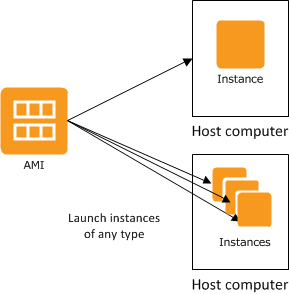
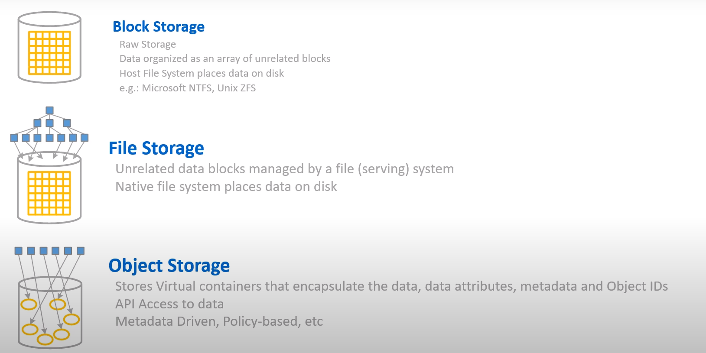
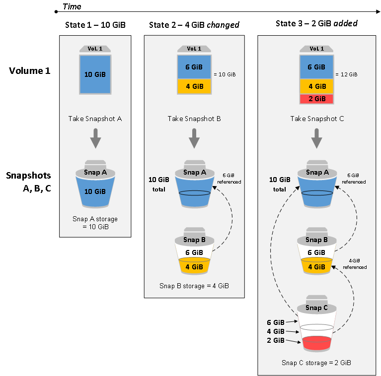

# EC2 (Amazon Elastic Compute Cloud)

- Amazon Elastic Compute Cloud(Amazon EC2)
  - AWS 컴퓨팅 서비스 중 하나
    - EC2 - 확장 가능한 서버(컴퓨터) 제공
    - Elastic Beanstalk - PaaS 형태의 서비스 제공 
    - Lambda - serverless 컴퓨팅 서비스 제공
  - Amazon EC2를 사용하면 하드웨어에 선투자할 필요가 없어 더 빠르게 애플리케이션을 개발하고 배포할 수 있음
  - Amazon EC2를 통해 원하는 만큼 **가상 서버(=인스턴스 Instance)**를 구축하고 보안 및 네트워크 구성과 스토리지 관리가 가능
  - 또한 Amazon EC2는 요구 사항이나 갑작스러운 인기 증대 등 변동 사항에 따라 신속하게 규모를 확장하거나 축소할 수 있어 서버 트래픽 예측 필요성이 줄어듬
- 특징
   - 컴퓨팅 요구사항의 변화에 따라 컴퓨팅 파워를 조정할 수 있다.
    - 새로운 서버 인스턴스 확보 및 부팅시간을 몇분으로 단축시킬 수 있다.
    - 실제로 사용한 용량만큼만 지불 가능 (요금제 선택에 따라 낭비할 수 도 있음)
    - Linux / Windows 중 선택 가능하다 (이외 운영체제는 현재 지원하지 않는다)
    - 안정성을 위해 여러 AWS 리전과 가용 영역에 걸쳐 배포
- 간단히 보는 EC2 제공 기능
   - **인스턴스**: 가상 컴퓨팅 환경
   - **Amazon 머신 이미지(AMI)**: 서버에 필요한 운영체제와 여러 소프트웨어들이 적절히 구성된 상태로 제공되는 템플릿으로 인스턴스를 쉽게 만들 수 있습니다.
   - **인스턴스 유형(Types)**: 인스턴스를 위한 CPU, 메모리, 스토리지, 네트워킹 용량의 여러 가지 구성 제공
   - **키 페어**를 사용하여 인스턴스 로그인 정보 보호(AWS는 퍼블릭 키를 저장하고 사용자는 개인 키를 안전한 장소에 보관하는 방식)
   - **인스턴스 스토어 볼륨**: 임시 데이터를 저장하는 스토리지 볼륨으로 인스턴스 중단, 최대 절전 모드로 전환 또는 종료 시 삭제됨
   - **Amazon Elastic Block Store(Amazon EBS)**, 즉 *Amazon EBS 볼륨*을 사용해 영구 스토리지 볼륨에 데이터 저장
   - 인스턴스와 Amazon EBS 볼륨 등의 리소스를 다른 물리적 장소에서 액세스할 수 있는 **리전 및 가용 영역**
   - **보안 그룹**을 사용해 인스턴스에 연결할 수 있는 프로토콜, 포트, 소스 IP 범위를 지정하는 방화벽 기능
   - **탄력적 IP 주소(EIP)**: 동적 클라우드 컴퓨팅을 위한 고정 IPv4 주소
   - **태그**: 사용자가 생성하여 Amazon EC2 리소스에 할당할 수 있는 메타데이터
   - AWS 클라우드에서는 논리적으로 격리되어 있지만 원할 때마다 고객의 네트워크와 간편히 연결할 수 있는 가상 네트워크인 **Virtual Private Clouds(VPC)**

## 인스턴스 유형

- *인스턴스 유형*에 따라 인스턴스에 사용되는 호스트 컴퓨터의 하드웨어가 결정
- 각 인스턴스 유형은 서로 다른 컴퓨팅, 메모리, 스토리지 용량을 제공하는데, 이 용량에 따라 서로 다른 인스턴스 패밀리로 분류
- 인스턴스에서 실행하려는 애플리케이션 또는 소프트웨어의 요구 사항에 따라 인스턴스 유형을 선택

#### 인스턴스 구입 옵션

- **온디맨드 인스턴스(기본값)** - 시작하는 인스턴스에 대한 비용을 초 단위로 지불합니다.
- **[Savings Plans](https://aws.amazon.com/ko/blogs/korea/new-savings-plans-for-aws-compute-services/)** – 1년 또는 3년 기간 동안 시간당 USD로 일관된 컴퓨팅 사용량을 약정하여 Amazon EC2 비용을 절감할 수 있습니다.
- **예약 인스턴스(RI)** – 1년 또는 3년 기간 동안 인스턴스 유형 또는 지역을 포함해 일관된 인스턴스 구성을 약정하여 Amazon EC2 비용을 절감할 수 있습니다.
- **스팟 인스턴스** – 경매단위, 미사용 EC2 인스턴스를 요청하여 Amazon EC2 비용을 대폭 줄일 수 있습니다.
- **전용 호스트** - 인스턴스 실행을 전담하는 실제 호스트 비용을 지불하며, 기존의 소켓, 코어 또는 VM 소프트웨어별 라이선스를 가져와 비용을 절감합니다.
- **전용 인스턴스** - 단일 테넌트 하드웨어에서 실행되는 인스턴스 비용을 시간 단위로 지불합니다.
- **용량 예약** – 원하는 기간 동안 특정 가용 영역의 EC2 인스턴스에 대해 용량을 예약합니다.

## AMI(Amazon Machine Image)

- *Amazon 머신 이미지(AMI)*는 소프트웨어 구성이 기재된 템플릿
  - 예: 운영 체제, 애플리케이션 서버, 애플리케이션
- AMI에서 *인스턴스*를 바로 시작하실 수 있는데, 이 인스턴스는 AMI의 사본으로, 클라우드에서 실행되는 가상 서버
  - 한 AMI로 여러 인스턴스를 실행할 수 있습니다.

## 종료와 중지

- 인스턴스 종료와 중지는 다르다. 
  - 둘의 차이를 확실하게 구분할것!
- 인스턴스 수명주기

| 인스턴스 상태   | 설명                                                         | 인스턴스 사용 요금                                           |
| :-------------- | :----------------------------------------------------------- | :----------------------------------------------------------- |
| `pending`       | 인스턴스는 `running` 상태로 될 준비를 하고 있습니다. 인스턴스를 처음 시작하거나 `stopped` 상태의 인스턴스를 다시 시작하면 `pending` 상태가 됩니다. | 미청구                                                       |
| `running`       | 인스턴스를 실행하고 사용할 준비가 되었습니다.                | 청구                                                         |
| `stopping`      | 인스턴스가 중지 또는 중지-최대 절전 모드로 전환할 준비를 하고 있습니다. | 중지 준비 중인 경우 미청구 최대 절전 모드로 전환 준비 중인 경우 청구 |
| `stopped`       | 인스턴스가 종료되고 사용이 불가합니다. 언제든지 인스턴스를 다시 시작할 수 있습니다. | 미청구                                                       |
| `shutting-down` | 인스턴스가 종료할 준비를 하고 있습니다.                      | 미청구                                                       |
| `terminated`    | 인스턴스가 영구적으로 삭제되었으며 시작할 수 없습니다.       | 미청구 **참고** 종료된 인스턴스에 적용되는 예약 인스턴스는 결제 옵션에 따라 기간이 종료될 때까지 요금이 청구됩니다. 자세한 내용은 [예약 인스턴스](https://docs.aws.amazon.com/ko_kr/AWSEC2/latest/UserGuide/ec2-reserved-instances.html) 섹션을 참조하세요. |

### 인스턴스 중지

- 인스턴스를 중단하면 정상적인 실행종료 과정이 이루어지고 stopped 상태가 됨
  - 인스턴스의 모든 Amazon EBS 볼륨이 연결된 상태로 유지되므로 나중에 언제든지 다시 시작할 수 있습니다.
  - 인스턴스가 중지됨 상태에 있는 동안에는 추가 인스턴스 사용량에 대한 요금이 부과되지 않습니다.
- 인스턴스가 중지인 상태에서 인스턴스 유형을 변경할 수 있음
  - 인스턴스가 시작된 후 신규 인스턴스 유형에 대한 요금이 부과
- 인스턴스가 중지인 상태에서 EBS 볼륨을 연결하거나 분리할 수 있음
  - 모든 연결 Amazon EBS 루트 디바이스 사용을 비롯한 인스턴스 사용에 관련된 비용은 일반 Amazon EBS 요금이 적용
- 인스턴스로부터 AMI를 만들수도 있음
- 인스턴스가 중지인 상태에서 커널, 램 디스크, 인스턴스 유형을 변경할 수 있습니다.

### 인스턴스 종료

- 인스턴스가 종료될 때 인스턴스는 일반 종료를 수행

  - 루트 디바이스 볼륨은 기본적으로 삭제되지만 모든 연결된 Amazon EBS 볼륨은 기본적으로 유지
  - 이는 각 볼륨의 deleteOnTermination 속성 설정에 따라 결정
  - 인스턴스 자체도 삭제되므로 나중에 다시 시작할 수 없음

- 인스턴스 종료를 비활성화하면 실수로 인스턴스를 종료하는 일을 방지할 수 있음

  - 이 경우에는 해당 인스턴스에 관련된 `disableApiTermination 속성`을 true

  - Linux의 `shutdown -h` 및 Windows의 `shutdown` 같은 인스턴스 실행종료 동작을 제어하려면,

    `instanceInitiatedShutdownBehavior` 인스턴스 속성을 `stop`이나 `terminate`로 적절히 설정

  - 기본 설정은 인스턴스 실행종료 시 Amazon EBS 볼륨을 루트 디바이스로 사용하는 인스턴스는 `stop` 상태, 인스턴스 스토어를 루트 디바이스로 사용하는 인스턴스는 항상 종료 상태로 변경

## EC2 스토리지

- 스토리지의 종류
  - Block Storage
  - File Storage
  - Object Storage

- Amazon EC2는 고객의 상황에 맞춰 유연하고 비용대비 효율적이며 사용이 쉬운 데이터 스토리지 옵션을 제공
  - 각 옵션은 성능과 내구성이 조합되어 고유하게 구성
  - 스토리지 옵션은 독립적으로 또는 요구 사항에 맞춰 조합하여 사용할 수 있습니다.

- 제공되는 스토리지 옵션
  - Amazon Elastic Block Store
    - SSD와 HDD로 구분됨
      - SSD - 작은 I/O 크기의 읽기/쓰기 작업을 자주 처리하는 트랜잭션 워크로드에 최적화
      - HDD - 주요 성능 특성이 처리량인 대규모 스트리밍 워크로드에 최적화
    - 내구성이 있는 블록 수준 스토리지 볼륨을 제공하여 실행 중인 인스턴스에 연결하는 것이 가능
    - EBS 볼륨이 인스턴스에 연결되면, 다른 물리적 하드 드라이브처럼 사용할 수 있음
    - 한 인스턴스에서 EBS 볼륨을 분리한 다음 다른 인스턴스에 연결하는 것도 가능합니다. 인스턴스에 연결된 볼륨의 구성을 동적으로 변경할 수 있음
    - Amazon EBS 암호화 기능을 사용하여 EBS 볼륨을 암호화된 볼륨으로 생성할 수도 있습니다. 자세한 내용은 [Amazon EBS 암호화](https://docs.aws.amazon.com/ko_kr/AWSEC2/latest/UserGuide/EBSEncryption.html) 섹션을 참조
    - EBS 볼륨의 *스냅샷*을 생성하여 Amazon S3에 저장하면 데이터의 백업 사본을 유지할 수 있음
      - 스냅샷에서 새 EBS 볼륨을 만든 후 다른 인스턴스에 연결할 수 있습니다. 자세한 내용은 [Amazon Elastic Block Store](https://docs.aws.amazon.com/ko_kr/AWSEC2/latest/UserGuide/AmazonEBS.html) 섹션을 참조
  - Amazon EC2 인스턴스 스토어
    - stop/start로 인해 하드웨어가 바뀌면 사라짐(휘발성)
    - 디스크 오류, 인스턴스 중지, 인스턴스 종료 시  데이터 소실
  - Amazon EFS
    - EC2 인스턴스를 위한 완전 관리형 네트워크 파일시스템
    - EFS 파일 시스템을 만든 후 파일 시스템을 마운트하도록 인스턴스를 구성할 수 있음
    - 하나의 EFS 파일 시스템을 여러 인스턴스에서 실행하는 워크로드 및 애플리케이션에 대한 공통 데이터 소스로 사용할 수 있음
  - Amazon S3 (Simple Sotrage Service)
    - 웹에서 사용 가능한 오브젝트 저장소
    - Amazon S3를 활용하면 저렴하지만 신뢰성이 있는 데이터 스토리지 인프라에 액세스할 수 있음
    - S3은 언제든지 Amazon EC2 내 또는 웹의 어디서나 원하는 데이터의 양을 저장하고 가져올 수 있게 해주어 웹 규모의 컴퓨팅 작업을 쉽게수행할 수 있도록 설계
      - 예를 들어, Amazon S3를 활용하면 데이터 및 애플리케이션의 백업 사본을 저장할 수 있음
      - Amazon EC2는 Amazon S3를 사용하여 EBS 스냅샷과 인스턴스 스토어 지원 AMI를 저장
- 스토리지 도입 시 고려할 사항들
  - 내구성 - 데이터 손실 측정
  - 가용성 - Downtime 측정
  - 보안 - at-rest와 in-transit 데이터 보안
  - 비용 - Amount per Storage unit
  - 확장성 - 향상된 유연성, 스토리지 크기, 사용자 수
  - 성능 - 성눙 메트릭(대역폭, IOPS)
  - Integration - API 제공 여부 또는 다른 서비스와 상호 작용 가능성

- 스토리지 추가
  - AMI에서 인스턴스를 실행할 때마다 해당 인스턴스에 대한 루트 스토리지 디바이스가 생성
  - 루트 스토리지 디바이스에는 인스턴스를 부팅하기 위해 필요한 모든 정보가 포함
  - *블록 디바이스 매핑*을 사용하면 AMI를 생성하거나 인스턴스를 실행할 때 루트 디바이스 볼륨과 스토리지 볼륨을 지정할 수 있음

### EBS 스냅샷

- 지정 시간 스냅샷을 만들어 Amazon S3에 Amazon EBS 볼륨의 데이터를 백업할 수 있음
  - 스냅샷은 *증분식* 백업이어서 마지막 스냅샷 이후 변경된 디바이스의 블록만이 저장
  - 그러면 스냅샷을 만드는 데 필요한 시간이 최소화되며 데이터를 복제하지 않으므로 스토리지 비용이 절약
  - 각 스냅샷에는 (스냅샷을 만든 시점의) 데이터를 새 EBS 볼륨에 복원하는 데 필요한 모든 정보가 들어 있음
    - 스냅샷을 기반으로 EBS 볼륨을 생성하는 경우, 새 볼륨은 해당 스냅샷을 생성하는 데 사용된 원본 볼륨과 정확히 일치
    - https://docs.aws.amazon.com/ko_kr/AWSEC2/latest/UserGuide/ebs-creating-snapshot.html
    
.png)

- 증분식 스냅샷 작동방식
  - 아래 다이어그램에서 볼륨 1은 세 가지 시점에 표시됩니다. 이 각 세 가지 볼륨 상태에 대한 스냅샷이 만들어집니다.
    - 상태 1의 볼륨에는 10GiB의 데이터가 있습니다. 스냅 A는 이 볼륨의 첫 번째 스냅샷이므로 10GiB 데이터 전체를 복사해야 합니다.
    - 상태 2의 볼륨에는 여전히 10GiB의 데이터가 있지만 4GiB가 변경되었습니다. 스냅 B는 스냅 A를 만든 후 변경된 4GiB만 복사하고 저장해야 합니다.
      - 스냅 A에 이미 복사되어 저장된 변경되지 않은 나머지 6GiB 데이터는 (다시) 복사되는 것이 아니라 스냅 B에서 *참조*됩니다. 이는 파선 모양 화살표로 표시됩니다.
    - 상태 3에서는 2GiB의 데이터가 볼륨에 추가되어 총 12GiB가 되었습니다. 스냅 C는 스냅 B를 만든 후 추가된 2GiB를 복사해야 합니다.
      - 파선 모양 화살표로 표시되었듯이 스냅 C는 스냅 B에 저장된 4GiB의 데이터 및 스냅 A에 저장된 6GiB의 데이터를 참조합니다.
    - 이 세 스냅샷에 필요한 총 스토리지는 16GiB입니다.

## CloudWatch 모니터링

- Amazon CloudWatch는 Amazon Web Services(AWS) 리소스와 AWS에서 실시간으로 실행 중인 애플리케이션을 모니터링
- 지표를 감시해 알림을 보내거나 임계값을 위반한 경우 모니터링 중인 리소스를 자동으로 변경하는 경보를 생성할 수 있음

.png)

### cloudWatch를 통한 인스턴스 모니터링

- Amazon EC2는 측정치를 Amazon CloudWatch로 전송
  -  AWS Management 콘솔, AWS CLI 또는 API를 사용하여 Amazon EC2가 CloudWatch에 전송하는 측정치를 나열할 수 있음
  - 기본적으로 각 데이터 요소는 인스턴스의 시작 시간 이후 5분간 활동을 다룹니다.
  - 세부 모니터링을 활성화한 경우 각 데이터 요소는 시작 시간부터 1분간 활동을 다룹니다.
- 지표 목록
  - 인스턴스 지표
  - CPU 크레딧 지표
  - Nitro 기반 인스턴스용 Amazon EBS 지표
  - 상태 확인 지표
  - 트래픽 미러링 지표
  - Amazon EC2 사용량 지표