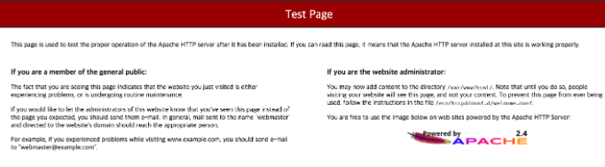
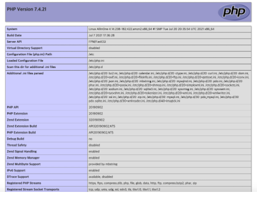
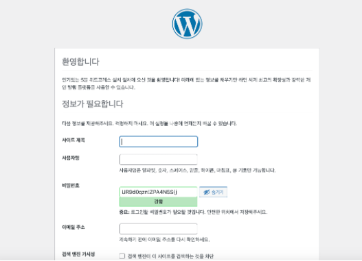
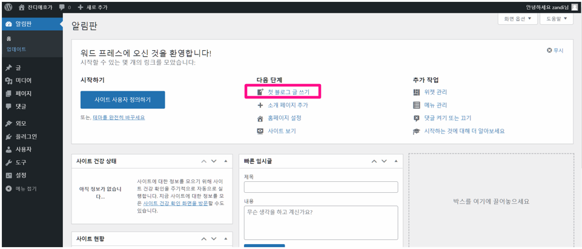

- 실습 목표

  - 단일 EC2에 wordpress, mariaDB 를 설치한 이후 워드프레스 구성

    (WordPress = PHP + mariaDB + Web)


#  EC2 

- 할 것
  - 웹서버 설치
  - php 설치
  - mariaDB 설치
  - wordPress 설치


## 웹서버 설치

```shell
# 관리자 전환
sudo su -

# 설치
yum install httpd -y

# 서비스 실행
systemctl start httpd && systemctl enable httpd

# 웹서버 버전 확인
httpd -v

# 웹 접속하여 확인
http://EC2_PublicIP/
```




## PHP 설치

```shell
# 설치
amazon-linux-extras install php7.4 -y

# PHP 버전 확인
php -v

# PHP Extensions 설치
yum install gcc php-xml php-mbstring php-sodium php-devel php-pear ImageMagick-devel ghostscript -y

# PHP Extensions 정보 확인
php --ini

# PHP Extensions - imagick 설치
## imagick 관련 ini 파일 생성
cat <<EOT> /etc/php.d/40-imagick.ini
; Enable imagick extension module
extension = imagick.so
EOT

# php.ini 파일 수정(아래 pecl 실행 시 필요한 메모리 확보 = 무제한 설정)
sed -i 's/^memory_limit = 128M/memory_limit = -1/g' /etc/php.ini
systemctl restart httpd

## pecl 로 imagick 설치
printf "\n" | pecl install imagick

# php-fpm 재시작으로 imagick 적용
systemctl restart php-fpm
systemctl restart httpd

# PHP Extensions 정보 확인
php --ini

# php info 페이지 생성
echo "<?php phpinfo(); ?>" > /var/www/html/info.php

# php.ini 파일 수정 - 업로드 파일 크기 관련 설정 및 메모리 상향 설정 
sed -i 's/^upload_max_filesize = 2M/upload_max_filesize = 64M/g' /etc/php.ini
sed -i 's/^post_max_size = 8M/post_max_size = 64M/g' /etc/php.ini
sed -i 's/^max_execution_time = 30/max_execution_time = 300/g' /etc/php.ini
sed -i 's/^memory_limit = 128M/memory_limit = 256/g' /etc/php.ini

# php-fpm 재시작으로 적용
systemctl restart php-fpm

# phpinfo.php 웹 접속하여 확인
http://EC2_PublicIP/info.php
```





## MariaDB

```shell
# 다운로드
wget https://ko.wordpress.org/wordpress-latest-ko_KR.zip
wget https://ko.wordpress.org/wordpress-5.8-ko_KR.zip


# 압축 풀기
unzip wordpress-latest-ko_KR.zip

# wp-config.php 파일 복사
cp wordpress/wp-config-sample.php wordpress/wp-config.php

# wp-config.php 파일에 db 접속을 위한 정보 입력
sed -i "s/database_name_here/wordpressdb/g" wordpress/wp-config.php
sed -i "s/username_here/root/g" wordpress/wp-config.php
sed -i "s/password_here/qwe123/g" wordpress/wp-config.php

# wp-config.php 파일에 메모리 상향 설정
cat <<EOT>> wordpress/wp-config.php
define('WP_MEMORY_LIMIT', '256M');
EOT

# 압축 푼 wordpress 파일을 웹 디렉터리에 복사
cp -r wordpress/* /var/www/html/

# 사용자와 권한 설정
chown -R apache /var/www
chgrp -R apache /var/www
chmod 2775 /var/www
find /var/www -type d -exec chmod 2775 {} \;
find /var/www -type f -exec chmod 0664 {} \;

# 서비스 재시작
systemctl restart httpd


```


## 워드프레스 관리자계정만들기

1. http://EC2_PublicIP/



2. 블로그 첫 글 써보기

