# HTTP Request 구조

> Hypertext Transfer Protocol(HTTP)
>
> 인터넷에서 데이터를 주고받을 수 있는 프로토콜 (프로토콜: 규칙)

## 1. start line

> HTTP request의 첫 라인

- **HTTP Method**
  HTTP Methods에는 GET, POST, PUT, DELETE, OPTIONS 등등이 있다. 주로 GET 과 POST과 쓰임.
- **Request target**
  해당 request가 전송되는 목표 uri.
- **HTTP Version**
  말 그대로 사용되는 HTTP 버젼. 버젼에는 1.0, 1.1, 2.0 등이 있다.

## 2. headers 

> 해당 request에 대한 추가 정보(addtional information)를 담고 있는 부분
>
> Key:Value 값으로 되어있다. 

- **Host**
  요청이 전송되는 target의 host url: 예를 들어, google.com
- **User-Agent**
  요청을 보내는 클라이언트의 대한 정보: 예를 들어, 웹브라우저에 대한 정보.
- **Accept**
  해당 요청이 받을 수 있는 응답(response) 타입.
- **Connection**
  해당 요청이 끝난후에 클라이언트와 서버가 계속해서 네트워크 컨넥션을 유지 할것인지 아니면 끊을것인지에 대해 지시하는 부분.
- **Content-Type**
  해당 요청이 보내는 메세지 body의 타입. 예를 들어, JSON을 보내면 application/json.
- **Content-Length**
  메세지 body의 길이

## 3. body

>  해당 reqeust의 실제 메세지/내용
>
>  Body가 없는 request도 많다. 예를 들어, GET request들은 대부분 body가 없는 경우가 많음.

# HTTP Response 구조

## 1. start line

> Response의 상태를 간략하게 나타내주는 부분. 3부분으로 구성되어 있다.

- HTTP 의 버전

- Status code: 응답 상태를 나타내는 코드. 숫자로 되어 있는 코드. 예를 들어, 200
- Status text: 응답 상태를 간략하게 설명해주는 부분. 예를 들어, "404 Not Found"

`HTTP/1.1 404 Not Found`

## 2. Headers

- HTTP Request 의 Header 와 동일하다.

  다만, response에서만 사용되는 header 값들이 있다.

  ex) User-Agent 대신에 Server 헤더가 사용

## 3. Body

- HTTP Response 의 body와 일반적으로 동일

  Request와 마찬가지로 모든 response가 body가 있지는 않다. 데이터를 전송할 필요가 없을경우 body가 비어있게 된다.

# HTTPS

>  HTTPS = HTTP + SSL

- HTTP = Hyper Text Transfer Protocol. Hypertext인 html을 전송하기 위한 통신 규약
- HTTPS = HTTP + S(over Secure socket layers). 보안이 강화된 HTTP

SSL(Secure Socket Layer) = TLS(Transport Layer Security)
인터넷에서 정보를 암호화해서 송수신하는 프로토콜로 넷스케이프가 개발.
국제 인터넷 표준화 기구에서 표준으로 인정받은 프로토콜임.
표준에 명시된 정식 명칭은 TLS이지만 아직도 SSL이라는 용어가 많이 사용됨.
고로 HTTP에 SSL이 첨가된 방식으로 주고 받는 정보가 암호화되어 보안성이 강화된 방식이다.

## HTTP의 문제

1. **암호화 기능 없음**
   단순 text형식으로 주고받기 때문에, 중간에서 누군가가 신호를 가로챈다면 내용이 그대로 노출된다.
2. **신뢰할 수 있는 사이트인지 확인 불가**
   통신하려는 사이트를 따로 확인하는 작업이 없어 다른 사이트가 통신하려는 사이트로 위장 가능
3. **통신 내용 변경 가능**
   요청을 보낸 곳과 받은 곳의 리소스가 정확히 일치하는지 확인할 수 없다.
   누군가가 중간에 데이터를 악의적으로 변조한다면 정확한 데이터를 주고받을 수 없게된

## SSL

> Secure Socket Layer

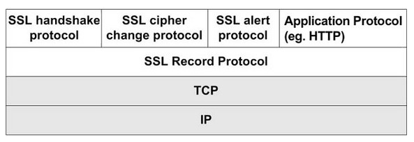

- HTTP 프로토콜 상위에 통신시 보안을 위한 SSL 관련 프로토콜이 있는 방식

  

  

### SSL 적용방식

> SSL 암호화 통신은 비대칭키 방식(암호화에 사용할 키를 교환)
>
> 데이터 통신은 대칭키 방식

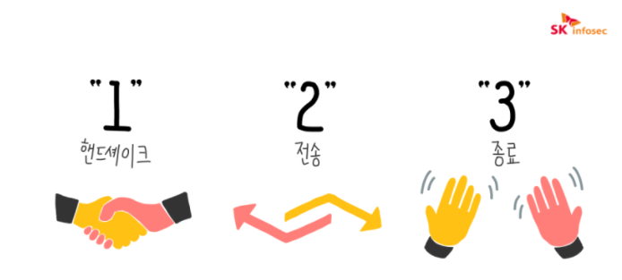

1. 핸드 셰이킹
2. 데이터 전송
3. 세션 종료

- SSL 적용은 핸드 셰이킹 단계에서 발생이 된다.

  - SSL 핸드셰이킹 : 443 포트를 이용하여 서로의 상태를 파악하는 TCP 기반의 프로토콜
  - TCP 기반이기 때문에 SSL 핸드세이크 전에 TCP 3-way 핸드셰이크 또한 수행

- 핸드 셰이킹 순서

  1. Client hello : 클라이언트가 서버에게 연락

     - ex) 브라우저 검색창에 도메인을 입력하는 것
     - 이때 클라이언트는 자신의 브라우저가 지원할 수 있는 암호화 방식(Cipher Suite)을 먼저 제시합니다. 그리고 랜덤 데이터를 생성하여 추가로 전송
     - **세션 아이디:** 이미 SSL 핸드쉐이킹을 했다면 비용과 시간을 절약하기 위해서 기존의 세션을 재활용하게 되는데 이때 사용할 연결에 대한 식별자를 서버 측으로 전송

  2. Server hello : 서버가 클라이언트에게 연락

     - 서버는 클라이언트가 제시한 암호화 방식 중 하나를 선정하여 알려줍니다. 
     - 또한, 서버 자신의 **인증서를 전달**합니다. 이 인증서에는 서버의 **공개 키**가 포함되어 있습니다. ( public key )
     - 클라이언트와 마찬가지로 서버 측에서 생성한 랜덤 데이터 또한 전달

  3. Client key exchange 

     - 인증서가 자신이 신용있다고 판단한 CA로부터 서명된 것인지 확인

       (또한 날짜가 유효한지, 그리고 인증서가 접속하려는 사이트와 관련되어 있는지 확인)

     - 클라이언트는 미리 주고받은 자신과 서버의 랜덤 데이터를 참고하여 서버와 암호화 통신을 할 때 사용할 키(랜덤 대칭 암호화 키)를 생성한 후 서버에게 전달합니다. 

     - 이때 키는 서버로부터 받은 공개키로 암호화되어 보내집니다.

  4. Finished 

     - 마지막으로 핸드셰이크 과정이 정상적으로 마무리되면, 클라이언트와 서버 모두 “finished” 메시지를 보냅니다. 

  5. 이후 전송단계로 넘어가서 클라이언트가 생성한 키를 이용하여 암호화된 데이터를 주고받게 됩니다.

- 핸드 쉐이킹 이후 데이터 전송 과정

  1. 클라이언트의 암호화한 데이터 전송
     - public key를 사용해서 랜덤 대칭 암호화키를 비롯한 URL, http 데이터들을 암호화해서 전송
  2. 웹서버의 복호화
     - private key를 이용해서 랜덤대칭 암호화키와 URL. http를 복호화
  3. 웹서버의 암호화 데이터 전송
     - 요청받은 URL에 대한 응답을 웹브라우저로부터 받은 랜덤 대칭 암호화키를 이용하여 암호화해서 브라우저로 전송
  4. 클라이언트의 복호화
     - 대칭 암호키를 이용해서 http 데이터와 html 문서를 복호화하고 화면에 뿌려줌

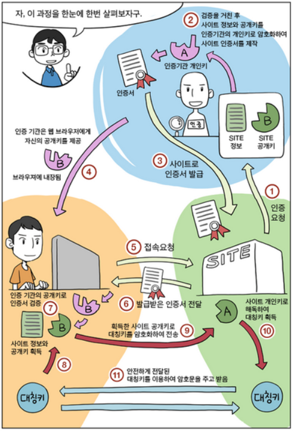

-  그림출처 :  https://preamtree.tistory.com/38

### 비대칭키 방식

> 당사자 중 한쪽이 비밀 키와 공개 키의 쌍, 공개 키 인프라(PKI) 기반을 갖는다.

- 공개 키와 개인 키의 개념을 기반

  - 두 가지 키 중 하나로 평문을 암호화(공개키를 통한 암호화)하면 다른 보완 키를 사용해야만 복호화(개인 키를 통한 복호화)할 수 있다.
  - 

- 단점

  - **암복호화가 매우 복잡하다는 점**이다. 암복호화가 복잡한 이유는, **암호화하는 키와 복호화하는 키가 서로 다르기 때문**

    - 즉, 메세지의 크기가 크면 암호화하는데 느리다.

    

### 대칭키 방식

> 양쪽 당사자가 공통 비밀 키를 공유

- 대칭형 방식은 양쪽 당사자가 공유한 시크릿에 의존

  - 전송자는 정보를 암호화하는 데 사용하고
  - 수신자는 동일한 방식과 키를 사용해 복호화한다. 

- 이 방법의 문제는 양쪽 당사자가 서로 물리적인 만남 없이 시크릿을 협상(교환)하는 방법이라서 일종의 보안 통신 채널이 필요하다.

  - 그래서, SSL 통신을 통하여 보안 통신채널을 만드는 것

- 장점

  - 공개키 암호화 방식에 비해 암호화 및 복호화가 빠르다는 장점이 있다. 

- 단점

  - 암호화 통신을 하는 사용자끼리 같은 대칭키를 공유해야만 한다는 단점이 있다.

    - 대칭키를 사용자끼리 물리적으로 직접 만나서 전달하지 않는한, **대칭키를 전달하는 과정에서 해킹의 위험에 노출**될 수 있기 때문

  - 대칭키는 데이터를 전송하는 쌍마다 필요하기 때문에, 통신을 총 n명이 한다면 nC2=n(n-1)/2 만큼의 대칭키 생성작업이 필요하다.
    - 즉, 키 관리가 힘들다.

  

### SSL 인증서

> SSL 인증서는 클라이언트와 서버간의 통신을 제3자가 보증해주는 전자화된 문서

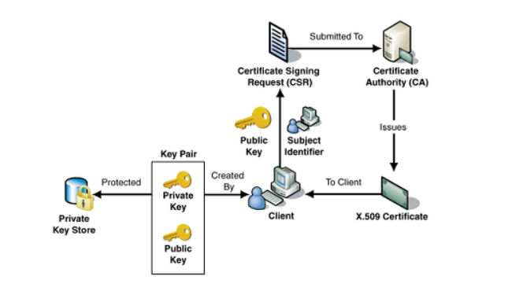

- 언제 검증하는가?
  - 클라이언트가 서버에 접속한 직후에 서버는 클라이언트에게 이 인증서 정보를 전달하게 됩니다. 
    클라이언트는 이 인증서 정보가 신뢰할 수 있는 것인지를 검증 한 후에 다음 절차를 수행하게 됩니다.
- SSL 인증서의 역할
  1. 클라이언트가 접속한 서버가 신뢰할 수 있는 서버임을 보장
  2. SSL 통신에 사용할 공개키를 클라이언트에게 제공
- 인증서의 내용
  1. 서비스의 정보 (인증서를 발급한 CA, 서비스의 도메인 등등)
     - 클라이언트가 접속한 서버가 신뢰할 수 있는 서버임을 보장하는 역할에 사용
  2. 서버 측 공개키 (공개키의 내용, 공개키의 암호화 방법)
     - 서비스의 도메인, 공개키와 같은 정보는 서비스가 CA로부터 인증서를 구입할 때 제출하고, CA에 의해 암호화해서 저장(CA는 CA 공개키를 이용해서 서버가 제출한 인증서를 암호화)

### CA

> 인증서를 통해 클라이언트가 접속한 서버가 클라이언트가 의도한 서버가 맞는지를 보장하는 역할
>
> CA(Certificate authority) 혹은 Root Certificate

- 브라우저의 CA 리스트

  - 브라우저는 내부적으로 CA 리스트를 미리 파악하고 있습니다.
  - 즉, 라우저가 미리 파악하고 있는 CA의 리스트에 포함되어야만 공인된 CA가 될 수 있는 것

- 확인 결과 서버를 통해서 다운받은 인증서가 내장된 CA 리스트에 포함되어 있다면 해당 CA의 공개키를 이용해서 인증서를 복호화

  - CA의 공개키를 이용해서 인증서를 복호화 할 수 있다는 것은 이 인증서가 CA의 비공개키에 의해서 암호화 된 것을 의미

    

  

# HTTP 와 HTTPS 차이 실습

- https://codingdog.tistory.com/entry/http%EC%99%80-https%EA%B0%80-%EC%96%B4%EB%96%A4-%EC%B0%A8%EC%9D%B4%EA%B0%80-%EC%9E%88%EB%8A%94%EC%A7%80-%EA%B0%84%EB%8B%A8%ED%95%98%EA%B2%8C-%EC%8B%A4%EC%8A%B5%ED%95%B4-%EB%B4%85%EC%8B%9C%EB%8B%A4 참조

- 준비물 
  - postman : 요청 보내는 용도
  - wireshark : 패킷 내용 확인 용도
  - HTTP, HTTPS 서버

## HTTP 요청의 경우

- 패킷 내용을 확인하면, 내가 보낸 HTTP 요청 내용이 그대로 보이는 것을 확인할 수 있다.

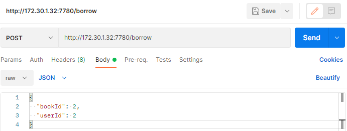

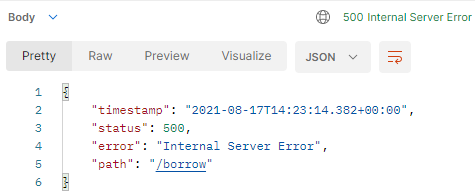

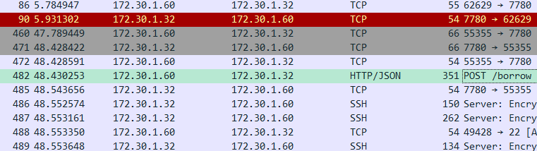

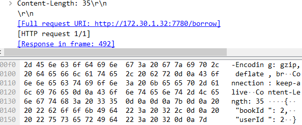

## HTTPS 요청의 경우

- 요청이 HTTP가 아니라 TLS 임을 확인할 수 있고, 패킷 어디를 확인하더라도 HTTP 내용이 암호화되서 확인할 수 없는 것을 볼 수 있음.

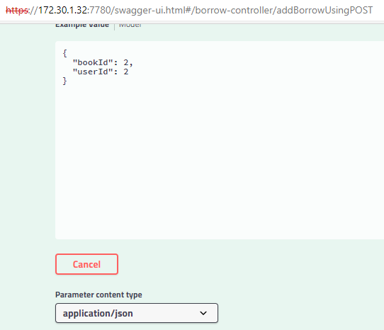

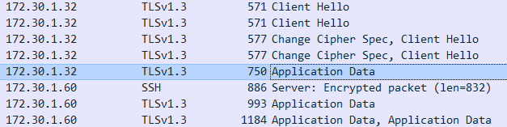

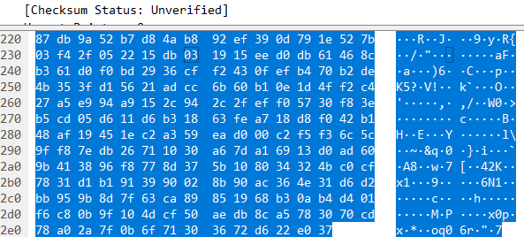