# 📌 Neural network

**비선형 모델인 신경망(Neural network)** 의 기본적인 개념과 그 의미를 풀어나가기 위한 도구들을 정리해본다.

------

# 📄 처음으로 되돌아가볼까?

신경망의 개념을 이해하는데 도움이 될 문제들을 살펴보도록 한다.

## ✏️ 선형회귀(Linear Regression)

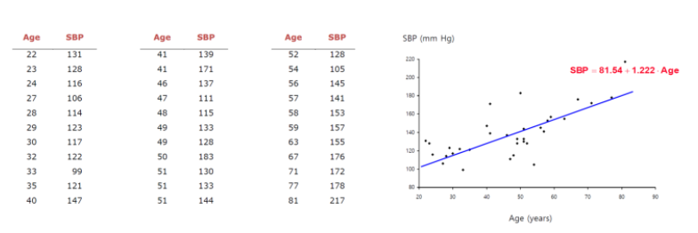

**선형회귀(다중선형회귀,Multiple Linear Regression)** 는 수치형 설명변수 **X** 와 연속형 숫자로 이루어진 종속변수 **Y** 간의 관계를 선형으로 가정하고 이를 잘 표현할수 있는 **회귀계수 \*β\* 를 데이터로부터 추정하는 모델** 이다.

$$
y = f(x) = \beta_{0} + \beta_{1}x_{1} + ... + \beta_{p}x_{p} = \beta^{T}\overrightarrow{x},\\ \overrightarrow{x} ^{T} = [1, x_{1}, ... , x_{p}] \\ \beta^{T} = [\beta_{0},\beta_{1}, ... , \beta_{p}]
$$
데이터를 가장 잘 표현할수 있는 회귀계수 *β* 를 찾기 위해서 **모델의 예측값(\**y\**^)과 실제값(\**y\**)의 차이, 즉 최소제곱법(Least Squared Method)를 이용하여 잔차(Residual)의 합이 최소가 되도록 한다.**

$$
\sum residual^{2} = \sum_{i}^{}(y_{i}-f(x_{i}, \beta))^{2}
$$


## ✏️ 다항 회귀(Polynomial Regression)

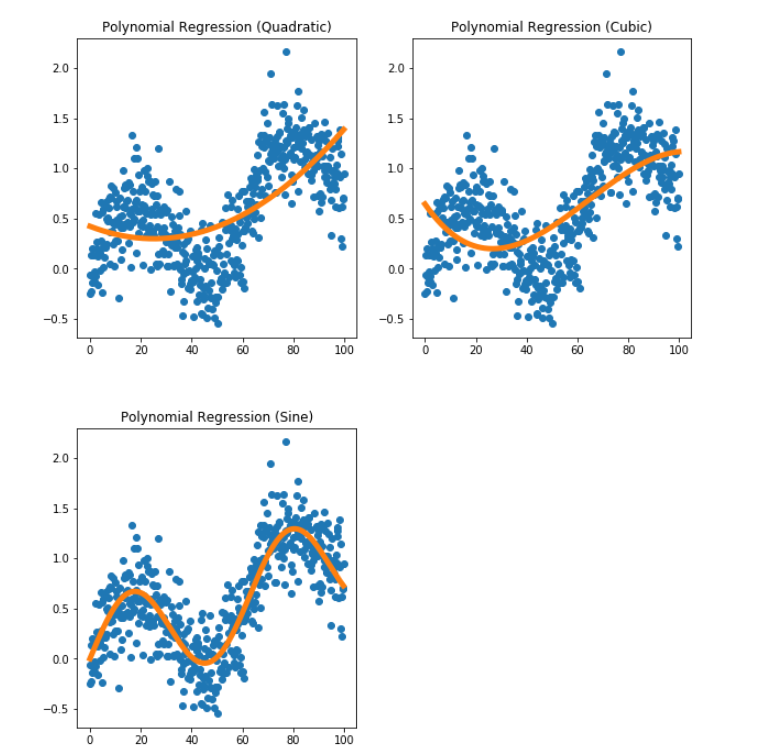

선형회귀를 확장하여 단순 직선이 아닌 **d차 다항함수** 에 대해 생각해 볼 수 있다.

$$
y= \beta_{0} + \beta_{1}x
$$
를 확장하여

$$
y= \beta_{0} + \beta_{1}x^{1}+ \beta_{2}x^{2}+ ... + \beta_{d}x^{d}
$$
다항 회귀 모델을 생성할 수 있다.

## ✏️ 로지스틱회귀(Logistic Regression)

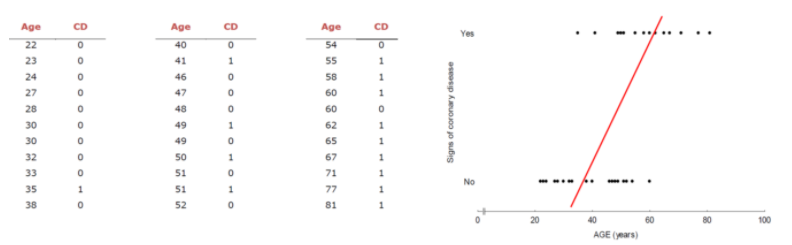

연속형 숫자가 아닌 **범주형(Categorical) 종속 변수** 는 근본적으로 범주형 데이터의 숫자 자체가 의미를 지니고 있지 않기 때문에 다중선형회귀(Multiple Linear Regression)를 적용할수 없다. 그래서 제안된 것이 **로지스틱 회귀 모델** 이며, 이를 이해하기 위해 하나씩 살펴보도록 한다.

- **Odds**
  $$
  \frac{사건A가 발생할 확률}{사건A가 발생하지 않을 확률} = \frac{P(A)}{P(A^{c})} = \frac{P(A)}{1-P(A)}
  $$
  odds 는 *P*(*A*)의 값이 커진다면(1에 가까워진다면) 증가 / 값이 작아진다면(0에 가까워진다면) 감소하게 된다. **다르게 생각한다면 odds값이 크다는 것은 사건 A가 발생할 확률이 커진다는 것이다.**

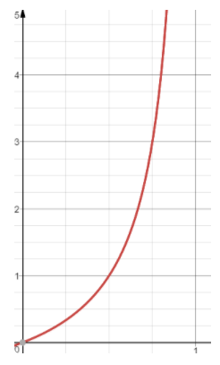

- 이항 로지스틱 회귀(Binomial Logistic Regression)

  클래스가 2개인 이진분류 문제

   

  를 해결하기 위해

   

  기존의 회귀모델과 odds를 결합한 이항 로지스틱회귀 모델

   

  을 생성한다.

  $$
log(\frac{P(Y_{1}|x)}{1-P(Y_{1}|x)}) = \beta^{T}x
  $$
  
  
  ```null
  log 를 취한것은 odds 값의 범위를 우변의 값 범위와 맞춰주기 위함이다.
  ```

$$
\frac{P(Y_{1}|x)}{1-P(Y_{1}|x)} = e^{\beta^{T}x} \\ P(Y_{1}|x) = e^{\beta^{T}x}(1-P(Y_{1}|x)) = e^{\beta^{T}x}- e^{\beta^{T}x}P(Y_{1}|x) \\ P(Y_{1}|x)(1+e^{\beta^{T}x}) = e^{\beta^{T}x} \\ \\ \therefore P(Y_{1}|x) = \frac{e^{\beta^{T}x}}{1+e^{\beta^{T}x}}= \frac{1}{e^{-\beta^{T}x}}
$$

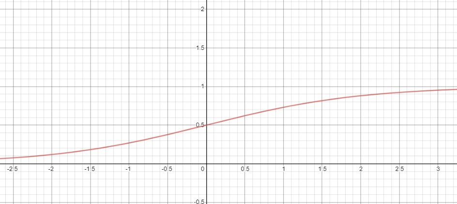

- **결정경계(Decision Boundary)**
  임의의 입력 벡터 **x** 의 클래스를 결정하기 위한 방법은 *P*(*Y*=1∣*X*=**x**) 와 *P*(*Y*=0∣*X*=**x**) 의 값을 비교하는 것이다. 다음 수식을 통해 **결정 경계는\*β^{T} x**=0 인 hyperplane** 임을 알 수 있다.

$$
P(Y_{1}|x) > P(Y_{0}|x) \\ \frac{P(Y_{1}|x)}{P(Y_{0}|x)} > 1 \\ log(\frac{P(Y_{1}|x)}{1-P(Y_{1}|x)}) >0 \\ \therefore \beta^{T}x >0
$$

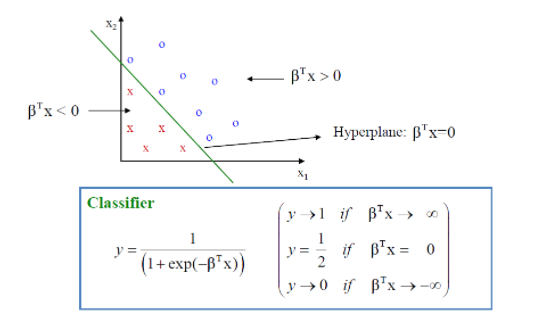

- 다항 로지스틱 회귀(Multinomial Logistic Regression)

  만약

   

  클래스가 3개 이상

   

  이라면 다음과 같이

   

  2개의 이항 로지스틱 회귀

   

  로 문제를 해결할수 있다.

  (1) 
$$
  log(\frac{Y_{1}|x}{P(Y_{3}|x)}) = \beta_{1}^{T}x \\ P(Y_{1}|x) = e^{\beta_{1}^{T}x } ...(*1) \\
$$
  (2) 
$$
  log(\frac{Y_{2}|x}{P(Y_{3}|x)}) = \beta_{2}^{T}x \\ P(Y_{2}|x) = e^{\beta_{2}^{T}x }P(Y_{3}|x) ...(*2) \\
$$


(3) 
$$
P(Y_{3}|x) = 1-P(Y_{1}|x) - P(Y_{2}|x) \\ P(Y_{3}|x) = 1 - (*1) - (*2) \\ P(Y_{3}|x)(1+e^{\beta_{1}x}+e^{\beta_{2}x})) =1 \\ \\ \therefore P(Y_{3}|x) = \frac{1}{1+e^{\beta_{1}x}+e^{\beta_{2}x})}
$$
확장하여 *K*개의 클래스를 분류하는 문제는 다음과 같다.

$$
P(Y_{k}|X=x) = \frac{e^{\beta_{k}^{T}x}}{1+\sum_{i=1}^{K-1}e^{\beta_{i}^{T}x}}, (k=0,1, ..., K-1) \\ P(Y_{K}|X=x) = \frac{1}{1+\sum_{i=1}^{K-1}e^{\beta_{i}^{T}x}}
$$
의 두 식을 일반화한다면 다음과 같다.

$$
P(Y_{i}|x) = e^{ \beta _{i}^{T}x}P(Y_{K}|x)\\ = e^{ \beta _{i}^{T}x} \frac{1}{1+\sum_{i=1}^{K-1} e^{ \beta _{i}^{T}x} } \\ = \frac{e^{ \beta _{K}^{T}x} }{e^{ \beta _{i}^{T}x} + \sum_{i=1}^{K-1} e^{ \beta _{i}^{T}x} }  (\because P(Y_{K}|x) = e^{ \beta _{K}^{T}x} P( Y_{K}|x)) \\ \therefore P(Y_{i}|x) = \frac{e^{ \beta _{i}^{T}x}}{\sum_{K}^{i=1}e^{ \beta _{i}^{T}x}}
$$


## ✏️ 단층 퍼셉트론(Single-layer Perceptron)

퍼셉트론은 **다수의 신호를 입력으로 받아 step function 을 이용하여 임계값을 기준으로 0 또는 1의 신호를 출력한다.** 다음은 단층 퍼셉트론을 표현하였다.

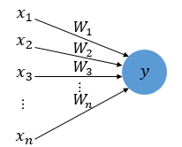

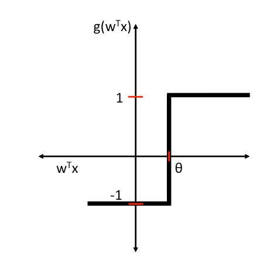
$$
\left\{\begin{matrix} y = 1, if \sum_{i=1}^{n} x_{i}w_{i} = w^{T}x >= \theta \\ y = 0, if \sum_{i=1}^{n} x_{i}w_{i} = w^{T}x < \theta \end{matrix}\right.
$$
위의 식에서 임계값을 좌변으로 넘기고 **편향(b,bias)** 으로 표현할수도 있는데, 보통 다음과 같이 표현된다. (다음 그림에서는 *w**o* 가 bias 로 표현되었다.)

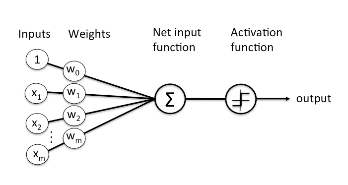

$$
\left\{\begin{matrix} y = 1, if \sum_{i=1}^{n} x_{i}w_{i} +w_{0}= w^{T}x +w_{0}>= \theta \\ y = 0, if \sum_{i=1}^{n} x_{i}w_{i}+w_{0} = w^{T}x +w_{0}< \theta \end{matrix}\right.
$$
단층 퍼셉트론을 이용하면 **AND,NAND,OR 게이트** 를 쉽게 구현할 수 있다.
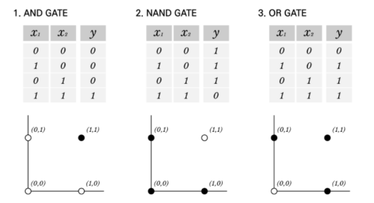

- AND 게이트

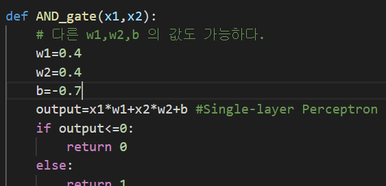

- **NAND 게이트**

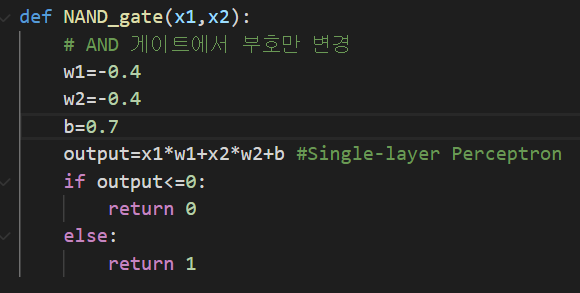

- **OR 게이트**

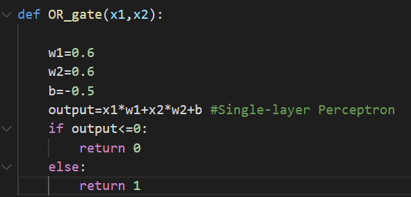

## ✏️ 다층 퍼셉트론(Multi-layer Perceptron)

단층 퍼셉트론으로 AND,NAND,OR 문제를 풀 수 있었지만 XOR 문제는 풀 수 없었다. **즉 XOR 문제는 직선 하나로 나누는 것(선형분리)은 불가능하였고, 비선형 영역으로 분리했어야 했다.**

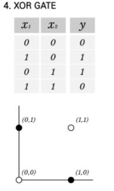

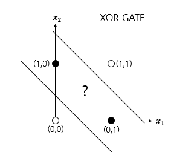

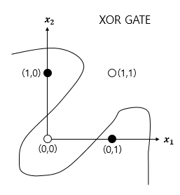

그래서 **은닉층(Hidden layer)을 추가하여 XOR 문제를 해결하려 제안된 것이 바로 MLP(Multi-layer Perceptron) 이다.**

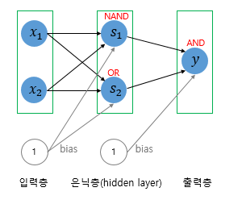

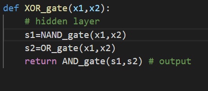

이후로 더 복잡한 문제을 풀기 위해 은닉층은 늘려졌고, 아래와 같이 **은틱층이 2개 이상인 신경망을 심층 신경망(Deep Neural Network, DNN)** 이라고 한다.

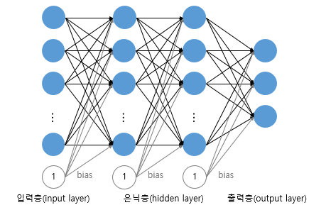

------

# 📄 이제 신경망을 살펴볼까?

신경망을 수식으로 살펴본다면 **각 데이터에 대해 d개의 변수로 p개의 선형모델** 을 생각해 볼 수 있다.

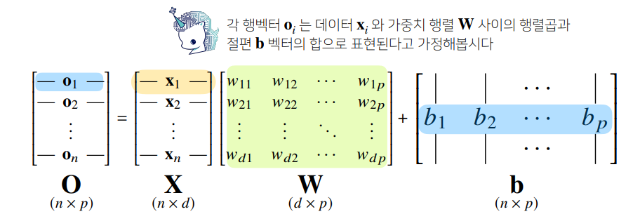

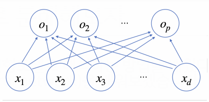

신경망에서 출력벡터 **O** 를 얻기 전 [활성함수](https://velog.io/@kgh732/부스트캠프-AI-Tech-U-stage.-2-3#-활성함수activation-function는-무엇일까) *σ* 가 적용되는 하나의 은닉층 **H** 를 생각해본다면, 다음과 같이 각 잠재벡터 **z***i*=(*z*1,*z*2,…,*z**p*)에 활성함수 *σ* 를 적용하여 생성된 **H**=(*σ*(**z**1),*σ*(**z**2),…,*σ*(**z***n*)) 를 얻을 수 있다.

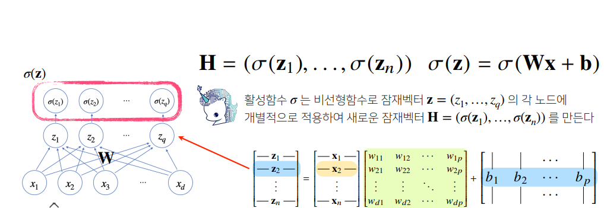

출력벡터 **O** 를 얻기 위해 가중치 행렬 **W**(2) 과 **b**(2) 를 통해 선형변환하면 (**W**(2),**W**(1)) 을 파라미터로 가지는 **2-layers Neural Net(1-hidden-layer Neural Net)** 이 만들어진다.

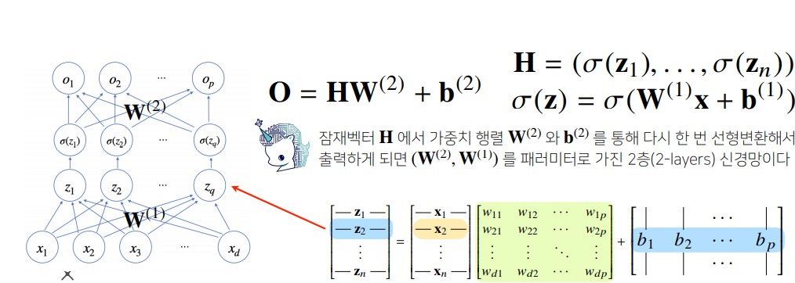

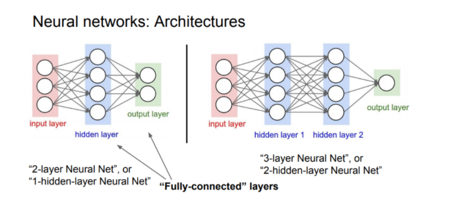

------

# 📄 활성함수(Activation Function)는 무엇일까?

- **활성함수는 입력 신호의 총합 을 그대로 사용하지 않고, 출력 신호로 변환하는 함수** 입니다.  
- **활성함수는 입력 신호의 총합이 활성화 되는지 아닌지를 정하는 역할**을 합니다.  

### ✏️ 시그모이드 함수(Sigmoid)

- 시그모이드 함수는 Logistic 함수라 불리기도한다. 

- 선형인 멀티퍼셉트론에서 비선형 값을 얻기 위해 사용하기 시작했다. 

- 시그모이드의 특징

  - 우선 함수값이 (0, 1)로 제한된다.
  - 중간 값은 1/2이다.
  - 매우 큰 값을 가지면 함수값은 거의 1이며, 매우 작은 값을 가지면 거의 0이다.

- 시그모이드의 단점 - 신경망 초기에는 많이 사용되었지만, 최근에는 아래의 단점들 때문에 사용하지 않는다.

  - **Gradient Vanishing** 현상이 발생한다. 미분함수에 대해 x=0x=0에서 최대값 1/4을 가지고, input값이 일정이상 올라가면 미분값이 거의 0에 수렴하게된다. 이는 |x|값이 커질 수록 Gradient Backpropagation시 미분값이 소실될 가능성이 크다.

  - **함수값 중심이 0이 아니다.** 함수값 중심이 0이 아니라 학습이 느려질 수 있다. 그 이유를 알아보면. 만약 모든 x값들이 같은 부호(ex. for all x is positive) 라고 가정한다. (밑의 수식 참고). 따라서 한 노드에 대해 모든 파라미터w의 미분값은 모두 같은 부호를 같게된다. 따라서 같은 방향으로 update되는데 이러한 과정은 학습을 zigzag 형태로 만들어 느리게 만드는 원인이 된다.
    $$
    \frac{\partial L}{ \partial w} = \frac{\partial L}{ \partial a} \frac{\partial a}{\partial w} \\ \frac{ \partial L}{\partial w} = \frac {\partial L}{ \partial a}x (\because \frac{ \partial a}{\partial w} = x ) \\ \frac{ \partial L}{\partial w} 는 \frac {\partial L}{ \partial a} 부호에 의해 결정 (\because \forall x >0 )
    $$
    
- exp 함수 사용시 비용이 크다.

$$
\sigma (x) = \frac{1}{1+e^{-x}} \\ \sigma^{'} = \sigma(x)(1-\sigma(x))
$$

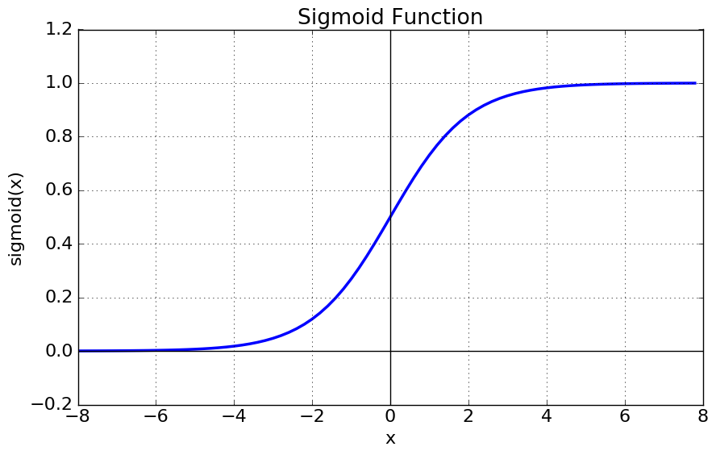

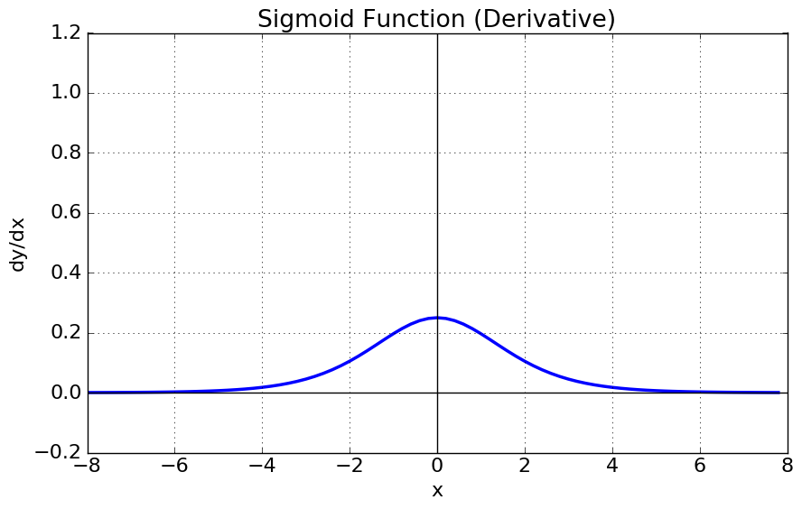


### ✏️ tanh 함수(Hyperbolic tangent function)

- 하이퍼볼릭탄젠트란 쌍곡선 함수중 하나이다.

  쌍곡선 함수 : 쌍곡선 함수란 삼각함수와 유사한 성질을 가지고, 표준 쌍곡선을 매개변수로 표시할 때 나오는 함수이다.

- 하이퍼볼릭탄젠트 함수는 시그모이드 함수를 transformation해서 얻을 수 있다.

- 특징

  - tanh 함수는 함수의 중심값을 0으로 옮겨 sigmoid의 최적화 과정이 느려지는 문제를 해결했다.
  - 하지만 미분함수에 대해 일정값 이상 커질시 미분값이 소실되는 **gradient vanishing** 문제는 여전히 남아있다.

$$
tanh(x) = 2 \sigma (2x) -1 \\ tanh(x) = \frac{e^{x} - e^{-x}}{e^{x} + e^{-x}} \\ tanh^{'}(x) = 1-tanh^{2}(x)
$$

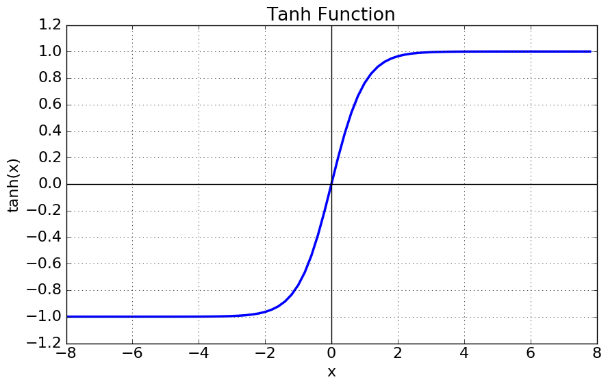

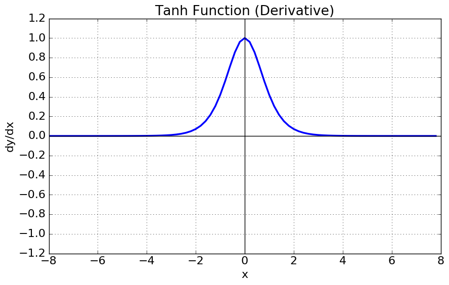

### ✏️ ReLU 함수(Rectified Linear Unit)

- ReLu함수는 최근 가장 많이 사용되는 활성화 함수
- 특징
  - x>0이면 기울기가 1인 직선이고, x<0이면 함수값이 0이된다.
  - sigmoid, tanh 함수와 비교시 학습이 훨씬 빨라진다.
  - 연산 비용이 크지않고, 구현이 매우 간단하다.
  - x<0인 값들에 대해서는 기울기가 0이기 때문에 뉴런이 죽을 수 있는 단점이 존재한다.

$$
f(x) = max(0,x)
$$

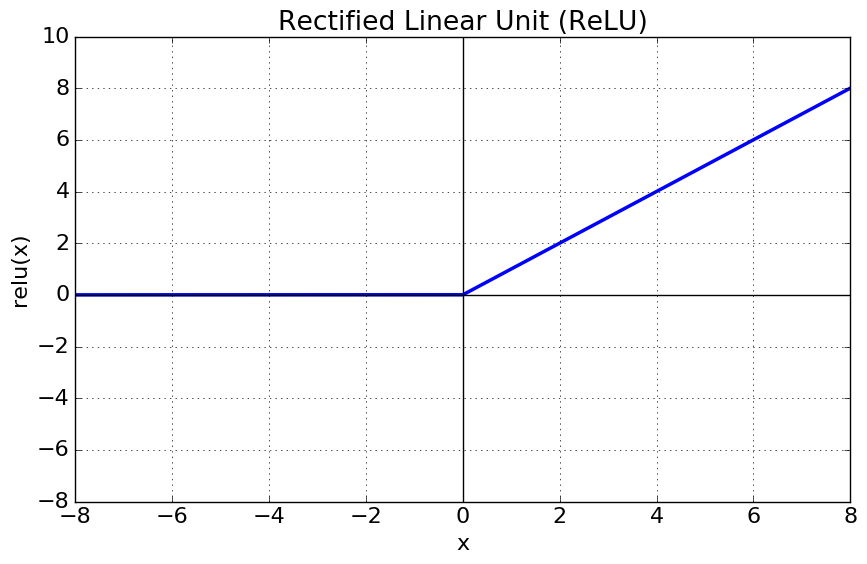

### ✏️Leakly ReLU

- leakly ReLU는 ReLU의 뉴런이 죽는(“Dying ReLu”)현상을 해결하기위해 나온 함수
- Leakly ReLU는 음수의 x값에 대해 미분값이 0되지 않는다는 점을 제외하면 ReLU와 같은 특성을 가진다.
- 밑의 식에서 0.01 대신 다른 매우 작은 값 사용이 가능하다.

$$
f(x) = max(0.01x,x)
$$


### ✏️PReLU

- Leakly ReLU와 거의 유사하지만 새로운 파라미터 α 를 추가하여 x<0에서 기울기를 학습할 수 있게 하였다.

$$
f(x) = max(\alpha x,x)
$$


### ✏️Expeonential Linear Unit(ELU)

- ELU는 비교적 가장 최근에 나온 함수  [Clevert et al. ,2015](http://arxiv.org/abs/1511.07289)
- 특징
  - ReLU의 모든 장점을 포함한다.
  - “Dying ReLU” 문제를 해결했다.
  - 출력값이 거의 zero-centered에 가깝다
  - 일반적인 ReLU와 달리 exp함수를 계산하는 비용이 발생한다.

$$
f(x) = x \;if \; x>0 \\ f(x) = \alpha(e^{x} -1) \; if \; x<=0
$$


### ✏️ Maxout 함수

- 특징
  - 이 함수는 ReLU가 가지는 모든 장점을 가졌다
  -  dying ReLU문제 또한 해결한다. 
  - 하지만 계산량이 복잡하다는 단점이 있다.

$$
f(x) = max(w_{1}^{T}x+b_{1}, w_{2}^{T}x+b_{2})
$$


### ✏️ 그래서 뭘 사용해야하는데?

- 우선 가장 많이 사용되는 함수는 ReLU이다. 간단하고 사용이 쉽기 때문에 우선적으로 ReLU를 사용한다.
- ReLU를 사용한 이후 Leakly ReLU등 ReLU계열의 다른 함수도 사용 해본다.
- sigmoid의 경우에는 사용하지 않도록 한다.
- tanh의 경우도 큰 성능은 나오지 않는다.


------

# 📄 활성함수(Activation Function)는 왜 비선형 함수여야만 할까?

- 활성함수의 가장 중요한 특징은 **비선형성** 이다. 
-  만약 활성함수를 **선형함수** 로 쌓게 된다면 **층을 무한정 깊게 쌓더라도 [선형성](https://ko.wikipedia.org/wiki/선형성)** 을 띄기 때문에 선형함수를 사용한 하나의 은닉층을 가지는 뉴럴넷과 깊게 쌓은 뉴럴넷은 차이가 없다.

------

# 📄 층을 여러개 쌓는 이유는 무엇일까?

- 이론적으로는 [Universal Approximation Theorem](http://neuralnetworksanddeeplearning.com/chap4.html) (**하나의 은닉층과 비선형 활성함수를 가진 뉴럴넷을 이용해 어떠한 형태의 연속함수든 모델링 할 수 있다.** )에 의해서 2-layers Neural Net 으로도 임의의 연속함수를 근사할 수 있다. 
- 그러나 층이 깊어진다면 목적함수를 근사하는데 필요한 뉴런의 숫자가 훨씬 빨리 줄어들어 효율적으로 학습이 가능하기 때문에 층을 여러개 쌓게 된다.( 물론 층을 계속 깊게 쌓게 되면 최적화와 모델 학습 부분에 있어 어려워진다.)

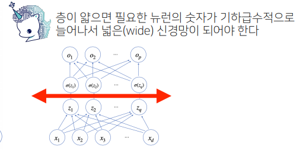

------

# 📄 순전파(Forwardpropagation) vs 역전파(Backpropagation)

## ✏️ 순전파(Forwardpropagation)

- **순전파(forward propagation)** 은 뉴럴 네트워크 모델의 입력층부터 출력층까지 순서대로 변수들을 계산하고 저장하는 것을 의미하며 
- 학습과정이 아닌 **단순히 값들을 다음 층으로 넘겨주는 과정이다.**

## ✏️ 역전파(Backpropagation)

- **역전파(back propagation)** 는 뉴럴 네트워크의 파라미터들에 대한 그래디언트(gradient)를 계산하는 방법을 의미

- 일반적으로는 뉴럴 네트워크의 각 층과 관련된 목적 함수(objective function)의 중간 변수들과 파라미터들의 **그래디언트(gradient)를 출력층에서 입력층 순으로 연쇄법칙(Chain rule) 을 통해 계산하고 저장한다.**

  - 역전파를 이용해 각 층에 사용된 파라미터 학습
    $$
    \begin{bmatrix} W^{(l)}, b^{(l)} \end{bmatrix}^{L}_{l=1}
    $$

  - 역순으로 연쇄법칙(chain-rule)을 통해 gradient vector를 전달
    $$
    \frac{ \partial z}{\partial x} = \frac{ \partial z}{\partial w} \frac{ \partial w}{\partial x} 
    $$

  - 역전파 알고리즘은 chain-rule 기반의 자동미분(auto-differentiation) 사용

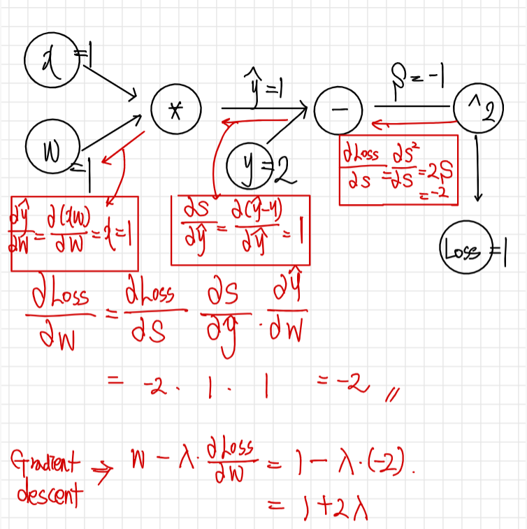

# 📄 분류 문제에서 softmax 함수가 사용되는 이유가 뭘까요?

- softmax 함수는 모델의 출력을 확률로 해석할 수 있게 변환해주는 연산입니다.
- 즉, softmax 함수를 사용한다면, 모델의 결과를 확률로 표현하여 분류 결과와 비교 할 수 있게 됩니다.
- 따라서, 분류 문제에서 softmax 함수가 사용됩니다.
  - softmax 함수의 결과인 예측값과 정답이라고 할 수 있는 실제값의 오차를 최소화하는 방향으로 학습에 사용 할 수 있습니다.