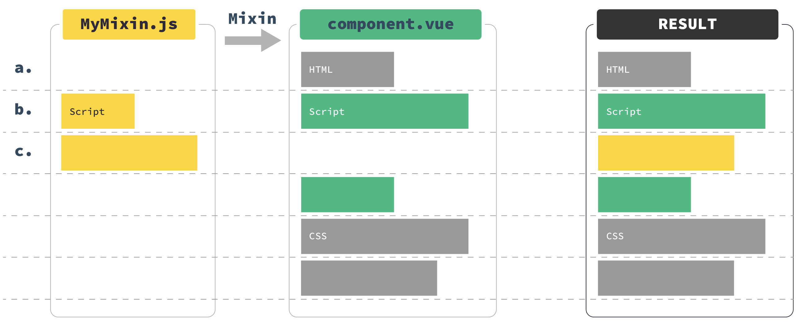
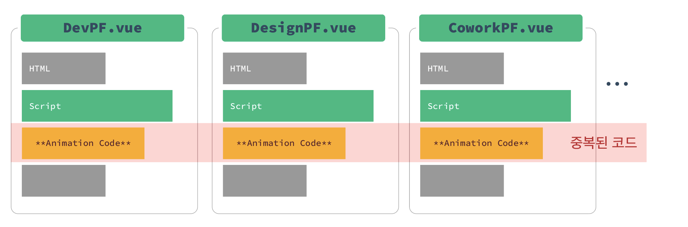
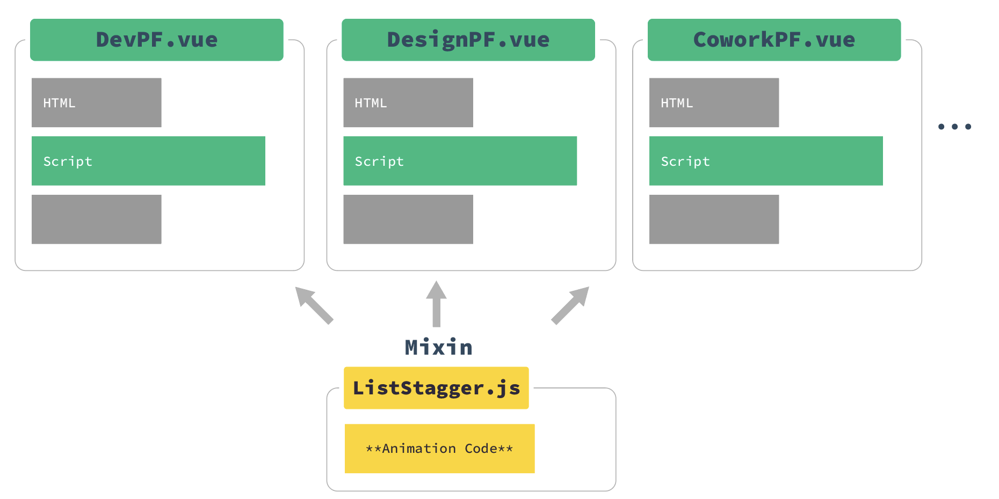

# Vue mixin

- Mixins는 Vue 컴포넌트에 재사용 가능한 기능을 배포하는 유연한 방법
- mixin 객체는 모든 구성 요소 옵션을 포함할 수 있음
- 컴포넌트에 mixin을 사용하면 해당 mixin의 모든 옵션이 컴포넌트의 고유 옵션에 “혼합”됨


## 적용 순서

1. 믹스인할 객체를 만들고 (javascript 객체)
2. 컴포넌트에 객체를 믹스인하고
   -  믹스인에서 선언한 속성(e.g. data)를 컴포넌트에서 다시 선언할 수 있으며, 이 경우 **컴포넌트에 선언된 값을 우선하여 병합**됩니다.
3. 나머지 부분을 구현해 완성한다





## 적용 방법

1. 믹스인 할 파일을 만듬

```js
// @/mixin/MyMixin.js

// 모듈이 여러개일 경우 이름으로 구분을 지어야함
let MyMixin = {
  mounted() {
    console.log('Mixed!')
  }
}

const toggle = {
  data() {
    return {
      isShowing: false
    }
  },
  methods: {
    toggleShow() {
      this.isShowing = !this.isShowing;
    }
  }
}

const Modal = {
  template: '#modal',
  mixins: [toggle], // 이런식으로 mixin 안에서도 서로 mixin 가능
  components: {
    appChild: Child
  }
};


export default MyMixin // mixin 부를떄 기본적으로 사용할 것들 넣어주기, 공통적으로 사용하는 부분이 없으면 없어도 됨

// 하나일 경우 이런식으로 해도 됨
export default {
  mounted() {
    console.log('Mixed!')
  }  
}
```


2. 적용할 컴포넌트에서 불러와서 적용하기

```js
// @/component. js
import MyMixin from '@/mixins/MyMixin'
export default {
  mixins: [MyMixin] // mixin"s" 입니다! s에 주의하세요!
	            // 에러메세지 출력 없이 동작하지 않습니다.
}

// mixin 에 모듈이 여러개일 경우
import { toggle } from './mixins/toggle' // mixin 안에서 선택적으로 불러오기

export default {
  name: 'test',
  mixins: [toggle],
}
```


### Global Mixin

- `App.vue` 에서 모든 vue에서 사용하는 함수를 plug-in처럼 추가할 수 있음.
  - 하지만 이 방법은 써드파티 컴포넌트를 포함하여 생성된 모든 단일 Vue 인스턴스에 영향을 주기 때문에 적게 이용하고 신중하게 사용해야함

```js
Vue.mixin({
  mounted() {
    console.log('hello from mixin!')
  }
})
```


## 왜 쓰는가?

- mixin 사용으로 같은 코드를 반복하지 않게 되고, 특정 '기능'을 나타내는 파일을 캡슐화 할 수 있게 됨
  - 단순히 코드의 전체 줄 수가 줄어듬
  - 유지보수가 쉬움



