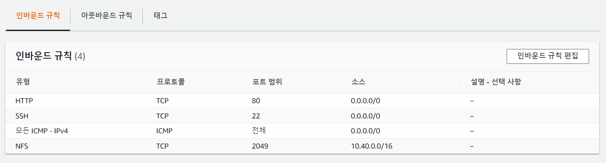
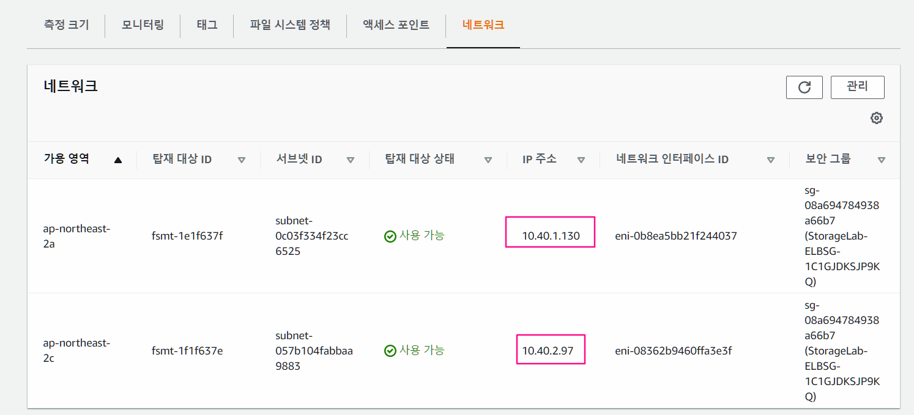
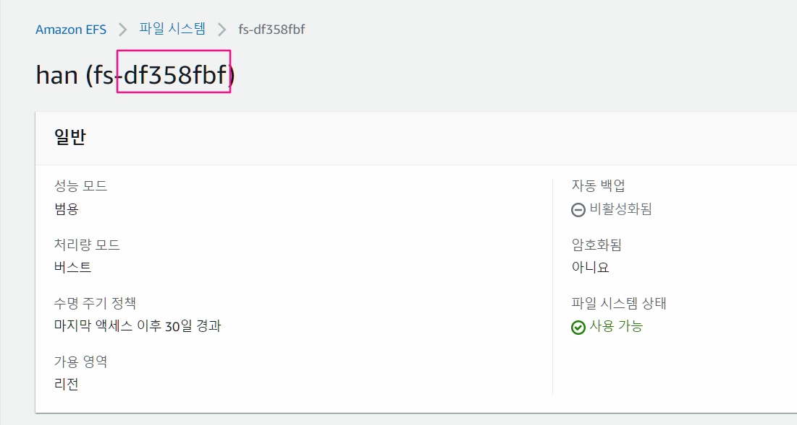

- 학습 목표
  - EFS 생성하기
  - EFS 마운트 하기
  - EFS 에 파일 올리기
  
  
# 3. EFS


## EFS 생성하기

1. EFS 검색 > EFS 파일 시스템 생성 - 사용자 지정 > 1단계 파일시스템 설정
   - 이름 : han
   - VPC : cloudFormation으로 배포함 ELB-VPC 선택
   - 자동백업 - 체크 해제
   - 암호화 활성화 - 체크 해제
2. 네트워크 액세스
   - 보안그룹은 default로 설정되어있을텐데 CloudFormation으로 배포한 보안그룹으로 가용영역 2개 다 설정하기
     - 인바운드 규칙에 NFS 규칙을 추가해놓은 상태 - default로 할 경우 이것이 없어서 접근이 제한되게 됨



3. 파일 시스템정책 - 기본값
4. 생성


- IP 주소가 다름을 확인할 수 있음
  - EFS시스템을 공통으로 이용할 떄 하나의 주소를 사용하는 것이 아닌
  - 각각 mount 되어진 동일 subnet 대역을 할당받아 사용하게 됨




## STG1에 EFS 마운트하기

1. 웹서버 동작 확인하기 - EC2-STG1 하고 EC2-STG2 둘다

```shell
[root@ST1 ~]# curl localhost
<html><h1>AFOS Study - Web Server 1</h1></html>
```


2. EFS 디렉토리 생성하고 mount
   - EFS 아이디는 하단의 사진 처럼 확인하기

```shell
# efs 디렉터리 생성
[root@ST1 ~]# mkdir /var/www/html/efs

# 자신의 EFS ID 확인 후 마운트
mount -t efs -o tls 자신의-EFS-ID:/ /var/www/html/efs
[root@ST1 ~]# mount -t efs -o tls fs-df358fbf:/ /var/www/html/efs
```




3. EFS 마운트 한 곳에 파일 생성하기

```shell
# EFS 마운트 한 곳에 파일 생성
[root@ST1 ~]# echo "<html><h1>Hello from Amazon EFS</h1></html>" > /var/www/html/efs/index.html

# EFS에 생성한 파일 확인
[root@ST1 ~]# curl localhost/efs/
<html><h1>Hello from Amazon EFS</h1></html>

# EFS Size 확인 - 사용자는 용량 신경 쓸 필요 없이 실제 사용한 용량 만큼만 비용 지불
[root@EC2-STG1 ~]# df |grep efs
127.0.0.1:/    9007199254739968       0 9007199254739968   0% /var/www/html/efs

```


## STG2에 EFS 마운트하기

```shell
# 관리자 권한으로 변환
[ec2-user@EC2-STG2 ~]$ sudo su -

# efs 디렉토리 생성
[root@EC2-STG2 ~]# mkdir /var/www/html/efs

# mount 하기
# mount -t efs -o tls 자신의-EFS-ID:/ /var/www/html/efs
[root@EC2-STG2 ~]# mount -t efs -o tls fs-df358fbf:/ /var/www/html/efs

# efs 파일 읽기
[root@EC2-STG2 ~]# curl localhost/efs/
<html><h1>Hello from Amazon EFS</h1></html>


```


## 재부팅에서 EFS 자동 탑재

```shell
# /etc/fatab 파일에 추가 후 monut -fav 로 검증
[root@ST1 ~]# umount /var/www/html/efs

# /etc/fstab 에 아래 내용 추가
echo "자신의-EFS-ID:/ /var/www/html/efs efs _netdev,noresvport,tls,iam 0 0" >> /etc/fstab
[root@ST1 ~]# echo "fs-9f0cd4ff:/ /var/www/html/efs efs _netdev,noresvport,tls,iam 0 0" >> /etc/fstab
[root@ST1 ~]# mount -fav
/                        : ignored
/var/www/html/efs        : successfully mounted
[root@ST1 ~]# reboot
...
# 재부팅 후 자동 탑재 확인
[root@ip-172-31-12-49 ~]# df -hT |grep nfs
fs-1ebe907f.efs.ap-northeast-2.amazonaws.com:/ nfs4      8.0E     0  8.0E   0% /var/www/html/efs
```


