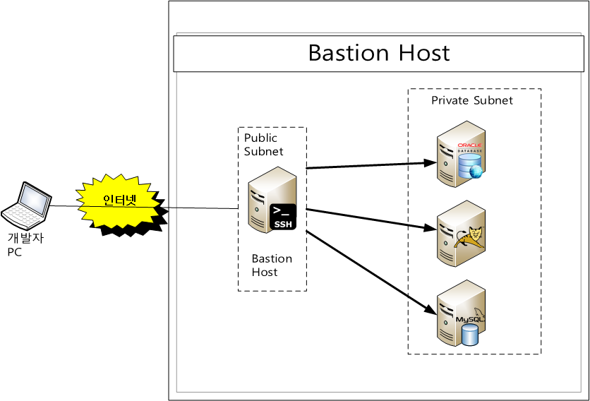
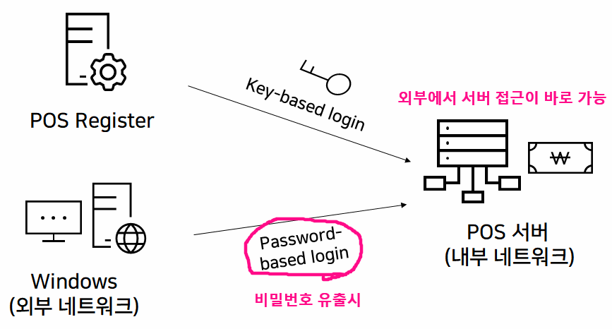
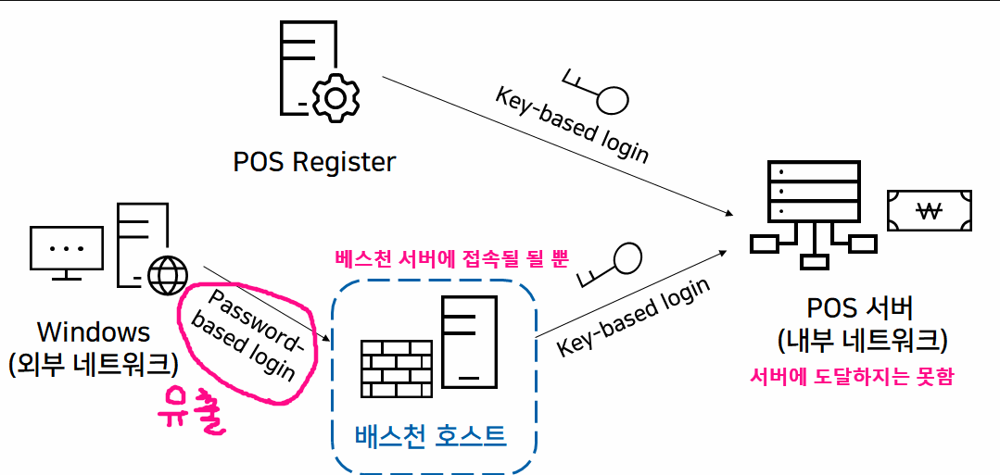

## Bastion 어원

베스천(Bastion) 은 보루, 요새라는 뜻으로 중세 시대에 영주나 왕이 살고 있는 중요한 기지인 성을 둘러싸고 있는 방어막을 의미

즉,  컴퓨터 보안에서도 이런 의미를 가져와서 보호된 네트워크에 접근하기 위해 유일하게 외부에 노출되는 호스트를 Bastion 호스트라고 정의

## 어떻게 사용되는가?

- 역할

  - 배스천 호스트는 접근 제어 기능과 더불어 게이트웨이로서 가상 서버(Proxy Server)의 설치, 인증, 로그 등을 담당합니다. 특히 내부와 외부 사이에서 일종의 게이트 역할을 **수행**

- 외부에 노출되면 안되는 DB 나 WAS 를 private subnet 에 위치시키고, public subnet의 bastion host로만(원격 접근 권한) 통해 접속할 수 있게 함

  

### 어떻게 bastion Host를 설정하면 좋을까?

1.  Bastion Host 에 접근할 개발자 PC 의 IP 만 명시적으로 접근을 허용
2. SSH 포트는 22 번이 아닌 다른 포트를 사용
3. 로그인시에 two factor 인증(OTP + 공개키)으로 보안을 강화하는 것을 권장
4.  Bastion Host 는 내부망에 연결 가능한 중요한 서버이므로 방화벽과 침입 탐지등 여러 가지 보안 강화 대책을 적용하고 사용자의 접근 이력 로깅과 수행한 작업등을 남겨 놓도록 설정하는 게 좋음

## 뭐가 좋은지 이해가 안된다! 예시

많은 가게에서 이용하는 Point of Sale(POS) 시스템 운영을 가정해보겠습니다. 만약 배스천 호스트가 없는 경우 외부 네트워크에서 공격을 받아 패스워드가 탈취 당한다면 내부 네트워크인 POS Server에 접근이 가능해집니다. 반면 배스천 호스트를 운영하고 있다면 외부 네트워크의 패스워드가 탈취 당하더라도 POS Server까지는 접근할 수 없습니다.

## 다른 방식은 뭐가 있나?

> 방화벽(네트워크 트래픽을 모니터링하고 정해진 보안규칙을 기반으로 특정 트래픽의 허용 또는 차단을 결정하는 네트워크 보안 디바이스) 보안 시스템의 구축 유형
>
> 베스천 호스트 는 **단일 홈 게이트웨이 ( Single-homed Gateway )** 방식이다.

- **스크리닝 라우터(Screening router)**

  - 일반 라우터에 패킷 필터링 규칙을 적용시켜 방화벽 역할을 수행
  - 라우터에서는 단순한 필터링 기능만을 제공하므로 완벽한 방화벽의 역할을 기대하기는 어렵다

- **이중 홈 게이트웨이(Dual-Homed Gateway)**

  - 두 개의 네트워크 인터페이스를 가진 Bastion Host - 양 네트워크 간의 직접적인 접근은 허용되지 않는다
    - 하나의 네트워크 인터페이스는 외부 네트워크와 연결
    - 다른 하나는 내부 네트워크에 연결
  - 베스천호스트가 프록시 서버를 이용하여 패킷 필터링과 서비스 연결 및 관리 기능을 수행하여 내부 네트워크를 보호하는 구성 방식
  - 정보 지향적인 공격을 방어할 수 있고, 각종 기록 정보를 생성 및 관리하기 쉽고 설치 및 유지보수가 쉽다
    - 하지만, 제공되는 서비스가 증가할 수록 프록시 소프트웨어 가격이 상승한다

- **스크린된 호스트 게이트웨이(Screened Host Gateway)**

  - 스크린드 호스트 + 듀얼 홈드 호스트 방식
    - 외부에서 들어오는 패킷 트래픽을 스크리닝 라우터에서 패킷 필터 규칙으로 1차 방어
    - Bastion Host에서 2차로 필터
  - 스크리닝 라우터의 라우팅 테이블이 변경되어 Bastion Host로 입력이 되지 않고 곧바로 내부 네트워크로 진입할 수 있는 위험이 있기 때문에 정적 라우팅 테이블을 사용하는 것이 안전
  - 네트워크 계층과 응용 계층에서 방어하므로 매우 안전하며 가장 많이 이용되는 방화벽 시스템
    - 하지만 스크리닝 라우터의 라우팅 테이블이 변경되면 이를 방어할 수 없고 방화벽 시스템 구축비용이 많이든다

  

