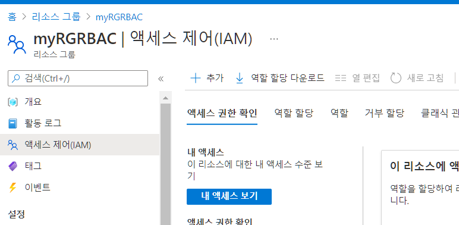
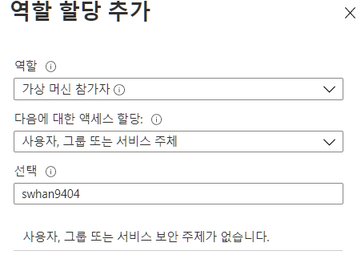
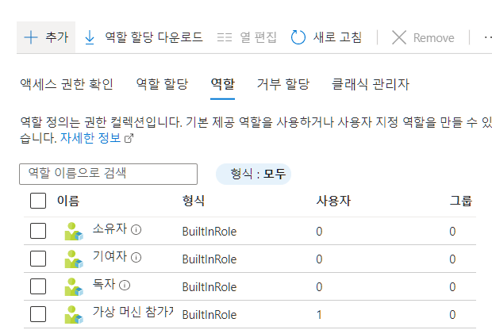
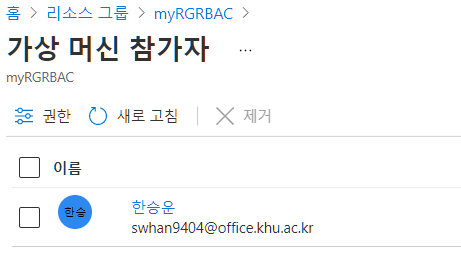
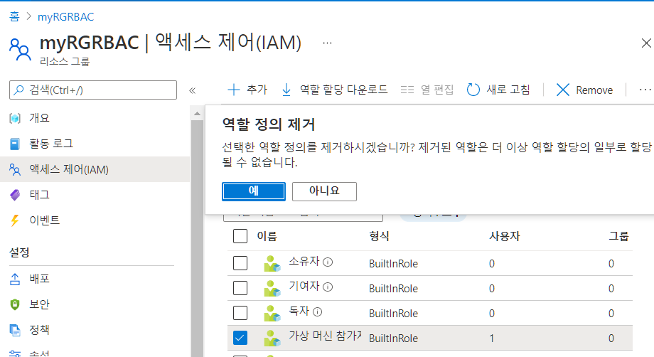

- RBAC 이란?
  - Role Base Access Control
  - 역할 기반 액세스 제어
    - Azure 리소스에 액세스할 수 있는 사용자, 해당 리소스로 수행할 수 있는 작업 및 액세스 권한이 있는 영역을 관리하는 데 도움
- 목표 - 리소스 그룹을 만들고 역할을 자신에게 할당해보고 할당을 삭제해보기

# 1. 리소스 그룹 만들기

1. `리소스 그룹` 검색

2. 리소스 그룹 만들기 선택
3. 리소스 그룹 만들기 - 기본
   - 구독 : 무료
   - 리소스그룹 : myRGRBAC
   - 영역 : 동남아시아
4. 검토+만들기

# 2. 리소스 그룹 액세스 제어 하기

1. 만들어진 리소스그룹에 들어가기 - 액세스 제어 클릭

2. 역할 탭 클릭 
3. 추가 -  역할 할당 추가 
   - 역할 - 가상머신 참가자
   - 선택 - 본인

4. 가상머신 참가자 클릭 해서 확인

# 3. 활동로그 확인

1. `myRGRBAC` 에서 활동 로그 메뉴 클릭
   - 검색 - 활동 로그 로 들어올 경우 필터링해서 검색
     - 리소스 그룹 : myRGRBAC 
     - 작업 - 역할 - 역할할당만들기 
   - Create role assignment -  방금 역할 만든 것을 확인할 수 있음

# 4. 만든 역할 제거

1. 제거 해보기
   - 하지만 에러나면서 제거가 안됨

2. 가상머신 참가자 클릭해서 들어가기
   - 참여자 제거
   - 참여자가 전부 사라지면 역할도 사라짐

