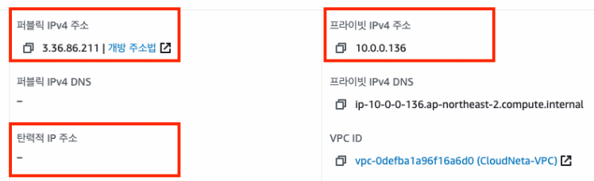
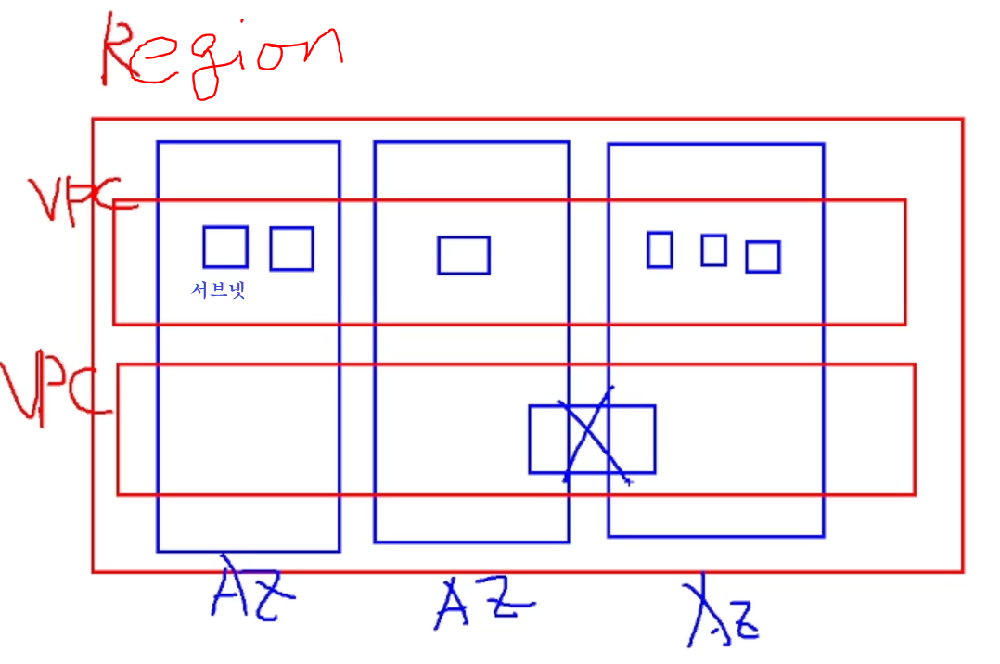
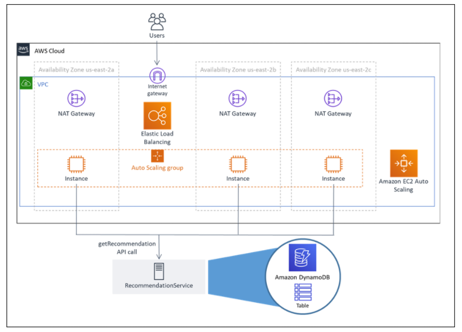
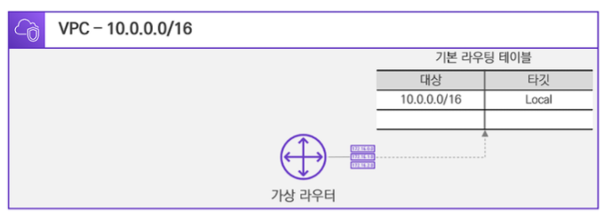
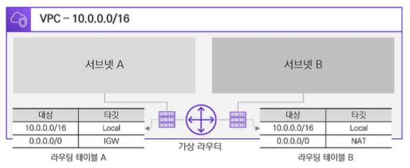
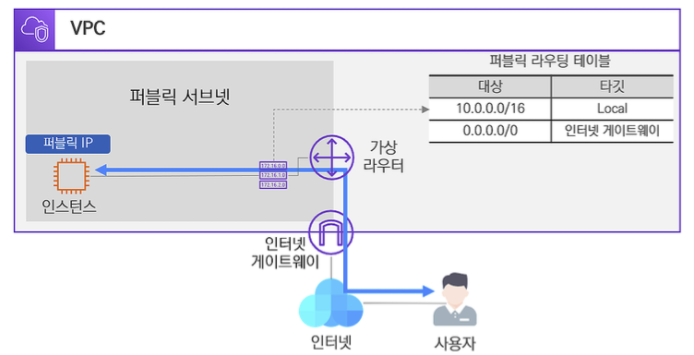
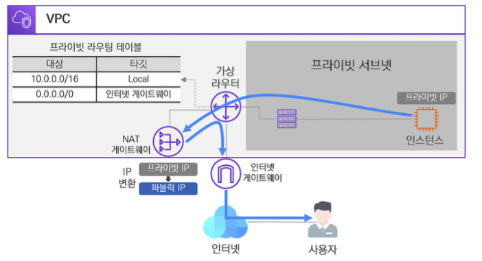
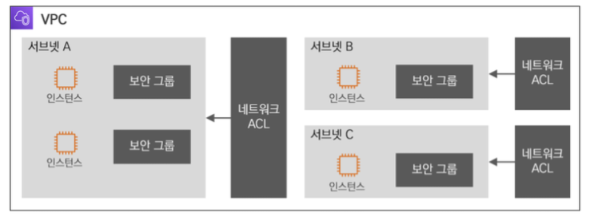

# VPC

- VPC 란? ( Virtual Private Cloud )
  - 독립된 가상의 클라우드 네트워크
  - AWS는 사용자에 따라 네트워크 환경을 직접 설계할 수 있음
  - IP대역, 인터페이스, 서브넷, 라우팅 테이블, 인터넷 게이트웨이, 보안그룹, 네트워크 ACL등을 생성하고 제어할 수 있음
- VPC의 종류
  - 기본 VPC
    - 리전 별로 1개씩 생성되어 있으며 VPC 내에 AWS 리소스가 미리 정해져 있음
  - 사용자 VPC
    - 사용자가 수동으로 생성해야함
    - 최대 5개 까지 만들 수 있음

- VPC의 특징
  - 확장성
    - 손쉽게 VPC 자원을 생성, 삭제 가능
  - 보안
    - 인스턴스 레벨과 서브넷 레벨에서 인바운드와 아웃바운드 필터링을 수행할 수 있음
    - 보안그룹과 네트워크 ACL을 통해 보안 강화 가능
  - 사용자중심
    - 네트워크 지표 및 모니터링 툴을 활용하여 사용자에게 높은 가시성 제공
  - 제약사항
    - 전통적인 네트워크 환경에서 사용했던 기능이 제한되어 있거나 일부만 사용가능
      - 브로드캐스트, 멀티캐스트, IP 기반 Failover 프로토콜(VRRP. HSRP 등)

## VPC 실제로 살펴보기

- 퍼블릭 IPv4
  - AWS Public IP - 퍼블릭 ip
  - EC2 중지 후 다시 시작히 public IP 가 변경됨
- 프라이빗 IPv4
  - 실제 서버에 할당된 주소
- 탄력적 IP 주소(Elastic IP)
  - 고정된 주소
  - 할당 받은 후 미 사용 시 과금 - 사용시에는 과금x
    - 한정된 자원이기 떄문에 사용을 안하면 벌금 개념
    - 효율적인 사용을 위해서

## 서브넷

- **서브넷**(Subnet)의 일반적인 개념은 **네트워크** 영역을 부분적으로 **나눈 망**으로 정의할 수 있습니다.

  - AWS의 VPC에서도 서브넷을 통해 **네트워크를 분리**하여 나눌 수 있습니다.
  - VPC 내에 서브넷을 통해 네트워크망을 분리하고 있는 모습입니다.

  - 추가로 알아두셔야 할 것은 서브넷의 IP 대역은 VPC의 IP 대역에 속해 있어야 하며, **서브넷**은 **1개의 가용 영역(AZ)에 종속**되어야 합니다.

- 서브넷 설계
  - 1개의 서비스의 가용성 확보를 위해 여러 가용영역에 인스턴스를 배치 , EC2 Auto Scaling 사용

- 서브넷의 예약되어 있는 ip 주소
  - AWS VPC 내부의 서브넷에 할당할 수 있는 IP 대역에서 미리 예약되어 있는 IP 주소가 있습니다.
  - 예를 들어 VPC A(10.0.0.0/16) 내부의 서브넷에 할당할 IP대역이 10.0.0.0/24이라면 
    - 10.0.0.0~10.0.0.255 중에서 첫번째 주소: 10.0.0.0 네트워크 주소
    - 두번째 주소: 10.0.0.1 AWS VPC 가상 라우터 주소 
      - 게이트웨이 주소로 사용됨
    - 세번째 주소: 10.0.0.2 AWS DNS 서버 주소  
    - 네번째 주소: 10.0.0.3 - 향후 새로운 기능에 활용할 주소 
    - 마지막 주소: 10.0.0.255 - 네트워크 브로드캐스트 주소 VPC 내 여러 서브넷이 존재할 경우 첫번째 서브넷의 세번째 주소를 DNS 서버 주소로 사용합니다.  나머지 서브넷의 세번째 주소는 AWS에서 예약되어 있습니다.

## 가상 라우터와 라우팅 테이블

- 라우터
  - 네트워크와 네트워크를 연결하는 장치 - 라우터, 스위치
  - ip를 기반으로 어느쪽과 어느쪽이 연결되었는지 식별
    - 이 주소를 모아놓은 테이블을 **라우팅테이블** 이라고 부름
    - 일종의 네이게이터 역할을 하고 있음
  - 라우팅 - 이러한 연결과정

- VPC를 생성하면 자동으로 가상 라우터가 생성됩니다. 이 가상 라우터는 라우팅 테이블을 가지고 있어 목적지 네트워크로 라우팅합니다.
  - 예시
    -  10.0.0.0/16 대역의 VPC를 생성하면, 자동으로 가상 라우터가 생성 되게 됨
    -  가상 라우터는 최초에 기본 라우팅 테이블을 보유하고 있으며 로컬 네트워크에 대한 라우팅 경로만 잡혀 있습니다.
    -  여기서 로컬 네트워크는 VPC의 자체 대역으로 VPC 내에 생성된 서브넷은 라우팅 테이블의 로컬 네트워크에 의해 통신이 가능

- 라우팅 테이블
  - 가상 라우터에서는 서브넷별로 라우팅 테이블을 매핑
  - 기본 라우팅 테이블을 사용할 수도 있지만, 새로운 라우팅 테이블을 생성하고 매핑하여 서브넷 당 개별적인 라우팅 테이블을 가질 수 있습니다

## 인터넷 게이트웨이

- 게이트웨이란?
  - 인터넷 게이트웨이는 VPC와 인터넷 간의 논리적인 연결입니다. 
  - 간략하게 VPC에서 **인터넷** 구간으로 나가는 **관문**이라고 생각할 수 있습니다.
- 인터넷 게이트웨이는 VPC 당 1개만 생성할 수 있습니다.
  - 인터넷 게이트웨이를 통해 외부 인터넷 구간으로 통신할 수 있는 대상은 퍼블릭 IP를 사용하는 퍼블릭 서브넷 내의 자원입니다.
  - 이러한 퍼블릭 서브넷은 자신의 라우팅 테이블에 외부 인터넷 구간으로 나가는 타깃을 인터넷 게이트웨이로 지정해 주어야 합니다.
- 퍼블릭 서브넷 내의 인스턴스가 외부 인터넷 구간과 통신하기 위하여 인터넷 게이트웨이가 관문이 되어 이를 통해 통신이 되고 있습니다.
  - 인터넷 게이트웨이는 양방향으로 연결을 지원하기에 외부 인터넷 구간에서 퍼블릭 서브넷의 퍼블릭 IP로도 정상적인 통신이 가능합니다

## NAT 게이트웨이

- NAT 게이트웨이도 인터넷 게이트웨이처럼 외부 인터넷 구간과 연결하는 관문 역할을 하고 있습니다.

  - 차이점은 NAT이라는 명칭에서 알아볼 수가 있는데, **NAT은 Network Address Translation**의 약자로 네트워크 주소 즉, IP 주소를 변환해 주는 기술

- 인터넷 구간은 공공 네트워크 구간으로 퍼블릭 IP를 통해 통신이 이루어집니다.

  - 프라이빗 IP는 인터넷 구간으로 넘어올 수가 없는데, 이때 NAT 게이트웨이가 프라이빗 IP를 퍼블릭 IP로 변환하여 통신을 도울 수 있습니다.

- 인터넷 게이트웨이와의 차이

  - 인터넷 게이트웨이는 퍼블릭 서브넷의 외부 인터넷 구간을 연결하는 반면에

    - NAT 게이트웨이는 [그림 3-4-1]과 같이 프라이빗 서브넷 인스턴스의 프라이빗 IP를 퍼블릭 IP로 변환하여 외부 인터넷 구간으로 연결할 수 있습니다.

  - 인터넷 게이트웨이 양방향 연결을 지원하는 반면에

    - NAT 게이트웨이는 한쪽 방향으로만 동작

      즉, 프라이빗 서브넷에서 외부 인터넷으로 통신이 가능하지만 반대로 외부 인터넷에서 프라이빗 서브넷으로 통신은 불가능

## 보안 그룹과 네트워크 ACL

- 보안 그룹과 네트워크 ACL
  - 접근제어를 통해 보안
- VPC는 **인스턴스** 레벨과 **서브넷** 레벨 상에서 대상을 필터링 할 수 있는 보안 기술을 사용할 수 있습니다.
  - 인스턴스 레벨에서의 보안 기술은 **보안 그룹**Security Group
    - 보안 그룹은 인스턴스 별로 지정하는 보안 기술
  - 서브넷 레벨에서의 보안 기술은 **네트워크 ACL** Access Control List
    - 네트워크 ACL은 서브넷 별로 지정하는 보안 기술

- 이러한 보안 기술들은 인바운드 및 아웃바운드되는 데이터에 대해 허용 규칙과 거부 규칙을 수립하여, 원하는 데이터만 수용할 수 있게 필터링 할 수 있습니다

