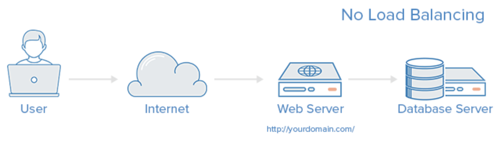
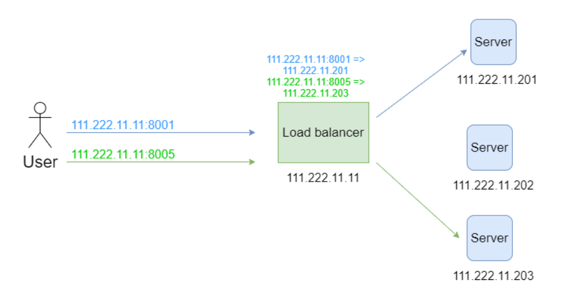
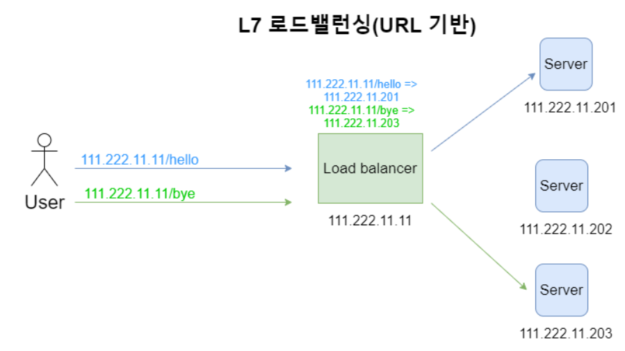

# 로드 밸런서란 무엇인가?

## 로드 밸런서의 필요성

- 서버의 역할
  - Server는 사용자가 원하는 결과를 응답해주는 역할을 한다.
  - 사용자가 한두명이 아니라 수천만명이라면? 서버는 과부하가 걸려, 동작을 멈추게 될 것이다.
- 문제를 해결하기 위해서는 어떻게 해야하는가?
  1. `Scale-up` : Server가 더 빠르게 동작하기 위해 하드웨어 성능을 올리는 방법
  2. `Scale-out` : 하나의 Server 보다는 여러 대의 Server가 나눠서 일을 하는 방법
- Scale-out 이 가지는 장점
  - 하드웨어 향상하는 비용보다 서버 한대 추가 비용이 더 적습니다.
  - 여러 대의 Server 덕분에 무중단 서비스를 제공할 수 있습니다
- Scale-out을 하게 되면 여러 서버에 균등하게 역할을 분산시켜주는 역할을 하는 것이 필요하다
  - `Load Balancer`는 바로 이 역할을 하는 친구이다.
  - 그리고, 로드밸런서가 없을 시  EC2 인스턴스에는 하나의 도메인만 연결할 수 있기 때문에 서버가 늘어날 떄마다 새로운 도메인이 필요할 것이다.

## 로드밸런서의 정의와 기능

- 정의
  - 하나의 인터넷 서비스가 발생하는 트래픽이 많을 때 여러 대의 서버가 분산처리하여 서버의 로드율 증가, 부하량, 속도저하 등을 고려하여 적절히 분산처리하여 해결해주는 서비스
- 역할
  - 서버에 가해지는 부하(=로드)를 분산(=밸런싱)해주는 장치 또는 기술을 통칭합니다. 클라이언트와 서버풀(Server Pool, 분산 네트워크를 구성하는 서버들의 그룹) 사이에 위치하며, 한 대의 서버로 부하가 집중되지 않도록 트래픽을 관리해 각각의 서버가 최적의 퍼포먼스를 보일 수 있도록 합니다.
- 주요 기능
  1. NAT(Network Address Translation)
     - 사설 IP 주소를 공인 IP 주소로 바꾸는 데 사용하는 통신망의 주소 변조기입니다.
  2. Tunneling
     - 인터넷상에서 눈에 보이지 않는 통로를 만들어 통신할 수 있게 하는 개념
     - 데이터를 캡슐화해서 연결된 상호 간에만 캡슐화된 패킷을 구별해 캡슐화를 해제할 수 있습니다.
  3. DSR(Dynamic Source Routing protocol)
     - 로드 밸런서 사용 시 서버에서 클라이언트로 되돌아가는 경우 목적지 주소를 스위치의 IP 주소가 아닌 클라이언트의 IP 주소로 전달해서 네트워크 스위치를 거치지 않고 바로 클라이언트를 찾아가는 개념
- 기본 작동 방식
  1. 클라이언트 브라우저에서 swhan9404.com 이라고 입력
  2. 클라이언트에 설정된 메인 DNS 서버로 swhan9404.com 의 IP 주소를 문의
  3. 메인 CNS 서버는 swhan9404.com 주소를 관리하는 별도의 DNS 서버에 IP 주소를 문의
  4. 별도 관리 DNS 서버는 로드밸런서의 IP (Virtual IP)주소를 메인 DNS에게 알려줌
     - VIP(Virtual IP)란?
     - 서버의 IP 가 아니면서 마치 서버IP인 것 처럼 기능을 하기 때문에 가상IP라고 부르고,
       이 가상 IP 를 찾아가면 여러 서버들의 IP로 연결될 수 있기 떄문에 이 IP를 `대표IP`라고 부르기도 한다.
  5. 메인 DNS는 획득한 VIP를 클라이언트에 전송
  6. 클라이언트에서 로드밸런서의 VIP 주소로 http 요청
  7. 로드밸런서는 별도 로드밸런싱방법(라운드로빈 등)을 통하여 서버에게 요청을 전송
  8. 서버의 작업 결과를 받은 로드밸런서는 전달받은 http 결과를 클라이언트에게 전송
     - 요청과 응답이 모두 Load Balancer를 경유함

## 로드밸런서의 종류

- OSI 계층에 따라서 4가지로 구분할 수 있다.
- 부하 분산에는 L4 로드밸런서와 L7 로드밸런서가 가장 많이 활용됨
  -  L4 로드밸런서부터 포트(Port)정보를 바탕으로 로드를 분산하는 것이 가능하기 때문
    ( 한 대의 서버에 각기 다른 포트 번호를 부여하여 다수의 서버 프로그램을 운영하는 경우라면 최소 L4 로드밸런서 이상을 사용 )
  - L7 로드밸런서의 경우 애플리케이션 계층(HTTP, FTP, SMTP)에서 로드를 분산하기 때문에 HTTP 헤더, 쿠키 등과 같은 사용자의 요청을 기준으로 특정 서버에 트래픽을 분산하는 것이 가능
  - L7 로드밸런서의 경우 특정한 패턴을 지닌 바이러스를 감지해 네트워크를 보호할 수 있으며, DoS/DDoS와 같은 비정상적인 트래픽을 필터링할 수 있어 네트워크 보안 분야에서도 활용

### L2

- Data link 계층을 사용

- Balancing 기준
  - Mac주소를 바탕으로 Load Balancing

### L3

- Network 계층을 사용

- Balancing 기준
  - IP주소를 바탕으로 Load Balancing

### L4

- Transport 계층을 사용

- Balancing 기준
  - Transport Layer(IP와 Port) Level에서 Load Balancing
- TCP, UDP 포트 정보를 바탕으로 함
- CLB(Connection Load Balancer) 혹은 SLB(Session Laod Balancer) 라고 부르기도 함
- 데이터 수정 변경 불가

### L7

- Application 계층을 사용

- Balancing 기준
  - Application Layer(사용자의 Request) Level에서 Load Balancing
- HTTP, HTTPS, FTP 정보를 바탕으로 함
- 포트나 헤더 등을 수정할 수 있음

|               | L4로드밸런서                                                 | L7로드밸런서                                                 |
| ------------- | ------------------------------------------------------------ | ------------------------------------------------------------ |
| 네트워크 계층 | Layer 4  전송계층(Transport Layer)                      | Layer7 응용계층(Application Layer)                      |
| 특징          | TCP/UDP 포트 정보를 바탕으로 함                              | TCP/UDP 정보는 물론 HTTP의 URI, FTP의 파일명, 쿠키 정보등을 바탕을 함 |
| 장점          | 1. 데이터 안을 들여다보지 않고 패킷 레벨에서만 로들르 분산하기 떄문에 속도가 빠르고 효율이 높음 2. 데이터 내용을 복호화할 필요가 없기 때문에 안전함 3. L7 로드밸런서보다 가격이 저렴함 | 1. 상위 계층에서 로드를 분산하기 떄문에 훨씬 섬세한 라우팅이 가능함 2. 캐싱 기능을 제공함 3. 비정상적인 트래픽을 사전에 필터링할 수 있어 서비스 안정성이 높음 |
| 단점          | 1. 패킷 내용을 살펴볼 수 없기 때문에 섬세한 라우팅이 불가능함 2. 사용자의 IP가 수시로 바뀌는 경우라면 연속적인 서비스를 제공하기 어려움 | 1. 패킷의 내용을 복호화해야하기 때문에 더 높은 비용을 지불해야함 2. 클라이언트가 로드밸런서와 인증서를 공유해야하기 떄문에 공격자가 로드밸런서를 통해 클라이언트에 데이터에 접근할 보안상의 위험이 존재함 |

## 로드밸런서의 분산방법- L4

- L4 로드밸런서가 어떤 기준으로 서버에 트래픽을 분산하는지 설명

### Round Robin

- 서버에 들어온 요청을 순서대로 돌아가며 배정하는 방식
- 클라이언트의 요청을 순서대로 분배하기 때문에 여러 대의 서버가 동일한 스펙을 갖고 있고, 서버와의 연결(세션)이 오래 지속되지 않는 경우에 활용하기 적합
- 더 나아간 방법
  - **가중 라운드로빈 방식(Weighted Round Robin Method)**
    - 각각의 서버마다 가중치를 매기고 가중치가 높은 서버에 클라이언트 요청을 우선적으로 배분
    - 주로 서버의 트래픽 처리 능력이 상이한 경우 사용되는 부하 분산 방식
    - 예시)
      - A라는 서버가 5라는 가중치를 갖고 B라는 서버가 2라는 가중치를 갖는다면, 
        로드밸런서는 라운드로빈 방식으로 A 서버에 5개 B 서버에 2개의 요청을 전달

 

### 최소 연결 방식(Least Connections)

- 연결 개수가 가장 적은 서버를 선택하는 방식입니다.
- 자주 세션이 길어지거나, 서버에 분배된 트래픽들이 일정하지 않은 경우에 적합한 방식

### IP 해시 방식(IP Hash Method)

- 클라이언트의 IP 주소를 해싱하여 특정 서버로 매핑하여 요청을 처리하는 방식
  - 해싱(Hashing, 임의의 길이를 지닌 데이터를 고정된 길이의 데이터로 매핑하는 것, 또는 그러한 함수) 

- 사용자는 항상 같은 서버로 연결되는 것을 보장합니다.

### 최소 리스폰타임(Least Response Time Method)

- 서버의 현재 연결 상태와 응답시간(Response Time, 서버에 요청을 보내고 최초 응답을 받을 때까지 소요되는 시간)을 모두 고려하여 트래픽을 배분
  - 가장 적은 연결 상태와 가장 짧은 응답시간을 보이는 서버에 우선적으로 로드를 배분하는 방식

## 로드밸런서의 분산방법- L7

- L7 로드밸런서가 어떤 기준으로 서버에 트래픽을 분산하는지 설명

### URL 스위칭 방식(URL Switching)

- 특정 하위 URL 들은 특정 서버로 처리하는 방식
- 예를 들어 '.../swhan9404/image' 혹은 '.../swhan9404/video' 와 같은 특정 URL을 가진 주소들은 서버가 아닌 별도의 스토리지에 있는 개체 데이터로 바로 연결되도록 구성

### 컨텍스트 스위칭 방식(Context Switching)

- 클라이언트가 요청한 특정 리소스에 대해 특정 서버 등으로 연결을 할 수 있음
- 예를 들어, 이미지 파일에 대해서는 확장자를 참조하여 별도로 구성된 이미지 파일이 있는 서버/스토리지로 직접 연결 가능

### 쿠키 지속성(Persistence with Cookies)

-  쿠키 정보를 바탕을 클라이언트가 연결 했었던 동일한 서버에 계속 할당을 해주는 방식
- 특히, 사설 네트워크에 있던 클라이언트의 IP주소가 공인IP 주소로 치환되어 전송(X-Forwarded-For 헤더에 클라이언트 IP 주소를 별도록 기록)하는 방식을 지원

## 로드밸런서의 주요 성능지표

1. 초당 연결수(Connections per second)
   - 최대 처리 가능한 초당 TCP 세션의 갯수를 의미
2. 동시 연결 수 (Concurrent connections)
   - 동시에 최대로 세션을 유지할 수 잇는 개수를 의미
3. 처리용량(Throughput) - L4 에 해당
   - 패킷 자체에 대해 연결이 성립되는 UDP 프로토콜에 대한 로드밸런싱 성능지표.
   - FWLB(Firwall Laod Balancing)에서 중요
   - 단위는 bps(bit per second) 또는 pps(packet per second)를 사용

## 로드밸런서의 장애 대비

- Load Balancer를 이중화하여 장애를 대비할 수 있음
- 장애가 났을 때의 시나리오
  - 이중화된 Load Balancer들은 서로 Health Check를 합니다.
  - Main Load Balancer가 동작하지 않으면 가상IP(VIP, Virtual IP)는 여분의 Load Balancer로 변경됩니다.
  - 여분의 Load Balancer로 운영하게 됩니다.
undefined

