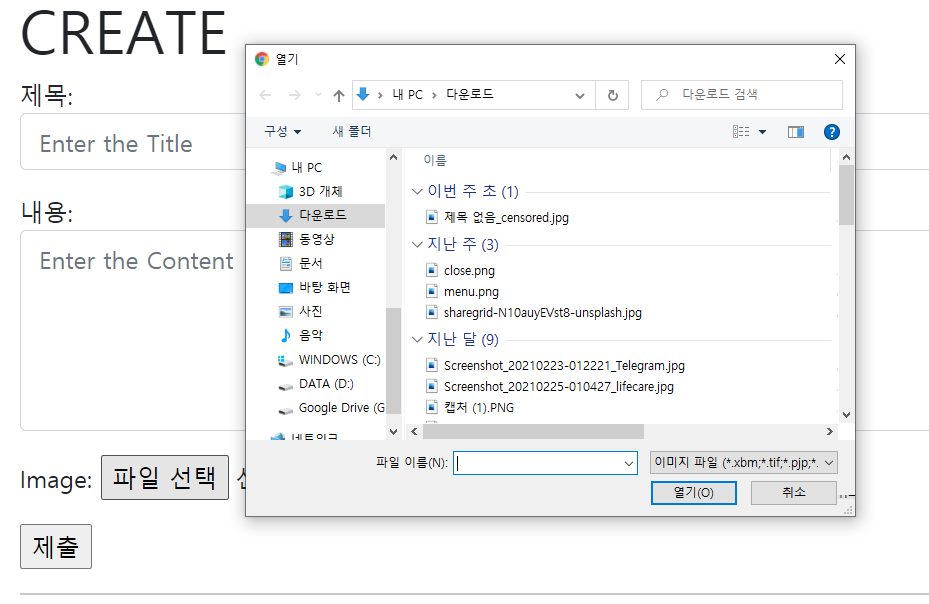

# 1. Static files

- static file 이란?
  - 이미지, CSS, HTML, js 같이 해당 내용이 고정되어, 응답할 때 별도의 처리 없이 파일 내용을 그대로 보여주면 되는 파일
  - 즉, 사용자의 요청에 따라 내용이 바뀌는 것이 아니라 요청한 것을 그대로 응답하면 되는 파일
  - 기본 static 경로
    - `app_name/static/`
  - HTML에서 사용하기
    - HTML 상단에 `` 하기
    - ``
  - https://docs.djangoproject.com/ko/3.1/howto/static-files/


## 1.1 The staticfiles app

- `STATIC_ROOT`
  - Django프로젝트에서 사용하는 모든 정적 파일을 한 곳에 모아놓은 경로
  - collectstatic이 배포를 위해 정적 파일을 수집하는 절대 경로
    - collectstatic 이란?
    - 프로젝트 배포 시 흩어져 있는 정적 파일들을 모아 특정 디렉토리로 옮기는 작업
    - `python manage.py collectstatic` 명령어로 사용
  - DEBUG=True(개발 단계)로 설정되어 있으면 작용하지 않음
    - 개발 단계에서는 STATIC_ROOT 경로를 작성하지 않아도 문제없이 동작
  - 즉, 실제 **서비스 배포 환경**에서 필요한 경로

- `STATIC_URL`
  - STATIC_ROOT에 있는 정적 파일을 참조 할 때 사용할 URL
    - 실제 파일이나 디렉토리가 아니며, URL로만 존재
  - 비어있는 값으로 설정한다면 반드시 `/` 로 끝나야함
- `STATICFILES_DIRS`
  - app 내의 static 디렉토리 경로를 사용하는 것(기본 경로) 외에 추가적인 정적 파일 경로 정의


## 1.2 실습 - 어플.static 경로 사용하기

1. `어플.static/articles` 을 만들어 사진을 넣는다.
   - 사진이름 : sample.png
2. 넣고 싶은 `페이지.html` 로 가서
   - ``  넣기 - `` 밑에
     - 주의 사항 : `base.html` 에 `` 을 넣어버리고 extends로 상속받으면 될것같지만, 이렇게 하면 작동을 하지 않음
     - extends 에서는 load 부분을 가지고 오지 않음 
       - extends는 HTML 소스와 block 부분만 가지고옴
   - `` 


## 1.3 실습2 - 프로젝트.static 경로 사용하기

1. `프로젝트폴더.static/stylesheets` 경로 만들기

   - style.css 하나 만들기

2. `base.html`에 

   - `` `` 으로 css 블럭 만들기

3. css 적용 원하는 HTML 으로 가서 css 블록 안에

   - `<link rel="stylesheet" href="">`
   - 이렇게 까지만 하면 적용될 것 같지만 안됨
     - 프로젝트폴더의 static은 경로를 따로 추가해줘야함

4. `프로젝트.settings.py` 

   - `STATIC_URL='/static/'` 

     - 서버가 Static 파일에 접근할 수 있도록 가상의 URL을 만드는데, 해당 URL의 첫번쨰 경로를 정의한다.

   - `STATICFILES_DIRS= [ BASE_DIR / '프로젝트이름' / 'static']`

     - Static 파일은 기본적으로 앱 아래에 있는 static 폴더를 탐색한다.
     - 추가적인 경로를 탐색하게 하려면 이렇게 리스트를 추가해야한다.

   

# 2. media

- 미디어 파일 (media files)
  - 사용자가 웹에서 업로드 하는 정적 파일
  - 즉, 유저가 업로드 하는 모든 정적 파일
- 사용하기 위해서는 몇가지 단계를 거쳐야함
  1. `프로젝트.settings.py`에 `MEDIA_ROOT`, `MEDIA_URL` 설정
  2. `upload_to` 속성을 정의하여 업로드 된 파일에 사용할 MEDIA_ROOT 의 하위 경로 지정
  3. 업로드 된 파일의 상대 URL 경로를 django가 제공하는 `url`  attribute를 통해 사용가능
- `MEDIA_ROOT`
  - 사용자가 업로드 한 파일을 보관할 디렉토리의 절대 경로
  - 실제 해당 파일의 업로드가 끝나면 파일이 저장되는 경로
  - Django는 성능을 위해 업로드 파일은 데이터 베이스에 저장하지 않음
    - 데이터베이스에 저장되는 것은 파일의 경로
  - `MEDIA_ROOT` 와 `STATIC_ROOT`는 서로 다른 경로를 가져야함
- `MEDIA_URL`
  - 업로드 된 파일의 주소(URL)를 만들어 주는 역할
  - MEDIA_ROOT에서 제공되는 미디어 파일을 처리하는 URL
    - 웹 서버 사용자가 사용하는 public URL
  - 비어 있지 않은 값으로 설정한다면 반드시 slash(`/`)로 끝나야함
  - MEDIA_URL과 STATIC_URL은 서로 다른 경로를 가져야함

- https://docs.djangoproject.com/en/3.1/topics/files/

- https://docs.djangoproject.com/ko/3.1/howto/static-files/#serving-static-files-during-development

  

## 2.1 실습하기

1. `어플.models.py` 에  `Article(models.Model) ` 안에 image 필드 만들기

   - 하지만 이렇게 하면 에러가 날 것
     - Pillow 를 설치해줘야함
     - pip install Pillow
     - 패키지를 다운 했으면 pip freeze > requirement.txt 로 패키지 다운리스트 추가
     - pillow는 `프로젝트.settings.py`에 INSTALLED_APPS 에 추가하지 않아도됨
   - `image = models.ImageField(blank=True)`

     - blank=True 일 경우 해당 field는 blank(빈 값) 허용
     - 데이터베이스에는 `''`(빈문자열)이 저장되게 디ㅗㅁ
     - 유효성검사와 관련있음
   ```python
   from django.db import models
   
   # Create your models here.
   class Article(models.Model):
       title = models.CharField(max_length=10)
       content = models.TextField()
       image = models.ImageField(blank=True)
       created_at = models.DateTimeField(auto_now_add=True)
       updated_at = models.DateTimeField(auto_now=True)
   ```

2. `python manage.py makemigrations` 로 데이터베이스 스키마 만들기

3. `python manage.py migrate`로 데이터 베이스에 방금만든 스키마 적용

4. 잘 적용됬는지 `create.html` 로 가서 확인해보기

   - 파일 선택을 하면 `이미지파일` 선택이 기본으로 되어있음
   - 이미지 파일을 사용자가 넣지 않을 경우 에러처리도 django가 알아서 해줌

   

5. 파일을 전송하려면 form 속성을 바꿔줘야함

   - enctype 속성

     - `<form>` 태그의 enctye 속성은 폼 데이터(form data)가 서버로 제출될 때 해당 데이터가 인코딩되는 방법을 명시
     - 이 속성은 `<form>` 요소의 method 속성값이 `POST`인 경우에만 사용가능

     |              속성값               |                             설명                             |
     | :-------------------------------: | :----------------------------------------------------------: |
     | application/x-www-form-urlencoded | 기본값으로, 모든 문자들은 서버로 보내기 전에 인코딩됨을 명시함. |
     |        multipart/form-data        | 모든 문자를 인코딩하지 않음을 명시함.이 방식은 <form> 요소가 파일이나 이미지를 서버로 전송할 때 주로 사용함. |
     |            text/plain             | 공백 문자(space)는 "+" 기호로 변환하지만, 나머지 문자는 모두 인코딩되지 않음을 명시함. |

   - ` <form action="" method="POST" enctype="multipart/form-data">` 로 바꿔주기
   - input 태그 - accept 속성

      - 입력 허용할 파일 유형을 나타내는 문자열
      - 이 문자열은 쉼표로 구분된 고유 파일 유형 지정자(unique file type specifiers)
      - 하지만 파일 검증은 하지 못함 (이미지만 accept 해 놓더라도 비디오나 오디오 파일을 제출할 수 있음)

6. `어플.views.py` 에 가서 create method를 변경해주기

   - `form = ArticleForm(request.POST, request.FILES)` 
     - request.FILES 를 매개변수로 넣어주어야함

7. `detail.html` 에서 사진이 표시될 수 있도록 하기

   - ``
   - imageField 의 경우 3가지 속성이 있음.
     - name - 업로드 파일의 이름(`{{ article.image }}` 를 출력해도 name이 나옴)
      - path
      - url - 업로드 파일의 상대 URL
   - 하지만 여기까지 해도 사진은 안나옴 - media 위치를 지정해주어야함

8. `프로젝트.settings.py` 에 MEDIA_URL 속성 추가

   - 서버가 Media 파일을 요청할 때 사용할 가상의 URL

   - `MEDIA_URL ='/media/'`

9. 지금 올려놓은 파일의 위치를 보면 ROOT 폴더에 저장되어 있음을 확인할 수 있음

   그래서 사용자가 올린 파일들이 저장될 위치를 지정해주어야함.

   - MEDIA_ROOT 의 기본값은 `''` 이기 때문에 루트폴더에 저장됨
   - Media 파일이 실제로 위치할 경로
   - `MEDIA_ROOT = BASE_DIR / 'media'`
   - 하지만 여기까지 해도 사진은 뜨지 않음 

10. `프로젝트.urls.py` 에 가서 사진 경로를 만드는 걸 추가해줘야함

    - static 파일의 경우에는 django에서 기본적으로 url 세팅을 해주는 것을 설정하지 않아도 하지만, media의 경우는 가상의 url을 만드는 것을 만들어주어야함.
    - static 메서드
      - MEDIA_URL :  미디어 파일에 접근하는 URL
      - settings.MEDIA_ROOT : 실제 미디어 파일들이 위치하고 있는 경로
      - `+static()`을 하지 않는다면, 주소는 뜨지만 media 이미지와 연동이 되지 않아 사진이 뜨지 않게된다.

    ```python
    from django.conf import settings
    from django.conf.urls.static import static
    
    urlpatterns = [
        # ... the rest of your URLconf goes here ...
    ] + static(settings.MEDIA_URL, document_root=settings.MEDIA_ROOT)
    # 이거는 static 파일들 경로가 추가되는것 - 자동으로 추가되어잇음
    # + static(settings.STATIC_URL, document_root=settings.STATIC_ROOT)
    ```

    - 여기까지 하면 드디어 사진 경로가 나오게 됨.

11. 하지만 이미지가 없는 글에 들어가면 에러가 남. 이거 처리해주어야함.

    - `detail.HTML` 에 if 문으로 존재하는지 확인

      ```HTML
        
         
        
          <p>이미지가 없습니다</p>
        
      ```


## 2.2 업데이트 부분도 실습하기

- `HTML` 파일의 form 부분에 `enctype="multipart/form-data` 추가
- `어플.views.py` 에 form 받는 부분 수정
  - `form = ArticleForm(request.POST, request.FILES, instance=article)`
    - request.FILES 매개변수를 추가한것