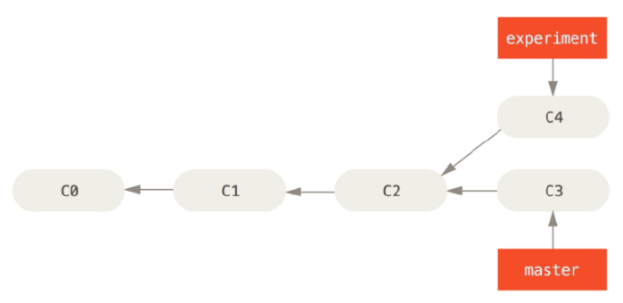
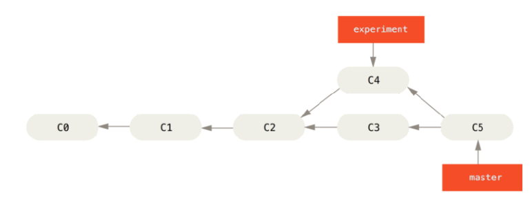
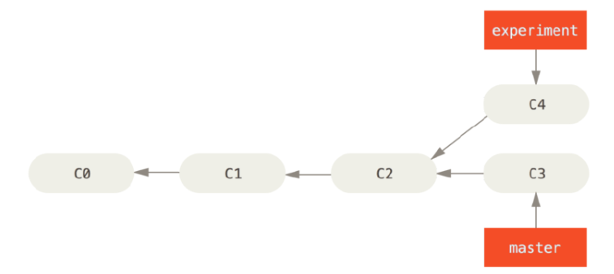
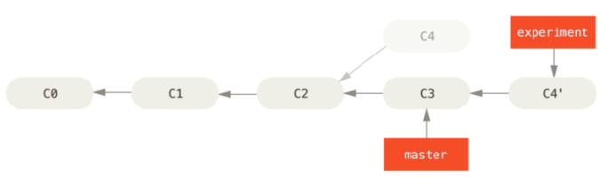
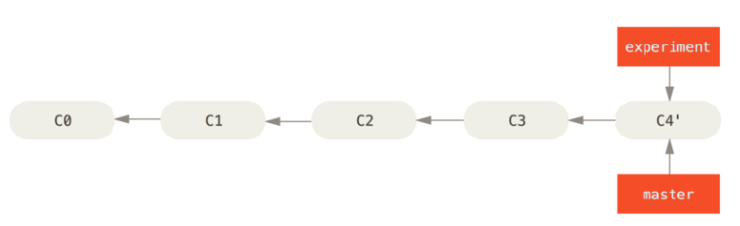
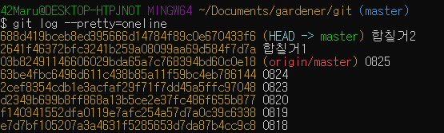
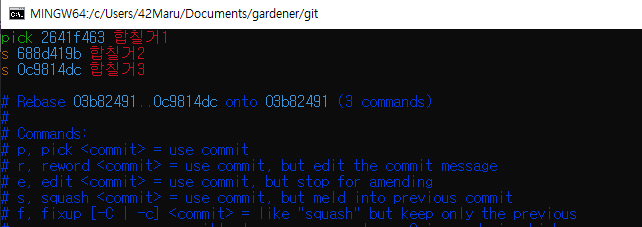
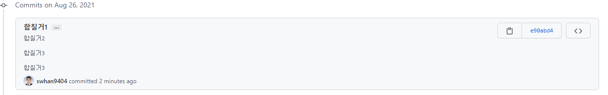
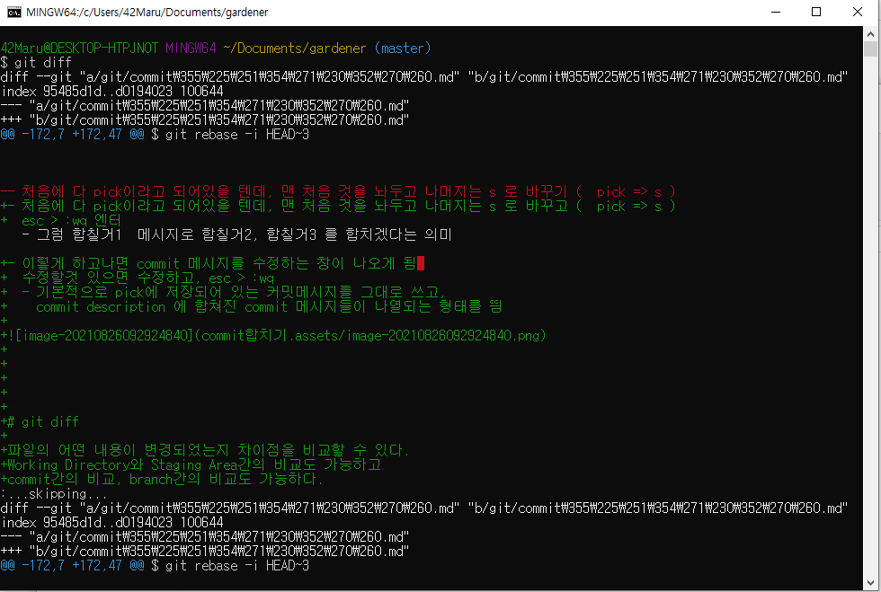

# git rebase란?

> `rebase`는 말 그대로 (re-base)로 베이스를 재배치한다는 뜻

- Git에서 한 브랜치에서 다른 브랜치로 합치는 방법은 Merge와 Rebase다.
- Merge와 Rebase의 실행결과는 같지만 커밋 히스토리가 달라진다.
- Merge는 쉽고 안전하지만 커밋히스토리가 지저분할 수 있다 반면 Rebase는 잘 모르고 사용할 경우 위험할 수 있어 까다롭지만 커밋히스토리를 깔끔하게 관리할 수 있다.
- Rebase는 base를 새롭게 설정한다는 의미로 이해하면 좋다.


## rebase와 merge와의 차이점

그럼 **두 개의 브랜치로 나뉘어진 커밋 히스토리가 있는 상황**에서 `Merge` 와 `Rebase`를 비교해 본 후 `Rebase`에 대해 좀 더 자세히 알아보자


### merge를 통한 통합

- Merge로 통합하기



이 두 브랜치를 합치는 가장 쉬운 방법은 merge 명령을 이용해 3-way Merge로 새로운 커밋을 만들어내는 것입니다.
이 때 내부적으로 공통조상인 C2를 이용하게 됩니다.




### rebase

- 두 브랜치가 나뉘어 있는 아까와 같은 상황에서 시작합니다.




2. `experiment` 브랜치로 이동해 master를 base삼아 Rebase 하겠다는 의미입니다.

```bash
$ git checkout experiment
$ git rebase master
First, rewinding head to replay your work on top of it...
Applying: added staged command
```

그러면 내부에서는 master가 base가 되고, C3과 C4의 차이를 임시 저장하는 공간에 저장합니다. 이 임시저장 공간을 `Patch`라고 합니다.

그리고 `base`가 되는 `master`에 `Patch`들이 적용됩니다. (이렇게 생각하는 편이 개인적으로 이해하기 좋다고 생각해 적었습니다.)

다시 정리하겠습니다.

- 공통 커밋(**C2**)에서 시작해서 현재 체크아웃한 experiment 브랜치가 가리키는 커밋까지 `diff`를 차례대로 만들어 `Patch`에 저장
- experiment브랜치가 master브랜치를 가리키게 함
- C3에 Patch를 순서대로 적용


3. 아까 Merge와 다른점이 눈에 확연히 보입니다!
   커밋들이 여러갈래로 있었던 Merge와 다르게 커밋 히스토리가 한 줄로 깔끔하게 정렬된 것을 볼 수 있습니다.

   이제 마지막으로 master브랜치를 `Fast-forward` 시킵니다.

```null
$ git checkout master
$ git merge experiment
```




Merge의 결과에서의 `C5`가 위 사진의 `C4'`는 내용이 같습니다.
결과적으로 봤을 때는 서로 다를게 없습니다. 하지만 Rebase가 좀 더 깨끗한 히스토리를 만듭니다.
Rebase는 그래서 보통 리모트 브랜치에 커밋을 깔끔하게 적용하고 싶을 때 사용합니다.
또 다른 차이점은 Rebase는 브랜치의 변경사항 Patch를 이용한다는 점, Merge의 경우는 두 브랜치의 최종 결과만을 가지고 합친다는 점입니다.


## git rebase 옵션

**[의미 분석]**

1. p = pick

`pick` 또는 `p` 는 **해당 커밋을 수정하지 않고 그냥 사용하겠다 라는 명령어**입니다. 디폴트로 실행되는 명령어이므로 vim에서 내용을 편집하지 않고 종료한다면 아무런 변경 사항 없이 리베이스가 종료됩니다.

이런 특성을 가진 `pick`을 이용해서 커밋 순서을 재정렬하거나, 아예 커밋을 삭제하는 용도로 사용할 수도 있습니다.


2. r = reword

`reword` 또는 `r` 는 **커밋 메시지를 수정하기 위한 명령어**입니다.

 `reword` 명령어를 입력한 후 vim을 종료하면, 커밋 메시지를 vim에서 수정할 수 있게 됨


3. e = edit

`edit` 또는 `e` 는 **커밋의 명령어 뿐만 아니라 작업 내용도 수정할 수 있게 하는 명령어**입니다. 
명령어 edit을 사용하면, 해당 커밋으로 HEAD가 옮겨지고, `git commit --amend`로 커밋을 수정하고,
`git rebase --continue` 를 입력하여 수정을 완료시킬 수 있음


4. s = squash
   f = fixup

`squash`와 `s`, `fixup`과 `f`는 **해당 커밋을 이전 커밋과 합치는 명령어**
`squash` 는 각 커밋들의 메시지가 합쳐지는 반면, 
`fixup` 은 이전의 커밋 메시지만 남기는 차이점

`squash`를 통하여 합쳐진 메시지는 commit description 으로 들어간것을 확인할 수 있음


5. x = exec

`exec` 또는 `x` 는 **리베이스 도중에 실행할 쉘 커맨드를 입력할 수 있게 해주는 명령어**입니다.


6. b = break

`break` 또는 `b` 는 그냥 말 그대로 **해당 라인에서 리베이스를 일시중지하는 명령어**입니다.
다시 재개하려면 `git rebase --continue` 를 입력하면 됩니다. 


7.  drop

`drop` 또는 `d` 는 **해당 커밋을 명시적으로 삭제하는 명령어**입니다. 위에서 `pick` 명령어로 삭제하는 것과 동일한 결과물이 나옵니다.


8. m = merge

`merge` 또는 `m` 옵션은 **머지 커밋을 만들면서 머지하는 명령어**입니다.
다른 브랜치에서 작업한 커밋을 가져와서, 리베이스 중에 머지시키고, commit 메시지 작성


## 여러 commit 합치기


### 1. 무엇을 합칠지 확인

```bash
$ git log --pretty=oneline
```





### 2. rebase 활용

```bash
# 3개의 메시지 합치기
# i = interactive 즉, 대화형 실행옵션
$ git rebase -i HEAD~3
```




- 처음에 다 pick이라고 되어있을 텐데, 맨 처음 것을 놔두고 나머지는 s 로 바꾸고 (  pick => s )
  esc > :wq 엔터
  - 그럼 합칠거1  메시지로 합칠거2, 합칠거3 를 합치겠다는 의미

- 이렇게 하고나면 commit 메시지를 수정하는 창이 나오게 됨 
  수정할것 있으면 수정하고, esc > :wq
  - 기본적으로 pick에 저장되어 있는 커밋메시지를 그대로 쓰고,
    commit description 에 합쳐진 commit 메시지들이 나열되는 형태를 띔




# git diff

파일의 어떤 내용이 변경되었는지 차이점을 비교할 수 있다.
Working Directory와 Staging Area간의 비교도 가능하고
commit간의 비교, branch간의 비교도 가능하다.


## 관련 명령어 정리

1. **commit된 파일상태와 현재 수정중인 상태 비교**
   `git diff`

2. **commit된 파일상태와 add된 파일 상태 비교**
   `git diff --staged`

3. **commit간의 상태 비교하기 - commit hash 이용**
   `git diff [비교할commit해쉬1] [비교할commit해쉬2]`
   ex ) git diff 048171 0c747d

4. **commit간의 상태 비교하기 - HEAD 이용**
   ex) `git diff HEAD HEAD^`
   가장 최근의 커밋과 그 전의 커밋을 비교한다

5. **branch간의 상태 비교하기 - HEAD 이용**
   `git diff [비교할branch1] [비교할branch2]`
   ex ) git diff feature/test origin/master
   local의 feature/test브런치와 remote의 master branch 비교




# git show

> 해당 커밋들에 어떤 수정사항이 있었는지 커밋정보를 확인하기 위해 사용되어진다.

- `git show` : 현재 브랜치의 가장 최근 커밋 정보를 확인함

- `git show 커밋해시값` : 특정 커밋 정보를 확인함

- `git show HEAD` : HEAD 포인터가 가리키는 커밋정보를 확인함

- `git show 커밋해시값 또는 HEAD^`:

  - 마지막에 `^`표시가 있다.

    - `^`표시 한 개면 한 개전 두 개면 두 개전, 갯수로 얼마나 이전 값인지 알수 있음

  - `~숫자` 는 명시적으로 몇개 전인지 표시합니다.

    

