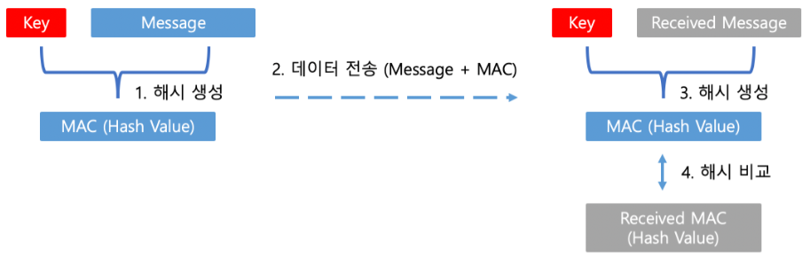

# HMAC 이란?

> Hash-based Message Authentication Code

- HMAC의 정의
  - **API** 서버에 요청자의 신원(신뢰성)과 요청 메시지의 무결성을 검증하는데 특화된 해쉬 문자열
- 무결성이란?
  - 서버 입장에서 클라이언트로부터 API 요청을 받았을 때, 이 요청이 신뢰할 수 있는 것인지 (정보가 중간에 변경없이 그대로 전달된 것인지)에 대한 성질
- 왜 다른 암호를 안쓰고 HMAC 을?
  - PKI(공개키 기반 구조) 보다 구현 부담이 적기 떄문에 HMAC을 널리 사용하고 있다.

## HMAC 만드는 법

HMAC은 인증을 위한 `Secret Key`(서버와 클라이언트 만이 공유하는 비밀키`Shared Secret`,  즉 대칭키)와 임의의 길이를 가진 `Message`를 해시 함수(알고리즘)을 사용해서 생성한다. 해시 함수로는 MD5, SHA-256과 같은 일반적인 해시 함수를 그대로 사용할 수 있으며 각 알고리즘에 따라 다른 고정길이의 MAC(Hash value)가 생성된다.

- **Secret Key**: 서버와 클라이언트가 함께 알고 있는 외부로 유출되어서는 안되는 값.
- **Message**: 클라이언트가 전송하는 요청의 전체(Header + Body)가 될 수도 있고, URL만 될 수도 있다.

> 만약 Message를 변경하지 않고, 중간에 Message를 취득한 공격자가 변조 없이 동일한 요청을 계속 보낸다면, Message를 변조하지 않았기 때문에 서버는 이를 유효한 요청으로 인식할 것이다. 이것을 **Replay Attack**이라고 하는데 이를 방지하기 위해서 MAC을 생성할 때 **timestamp**를 추가해서 사용하는 방법이 있다.
> 이렇게 하면 서버는 이 Message가 생성된 시간을 알 수 있고, 생성된 시간부터 일정 시간내의 호출만 정상적인 호출로 사용하면 된다.

##  HMAC 작동방법

1. **해시 생성**: 클라이언트는 Key와 Message를 이용해 해시함수로부터 MAC을 생성한다.
2. **데이터 전송**: 생성된 MAC과 Message를 서버에게 전송한다. MAC은 HTTP Request Header 혹은 URL에 포함된다.
3. **해시 생성**: 서버는 클라이언트로부터 전달받은 Message와 갖고 있던 Key를 이용해 해시함수로부터 MAC을 생성한다.
4. **해시 비교**: 서버에서 생성된 MAC과 클라이언트로부터 전달받은 MAC의 값이 같은지 비교한다.

### aws S3 REST API 기준  - HMAC 서명 생성과 검증

- 서명을 생성하는데 필요한 것은 요청 자체에 담긴 여러 데이터와 비밀 키이다. 클라이언트는 미리 서버와 약속된 공식에 따라 데이터를 가공한 후 비밀 키를 이용하여 **HMAC** 서명 문자열로 변환한다. 서명 문자열을 만들어내는 방법은 다양하다. **DomainTools**의 경우 **client_id** + **timestamp** + **request_uri**를 조합한 문자열에 **client_secret**를 이용한 **HMAC**을 생성한다. [[관련 링크\]](https://www.domaintools.com/resources/api-documentation/authentication/)
- 서버 측은 요청 데이터에 대해 동일한 방법을 이용하여 **HMAC** 서명 문자열을 생성하는데 클라이언트 측이 첨부한 것과 일치하면 유효한 요청으로 간주하고 불일치할 경우 비정상적인 요청으로 간주한다.

### aws S3 REST API 기준 - 인증방법

- **Amazon S3 REST API**는 서버와 클라이언트 만이 공유하는 비밀키(`Shared Secret`, 대칭키)를 이용하여 생성된 서명(`Signature`)으로 매번 클라이언트로부터의 요청이 올바른지 인증한다.
- 클라이언트와 서버 사이의 요청-응답 메시지에 대한 보안은 `TLS`가 적용된 **HTTPS** 프로토콜을 사용하는 것으로 자연스럽게 수행된다. **Signature**는 단지 요청한 클라이언트가 진짜인지 가짜인지를 증명하는 역할을 수행한다.
- **HMAC** 서명을 생성하는 알고리즘으로는 `SHA256`이 사용된다. 업계 표준으로 쓰이고 있어 신뢰할 수 있으며 **CPU**에 가해지는 부담이 적다.
- 생성된 서명이 포함된 요청의 유효 시간은 15분이다. 15분이 경과하면 유효하지 않은 요청으로 간주한다. 이 경우 **timestamp**의 포맷은 **ISO 8601**에 타임존을 추가하여 정의한다.

## HMAC 장점과 단점

**[장점]**

- 단순히 **client_id**, **client_secret**을 전송하여 인증하는 방식보다 보안이 우수하다. 공격자가 클라이언트로 위장하려면 비밀키를 알아야 하고, 비밀키를 알았다고 하더라도 계산 공식까지 알아야 한다.
- **PKI** 대비 복잡성이 적어 최소한의 비용으로 인증 보안을 유지할 수 있다

**[단점]**

- 서버와 클라이언트 간에 비밀키를 유출되지 않고 공유하는 방법을 고민해야 한다.
- 단순히 **client_id**, **client_secret**을 사용하는 인증 방식에 비해 구현자의 부담이 증가한다.

