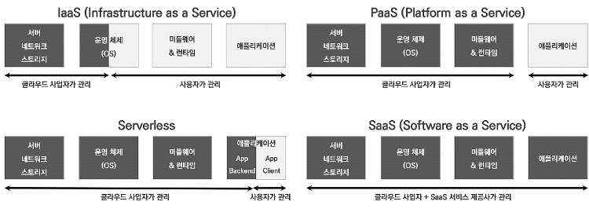
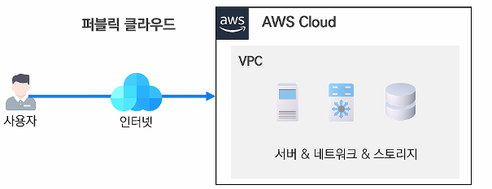
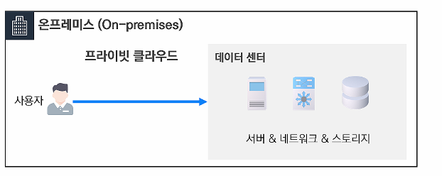
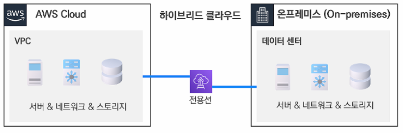

# 1. 클라우드란?
클라우드는 인터넷을 통해서 언제 어디서든지 원하는 때 원하는 만큼의 IT 리소스(컴퓨팅, 스토리지, 네트워크)를 손쉽게 사용할 수 있게 하는 서비스를 말합니다.

## 종류

>  사용자의 관리 영역에 따라 구분

- IaaS 

  - IT 인프라(서버, 스토리지) 등의 하드웨어를 서비스로 제공
  - 정리
    - 우리가 자주 사용하는 가상 호스팅(VM Hosting)과 비슷하나 처음에 말했다시피, 가상 호스팅은 우리가 직접 장비를 사서 그 장비의 한에서 자원을 할당하고 구성해야 하지만, IaaS는 기업이 준비해놓은 환경에서 우리가 선택할 수 있다는 점에서 차이가 있습니다.
    - 일반적으로 적은 OS가 지원됩니다. (아마존은 일부 Linux와 Windows Server 제공)
    - 고객은 OS와 어플리케이션을 직접 관리해야 합니다.
    - 관리 측면에서 개발자와 인프라 관리자의 역할을 분담시킬 수 있습니다.
  - 장점
    - 고객은 가상 서버 하위의 레벨에 대해서는 고려할 필요가 없다는 장점이 있습니다.
  - 단점
    - 그러나 역설적으로 IT 부서(특히, 운영부서)에서 느끼는 매우 큰 단점은 바로 가상 서버 하위의 레벨에 대해서는 전혀 고객이 접근하거나 컨트롤할 수 없습니다.
    - 결국, 가상 서버 하위의 레벨에 대해서 고려할 필요가 없는 사용자가 쓰기에 적합한 모델입니다.
  - 예시
    - AWS EC2, Microsoft Azure VM 등

- PaaS

  - 개발환경, 운영체제 등의 소프트웨어까지 서비스로 제공
  - 정리
    - 운영 팀이 인프라를 모니터링할 필요가 없습니다.
    - 사용자는 OS, Server 하드웨어, Network 등등을 고려할 필요가 없습니다.
    - 사용자는 어필리케이션 자체에만 집중할 수 있습니다. **즉 개발자는 빠르게 어플리케이션을 개발하고 서비스 가능하게 할 수 있습니다.**
    - `IaaS`와 헷갈릴 수 있는데 아마존과 같은 서비스가 VM을 제공하는 `IaaS`라면, `PaaS`는 `node.js, Java`와 같은 런타임을 미리 깔아놓고, 거기에 소스코드를 넣어서 돌리는 구조입니다. **다시 한번 얘기하면 우리는 소스코드만 적어서 빌드 하는 것이고, 컴파일은 클라우드에서 하여 결과만 가져오는 거라고 생각하시면 됩니다.**
  - 장점
    - `PaaS`의 경우 이미 설치된 미들웨어 위에 코드만 돌리면 되기 때문에, 아무래도 관리가 매우 편리합니다.
    - 가장 이상적인 어플리케이션 플랫폼 관점의 클라우드 모델로 업계에 받아들여지고 있습니다.
  - 단점
    - 이것도 IaaS와 마찬가지로 하나의 인프라를 기반으로 개발할 수 있다는 것 자체가 장점이자 단점이 될 수 있습니다.
    - PaaS는 기본적으로 어플리케이션과 플랫폼이 함께 제공됩니다. 어플리케이션이 플랫폼에 종속되어 개발되기 때문에 다른 플랫폼으로의 이동이 어려울 수도 있습니다.

  - 예시
    - Heroku, Google App Engine, Oracle Cloud Platform 등

- SaaS

  - 하드웨어, 소프트웨어 뿐만 아니라 응용소프트웨어까지 서비스로 제공
  - 정리
    - 모든 것을 기업(클라우드)에서 제공함으로 사용자는 별도의 설치나 부담이 필요 없이 SW를 사용할 수 있습니다.
    - SaaS는 소비 관점에서 제공되는 IT 방식의 서비스로 정리할 수 있습니다. 구독의 방식으로 돈을 벌거나 트래픽 기반으로 돈을 벌 수 있습니다.
  - 장점
    - Public Cloud에 있는 SW를 웹 브라우저로 불러와 언제 어디서나 사용할 수 있습니다.
    - 사용자는 웹만 접속하면 되기 때문에 사용하기 매우 쉽고, 최신 SW 업데이트를 빠르게 제공받을 수 있습니다. 사실상 기업 입장에서도 클라우드에 SW가 있기 때문에 따로 업데이트를 하지 않아도 접속한 사용자는 최신 SW를 사용하게 될 수 있습니다.
  - 단점
    - 단점으로는 SaaS의 특성상 반드시 인터넷에 접속할 수 있어야만 사용할 수 있고, 외부의 데이터 노출에 대한 위험이 있습니다.
  - 예시
    - 웹메일, 구글 클라우드, 드롭박스, MS오피스365 등

- Serverless

  - 개발자가 공유 환경에서 코드를 실행하는데 필요한 인프라에 신경쓰지 않고 코드를 작성하고 배포할 수 있는 클라우드 플랫폼

  - FaaS(Function as a Service)와 BaaS(Backend as a Service)로 구분됨
    - FaaS
      - FaaS는 기능을 하나의 함수로 구현해두고 실행할 때마다 서버 자원을 할당받아 사용하는 것을 말한다
      - FaaS에서 서버는 이벤트가 발생할 때마다 함수를 실행한다. 대부분의 로직을 개발자가 작성하므로 BaaS에 비해 제어 범위가 넓다고 볼 수 있다.
      - FaaS의 예시로는 AWS 람다(AWS Lambda), Azure 펑션(Azure Function), Google 펑션(Google Functions)이 있다. 
    - BaaS
      - BaaS는 애플리케이션 개발 시 필요한 로그인, 데이터 관리, 회원 관리 같은 기능을 클라우드 공급자가 제공하는 서비스를 이용해 구현하는 것을 말하며, 서비스형 서버리스라고도 부른다.
      - 애플리케이션에 당연히 요구되지만 구현하기는 번거로운 데이터 저장소, 파일 저장소, SNS 연동, 위치 정보 검색, Push 알림 등 기능을 API 방식으로 제공하기 때문에 애플리케이션 내에 필요한 기능을 호출하여 사용할 수 있다.
      - Google Firebase가 대표적인 예시이며, 클라우드 공급업체가 제공하는 서비스를 사용하게 되므로 FaaS보다는 개발이 간단해진다는 장점이 있다.
  - 장점
    - 관리보다 개발에 집중하여 서비스 출시를 앞당김
    - 함수 단위 로직으로 코드 유지보수나 기능 추가에 효율적
    - 이벤트 기반 실행으로 경제적이며 유연한 대응 가능
    - 반복적으로 타 시스템과 연계하여 비즈니스 인사이트를 도출할 때 유용
  - 단점
    - 장기간 지속하는 작업에는 기능적/비용적으로 부적합
    - 기존 컴퓨팅 자원 대비 고가의 서비스 비용 (동일한 가동 시간 가정)
    - ‘콜드 스타트’를 깨기 위한 시간 필요
    - 서비스 처리 결과에 대한 데이터 저장 필요

### 미들웨어

- 미들웨어는 공통 서비스 및 기능을 애플리케이션에 제공하는 소프트웨어
- 역할
  - 데이터 관리, 애플리케이션 서비스, 메시징, 인증 및 API 관리는 주로 미들웨어를 통해 처리됨
- 클라우드 컴퓨팅에서 미들웨어가 중요한 이유
  - 미들웨어는 고도로 분산된 플랫폼 전반에서 원활하고 일관되게 작동하는 애플리케이션 환경을 지원할 수 있습니다.
  - 한 곳에서 구축하고 다른 곳에 배포할 수 있으며, 애플리케이션의 기반인 미들웨어의 이점을 활용하여 동일하게 작동합니다.
- 장점
  - 표준화된 인터페이스 제공 가능
  - 모든 비즈니스 로직을 서버에서 관리하기 때문에 관리와 유지 보수가 간편해진다. 만약 변경 사항이 있는 경우에 오직 서버 측만 변경하기 때문에 유지 보수가 간편해지는 것이다.
  - 확장성이 좋아진다.
  - 분산된 업무를 동시에 처리 가능하여 자료의 일관성이 유지

- 종류

  - 데이터베이스 미들웨어

    - 데이터 베이스 벤더에서 제공하는 소프트웨어로서 클라이언트에서 원격의 데이터 베이스와 연결하기 위한 미들웨어 임

    - 예) 오라클의 Sql*Net, IBM 인포믹스의 I*Net, ODBC 드라이버 등

  - RPC(Remote Procedure Call) 미들웨어
    - 원격 프로시져를 마치 로컬 프로시져처럼 호출하는 방식의 미들웨어
    - 예) DCE RPC, 엔테라(RPC 기반에서 발전된 형태임) 등
  - MOM(Message Oriented Middleware) 미들웨어
    - 주로 비동기형 메시지 처리를 전달하는 방식의 미들웨어 임. 온라인 업무에 사용되기 보다는 이 기종 분산 데이터 시스템의 데이터 동기를 위해 많이 사용되고 있음.
    - 예) IBM MQ시리즈, BEA Message Q, J2EE의 JMS 기반 제품 등
  - TP-모니터 미들웨어
    - 온라인 트랜잭션 업무(은행 계정, 항공기/버스 예약 업무 등)에서 트랜잭션을 처리, 감시하는 미들웨어. 사용자 수가 증가하여도 빠른 응답 속도를 유지해야 하는 OLTP 성의 업무에 적합 
    - 예) BEA TUXEDO, BEA TOPEND, IBM TxSeries, 대만 CS Talk 등
  - ORB(Object Request Broker) 미들웨어
    - 객체 지향 미들웨어. 코바(CORBA) 표준 스펙을 구현한 미들웨어. 최근에는 TP-모니터가 가지고 있는 장점(트랜잭션 처리, 모니터링 등)을 추가로 구현
    - 예) IONA Orbix, Borland VisiBroker, BEA TUXEDO 8.0 이상 CORBA 엔진 등
  - WAS(Web Application Server) 미들웨어
    - 클라이언트/서버 환경 보다는 웹 환경을 구현하기 위한 미들웨어. Web Application Server는 HTTP 세션 처리를 위한 웹서버 기능 뿐만 아니라, TP 기능을 보강하여, 미션-크리티컬한 기업 업무까지 자바, EJB 컴포넌트 기반으로 구현 가능하게 해주는 미들웨어
    - 예) BEA WebLogic, IBM WebSphere, Oracle 9iAS, SUN iPlanet 등

### 런타임

- 런타임
  - 컴퓨터 과학에서 컴퓨터 프로그램이 실행되고 있는 동안의 동작
- 런타임환경
  - 컴퓨터가 실행되는 동안 프로세스나 프로그램을 위한 소프트웨어 서비스를 제공하는 가상 머신의 상태
  - 운영 체제 자체에 속하는 경우도 있고 운영 체제에서 작동하는 소프트웨어를 뜻할 수도 있다.

## 구현 모델

> 클라우드 위치에 따라 구분됨

### 퍼블릭 클라우드

- AWS 또는 Azure와 같은 서비스 공급자와 계약하는 경우 퍼블릭 클라우드를 사용하고 기본적으로 분산 데이터 센터 인프라의 일부분을 임대
  - IaaS 형태로 제공
- 장점
  - **확장성(확장 및 축소 둘 모두에 해당).** 온디맨드 클라우드 리소스 덕분에 거의 제한이 없습니다.
  - **자본 지출(CapEx) 절감.** 자체 데이터 센터 장비를 모두 구입할 필요가 없습니다.
  - **안정성.** 서비스가 여러 데이터 센터에 분산되어 있기 때문에 안정적입니다.
- 단점
  - **데이터 보안에 대한 제어 감소.** 데이터가 운영되는 위치와 적용되는 제한(지리적 제한 또는 기타 제한)에 대해 알 수 없습니다.
  - **운영 비용(OpEx) 증가.** 성능을 확장함에 따라 시간당 비용이 증가합니다.

### 프라이빗 클라우드(온프레미스(On-premise))

- 엔터프라이즈를 위한 전용 클라우드 인프라를 설정하는 경우에는 프라이빗 클라우드를 사용합니다. 이 경우 사용자가 직접 관리하든 타사 서비스를 사용하든, 데이터 센터에서 호스팅하든 외부에서 호스팅하든 관계없이 모두 프라이빗 클라우드입니다.
- 장점
  - **보안.** 프라이빗 클라우드에서는 데이터와 애플리케이션이 방화벽 뒤에 유지되고 엔터프라이즈에서만 액세스할 수 있으므로 기밀 데이터를 처리하거나 저장하기에 더 적합합니다.
  - **TCO의 잠재적 절감.** 운영 비용을 줄여줍니다.
  - **향상된 제어 및 사용자 지정.** 엔터프라이즈의 기본 설정에 서버를 맞출 수 있습니다.
  - **유연성.** 중요하지 않은 데이터를 퍼블릭 클라우드로 이동하여 프라이빗 클라우드의 갑작스러운 수요 증가를 수용할 수 있습니다
- 단점
  - **더 높은 비용.** 초기 비용이 높고 구입한 장비에 대한 비용을 상환해야 합니다.
  - **책임.** 자체 데이터 센터, IT 하드웨어 및 엔터프라이즈 소프트웨어는 물론이고 자체 보안 및 규정 준수를 운영하고 유지 관리해야 합니다.
  - **유연성 감소.** 요구사항의 변화에 따라 IT 리소스를 확장하거나 축소할 때 유연성이 떨어집니다.

### 하이브리드 클라우드

- 퍼블릭 클라우드와 온프레미스를 상황에 따라 모두 사용하는 모델
- 클라우드 시나리오
  - **동적 워크로드 또는 자주 변경되는 워크로드.** 동적 워크로드에는 확장이 간편한 퍼블릭 클라우드를 사용하고 휘발성이 적거나 덜 중요한 워크로드는 프라이빗 클라우드 또는 온프레미스 데이터 센터에 유지합니다.
  - **중요한 워크로드를 중요도가 낮은 워크로드와 분리.** 중요한 금융 또는 고객 정보를 프라이빗 클라우드에 저장하고 퍼블릭 클라우드를 사용하여 나머지 엔터프라이즈 애플리케이션을 실행할 수 있습니다.
  - **빅데이터 처리.** 빅데이터를 거의 일정한 볼륨으로 지속적으로 처리할 가능성은 낮습니다. 대신 높은 확장성을 자랑하는 퍼블릭 클라우드 리소스를 사용하여 빅데이터 분석을 실행하는 동시에 프라이빗 클라우드를 사용하여 데이터 보안을 보장하고 중요한 빅데이터를 방화벽으로 보호할 수 있습니다.
  - **엔터프라이즈의 상황에 맞춰 클라우드로 점진적으로 이전.** 워크로드의 일부를 퍼블릭 클라우드 또는 소규모 프라이빗 클라우드에 배치합니다. 엔터프라이즈에 적합한 솔루션을 확인하고 퍼블릭 클라우드, 프라이빗 클라우드 또는 혼합 클라우드로 필요에 따라 클라우드 환경을 확장할 수 있습니다.
  - **임시 처리 용량이 필요한 경우.** 하이브리드 클라우드를 사용하면 자체 데이터 센터의 IT 인프라를 사용하는 것보다 저렴한 비용으로 단기 프로젝트에 퍼블릭 클라우드 리소스를 할당할 수 있습니다. 이렇게 하면 일시적으로만 필요한 장비에 과도하게 투자하지 않아도 됩니다.
  - **미래를 위한 유연성.** 현재의 요구사항을 제대로 충족하더라도 다음 달 또는 내년에는 요구사항이 어떻게 바뀔지 알 수 없습니다. 하이브리드 클라우드 접근 방식을 사용하면 퍼블릭 클라우드, 프라이빗 클라우드 또는 온프레미스 리소스 중에서 실제 데이터 관리 요구사항을 처리하기에 가장 적합한 리소스를 사용할 수 있습니다.
  - **일석이조.** 퍼블릭 클라우드 솔루션이나 프라이빗 클라우드 솔루션만으로 분명한 요구사항을 충족할 수 있는 것이 아니라면 옵션에 제한을 두지 않아야 합니다. 하이브리드 클라우드 접근 방식을 선택하면 두 가지 환경의 장점을 동시에 활용할 수 있습니다.

## 클라우드의 이점

1. 신속한 인프라 도입
   - 가입만 하면 바로 서비스 구축을 시작할 수 있음
2. 유연한 인프라 관리
   - 인프라의 부족이나 잉여 인프라에 따른 과도한 비용 지출을 막을 수 있다.
   - 클라우드는 실시간으로 인프라의 규모를 자유롭게 증감시킬 수 있다.
   - 자동 트래픽 증감 기술인 '오토스케일링'을 통해 트래픽 폭주에 빠르게 대응할 수 있다.
3. 손쉬운 글로벌 서비스
   - 클라우드 사업자가 전세계에 데이터 센터를 보유하고 있기 때문에 그것을 이용하여 빠르게 글로벌 서비스를 구축할 수 있다.
4. 강력한 보안과 가용성
   - 클라우드 사업자는 최신 소픙트웨어 보안기술 뿐아니라 물리적으로 분리된 상호보완용 데이터 센터등으로 보안을 구축하고 있다.
   - 사업자는 100~99.8% 의 가용성을 보장하고 있어 서비스 장애를 통한 금전적 손실을 적게 발생시킬 수 있다.

