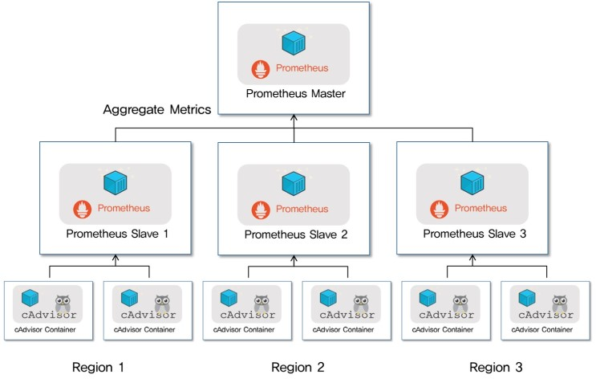
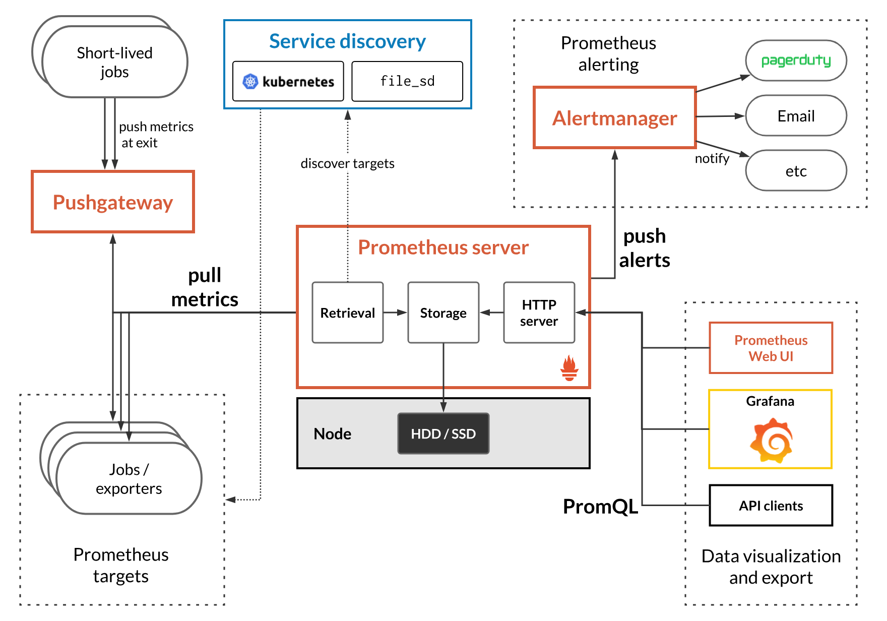

# 프로메테우스란?

- 오픈 소스 기반의 모니터링 솔루션
- 공식적으로 제공하는 exporter 뿐 아니라 여러 Third-party exporter를 통하여 다양한 플랫폼을 모니터링 할 수 있음
- 모니터링 대상이 되는 metric 를 pull 방식으로 수집함


## 프로메테우스의 특징

- 고차원 데이터 모델을 구현, 시계열은 메트릭 이름과 key-value 쌍으로 식별됨
- PromQL을 통한 강력한 쿼리
- 뛰어난 데이터 시각화(with Grafana)
- custom format을 통해 효율적인 데이터 저장
- 각 서버는 안정성을 위해 독립적이며 로컬 저장소에만 의존
- 정확한 alert
- 많은 클라이언트 라이브러리들
- pull 방식의 데이터 수집(push 방식도 가능)
- 쿠버네틱스의 메인 모니터링 시스템으로 사용되면서 요즘 주목을 받고 있다.


### metric 수집 방법

> metric 수집방법은 pull 방식, push 방식이 존재한다.


#### pull 방식 ( 프로메테우스의 방식 )

> 서버에 클라이언트가 떠있으면 서버가 주기적으로 클라이언트에 접속해서 데이터를 가져오는 방식

- 장점
  - 데이터의 정확성 : pull base 방식의 경우 메트릭이 발생하는 port를 항상 listening 상태로 유지해 직접 접근이 가능하기 때문에 데이터의 정확성 높다 ( push 방식의 경우 메트릭을 보낼 때만 임시적으로 수집서버와 연결)
  - 데이터의 양 : pull base의 경우 서버엥서 targets를 지정해 메트릭을 수집하기 때문에 문제가 없지만, push base의 경우 지정된 서버 외에서도 메트릭을 보낼 수 있다. whitelist와 같은 방법으로 제한할 수는 있지만, 해당 기능을 지원하지 않는 것이 대부분이다.
  - 보안 측면 : push 기반에서는 메트릭을 전송할 때 client 서버에서 TLS를 통해 연결하고 메트릭을 전송하는 일은 복잡하고 쉽지 않지만, pull 의 경우 HTTP로 안전하게 메트릭을 수집할 수 있다.
    서버접속 허용을 위해 자격증명, 방화벽 설정 필요




- 단점
  - 위의 그림처럼, 각 Region에 프로메테우스르 배치한 뒤, 이를 Master에 Aggregate하는 방식이 프로메테우스가 공식적으로 권장하는 다중화 방식으로, 즉 clustering과는 거리가 멀다.
  - 싱글 호스트 아키텍처이기 때문에 저장용량이 부족하면, 디스크용량을 늘리는 것 밖에 방법이 없다.
  - 프로메테우스 서버가 다운되거나, 설정 변경 등을 위해서 재시작을 할 경우 그간의 metric은 유실됨
  - 일정 풀링 주기를 기반으로 metric을 가져오기 떄문에 풀링하는 순간 스냅샷 정보만 알 수 있따. 스냅샷의 연속된 모음이기 때문에 실제로는 근사값 형태


#### push 방식

> 각 서버에 클라이언트를 설치하고, 이 클라이언트가 메트릭 데이터를 수집해 서버로 보내면, 서버가 모니터링 상태를 보여주는 방식

- 이벤트 생성 빈도가 초당 수천, 수만건으로 높은 방식에 유리(로그 시스템등)
  - Elasticsearch, Logstash, Kibana(이하 ELK스택), InfluxDB 등에서 사용
- 각 타겟 서버에서 부하가 걸릴 경우 push 방식은 fail point가 될 가능성이 있음
- 데이터 저장소가 시계열 데이터 저장소로 구성되어 있어, 많은 양의 정보를 빠르게 검색하는게 가능함.
  최소한의 설정(서버주소, 수집주기 등)으로 에이전트 구동 ( 대규모 모니터링 환경에 적합 )


- 프로메테우스는 Pull 기반의 모니터링 시스템이지만, 푸시에서 풀 방식으로 변환하는 게이트웨이를 사용하여 푸시 형태 메트릭을 수집하는 방법을 제공하고 있음


## 프로메테우스의 전체 구조



### Prometheus

- Retrival
  - 메트릭을 수집할 대상에 접근해서 (HTTP) 메트릭을 가져오거나, pushgateway를 통해서 접근할 수 없는 곳에 있는 데이터(inner server, firewall 내부의 metric 등)을 가져오는 역할
- TSDB (Time Series Database)
  - 가져온 데이터를 시간에 흐름에 따라 조회할 수 있어야 하므로, 시계열 데이터(time-series)를 저장할 수 있는 저장소가 prometheus에 구현되어있음
  - Local Storage(default) 와 Remote Storage 를 사용할 수 있음
  - key, value 형태의 저장소이다.
- PromQL
  - TSDB에 저장되어있는 데이터는 PromQL을 통한 쿼리문으로 조회가 가능하고, Prometheus가 자체적으로 제공하는 webUI에서 데이터 및 그래프 형태로 볼 수 있다.
  - 하지만, 시각화의 경우 Grafana 에서 하는 것을 권장하고 있다.

### Exporters

- exporter는 Prometheus 가 pull 방식으로 데이터를 수집할 수 있도록 메트릭을 노출하는 agent 입니다.
- exporter가 서버들로부터 메트릭을 수집해 /metrics HTTP endpoint를 제공합니다.( 이를 통해 prometheus 는 exporter가 열어놓은 HTTP endpoint로 Get 요청을 날려 메트릭을 수집)
- 즉, 우리가 모니터링을 할 서버에 exporter가 설치되어있어야함


### AlertManager

- Prometheus가 제공하는 Alertmanager를 통해 각 모든 지표마다 조건을 걸고 다양한 채널로 Alert를 보낼수 있다.

- 특징
  - Grouping : 알림을 그룹으로 묶어서 하나의 알림으로 보낼 수 있다. 클러스터의 다수 서버에서 장애가 생겼을 경우 그룹을 묶어주면 알림을 여러 개 받지 않고 하나의 알림만 받을 수 있다.
  - Inhibition : 특정 알림이 이미 발생한 경우 다른 알림을 중단할 수 있다. 예를 들어 서버나 클러스터 자체에 장애가 생기면 수많은 알림이 발생할 수 있는데 여기에 조건을 주어 다른 알림을 보내지 않도록 설정할 수 있다.
  - Silences : matcher로 조건을 주어서 조건에 맞는 경우 일정 시간 동안 알림을 멈출 수 있다.
  - HA 구성 : 알림 매니저의 클러스터를 만들어 하나의 알람 매니저가 다운되더라도 서비스를 계속 운영할 수 있다.

### pushgateway

- 프로메테우스는 기본적으로 pull 방식이지만, push 할 수 있도록 만들 수도 있음. 이 기능을 지원하는 것이 pushgateway
- pushgateway은 매트릭을 푸시할 수 있도록 지원하며, 푸시된 매트릭을 프로메테우스에서 가져갈 수 있도록 중개자 역할을 수행
  - 프로메테우스는 pushgateway에 푸시된 매트릭을 프로메테우스에 가져갈 수 있음


- 프로메테우스는 메트릭을 수집하기 위해서 프로메테우스가 수집해야할 설정파일에 매트릭 수집을 위한 주소를 넣어야함.
  - 하지만, 모든 인스턴스가 외부 인터넷망을 통해 접근할 수 있는 공인 IP를 할당하지는 않음
  - 보통, 클라우드를 통해 애플리케이션을 운영하는 경우에도 외부로 나가는 트래픽은 허용하지만 외부에서 내부로 들어오는 트래픽은 특정 IP 대역에서만 접근할 수 있도록 보안 규칙을 설정

### service discovery

- Service discovery는 prometheus가 메트릭을 수집할 대상을 동적으로 설정하는 것을 가능하게 해줌
- 이를 통해 오토 스케일링되는 EC2 instance나 Kubernetes pods으로 부터 메트릭수집 가능

### grafana

- Prometheus가 수집한 데이터를 시각화 해주는 역할을 담당한다.
- 하나하나 설정하기 너무 힘들기 떄문에 https://grafana.com/grafana/dashboards/ 에 가면 사람들이 만들어놓은 템플릿을 가져올 수 있다.
- import 방법 : https://grafana.com/docs/grafana/v7.5/dashboards/export-import/ 


# Metric의 구성

> 프로메테우스의 수집 데이터 형태

- Prometheus는 모든 데이터를 시계열로 저장하고, 모든 시계열 데이터는 고유한 메트릭명과 옵셔널하게 들어갈 수 있는 key-value 쌍의 라벨로 구분됨

```shell
# 메트릭명{라벨명=값, 라벨명=값} 샘플링데이터

# TYPE node_time_clocksource_available_info gauge
node_time_clocksource_available_info{clocksource="acpi_pm",device="0"} 1
node_time_clocksource_available_info{clocksource="hyperv_clocksource_tsc_page",device="0"} 1

# TYPE node_time_seconds gauge
node_time_seconds 1.6405891462634637e+09
```

## metric type

> 4가지 메트릭 타입 존재

- counter : 증가하거나 0으로만 리셋가능(ex. total request count)
- gauge : 증감 혹은 특정 값으로 설정 가능( ex. number of running processes)
- histogram : 특정 범위(bucket) 내에서 값의 빈도수를 표현 (ex. request duration)
- summary : histogram 과 유사, 사분위수를 나타냄( ex. request duration )

