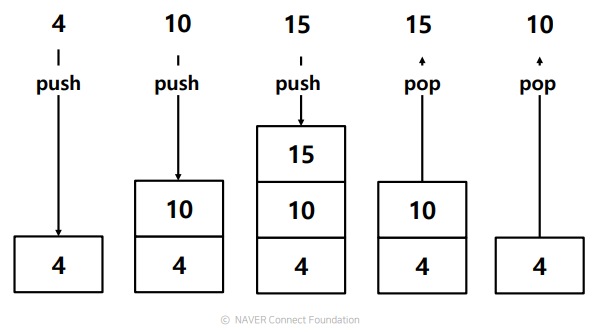
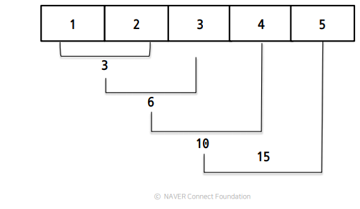

# 📌 Life is short, you need python

------

## 📄 Python data structure

### ✏️ Stack

**LIFO(Last In First Out)** 구조이며, 데이터의 입력을 **push**, 출력을 **pop** 이라고 한다. 파이썬에서는 list를 이용하여 구현 가능하다.



```python
>>> a = [1,2,3,4,5]
>>> a.append(10) # push
>>> a.append(20) # push
>>> a.pop() # pop
20
>>> a.pop() # pop
10 
```

- 정리
  - 나중에 넣은 데이터를 먼저 반환하도록 설계된 메모리 구조
  - Last In First Out (LIFO)
  - Data의 입력을 Push, 출력을 Pop이라고 함
  - 리스트를 사용하여 스택 구조를 구현 가능
  - push를 append(), pop을 pop()를 사용


### ✏️ Queue

**FIFO(First In First Out)** 구조이며, 데이터의 입력을 **enqueue**, 출력을 **dequeue** 라고 한다. 파이썬에서는 list를 이용하여 구현가능하다. 하지만 [collections.deque](https://velog.io/@kgh732/부스트캠프-AI-Tech-U-stage.-1-3#️-collectionsdeque) 를 활용하여 구현하는 것이 효율적이다.

```python
>>> a = [1,2,3,4,5]
>>> a.append(10) # enqueue
>>> a.append(20) # enqueue
>>> a.pop(0) # dequeue
1
>>> a.pop(0) # dequeue
2
>>>
```

- 정리
  - 먼저 넣은 데이터를 먼저 반환하도록 설계된 메모리 구조
  - First In First Out (FIFO)
  - Stack과 반대되는 개념
  - 파이썬은 리스트를 사용하여 큐 구조를 활용(collections.deque를 사용하는게 더 효율적)
  - put를 append(), get을 pop(0)를 사용


### ✏️ Tuple

**값의 변경이 불가능한 리스트** 로 프로그램을 작동되는 동안 변경되지 않을 데이터, 또는 실수로 사용자의 실수에 의한 에러를 사전에 방지하기 위해 사용된다. 튜플은 **값 변경을 제외한** 리스트의 연산, 인덱싱, 슬라이싱 등을 동일하게 사용할 수 있다.

```python
>>> t=(1,2,3)
>>> t[1]
2
>>> t[0:2]
(1,2)
>>> t[1]=5 # Error 
Traceback (most recent call last):
File "<stdin>", line 1, in <module>
TypeError: 'tuple' object does not support item assignment
```

만약 하나의 원소를 갖는 튜플을 선언하고 싶다면 `,` 를 붙여 선언해야 한다.

```python
>>> t=(1) # 일반정수로 인식
1
>>> t=(1,) # Tuple
(1,)
```

### ✏️ Set

**값을 순서없이 저장, 중복 없는 자료형** 으로 수학에서 활용되는 다양한 집합연산이 가능하다.

```python
>>> s = set([1,2,3,1,2,3]) # set 함수를 사용 1,2,3을 집합 객체 생성 , a = {1,2,3,4,5} 도 가능
>>> s
{1, 2, 3}
>>> s.add(1) # 한 원소 1만 추가, 추가, 중복불허로 추가 되지 않음
>>> s
{1, 2, 3}
>>> s.remove(1) # 1 삭제 - 만약 없을시 keyError에러발생
>>> s
{2, 3}
>>> s.update([1,4,5,6,7]) # [1,4,5,6,7] 추가
>>> s
{1, 2, 3, 4, 5, 6, 7}
>>> s.discard(3) # 3 삭제 - 없어도 remove와 다르게 keyError 안남
>>> s
{1, 2, 4, 5, 6, 7}
>>> s.clear() # 모든 원소 삭제
>>> s1 = set([1,2,3,4,5])
>>> s2 = set([3,4,5,6,7])
>>> s1.union(s2) # s1 과 s2의 합집합
{1, 2, 3, 4, 5, 6, 7}
>>> s1 | s2 # set([1, 2, 3, 4, 5, 6, 7])
{1, 2, 3, 4, 5, 6, 7}
>>> s1.intersection(s2) # s1 과 s2의 교집합
{3, 4, 5}
>>> s1 & s2 # set([3, 4, 5])
{3, 4, 5}
>>> s1.difference(s2) # s1 과 s2의 차집합
{1, 2}
>>> s1 - s2 # set([1, 2])
{1, 2}
```

### ✏️ Dict

데이터를 저장할 때 구분 지을수 있는 **key** 와 이에 대응되는 **value** 를 저장할수 있는 자료구조이다. 다른 언어에서는 Hash Table 이라는 용어를 사용한다.

```python
>>> country_code = {} # Dict 생성, country_code = dict() 도 가능
>>> country_code = {＂America＂: 1, ＂Korea＂: 82, ＂China＂: 86, ＂Japan＂: 81}
>>> country_code
{＇America＇: 1, ＇China＇: 86, ＇Korea＇: 82, ＇Japan＇: 81}
>>> country_code.items() # Dict 데이터 출력
Dict_items([(＇America＇, 1), (＇China＇, 86), (＇Korea＇, 82), (＇Japan＇, 81)])
>>> country_code.keys() # Dict 키 값만 출력
Dict_keys(["America", "China", "Korea", "Japan"])
>>> country_code["German"]= 49 # Dict 추가
>>> country_code
{'America': 1, 'German': 49, 'China': 86, 'Korea': 82, 'Japan': 81}
>>> country_code.values() # Dict Value만 출력
dict_values([1, 49, 86, 82, 81])
```

### ✏️ collections.deque

**Deque(Double ended queue)** 는 양방향에서 데이터를 처리할 수 있는 queue형 자료구조를 의미한다. 다음 그림은 deque의 구조를 나타낸 그림이다.


**stack 과 queue** 를 지원하는 모듈로 list에 비해 효율적인 저장방식을 지원한다. 또한 기존 list의 함수를 모두 지원하며, `rotate` 등 linked list의 특성을 지원한다.

| 함수                 | 기능                                                         |
| -------------------- | ------------------------------------------------------------ |
| append(x)            | 마지막에 x 삽입                                              |
| appendleft(x)        | 앞쪽에 x 삽입                                                |
| extend(iterable)     | 마지막에 iterable 객체 연결                                  |
| extendleft(iterable) | 앞쪽에 iterable 객체 연결                                    |
| pop()                | 마지막 원소 제거                                             |
| popleft()            | 앞쪽 원소 제거                                               |
| rotate(n)            | n 만큼 요소들 회전 - 한칸씩 오른쪽으로 밀어내기(넘어간 자료는 맨 처음으로) |

### ✏️ collections.OrderedDict

기존의 dict는 입력한 순서를 보장하지 못하여 **입력한 순서를 보장해주는 OrderedDict** 모듈이 있지만 **파이썬 3.6 버전 부터는** 입력한순서를 보장하여 출력한다.

### ✏️ collections.defaultdict

기존의 dict 는 **key 값이 정해지지 않았을 경우 `KeyError`를 일으키는데, key 값이 아직 정해지지 않은 상황에서 default 값을 설정하여 `KeyError`를 막을 수 있다.**

```python
from collections import defaultdict
d=defaultdict(lambda : 0) # default 값을 0으로 설정. 
print(d['first']) # 0
print(d['아무거나']) # 0
```

### ✏️ collections.Counter

Sequence type, dict type, keyword parameter 등 data element 들의 갯수를 dict 형태로 반환해준다. 또한 Set의 연산들을 지원한다.

```python
c=Counter(a=4,b=2,c=3,d=-2)
d=Counter(a=1,b=2,c=3,d=4)

# 같은 연산이지만 다른 결과 
print(f'c-d :{c-d}') #  음수값,0은 무시한다
c.subtract(d) # 음수값도 저장한다
print(f'c.subtract(d) : {c}')
Counter({'o': 2, 'B': 1, 's': 1, 't': 1, 'c': 1, 'a': 1, 'm': 1, 'p': 1})
Counter({'Boost': 1, 'camp': 1})
Counter({'Boost': 1, 'camp': 1})
c=Counter(a=4,b=2,c=-3,d=-2)
d=Counter(a=1,b=2,c=-5,d=2)
print(f'c | d :{c | d}') #  음수값,0 은 무시한다
print(f'c + d :{c + d}') #  음수값,0은 무시한다
print(f'c & d :{c & d}') #  음수값,0은 무시한다
c-d :Counter({'a': 3})
c.subtract(d) : Counter({'a': 3, 'b': 0, 'c': 0, 'd': -6})
c | d :Counter({'a': 4, 'b': 2, 'd': 2})
c + d :Counter({'a': 5, 'b': 4})
c & d :Counter({'b': 2, 'a': 1})
```

### ✏️ collections.namedtuple

튜플형태로 **데이터 구조체** 저장을 지원하고 저장되는 data의 variable을 사전에 지정한다.

```python
from collections import namedtuple
Point=namedtuple('Point',['x','y'])
p=Point(11,22) # (x=11, y=22)
print(f'x={p[0]} , y={p[1]}') # x=11,y=22
```

------

## 📄 Pythonic code

**파이썬 특유의 문법** 을 활용하여 효율적으로 코드를 표현하는 방법이다.

### ✏️ Split & Join

**split() : 문자열 -> 리스트**

```python
colors=['red','blue','green']
result=''
for s in color:
    result+=s
    
print(result) #redbluegreen

###############################
colors=['red','blue','green']
result=''.join(colors)
print(result) #redbluegreen
```

**join() : 리스트 -> 문자열**

```python
colors='red blue green'
print(colors.split()) # ['red','blue','green']

example = 'python,java,javascript' # 
print(example.split(",")) # ","을 기준으로 문자열 나누기,['python','java','javascript']
```

### ✏️ List comprehension

파이썬에서 가장 많이 사용되는 기법중 하나로 **for+append 보다 속도가 빠르다.**

```python
>>> case_1 = ["A","B","C"]
>>> case_2 = ["D","E","A"]
['AD', 'AE', 'AA', 'BD', 'BE', 'BA', 'CD', 'CE', 'CA']
>>> result = [i+j for i in case_1 for j in case_2]
>>> result
['AD', 'AE', 'AA', 'BD', 'BE', 'BA', 'CD', 'CE', 'CA']
>>> result = [ [i+j for i in case_1] for j in case_2] # 2차원
"""
for j in case_2 : 
    for i in case_1:
""" 
>>> result
[['AD', 'BD', 'CD'], ['AE', 'BE', 'CE'], ['AA', 'BA', 'CA']]
```

### ✏️ Enumerate & Zip

**enumerate() : Iterable 객체(대표적으로 list, dict, set, str, bytes, tuple, range)의 element를 추출할때 인덱스를 붙여서 추출**

```python
>>> for index,element in enumerate(['a','b','c']):
    	print(i,v)
    
0 a
1 b
2 c
```

**zip() : 길이가 같은 iterable 객체의 값을 병렬적으로 추출**

```python
>>> for a,b,c in zip([1,2,3],[4,5,6],[7,8,9]):
    	print(a,b,c)
1 4 7
2 5 8
3 6 9
    
```

### ✏️ Lambda & Map & Reduce

**lambda : 함수 이름 없이, 함수처럼 쓸 수 있는 익명함수** 로 python3 부터는 권장하지는 않으나 여전히 많이 쓰인다.

> - 이유
>   - 가독성이 떨어짐
>   - 테스트 어려움

```python
>>> f=lambda x,y : x+y
>>> f(1,4) 
5
```

**map() :** 입력받은 자료형의 각 요소가 함수에 의해 수행된 결과를 묶어서 **map iterator** 객체를 반환한다. 보통 iterator객체들은 **lazy evaluation(게으른 연산)** 을 하는데 필요할 때만 데이터를 가져다 사용하기 때문에 메모리를 크게 절약할 수 있다.

```python
>> data=[1,2,3]
>> result=map(lambda x:x**2,data)
>> next(result) # 1
1
>> next(result) # 4
4
>> next(result) # 9
9
>> next(result) # StopIteration
```

**reduce() : map 과는 달리 타겟에 함수를 누적적용해서 통합한 결과를 반환한다.**

> - 코드의 직관성이 떨어져서 권장x
> - 대용량 데이터를 다룰 때 유용할 수 있음



- lambda 쓸 때 
  - 앞에 인자가 이전까지의 합
  - 뒤에 인자가 더할 요소
- 맨 뒤에 result 초기값을 설정해 줄 수 있음(안하면 0)
```python
>> from functools import reduce
>> reduce(lambda result,y : result+y ,[1,2,3,4,5], 0) # 15
15
```

### ✏️ Iterator

**Iterable 객체 를 `iter()` 메소드로 iterator객체로 만들수 있으며, `next() `메소드를 통해 순차적 호출이 가능하며, 마지막 데이터 이후 next() 호출시 `StopIteration Error` 가 발생한다. 한 예로, for 문의 경우 파이썬에서는 임시로 list를 iterator로 반환해서 사용한다.**

```python
>>> iterable='iterable'
>>> iterator=iter(iterable)
>>> next(iterator) # i
i
>>> next(iterator) # t
t
>>> next(iterator) # e
e
>>> next(iterator) # r
r
>>> next(iterator) # a
a
>>> next(iterator) # b
b
>>> next(iterator) # l
l
>>> next(iterator) # e
e
>>> next(iterator) # StopIteration Error
```

### ✏️ Generator

**`yield`를 통해 iterator 를 생성하며, element가 사용되는 시점에 메모리를 반환한다.** 따라서 **큰 데이터를 처리하거나, 중간과정에서 loop 가 중단 될 수 있을때 사용한다면 많은 이점이 있다.** 그리고 list comprehension과 유사한 형태로 **generator comprehension** 이 존재한다. 차이점은 `[]` 대신 `()`를 사용하여 표현한다.

- 정리
  - iterable object를 특수한 형태로 사용해주는 함수
  - element가 사용되는 시점에 값을 메모리에 반환
    : yield를 사용해 한번에 하나의 element만 반환함
  - list comprehension과 유사한 형태로 generator형태의 list 생성
  - generator expression이라는 이름으로도 부름
  - [] 대신 ()를 사용하여 표현
  - 일반적인 iterator는 generator에 반해 훨씬 큰 메모리 용량 사용
  - 언제 사용하게 되는가?
    - list 타입의 데이터를 반환해주는 함수는 generator로 만들어라!
      : 읽기 쉬운 장점, 중간 과정에서 loop 이 중단될 수 있을 때!
    - 큰 데이터를 처리할 때는 generator expression을 고려하라!
      : 데이터가 커도 처리의 어려움이 없음
    - 파일 데이터를 처리할 때도 generator를 쓰자

```python
>>> def general_list(value): # 일반적인 리스트 선언
        result = []
        for i in range(value):
            result.append(i)
        return result
    
##########################
>>> def generator_list(value): # Generate를 사용한 리스트 선언
        result = []
        for i in range(value):
            yield i # yield를 사용한 iterator 생성


>>> for i in generator_list(4):
    	print(i) 
0
1
2
3

##########################
>>> generator=(i for i in range(4))
>>> for i in generator_list(4):
    	print(i) 
0
1
2
3
    
```


### ✏️ Asterisk

파이썬에서는 `*` 가 여러 용도로 사용되는데 다음과 같다.

1. **곱셈연산**

```python
    mul=2*2
```

2. **제곱연산**

```python
    square=2**2
```

3. **Variable Argument**(가변인자)

- 개수가 정해지지 않은 변수를 함수의 parameter로 사용하는 법
- Keyword arguments와 함께, argument 추가가 가능
- Asterisk(*) 기호를 사용하여 함수의 parameter를 표시함
- 입력된 값은 tuple type으로 사용할 수 있음
- 가변인자는 `오직 한 개만 맨 마지막 parameter 위치에 사용가능`
- 가변인자는 일반적으로 *args를 변수명으로 사용
- 기존 parameter 이후에 나오는 값을 `tuple로 저장`함

```python
>>> def asterisk_args(a,b,*args):
	print(a,b,args)
>>> asterisk_args(1,2,3,4,5)
1,2,(3,4,5)

>>> def asterisk_args2(*args,a,b):
	print(args,a,b)

>>> asterisk_args2(1,2,3,4,5,6) # Type Error , 가변인자는 맨 마지막 parameter, 오직 한개만 사용가능
```

4. **Keyword variable Argument**(키워드 가변인자)

- Parameter 이름을 따로 지정하지 않고 입력하는 방법

- asterisk(*) 두개를 사용하여 함수의 parameter를 표시함
- 입력된 값은 dict type으로 사용할 수 있음
- 가변인자는 오직 한 개만 기존 가변인자 다음에 사용

```python
>>> def asterisk_kwargs(a,b,*args,**kwargs): # Variable argument 와 Keyword variable argument 혼용가능.
    	print(a,b,args)
        print(kwargs)
        
>>> asterisk_kwargs(1,2,3,4,5,first=6,second=4)
1 2 (3, 4, 5)
{'first': 6, 'second': 4}
```

5. **Unpacking**

Iterable 객체에 들어가 있는 값을 **unpacking** 한다.

```python
>>> data = ([1, 2], [3, 4], [5, 6]) # 튜풀 unpacking
>>> print(*data)
[1,2],[3,4],[5,6]

>>> for data in zip(*([1, 2], [3, 4], [5, 6])): # zip 언패킹
	print(data)
(1,3,5)
(2,4,6)

>>> def asterisk_test(b, c, d,):
	print(b, c, d)
>>> data = {"b":1 , "c":2, "d":3} 
>>> asterisk_test(**data) # dict 언패킹 - b=1, c=2, d=3 로 실제로 작동
1 2 3
```