# 1. 변수와 식별자

## 1.1 식별자

- 식별자
  - 식별자(identifier)는 변수를 구분할 수 있는 변수명을 말함
  - 식별자는 반드시 문자, 달러($), 또는 밑줄(_) 로 시작
  - 대소문자를 구분하며, 클래스명 외에는 모두 소문자로 시작
  - 예약어 사용 불가능 ( for, if, case 등등)
- 작성 스타일
  - 카멜 케이스(camelCase, lower-camel-case)
    - 두번쨰 단어의 첫글자부터 대문자
    - 변수, 객체, 함수에 사용
  - 파스칼 케이스(PascalCase, upper-camel-case)
    - 모든 글자의 첫번쨰 글자를 대문자로 작성
    - 클래스, 생성자에 사용
  - 대문자 스네이크 케이스(SNAKE_CASE)
    - 상수(constants)에 사용
      - 상수 : 개발자의 의도와 상관없이 변경될 가능성이 없는 값을 말함


## 1.2 변수 선언

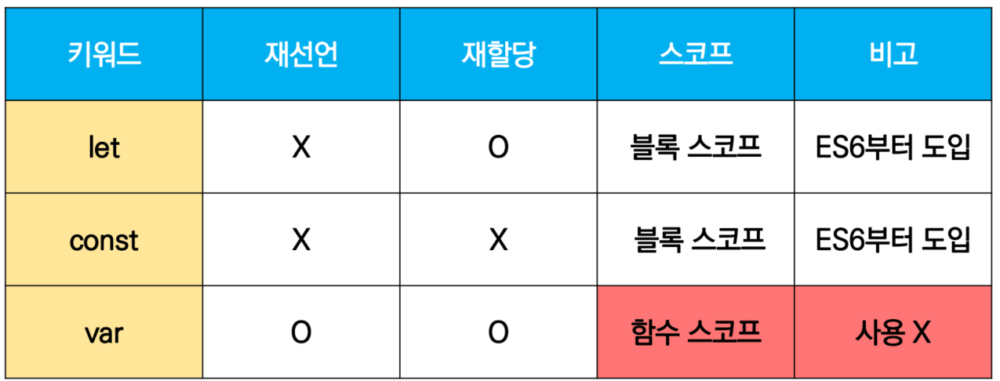


### 블록 스코프(block scope)

- if, for, 함수 등의 중괄호 내부를 가리킴
- 블록 스코프를 가지는 변수는 블록 바깥에서 접근 불가능


### 함수 스코프(function scope)

- 함수의 중괄호 내부를 가리킴
- 함수 스코프를 가지는 변수는 함수 바깥에서 접근 불가능
- 호이스팅(hoisting)
  - 변수를 선언 이전에 참조할 수 있는 현상
  - 변수 선언 이전의 위치에서 접근시 undefined를 반환


## 1.2 데이터 타입 종류

- 자바스크립트의 모든 값을 특정한 데이터 타입을 가짐

- 크게 원시타입(Primitive type) 과 참조 타입(Reference type)으로 분류됨

  - 원시타입(Primitive type) 
    - 객체(Object)가 아닌 기본 타입들을 말함
    - 변수에 해당 타입의 값이 담김
    - 다른 변수에 복사할 때 실제 값이 복사 됨
  - 참조 타입(Reference type)
    - 객체(object) 타입의 자료형을 말함
    - 변수에 해당 객체의 참조 값이 담김
    - 다른 변수에 복사할 때 참조 값이 복사 됨

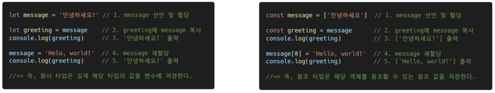

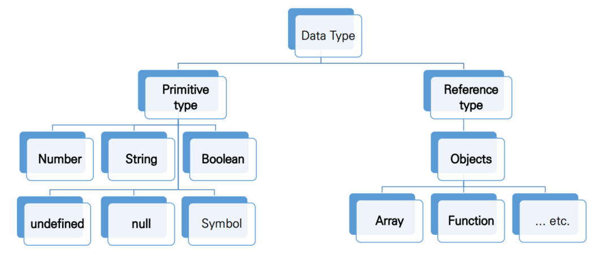


### 원시 타입 - 숫자(Number) 타입

- 정수, 실수 구분 없는 하나의 숫자 타입
- 부동소수점 형식을 따름
- NaN(Not-A-Number)
  - 계산 불가능한 경우 반환되는 값
  - ex) `Angel` / 1004 => NaN


### 원시타입 - 문자열(String) 타입

- 텍스트 데이터를 나타내는 타입
- 16비트 유니코드 문자의 집합
- 작은 따옴표, 큰 따옴표 모두 가능
- **템플릿 리터럴(Template Literal)**
  - ES6부터 지원
  - 따옴표 대신 backtick(``)으로 표현
  - `${ expression } 형태로 표현식 삽입 가능


### 원시타입 - undefined / null

- undefined
  - 변수의 값이 없을 나태는 데이터 타입
  - **변수 선언 시 아무 값도 할당하지 않으면 자바스크립트가 자동적으로 할당**
  - typeof 연산자의 결과는 undefined
- null
  - 빈 값을 표현하기 위한 데이터 타입
  - **개발자가 의도적으로 필요에 의해 할당**
  - typeof 연산자의 결과는 object


### 원시타입 - 불리언

- 논리적 참 거짓을 나타내는 타입
- true / false로 표현
- 조건문 또는 반복문에서 유용하게 사용

- 자동형변환 정리

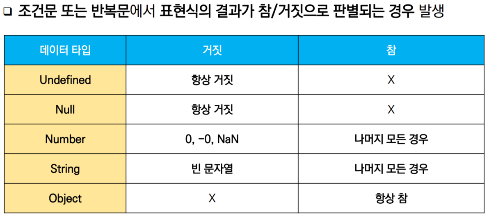


# 2. 연산자

## 2.1 할당연산자
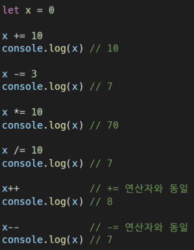


## 2.2 비교연산자

- 피연산자들(숫자, 문자, Boolean 등) 비교하고 비교의 결과값을 불리언으로 반환하는 연산자
- 문자열은 유니코드 값을 사용하며 표준 사전순서를 기반으로 비교
  - 알파벳끼리 비교하는 경우
    - 알파벳 오름차순으로 우선순위를 지님
    - 소문자가 대문자보다 우선순위를 지님


## 2.3 동등 비교 연산자( == )

- 두 피연산자가 같은 값으로 평가되는지 비교 후 불리언 값을 반환

- 비교할 때 암묵적 타입변환을 통해 타입을 일치시킨 후 같은 값인지 비교

- 두 피연산자가 모두 객체일 경우 메모리의 같은 객체를 바라보는지 판별

- **예상치 못한 결과가 발생할 수 있으므로 특별한 경우를 제외하고는 사용하지 않음**

  - `null`와 `undefined`가치 모두 잡기 

    ```js
    if ( someObjectOrPrimitive == null ) { 
        // null을 확인하면 객체와 기본 요소에 대해 null과 undefined를 모두 포착 하지만 // 0 또는 빈 문자열 과 같은 다른 잘못된 값은 포착하지 않습니다 . 
    }   
    ```


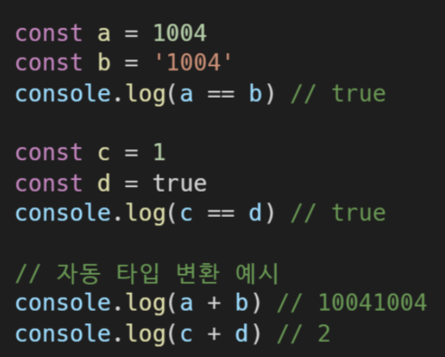


## 2.4 일치 비교 연산자( === )

- 두 연산자가 같은 값으로 평가되는지 비교후 불리언 값을 변환
- 엄격한 비교가 이뤄지며 암묵적 타입 변환이 발생하지 않음
  - 엄격한 비교 : 두 비교 대상의 타입과 값이 모두 같은지 비교하는 방식
- 두 피연산자가 모두 객체일 경우 메모리의 같은 객체를 바라보는지 판별


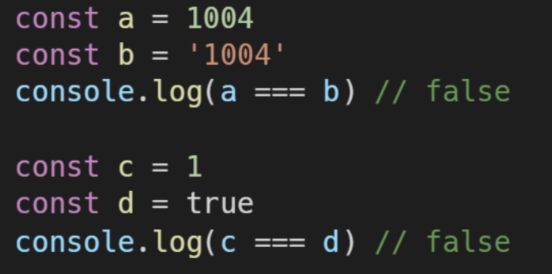


## 2.5 논리 연산자

- 세가지 논리 연산자로 구성
  - `&&` : and 연산
  - `||` : or 연산
  - `!` : not 연산
- 단축 평가 지원
  - false && true - > false
  - true || false -> true


## 2.6 삼항 연산자(Ternary Operator)

- 3개의 피연산자를 사용하여 조건에 따라 값을 반환하는 연산자
- 가장 왼쪽에 조건이 참이면 콜론(:) 앞의 값을 사용하고, 그렇지 않으면 콜론(:) 뒤의 값을 사용
- 삼항 연산자의 결과는 변수에 할당 가능

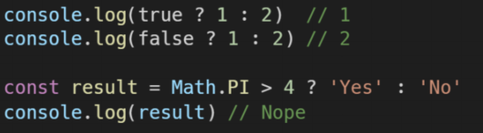


# 3. 조건문, 반복문
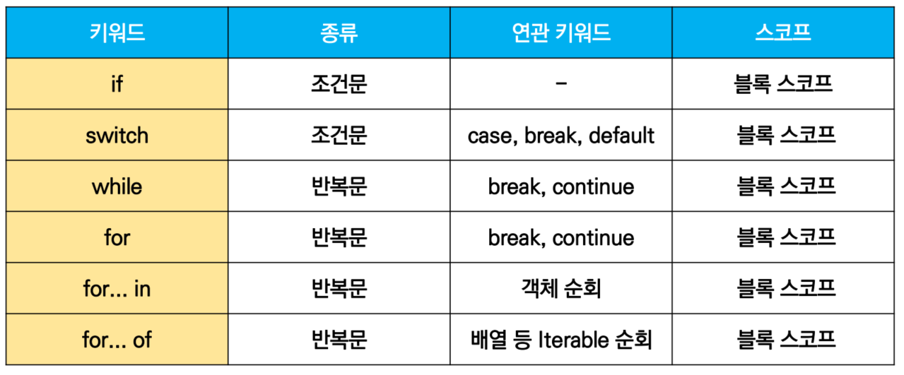


## 3.1 조건문

### if

- `if, else if, else`
- 조건은 소괄호(condition) 안에 작성
- 실행할 코드는 중괄호`{}` 안에 작성
- 블록 스코프 생성

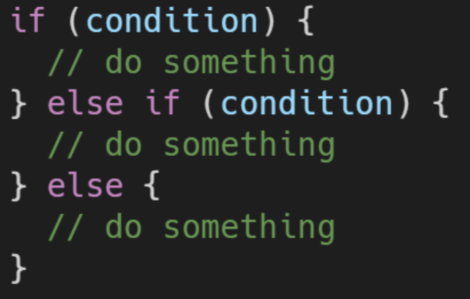

### switch

- 표현식(expression) 의 결과값을 이용한 조건문
- 표현시의 결과값을 case문의 오른쪽 값을 비교
- break 및 default문은 선택적으로 사용 가능
- break문이 없는 경우 break문을 만나거나 default문을  실행할 떄까지 다음 조건문 실행
- 블록 스코프 생성

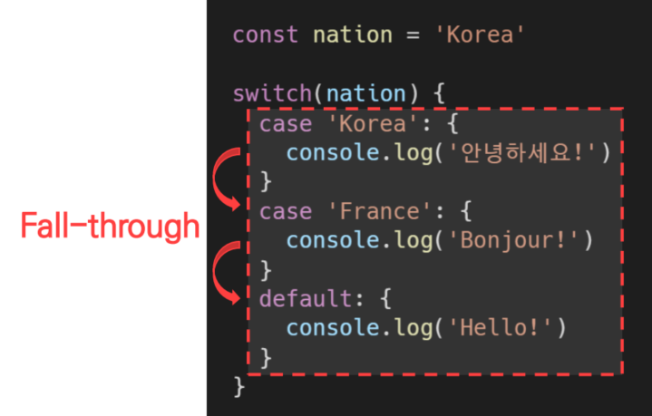

## 3.2 반복문

- while
- for
- for ... in
  - 주로 **객체(object)의 속성들을 순회**할 떄 사용
  - 배열도 순회 가능하지만, 인덱스 순으로 순회한다는 보장이 없으므로 권장하지 않음
- for ... of
  - 반복 가능한(iterable) 객체를 순회하며 값을 꺼낼 때 사용
  - 반복 가능한(iterable) 객체의 종류 : Array, Map, Set, String 등

### while

- 조건문이 참(true)인 동안 반복 시행
- 조건은 소괄호(condition) 안에 작성
- 실행할 코드는 중괄호`{}` dksdp wkrtjd
- 블록 스코프 생성


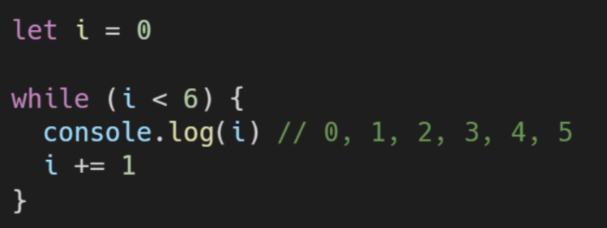


### for

- 세미콜론으로 구분되는 3 부분으로 구성
  - initialization
    - 최초 반복문 진입시 1회만 실행되는 부분
  - condition
    - 매 반복 시행 전 평가되는 부분
  - expression
    - 매 반복 이후 평가되는 부분
- 블록 스코프 생성


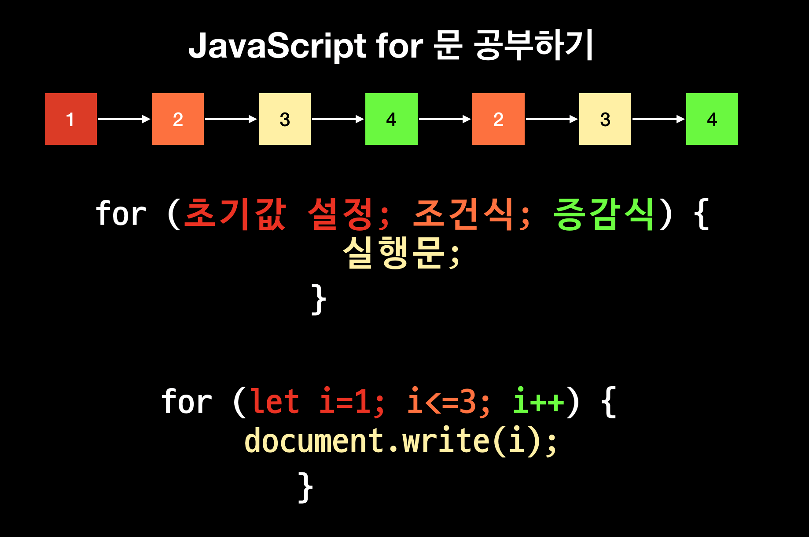


### for ... in

- 객체(object)의 속성들을 순회할 때 사용
- 배열도 순회 가능하지만 권장하지 않음
- 실행할 코드는 중괄호 안에 작성
- 블록 스코프 생성
- enumerable 이 true 일 때만 


```js
let myString = ["t","e","s","t"] // "test" 로 바꿔서 해도 결과는 같음

for (let i in myString){
    console.log(i) // 0 ,1, 2, 3이 찍힘 - 주의
}
// t e s t 가 출력되기 위해서는 밑의 for of 를 사용해야함
```


### for ... of

- 반복가능한(iterable) 객체를 순회하며 값을 꺼낼 때 사용
- 실행할 코드는 중괄호 안에 작성
- 블록 스코프 생성


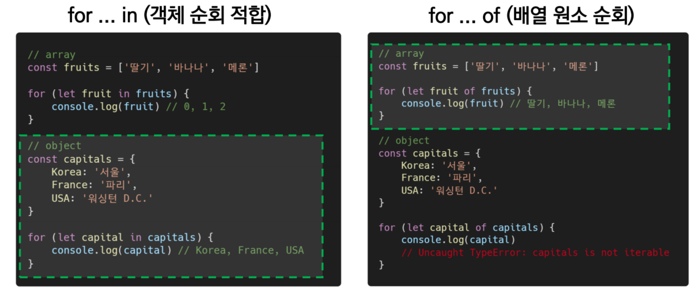


# 4. 함수

## 4.1 선언식

- 함수의 이름을 선언

```js
function isValid(password) {
	return password.length >= 8
}

isValid("password")
```


## 4.2 표현식(expression)

- 표현식 내에서 함수를 정의하는 방식
  - 표현식 : 어떤 하나의 값으로 결정되는 코드의 단위
- 이름이 없는 함수를 익명함수(anonymous function)라고 명명
- 익명함수는 함수 표현식에서만 가능함

```js
const sub = function (num1, num2){
    return num1 - num2
}
sub(7,2)
```


## 4.3 기본인자

- 인자 작성 시 `=` 문자 뒤 기본 인자 선언 가능

```js
const greeting = function (nmae = 'noName'){
    console.log(`hi ${name}`)
}
greeting
```


## 4.4 함수의 타입

- 함수도 하나의 값으로 평가됨

- 선언식 함수와 표현식 함수 모두 타입은 funciton으로 동일

  ```js
  console.log(typeof 선언식) // function
  console.log(typeof 표현식) // function
  ```

  

## 4.5 호이스팅

### 함수 선언식의 경우

- 함수 선언식으로 선언한 함수는 **var로 정의한 변수처럼 hoisting 발생**
- 함수 호출 이후에 선언 해도 동작

```js
add(2,7) // 9
function add(num1, num2){
    return num1 + num2
}
```


### 함수 표현식의 경우

- 함수 표현식으로 선언한 함수는 hoisting 시 에러 발생
- 이는 함수를 변수에 할당함으로 변수에 평가되어 변수의 scope 규칙을 따르기 떄문

```js
sub(7,2) // Uncaught ReferenceError : Cannot access 'sub' before initialization
//초기화 이전이라는 에러

const sub = function(num1, num2){
    return num1 - num2
}
```

- 함수 표현식을 var 키워드로 작성한 경우, 변수가 선언 전 undefined로 초기화 되어 다른 에러가 발생

```js
console.log(sub) // undefinedsub(7,2) 
// Uncaught ReferenceError : sub is not a function
// undefined로 초기화되어 function이 아니라는 에러
var sub = function(num1, num2){    
  return num1 - num2
}
```


## 4.6 Arrow Fucntion

- function 키워드 생략가능
- 함수의 매개변수가 단 하나 뿐이라면,  `()` 도 생략 가능
- 함수 바디가 표현식 하나라면 `{}`과 return 도 생략가능

```js
const arrow = function(name){    return `hello! ${name}`}// 1. function 키워드 삭제
const arrow = (name) => {return `hello! ${name}`}// 2. () 생략 - 매개변수가 하나일 때만
const arrow = name => {return `hello! ${name}`}// 3. {} & return 생략 (바디 표현식 1개인 경우만)
const arrow = name => `hello! ${name}`
```


# 5. 배열

- 키와 속성들을 담고 있는 참조 타입의 객체(object)

- 순서를 보장하는 특징이 있음

- 주로 대괄호를 이용하여 생성하고, 0을 포함한 양의 정수 인덱스로 특정 값에 접근 가능

- 배열의 길이는 array.length 형태로 접근 가능

  - 배열의 마지막 원소는 array.length - 1 로 접근

  

## 배열 조작 메서드

- https://developer.mozilla.org/ko/docs/Web/JavaScript/Reference/Global_Objects/Array#%EC%9D%B8%EC%8A%A4%ED%84%B4%EC%8A%A4_%EB%A9%94%EC%84%9C%EB%93%9C

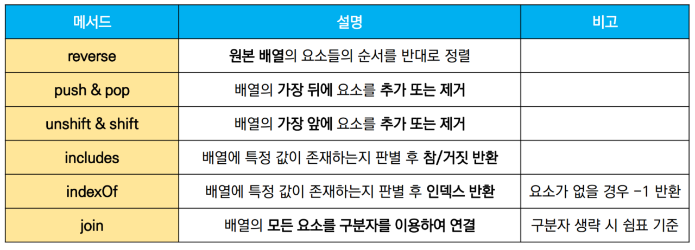

```js
//reverse
const numbers = [1,2,3,4,5]
numbers.reverse()
console.log(numbers) // [5,4,3,2,1]
// push & popconst numbers = [1,2,3,4,5]numbers.push(100)console.log(numbers) // [1,2,3,4,5,100]numbers.pop()console.log(numbers) // [1,2,3,4,5]// unshift & shiftconst numbers = [1,2,3,4,5]numbers.unshift(100)console.log(numbers) // [100,1,2,3,4,5]numbers.shift()console.log(numbers) // [1,2,3,4,5]// includesconst numbers = [1,2,3,4,5]console.log(numbers.includes(1)) // trueconsole.log(numbers.includes(100)) // false//indexOfconst numbers = [1,2,3,4,5]let result result = numbers.indexOf(3) // 2  특정값이 존재하는지 확인후 가장 첫번째 찾은 인덱스 반환result = numbers.indexOf(100) // -1  없을 경우 -1 반환//joinconst numbers = [1,2,3,4,5]let result result = numbers.join() // 1,2,3,4,5result = numbers.join("") // 12345result = numbers.join('-') //1-2-3-4-5
```


## 배열 순회 메서드

- 배열을 순회하며 특정 로직을 수행하는 메서드
- 메서드 호출시 인자로 callback함수를 받는 것이 특징
  - callback 함수 : 어떤 함수 내부에서 실행될 목적으로 인자를 넘겨받는 함수를 말함

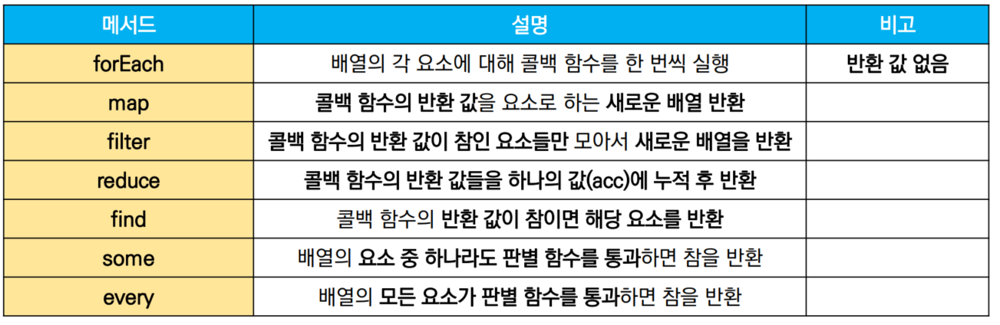

### forEach

- `array.forEach((element, index, array) => {  do something  })`

- 배열의 각 요소에 대해 콜백 함수를 한번씩 실행
- 콜백 함수는 3가지 매개변수로 구성
  - element : 배열의 요소
  - index : 배열의 요소의 인덱스 (생략가능)
  - array : 배열 자체 (생략가능)
- 반환 값(return)이 없는 메서드임

```js
const food = ["바나나", "사과", "파인에플"]
ssafy.forEach((food, index) => {
    console.log(food, index)
    //바나나 0
    //사과 1
    //파인에플 2
})
```


### map

- `array.map((element, index, array) => {  do something  })`
- 배열의 각 요소에 대해 콜백 함수를 한 번씩 실행
- 콜백 함수의 반환 값을 요소로 하는 새로운 배열을 반환
- 기존 배열 전체를 다른 형태로 바꿀 때 유용

```js
const numbers= [1,2,3,4,5]
const doubleNums = numbers.map((num) => {
    return num *2
})
console.log(doubleNums) // [2,4,6,8,10]
```


### filter

- 배열의 각 요소에 대해 콜백 함수를 한 번씩 실행
- 콜백 함수의 반환값이 참인 요소들만 모아서 새로운 배열을 반환
- 기존 배열의 요소들을 필터링할 때 유용

```js
const numbers=[1,2,3,4,5]

const oddNums = numbers.filter((num) => num%2)

console.log(oddNums) // 1,3,5
```


### reduce

- `array.reduce((acc, element, index, array) => { do something }, initialValue)`

- 배열의 각 요소에 대해 콜백 함수를 한번씩 실행
- 콜백 함수의 반환값들을 하나의 값으로 누적 후 반환
- reduce 메서드의 주요 매개변수
  - acc : 이전 callback 함수의 반환 값이 누적되는 변수
  - initialValue : 최초 callback 함수 호출 시 acc 에 할당되는 값으로, 선택적으로 설정 가능하며 직접 제공하지 않으먼 배열의 첫번째 값 사용 - 생략가능
- 빈 배열의 경우 initialValue를 제공하지 않으면 에러 발생

```js
const numbers = [1,2,3]

const result = numbers.reduce((acc,num) => { 
	return acc+num
},0)

console.log(result) // 1+2+3 = 6
```


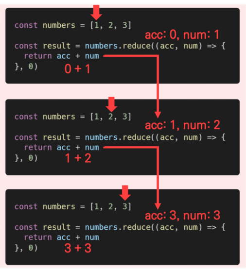

### find

- `array.find((element, index, array) => { do something })`

- 배열의 각 요소에 대해 콜백 함수를 한 번씩 실행
- 콜백 함수의 반환 값이 참이면 해당 요소를 반환
- 찾는 값이 배열에 없으면 undefined 반환

```js
const avenger = [
    { name : 'Tony Stark', age: 45},
    { name : 'Steve Rogers', age: 32},
    { name : 'Thor', age: 40},
]

const result = avengers.find((avenger) => {
    return avenger.name === 'Tony Stark'
})

console.log(result) // { name : 'Tony Stark', age: 45}
```


### some 

- `array.some((element, index, array) => { do something })`

- 배열의 요소 중 하나라도 주어진 판별 함수를 통과하면 참을 반환
- 모든 요소가 통과하지 못하면 거짓 반환
- 빈 배열은 항상 거짓 반환

```js
const numbers = [1,3,5,7,9]

const hasEvenNumber = numbers.some((num) => {
    return num %2 === 0
})
console.log(hasEvenNumber) // false

const hasOddNumber = numbers.some((num) => {
    return num %2
})
console.log(hasOddNumber) // true
```


### every

- `array.every((element, index, array) => { do something })`

- 배열의 모든 요소 판별 함수를 통과하면 참을 반환
- 모든 요소가 통과하지 못하면 거짓 반환
- 빈 배열은 항상 참 반환


## 배열 순회 방법 비교


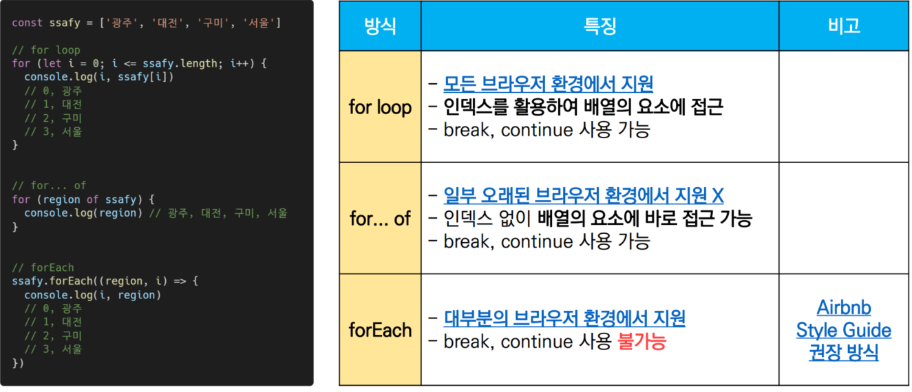


# 6. 객체(object)

- 객체는 속성(property)의 집합이며 중괄호 내부에 key와 value의 쌍으로 표현
- key는 **문자열 타입**만 가능
  - key 이름에 띄어쓰기 등의 구분자가 있을 경우 따옴표로 묶어서 표현
- value는 모든 타입 가능
- 객체 요소 접근은 점 또는 대괄호로 가능
  - key 이름에 띄어쓰기 같은 구분자가 있을 경우 대괄호 접근만 가능
- 객체 관련 ES6 문법 - 객체 생성 및 조작에 유용하게 사용가능
  - 속성명 축약
  - 메서드명 축약
  - 계산된 속성명 사용하기
  - 구조 분해 할당
    - 구조 분해 할당은 배열도 가능함


## 관련 문법

### 속성명 축약(shorthand)

- 객체를 정의할 떄 key와 할당하는 변수의 이름이 같으면 예시와 같이 축약 가능

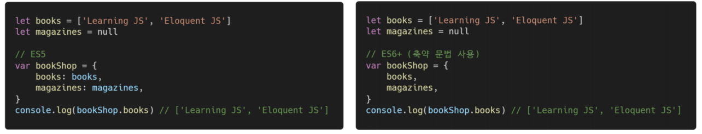


### 메서드명 축약(shorthand)

- 메서드 선언시 function 키워드 생략 가능
  - 메서드 : 어떤 객체의 속성이 참조하는 함수

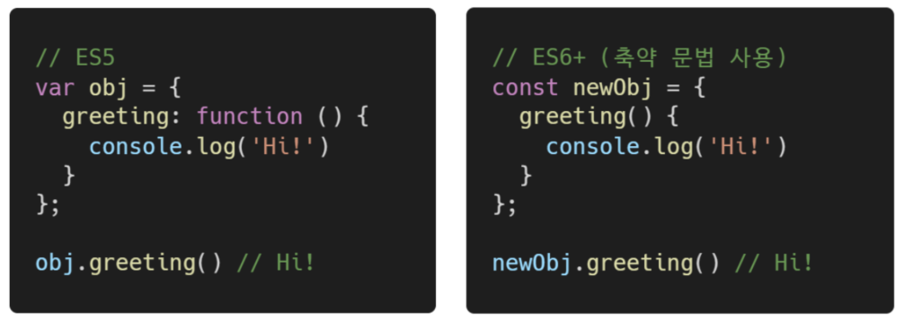


###  계산된 속성(computed property name)

- 객체를 정의할 떄 key의 이름을 표현식을 이용하여 동적으로 생성 가능

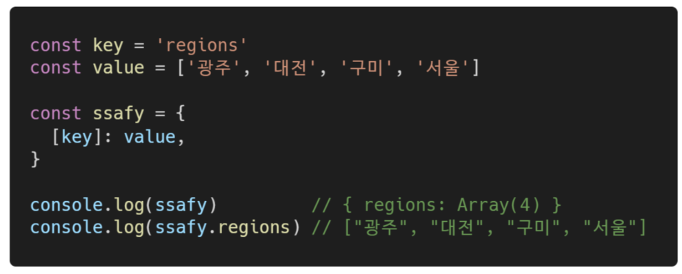


### 구조 분해 할당(destructing assignment)

- 배열 또는 개체를 분해하여 속성을 변수에 쉽게 할당하는 문법


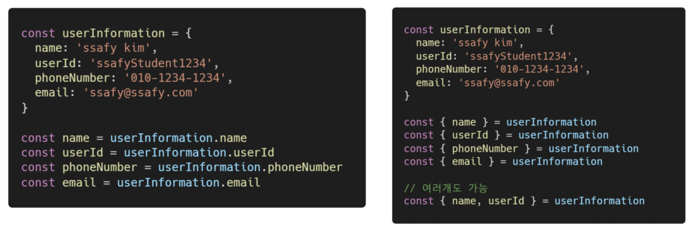

## JSON

- key - value 쌍의 형태로 데이터를 표기하는 언어 독립적 표준 포맷
- 자바스크립트의 객체와 유사하게 생겼으나 실제로는 문자열 타입
  - 따라서 JS의 객체로써 조작하기 위해서는 구문분석(parsing)이 필수
- 자바스크립트에서는 JSON을 조작하기 위한 두 가지 내장 메서드 제공
  - JSON.parse()
    - JSON => 자바스크립트 객체
  - JSON.stringify()
    - 자바스크립트 => JSON

```js
const jsonData = JSON.stringify({
    coffee : "Americano",
    iceCream : 'Cookie and cream'
})

console.log(jsonData) // "{"coffee": "Americano" , ...}"
console.log(typeof jsonData) // string

const paredData = JSON.parse(jsonData)
console.log(parsedData) // {coffe: "Americano", ...}
console.log(typeof parsedData) // object
```

