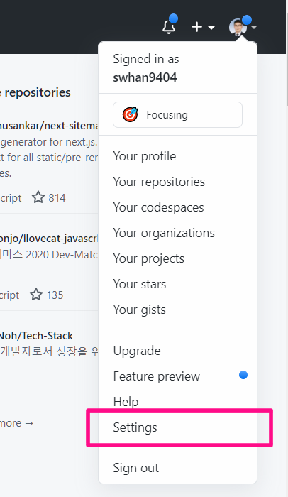
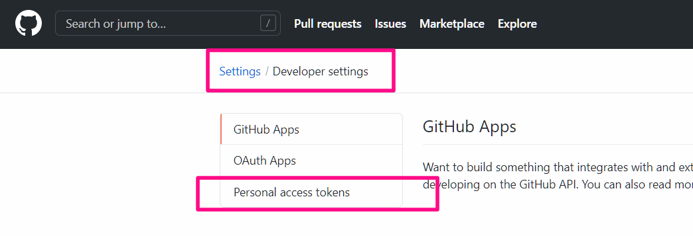
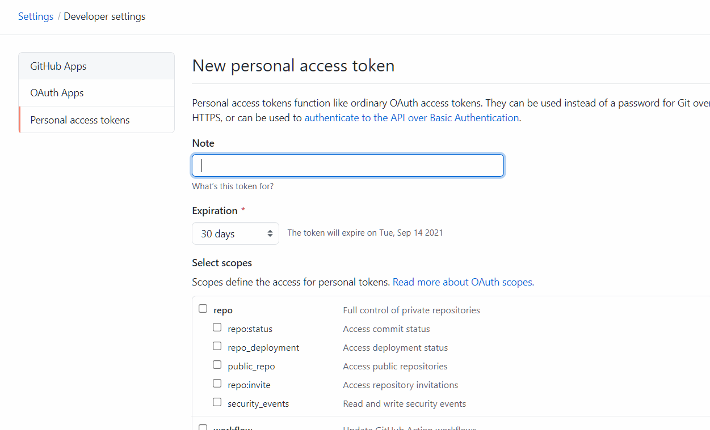

## 1. profile의 setting 들어가기

## 2. Developer settings > personal access token

## 3. token 만들기

- token의 유통기한과 권한 설정은 알아서

## 4. token 값 저장하기

- 만들어진 토큰의 값은 만들어질 때 밖에  보지 못하기 때문에 저장을 어딘가 해두어야함.
- 이렇게 만들어진 토큰으로 Git 작업을 위해 계정 아이디/비밀번호를 입력하여 연결할 때 비밀번호 대신 Personal access token 값을 입력하면 연결이 가능함.

## 5. 자격 증명 관리자

- window의 자격 증명 관리자 > Windows 자격증명 > `https://api.github.com/아이디` 로 되어있는 것을 삭제
- 그럼 cmd에서 github를 다시 다룰 때 다시 로그인 창이 뜰땐데 그걸로 계정값을 다시 등록하면됨

- 주의할 점
  - personal access Token 은 http가 아닌 https 로만 접근이 가능함