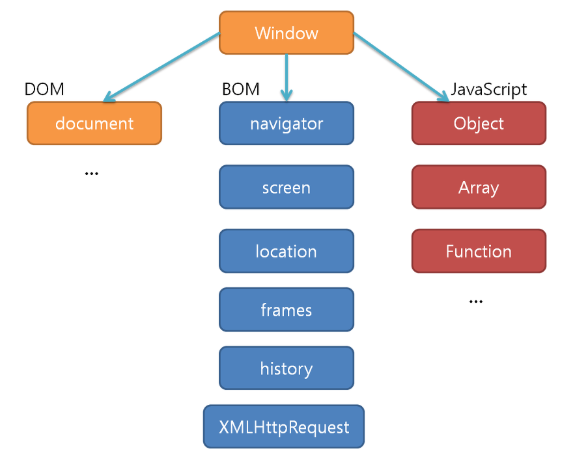
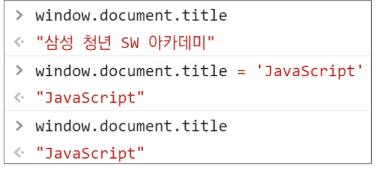
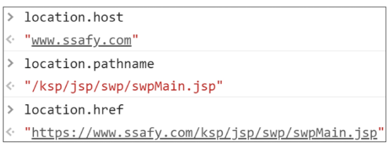
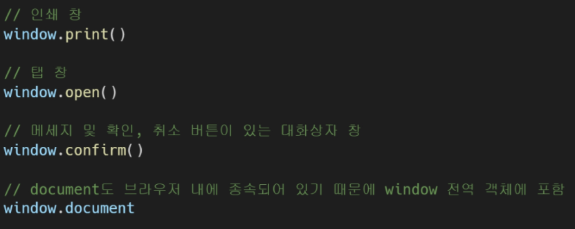
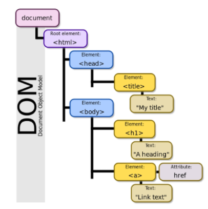
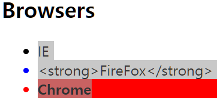
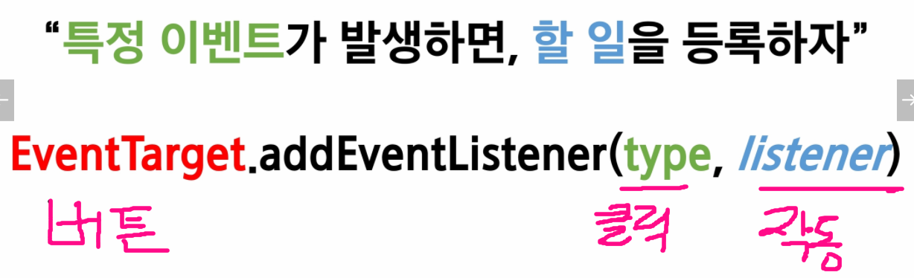

# browser

- 웹서버에서 이동하며 클라이언트와 서버간 양방향으로 통신하고, HTML 문서나 파일을 출력하는 GUI기반의 소프트웨어
- 주요 브라우저
  - 구글 크롬, 모질라 파이어폭스, 마이크로소프트 엣지, 오페라, 사파리 등


# javascript

## 역사

- 핵심인물

  - 팀 버너스리 - WWW, URL, HTTP, HTML 최초 설계자
  - 브랜던 아이크 - javascript 설계자, 모질라 재단 공동 설립자

- 생겨난 이유

  - 브랜던 아이크가 HTML을 동적으로 동적으로 동작하기 위해 만들게 됨

- 파편화 및 표준화

  - 수 많은 브라우저에서 자체 자바스크립트 언어를 사용하여 생긴 서로 다른 모습의 자바스크립가 크로스 브라우징 이슈를 만들어냄 -> 웹 표준 만들게 됨

  - Ecma 인터내셔널(정보와 통신 시스템을 위한 국제적 표준화 기구)

  - 2015년 ES6 (ES2015) 탄생

    'Next-gen of JS' 라고 불릴정도로 JS의 많은 고질적 문제들을 해결

- Vanilla JavaScript

  - 크로스 브라우징, 간편한 활용 등을 위해 많은 라이브러리 등장( jQuery)
  - 최근 표준화된 브라우전, ES6 이후의 다양한 도구 등장으로 순수 자바스크립트 활용의 증대


## 브라우저에서 할 수 있는 일

- DOM 조작
  - 문서(HTML) 조작
- BOM 조작
  - navigator, screen, location, frames, history, XHR
- JavaScript Core(ECMAScript)
  - Data Structure(Ojbect, Array) , Conditional Expression, Iteration




### DOM(Document Object Model)



### BOM(Browser Object Model)





## DOM

- HTML, XML 등과 같은 문서를 다루기 위한 언어 독립적인 문서 모델 인터페이스
- 문서를 구조화하고 구조화된 구성 요소를 하나의 객체로 취급하여 다루는 논리적 트리 모델
- 문서가 구조화되어 있으며 각 요소는 객체(Object)로 취급
- 단순한 속성 접근, 메서드 활용 뿐만 아니라 프로그래밍 언어적 특성을 활용한 조작 가능
- 주요 객체
  - window : DOM을 표현하는 창, 가장 최상위 객체(작성시 생략 가능)
  - document : 페이지 콘텐트의 Entry Point 역할을 하며, <body> 등과 같은 수많은 다른 요소들을 포함
  - navigator, location, history, screen



### parsing

- 브라우저가 문자열을 해석하여 DOM Tree로 만드는 과정


## BOM 이란

- Browser Object Model
- 자바스크립트가 브라우저와 소통하기 위한 모델
- 브라우저의 창이나 프레임을 추상화해서 프로그래밍적으로 제어할 수 있도록 제공하는 수단
  - 버튼, URL, 입력창, 타이틀 바 브라우저 윈도우 및 페이지의 일부분을 제어 가능
- window 객체는 모든 브라우저로부터 지원받으며 브라우저 window 자체를 지칭


## DOM 조작 

- Document는 문서 한장(HTML)에 해당하고 이를 조작
- DOM 조작 순서
  1. 선택(select)
  2. 변경(manipulation)


## DOM 관련 객체의 상속 구조

- EventTarget
  - Event Listener 가 가질 수 있는 개체가 구현하는 DOM 인터페이스
- Node
  - 여러가지 DOM 타입들이 상속하는 인터페이스
- Element 
  - Document 안에 모든 객체가 상속하는 가장 범용적인 기반 클래스
  - 부모인 Node와 그 부모인 EventTarget 속성을 상속
- Document
  - 브라우저가 불러온 웹 페이지를 나타냄
  - DOM 트리의 진입점(entry point) 역할을 수행
- HTMLElement
  - 모든 종류의 HTML요소
  - 부모인 element의 속성 상속

undefined


## DOM 선택 - 선택 관련 메서드

### Document.querySelector()

- 제공한 선택자와 일치하는 element 하나 선택
- 제공한 CSS  selector를 만족하는 첫번째 element 객체를 반환(없다면 null)
  - 이 성질 때문에 id, class 를 사용하는게 좋음


### Document.querySelectorAll()

- 제공한 선택자와 일치하는 여러 element를 선택
- 매칭할 하나 이상의 샐랙터를 포함하는 유효한 CSS Selector를 인자(문자열)로 받음
- 지정된 셀렉터를 일치하는 NodeList를 반환

### 아이디, 태그, 클래스로 접근

- getElementById()
- getElementByTagName()
- getElementsByClassName()

> 하지만, querySelector(), querySelectorAll()이 
>
> id, tag, class 선택자 등을 모두 사용가능하기 때문에 더 구체적이고 유연하게 선택 가능

```javascript
//1. Selection - querySelector / querySelectorAll
//1-1. window & document
// console.log(window)
// console.log(document)
// console.log(window.document)

//1-2. querySelector
const mainHeader = document.querySelector('h1') // <h1 id="header">DOM Manipulation</h1>
const langHeader = document.querySelector('#lang-header') // <h2 id="lang-header">Programming Languages</h2>
const frameHeader = document.querySelector('#frame-header') // <h2 id="frame-header">Frameworks</h2>
// console.log(mainHeader, langHeader, frameHeader)

//1-3. querySelectorAll
const langLi = document.querySelectorAll('.lang')
const frameworkLi = document.querySelectorAll('.framework')
// console.log(langLi, frameworkLi)

//1-4. 여러 개의 요소 -> 첫 번째로 일치하는 요소
const selectOne = document.querySelector('.lang')
// console.log(selectOne)

//1-5. 복합 선택자
const selectDescendant = document.querySelector('body li')
// const selectDescendant = document.querySelectorAll('body li')
const selectChild = document.querySelector('body > li')
// console.log(selectDescendant) 
// console.log(selectChild) 

//1-6. getElementById, getElementByClassName 
const selectSepcialLang = document.getElementById('special-lang')
const selectAllLangs = document.getElementsByClassName('framework')
const selectAllLiTags = document.getElementsByTagName('li')
// console.log(selectSepcialLang, selectAllLangs, selectAllLiTags)
```


## DOM 선택 - 선택 메서드별 반환 타입

- 단일 element
  - getElementById()
  - querySelector()
- HTMLCollection
  - getElementsByTagName()
  - getElementsByClassName()
- NodeList
  - queryselectorAll()


### HTMLCollection과 NodeList의 차이

- 공통점

  - 둘다 배열과 같이 각 항목을 접근하기 위한 인덱스를 제공(유사 배열- 배열은 아님)

- 차이점

  - HTMLCollection

    - name, id, 인덱스 속성으로 각 항목들에 접근 가능

  - NodeList

    - 인덱스 번호로만 각 항목들에 접근 가능
    - 단, HTMLCollection과 달리 배열에서 사용하는 for each 함수 및 다양한 메서드 사용가능

  - 둘다 `Live Collection`으로 DOM의 변경사항을 실시간으로 반영하지만,

    querySelectorAll()에 의해 반환되는 NodeList는 `Static collection`


### Live Collection과 Static Collection

- Live Collection
  - 문서가 바뀔 때 실시간으로 업데이트
  - DOM의 변경사항을 실시간으로 collection에 반영
- Static Collection( non-live )
  - DOM이 변경되어도 collection 내용에는 영향을 주지 않음
  - querySelectorAll()의 반환 LodeList만 static


## DOM 변경 메소드 

### 추가

- Document.createElement()
  - 주어진 태그명을 사용해 HTML 요소를 만들어 **반환**
    - 뭐가 추가됬는지 변수로 담아 쓸수 있다는 뜻
- ParentNode.append()
  - 특정 부모 노드의 자식 노드 리스트 중 마지막 자식 다음에 Node 객체나 DOMString을 삽입(반환값 없음)
  - 여러 개의 Node 객체, DOMString을 추가할 수 잇음
- Node.appendChild()
  - 한 노드를 특정 노드의 자식 노드 리스트 중 마지막 자식으로 삽입(Node만 추가 가능)
  - 추가한거 반환
  - 만약 주어진 노드가 이미 문서에 존재하는 다른 노드를 참조한다면 새로운 위치로 이동

```javascript

//2-1. Creation
const browserHeader = document.createElement('h2')
const ul = document.createElement('ul')
const li1 = document.createElement('li')
const li2 = document.createElement('li')
const li3 = document.createElement('li')
// console.log(browserHeader, li1, li2, li3) 

//2-3. append DOM 
const body = document.querySelector('body')
body.appendChild(browserHeader) // const browserHeader = document.createElement('h2')
body.appendChild(ul) // const ul = document.createElement('ul')

ul.append(li1, li2, li3) 
// ul.appendChild(li1, li2, li3) 
```

|                        | append | appendChild |
| ---------------------- | ------ | ----------- |
| 노드 객체(Node object) | o      | o           |
| 문자열(DOMString)      | o      | x           |
| 반환값(return)         | x      | o           |
| 다중 값 허용           | o      | x           |

### 삭제

- childNode.remove()

  - 이를 포함하는 트리로부터 특정 객체를 제거

    ```javascript
    let el = document.querySelelctor('#content')
    el.remove
    ```

    

- Node.removeChild()

  - DOM에서 자식 노드를 제거하고 제거 된 노드를 **반환**
    - 뭐가 지워졌는지 변수로 담아 쓸수 있다는 뜻
  - Node는 인자로 들어가는 자식 노드의 부모 노드

  ```javascript
  // 부모 노드를 알 때 지정된 자식 요소를 제거(부모, 지울 자식 다 필요)
  let parent = document.querySelector('#parent')
  let child = document.querySelector('#child')
  let oldChild = parent.removeChild(child) // 지워진것
  ```

  

### 속성변경(property)

- Node.textContent

  - 노드와 그 자손의 텍스트 컨텐츠(DOMString)를 표현 (해당 요소 내부의 raw text)
  - 노드의 모든 요소 컨텐츠를 가져옴

- Node.innerText

  - textContent와 동일하지만 raw text가 최종적으로 랜더링 된 모습을 표현(사람이 읽을 수 있는 요소만 남김)
  - 즉, 줄 바꿈을 인식하고 숨겨진 내용을 무시하는 등 최종적인 스타일링이 적용된 모습으로 표현
  - 화면에 `<h1>내용</h1>` 으로 보임

- Element.innerHTML

  - 요소(element) 내에 포함된 HTML 마크업을 반환

  - XSS공격에 취약점이 있으므로 사용시 주의

    - Cross-site Scripting 

      공격자가 웹 사이트 클라이언트 측 코드에 악성 스크립트를 삽입해 공격하는 방법

  - 화면에 `<h1>내용</h1>` 이 적용되어 `내용` 만 보임


```javascript
//2-2. innerText & innerHTML / append & appendChild
browserHeader.innerText = 'Browsers'
li1.innerText = 'IE'
li2.innerText = '<strong>FireFox</strong>'
li3.innerHTML = '<strong>Chrome</strong>'
// console.log(browserHeader, li1, li2, li3)
```





### 속성변경(Attribute)

- Element.setAttribute(name, value)
  - 지정된 요소의 값을 지정
  - 속성이 이미 존재하면 값을 업데이트, 그렇지 않으면 지정된 이름과 값으로 새 속성을 추가
- Element.getAttribute()
  - 해당 요소의 지정된 값(문자열)을 반환
  - 인자는 값을 얻고자 하는 속성의 이름


```javascript
//2-5. Element Styling
li1.style.cursor = 'pointer'
li2.style.color = 'blue'
li3.style.background = 'red'

// setAttribute 속성부여
li3.setAttribute('id', 'king')

// getAttribute 속성조회
const getAttr = li1.getAttribute('style')
const getAttr2 = li3.getAttribute('style')
console.log(getAttr)
console.log(getAttr2)
```


## Event

- 네트워크 활동 혹은 사용자와의 상호작용 같은 사건의 발생을 알리기 위한 객체
  - DOM 상속 구조 다시 확인
- 이벤트는 마우스를 클릭하거나 키보드를 누르는 등 사용자에 의해 발생할 수도 있고, 특정 메서드를 호출(HTMLElement.click()) 하여 프로그래밍적으로도 만들어낼 수 있음
- 이벤트 처리기(Event-handler)
  - `EventTarget.addEventListener()`
  - 해당 메서드를 통해 다양한 요소에서 이벤트를 붙일 수 있음
  - removeEventListener()를 통해 이벤트를 제거 가능


### Event 기반 인터페이스

- AnimationEvent, ClipboardEvent, DragEvent 등
- 그 중에서도 "UIEvent"
  - 간단한 사용자 인터페이스 이벤트
  - Event의 상속을 받음
  - MouseEvent, KeyboardEvent, InputEvent, FocusEvent 등의 부모 객체 역할을 함


### Event handler

- EventTarget.addEventListener()

- 지정한 이벤트가 대상에 전달될 때마다 호출할 함수를 설정

- 이벤트를 지원하는 모든 객체(Element, Document, Winodw 등)을 대상으로 지정가능

- target.addEventListener(type, listener[, options])

  - type : 반응할 이벤트 유형(대소문자 구분 문자열)

    - https://developer.mozilla.org/ko/docs/Web/Events

  - listener : 지정된 타입의 이벤트가 발생 했을 때 알림을 받는 객체

    EventListener 인터페이스 혹은 JS function 객체(콜백함수)여야 함

  



```javascript
const btn = document.querySelector('button')
btn.addEventListener('click', function (event){
    alert('버튼이 클릭되었습니다')
})
```


### preventDefault()

- 현재 이벤트의 기본 동작을 중단
- 예를 들면
  - a 태그는 클릭시 페이지 이동
  - from 태그는 폼 데이터 전송
- 이벤트의 전파를 막지 않고 이벤트의 기본동작만 중단
  - 이벤트는 남기되, 이벤트로 발생한 동작을 없앰

```javascript
<input type="checkbox" id="my-checkbox">  
    
  <script>
    const checkBox = document.querySelector("my-checkbox");

    checkBox.addEventListener('click', function(event){
      event.preventDefault() // 더이상 선택이 안됨
    });
  </script>
```

