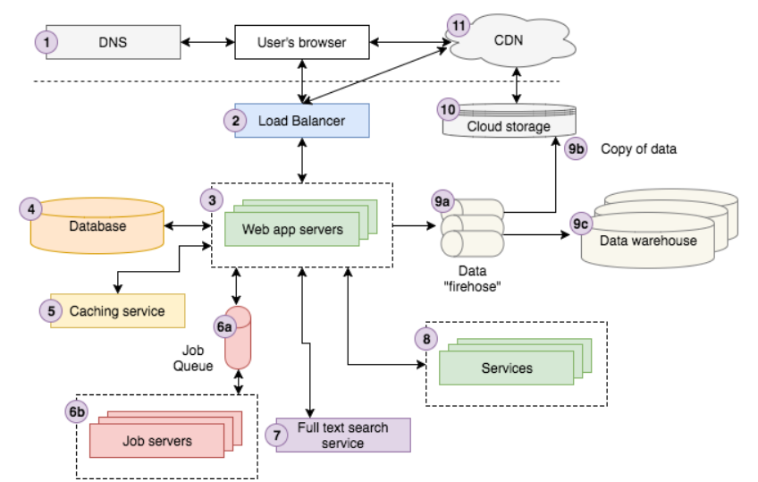

- 이 글은 아래 출처를 읽고 정리한 내용입니다.
  - https://medium.com/storyblocks-engineering/web-architecture-101-a3224e126947

# 웹페이지는 어떻게 작동할까?

- Storyblocks 란 웹사이트의 아키텍처를 통해 이해해보자

## Read

1. 사용자가 숲 속의 강렬한 아름다운 안개와 햇빛을 검색 -> 첫번쨰 검색 결과로 Stroyblocks의 페이지를 클릭  -> 사용자의 브라우저가 이미지 세부 정보 페이지로 리디렉션
2. 내부적으로는 DNS 서버에 요청을 보내 Storyblocks 에 연락하는 방법을 조회한 다음 요청을 보냄
3. 요청은 로드밸런서를 통과하여 요청을 처리할 당시 사이트를 실행하고 있는 10개 정도의 웹 서버 중 무작위로 선택
4. 웹서버는 캐싱서비스에서 이미지에 대한 정보를 검색하고 데이터베이스에서 나머지 데이터를 가져옴
5. 이미지의 색상 프로필이 아직 계산되지 않았으므로 작업 대기열에 "색상프로필"작업을 보냄. 
   작업 대기열은 작업 서버에서 비동기적으로 처리하여 결과로 데이터베이스를 적절하게 업데이트함

## Search

1. 사용자가 사진 제목을 입력하여 전체 텍스트 검색 서비스에 요청을 보내 유사한 사진 검색
2. 서버는 사용자가 회원으로 로그인 되어 있으므로 계정 서비스에서 그의 계정 정보 조회
3. Data firehose 에서 페이지보기 이벤트를 시작하여 클라우드 서토리지 시스템에 기록하고 결국 데이터웨어 하우스에 로드
4. 데이터 분석가들이 이를 사용하여 비지니스를 분석함
5. 서버는 뷰를 HTML로 랜더링하고 먼저 로드밸런스를 통과하여 사용자 브라우저로 다시 보냄
6. 이 페이지를 구성하는 Javascript나 CSS를 얻기 위해 사용자 브라우저는 CDN에 연결
7. 마지막으로 브라우저는 사용자가 볼 수 있또록 페이지를 시각적으로 랜더링함

## 구성 요소 각각의 역할

### DNS

- DNS는 도메인 이름 (예 : google.com)에서 IP 주소 (예 : 85.129.83.120) 로의 키 / 값 조회를 제공하는 역할
  - 이는 컴퓨터가 적절한 주소로 요청을 라우팅하는 데 필요
  - 전화 번호와 유사하게 도메인 이름과 IP 주소의 차이는 "John Doe에 전화"와 "201-867–5309에 전화"의 차이
  - 예전에 John의 번호를 조회하기 위해 전화 번호부가 필요했던 것처럼 도메인의 IP 주소를 조회하려면 DNS가 필요합니다. 따라서 DNS를 인터넷 전화 번호부로 생각할 수 있음

### 로드밸런서

- 수평확장과 수직확장
  - 수평확장 
    - 리소스 풀에 더 많은 머신을 추가하여 확장
  - 수직확장
    - 기존머신에 더 많은 전력(예시 - CPU, RAM)을 추가하여 확장
- 웹 개발에서는 수평적 확장을 추구함
  - 둘 이상의 서버가 있으면,  서버가 하나가 꺼지더라도 어플리케이션은 작동을 계속하게 만들 수 있음(내결함성)
    - **내결함성**이란 시스템의 일부 구성 요소가 작동하지 않더라도 계속 작동할 수 있는 기능
  - 수평적 확장을 통해 애플리케이션 백엔드(웹서버, 데이터베이스, 서비스들 등)의 서로 다른 부분을 서로 다른 서버에서 실행함으로 최소한으로 결합시킬 수 있음
- 로드밸런스는 수평확장을 도와주는 기술
  - 서로의 복제 / 미러 이미지 인 여러 애플리케이션 서버 중 하나로 수신 요청을 라우팅하고 앱 서버에서 클라이언트로 응답
  - 요청들을 분산시켜서 서버가 오버로드(과부하) 걸리지 않도록 해줌

### 데이터베이스 서버

- SQL( Structured Query Language )
- NoSQL

### 캐싱 서비스

- 캐싱 서비스는 O (1) 시간에 가깝게 정보를 저장하고 조회 할 수있는 간단한 키 / 값 데이터 저장소를 제공
- 비용이 많이 드는 계산 결과를 저장하므로 다음에 필요할 때 다시 계산하는 대신 캐시에서 결과를 검색
- 두 가지 캐싱 서버 기술은 Redis와 Memcache

### 작업 대기열 및 서버

- 대부분의 웹 애플리케이션은 사용자의 요청에 대한 응답과 직접 관련되지 않은 일부 작업을 백그라운드에서 비동기 적으로 수행해야합니다
  - Google은 검색 결과를 반환하기 위해 전체 인터넷을 크롤링하고 색인을 생성해야합니다. 검색 할 때마다이 작업을 수행하지 않습니다. 대신 웹을 비동기 적으로 크롤링하여 검색 색인을 업데이트
- 작업 대기열
  - 구성요소
    - 실행해야하는 "작업"대기열
    - 대기열에서 작업을 실행하는 하나 이상의 작업 서버 (종종 "작업자"라고 함)
  - 작동방식
    - 간단하게는 FIFO(선입선출) Queue 방식
    - 대부분의 응요프로그램은 일종의 우선순위 대기열 시스템을 사용
    - 앱이 일종의 정기적 인 일정에 따라 또는 사용자 작업에 따라 결정되는 작업을 실행해야 할 때마다 적절한 작업을 대기열에 추가

- 작업서버
  - 작업 서버는 작업을 처리
  - 작업 대기열을 폴링하여 수행 할 작업이 있는지 확인하고 작업이 있으면 대기열에서 작업을 꺼내 실행

### 전체 텍스트 검색 서비스

- 전체 텍스트 검색
  - 사용자가 텍스트 입력 (종종 "쿼리"라고 함)을 제공하고 앱이 가장 "관련성있는"결과를 반환하는 일종의 검색 기능을 지원 이 기능을 전체 텍스트 검색(full text search)이라고 부름
  - inverted index를 ㅘㄹ용하여 쿼리 키워드가 포함된 문서를 빠르게 조회

- 일부 데이터베이스에서 (MySQL에서 전체 텍스트 검색 지원)에서 직접 전체 텍스트 검색을 수행할 수 있을 수 있지만,
  - 보통은 Inverted index를 계산 저장하고 쿼리 인터페이스를 제공하는 별도의 검색서비스를 실행하는 것이 일반적
  - 오늘날 가장 인기있는 전체 텍스트 검색 플랫폼은 Elasticsearch, Sphnix, Apche solr 가 있다.

### 서비스

- 앱이 특정 규모에 돋라하면 별도의 애플리케이션으로 실행되도록 분할 된 특정 서비스가 있음
  - 외부 세계에 노출이 되지 않지만 앱 및 기타 서비스와 상호작용
- 아래는 Storyblocks의 운영 및 계획 서비스의 예시
  - **계정 서비스** 는 당사의 모든 사이트에 걸쳐 사용자 데이터를 저장하므로 교차 판매 기회를 쉽게 제공하고보다 통합 된 사용자 경험을 만들 수 있습니다.
  - **콘텐츠 서비스** 는 모든 비디오, 오디오 및 이미지 콘텐츠에 대한 메타 데이터를 저장합니다. 또한 콘텐츠를 다운로드하고 다운로드 기록을보기위한 인터페이스를 제공합니다.
  - **결제 서비스** 는 고객 신용 카드 결제를위한 인터페이스를 **제공** 합니다.
  - **HTML → PDF 서비스** 는 HTML을 받아들이고 해당 PDF 문서를 반환하는 간단한 인터페이스를 **제공** 합니다.

### 데이터

- 요즘 거의 모든 앱들이 특정 규모에 도달하면 데이터 파이플라인을 활용하여 데이터를 수집, 저장 , 분석할 수 있도록함
- 파이프 라인의 3가지 중요 단계
  1. 앱은 데이터 (일반적으로 사용자 상호 작용에 대한 이벤트)를 데이터를 수집하고 처리하는 스트리밍 인터페이스를 제공하는 데이터 "firehose"로 보냅니다. 종종 원시 데이터가 변환되거나 증가되어 다른 Firehose로 전달됩니다. AWS Kinesis와 Kafka는 이러한 목적을위한 가장 일반적인 두 가지 기술입니다.
  2. 원시 데이터와 최종 변환 / 증강 데이터는 클라우드 스토리지에 저장됩니다. AWS Kinesis는 원시 데이터를 클라우드 스토리지 (S3)에 저장하는 것을 매우 쉽게 구성 할 수있는 "firehose"라는 설정을 제공합니다.
  3. 변환 / 증강 데이터는 종종 분석을 위해 데이터웨어 하우스에로드됩니다. 대기업은 종종 Oracle 또는 기타 독점웨어 하우스 기술을 사용하지만 스타트 업 세계의 크고 성장하는 부분과 마찬가지로 AWS Redshift를 사용합니다. 데이터 세트가 충분히 크면 분석을 위해 Hadoop과 유사한 NoSQL MapReduce 기술이 필요할 수 있습니다.

### 클라우드 스토리지

- 클라우드 스토리지는 인터넷을 통해 데이터를 저장, 액세스 및 공유하는 간단하고 확장 가능한 방법
  - HTTP를 통해 RESTful API를 통해 상호 작용할 수 있다는 이점과 함께 로컬 파일 시스템에 저장하는 모든 것을 저장하고 액세스하는 데 사용할 수 있음
  -  Amazon의 S3 오퍼링은 현재 사용 가능한 가장 인기있는 클라우드 스토리지이며 여기 Storyblocks에서 비디오, 사진 및 오디오 자산, CSS 및 Javascript, 사용자 이벤트 데이터 등을 저장하기 위해 광범위하게 의존하는 클라우드 스토리지

### CDN

- Content Delivery Network
  - 단일 원본 서버에서 제공하는 것보다 훨씬 빠르게 웹을 통해 정적 HTML, CSS, Javascript 및 이미지와 같은 자산을 제공하는 방법을 제공
  - 전 세계의 많은 "에지"서버에 콘텐츠를 배포하여 작동하므로 사용자는 원본 서버가 아닌 "에지"서버에서 자산을 다운로드
    - 사용자 근처의 서버에서 다운로드해서 로드속도를 줄임

