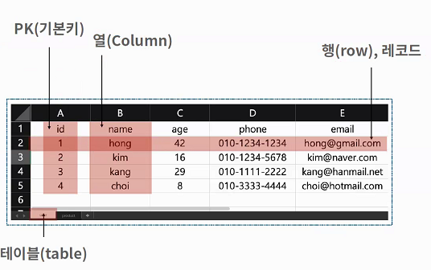
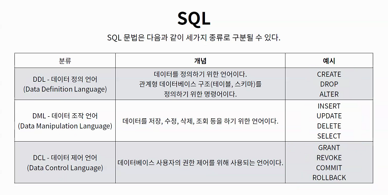
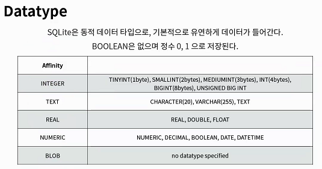
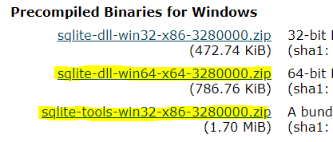
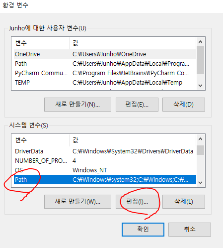
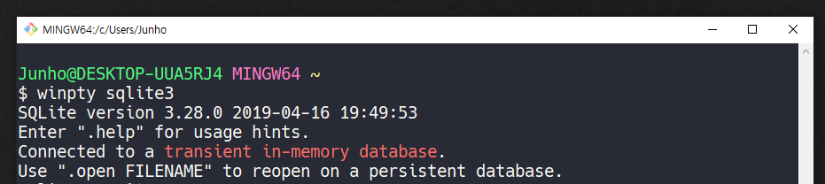
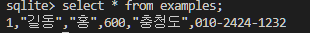
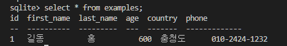

# SQLite 살펴보기

- SQLite
  - SQLite는 서버가 아닌 응용프로그램에 넣어 사용하는 비교적 가벼운 데이터베이스이다.
  - 구글 안드로이드 운영체제에 기본적으로 탑재된 데이터베이스이며, 임베디드 소프트웨어에도 많이 활용되고 있다.
  - 로컬에서 간단한 DB 구성을 할수 있으며(파일로 저장),  오픈소스 프로젝트이기 때문에 자유롭게 사용할 수 있다.


## 구조

- 스키마 : 데이터 베이스에서 자료의 구조, 표현방법, 관계등을 정의한 구조

undefined





## SQL 문법




## DataType





## SQLite 설치하기

- mac은 기본으로 설치가 되어있기 떄문에 설치할 필요 없음

1. sqlite 공식 홈페이지 

- https://www.sqlite.org/download.html

2. zip 파일 2개 다운로드



3. C드라이브 - sqlite 폴더생성 후 압축풀기


4. 시작 - 시스템 환경 변수 편집 - 환경 변수 - path 편집 - `C:\sqlite` 등록 확인



5. 설치 확인

   - 반드시 vscode, git bash 등 터미널 관련 프로그램 모두 종료 후 재시작

   - `winpty sqlite3`



6. alias 등록 - sqlite 실행명령어 바꾸기
   - `code ~/.bashrc`  하면 vscode가 열림
   - `alias sqlite3="winpty sqlite3"` 를 복사 붙여넣기 저장
   - `source ~/.bashrc`
   - `sqlite3` 로 잘 실행되는지 확인 


### Windows 7 64bit 의 경우

1. sqlite3 공식홈페이지 다운로드
2. c 드라이브 → sqlite 폴더 생성 → 모두 압축풀기
3. 환경변수에 다음과 같이 등록
4. `~/.bash_profile` 에 alias 등록
5. vscode, git bash, 파이참 완전 종료 후 재시작


## 실습 - sqlite 데이터베이스 생성하기 

1. 현재 위치에 `helloddb.csv` 파일 옮겨두기

- 혹시 액셀 파일로 보고 싶다면 VSCode extension에서 `Excel Viewer` 설치

2. `sqlite3 데이터베이스이름`

- ` .databases` 쓰면 데이터베이스가 현재 위치에 생성되게 됨

3. 데이터베이스에 csv 자료 넣기

   - `.mode csv` - CSV를 읽는 모드로 바뀜

   - `import hellodb.csv 테이블명` -  hellodb.csv 파일을 읽어서 테이블명으로 저장

4. 자료 출력해보기

   - `select * from 테이블명;`



    

   - 테이블을 더 이쁘게 출력하기 

     - `.header on` 설정하기 - 컬럼명 출력됨

     - `.mode column` 설정하기 - 컬럼에 구분지어서 이쁘게 출력

     - `select * from 테이블명;`


5. 새로운 테이블 만들어보기

   - 만약 SQLite는 따로 PRIMARY KEY 속성의 컬럼을 작성하지 않으면 값이 자동으로 증가하는 PK 옵션을 가진 `rowid` 컬럼을 정의한다.
     - 속성은 INTEGER PRIMARY 타입

   ```sqlite
   CREATE TABLE classmate(
   	id INTEGER PRIMARY KEY,
       name TEXT
   );
   ```

6. 테이블 목록 조회하기

   - `.tables` : 테이블 목록 조회
   - `.schema 테이블` : 테이블 스키마 확인하기

7. 테이블에 새로운 데이터 추가하기

   - `INSERT INTO 테이블명(컬럼명1, 컬럼명2 , ..) VALUES (value1, value2, ..)`
   - 만약에 PRIMARY KEY 를 컬럼명에 작성하지 않아도 자동으로 INTEGER형이면 만들어짐

   ```sqlite
   INSERT INTO classmate(id, name)
   VALUES (12, '한승운');
   ```

8. 테이블 삭제하기 - DROP

   - `DROP TABLE classmate`

9. 테이블 조회 - 상위 몇개만 가져오기

   - LIMIT은 마지막에 적어주기 (ORDER BY 보다 밑에 )

   - `LIMIT 갯수` 로  
     - `SELECT rowid, name FROM classmates LIMIT 3;`
   - `OFFSET 위치` 로 LIMIT의 시작위치 지정 가능
     - 위치는 0부터 순서를 센다.
     - `SELECT rowid, name FROM classmates LIMIT 3 OFFSET 2`
       - 3번쨰 위치부터 3개 가져옴

10. 테이블 조회 - 조건 주기

    - `WHERE 조건`
      -  `SELECT * FROM 테이블 WHERE name='한승운'`

11. 테이블 조회 - 중복 없이 검색

    - `DISTINCT`
      - `SELECT DISTINCT age FROM 테이블`

12. 테이블 내  특정 데이터 삭제 - DELETE

    - `DELETE FROM 테이블 WHERE 컬럼명 = 값`
    - 중간에 위치한 PRIMARY KEY 값을 지우게 되면 나중에 새로운 컬럼을 넣을 때 비어있는 PRIMARY KEY 값을 채우게 된다.
    - 이를 막기 위해서는 테이블 컬럼 속성에 `AUTOINCREMENT` 속성을 넣어준다
      - SQLite에서는 특정한 요구사항(사용되지 않은 값이나 이전에 삭제 된 행의 값을 재사용하지 못하게 하는)이가 없다면 AUTOINCREMNET 속성을 사용하지 않아야 한다는 철학을 가지고 있음
        - 내부적으로 CPU, 메모리, 디스크 공간을 추가로 불필요하게 사용하므로 엄격하게 필요하지 않을 경우 사용을 피해야한다고 생각한다고 함
      - 하지만,  django에서는 데이터베이스에서 삭제가 된 데이터에 대해 더 이상 불필요한 데이터라고 처리하는 것을 더 중요하게 생각하기 때문에 AUTOINCREMENT 속성을 사용한다.

13. 테이블 내용 수정 - UPDATE

- `UPDATE 테이블명 SET 바꿀컬럼=바꿀값, 바꿀컬럼2= 바꿀값2 WHERE 바꿀것에대한조건`

14. SELECT 문에 쓸 수 있는 표현식

    - `COUNT(column)`  : 컬럼 갯수반환
      - `SELECT COUNT(컬럼) FROM 테이블 WHERE 조건`
    - `AVG(column)` : 컬럼 값 평균 반환
      - `SELECT AVG(컬럼) FROM 테이블 WHERE 조건`
    - `MAX(column)` :  컬럼 최대값 반환
      - `SELECT MAX(컬럼) FROM 테이블 WHERE 조건`

15. LIKE를 통한 와일드카드 사용

    - LIKE 연산자는 검색하려는 값을 정확하게 모를 경우에도 검색할수 있도록

      와일드 카드와 함께 사용하여 원하는 결과를 검색

    - 와일드카드

      - `%` : 문자가 없거나 하나이상의 문자가 어떤 값이 와도 상관없습니다.
      - `_` : 단 하나의 문자만 어떤값이 와도 상관없습니다.

    - `SELECT * FROM users WHERE age LIKE '2_';`

      - age가 20대인 사람들 출력

    - `SELECT * FROM users WHERE phone LIKE '02-%';`

      - 전화번호 앞번호가 02 로 시작하는 사람들 출력 

16. 정렬(ORDER BY)

    - `SELECT 컬럼명 FROM 테이블명 ORDER BY 기준컬럼명 ASC` 
    - 정렬방식
      - ASC : 오름차순 - 생략가능
      - DESC : 내림차순

17. GROUP BY

    - 특정 속성을 기준으로 그룹화 하여 검색할 때 그룹화 할 속성을 지정
    - `SELECT 컬럼명1,  표현식 FROM 테이블 GROUP BY 컬럼명1`
      - 표현식은 컬럼명1 에 대한 SUM 이나 AVG 같은 표현식

18. 테이블 바꾸기 - ALTER TABLE

    - 테이블 이름 바꾸기 - RENAME TO
      - `ALTER TABLE 테이블명 RENAME TO 새이름;`
    - 새로운 컬럼 추가 - ADD COLUMN 
      - `ALTER TABLE 테이블명 ADD COLUMN 새로만들컬럼명 자료형 제약조건`
      
      
# SQL with django ORM

## 기본 준비 사항

```bash
# 폴더구조

99_sql # only SQL
    hellodb.csv
    tutorial.sqlite3
    users.csv
99_sql_orm # SQL + ORM
    ...
    users.csv # 해당 디렉토리로 다운로드
```

* django app

  * 가상환경 세팅

  * 패키지 설치

  * migrate

    ```bash
    $ python manage.py sqlmigrate users 0001
    ```

* `db.sqlite3` 활용

  * `sqlite3`  실행

    ```bash
    $ ls
    db.sqlite3 manage.py ...
    $ sqlite3 db.sqlite3
    ```

  * csv 파일 data 로드

    ```sqlite
    sqlite > .tables
    auth_group                  django_admin_log
    auth_group_permissions      django_content_type
    auth_permission             django_migrations
    auth_user                   django_session
    auth_user_groups            auth_user_user_permissions  
    users_user
    sqlite > .mode csv
    sqlite > .import users.csv users_user
    sqlite > SELECT COUNT(*) FROM users_user;
    100
    ```

* 확인

  * sqlite3에서 스키마 확인

    ```sqlite
    sqlite > .schema users_user
    CREATE TABLE IF NOT EXISTS "users_user" ("id" integer NOT NULL PRIMARY KEY AUTOINCREMENT, "first_name" varchar(10) NOT NULL, "last_name" varchar(10) NOT NULL, "age" integer NOT NULL, "country" varchar(10) NOT NULL, "phone" varchar(15) NOT NULL, "balance" integer NOT NULL);
    ```


---


## 문제

> 아래의 문제들을 보면서 서로 대응되는 ORM문과 SQL문을 작성하시오.
>
> **vscode 터미널을 좌/우로 나누어 진행하시오. (sqlite / shell_plus)**

`.headers on` 만 켜고 작성해주세요.

- QuerySet

  - https://docs.djangoproject.com/en/3.1/ref/models/querysets/

- making Query

- https://docs.djangoproject.com/en/3.1/topics/db/queries/

- orm 을 만든다음 

  - print(`orm내용`.query)
  - 하면 만들어진 쿼리문을 확인해볼수도 있음

- django raw sql

  - `모델.objects.raw('쿼리문')` 

    - 이렇게 하면 쿼리문을 django에서 직접 쓸 수도 있음

  - https://docs.djangoproject.com/en/3.1/topics/db/sql/

    


### 1. 기본 CRUD 로직

1. 모든 user 레코드 조회

   ```python
   # orm
   User.objects.all()
   ```

      ```sql
   -- sql
   SELECT * FROM users_user; 
      ```

2. user 레코드 생성

   ```python
   # orm
   User.objects.create(
   	first_name='김',
   	last_name='지용',
   	age=34,
   	country='광주광역시',
   	phone='010-123-123',
       balance='2000'
   )
   ```

   ```sql
   -- sql
   INSERT INTO users_user 
   VALUES (102,'가은','노',26,'광주광역시','010-1234-1234',50000);
   ```

   * 하나의 레코드를 빼고 작성 후 `NOT NULL` constraint 오류를 orm과 sql에서 모두 확인 해보세요.

3. 해당 user 레코드 조회

   - `101` 번 id의 전체 레코드 조회

   ```python
   # orm
   User.objects.get(id=101)
   ```

   ```sql
   -- sql
   SELECT * FROM users_user WHERE id=101; 
   ```

4. 해당 user 레코드 수정

   - ORM: `101` 번 글의 `last_name` 을 '김' 으로 수정
   - SQL: `101` 번 글의 `first_name` 을 '철수' 로 수정

   ```python
   # orm
   user = User.objects.get(id=101)
   user.last_name = "김"
   user.save()
   ```

      ```sql
   -- sql
   UPDATE users_user SET first_name='철수' WHERE id=101;
      ```

5. 해당 user 레코드 삭제

   - ORM: `101` 번 글 삭제
   - `SQL`:  `101` 번 글 삭제 (ORM에서 삭제가 되었기 때문에 아무런 응답이 없음)

   ```python
   # orm
   user = User.objects.get(id=102)
   user.delete()
   ```

   ```sql
   -- sql
   DELETE FROM users_user WHERE id=101;
   ```


---


### 2. 조건에 따른 쿼리문

1. 전체 인원 수 

   - `User` 의 전체 인원수

   ```python
   # orm
   Users.objects.count()
   ```

   

   ```sql
   -- sql
   SELECT count(*) From Users
   ```

2. 나이가 30인 사람의 이름

   - `ORM` : `.values` 활용
     - 예시: `User.objects.filter(조건).values(컬럼이름)`

   ```python
   # orm
   User.objects.filter(age=30).values('first_name') # QuerySet 반환
   ```

      ```sql
   -- sql
   SELECT first_name FROM User WHERE age=30;
      ```

3. 나이가 30살 이상인 사람의 인원 수

   -  ORM: `__gte` , `__lte` , `__gt`, `__lt` -> 대소관계 활용

   ```python
   # orm
   User.objects.filter(age__gte=30).count()
   ```

      ```sql
   -- sql
   SELECT count(first_name) FROM User WHERE age>=30;
      ```

4. 나이가 20살 이하인 사람의 인원 수 

   ```python
   # orm
   User.objects.filter(age__lte=20).count()
   ```

   ```sql
   -- sql
   SELECT count(first_name) FROM User WHERE age<=20;
   ```

5. 나이가 30이면서 성이 김씨인 사람의 인원 수

   ```python
   # orm
   User.objects.filter(age=30, last_name='김').count()
   ```

      ```sql
   -- sql
   SELECT COUNT(*) FROM users_user WHERE age=30 AND last_name='김';
      ```

6. 나이가 30이거나 성이 김씨인 사람? (OR)

   - OR은 Q object를 사용해야함
   - https://docs.djangoproject.com/en/3.1/topics/db/queries/#complex-lookups-with-q-objects

   ```python
   # orm
   User.object.filter(Q(age=30) | Q(last_name='김'))
   ```

   ```sql
   -- sql
   SELECT * FROM users_user WHERE age=30 OR last_name='김';
   ```

7. 지역번호가 02인 사람의 인원 수

   - `ORM`: `__startswith` 

   ```python
   # orm
   User.objects.filter(phone__startswith='02-').count()
   ```

      ```sql
   -- sql
   SELECT count(*) FROM User WHERE phone like '02-%'
      ```

8. 거주 지역이 강원도이면서 성이 황씨인 사람의 이름

   ```python
   # orm
   User.objects.filter(country='강원도', last_name='황').values('first_name')
   
   User.objects.filter(Q(country='강원도') & Q(last_name='황')).values('first_name')
   ```

      ```sql
   -- sql
   SELECT first_name FROM User WHERE country='강원도'and last_name='황'
      ```


---


### 3. 정렬 및 LIMIT, OFFSET

1. 나이가 많은 사람순으로 10명

   ```python
   # orm
   User.objects.order_by('-age')[:10].
   ```

      ```sql
   -- sql
   SELECT * FROM User ORDER BY age ASC limit 10
      ```

2. 잔액이 적은 사람순으로 10명

   ```python
   # orm
   User.objects.order_by('balance')[:10]
   ```

      ```sql
   -- sql
   SELECT * FROM users_user ORDER BY age LIMIT 10;
      ```

3. 잔고는 오름차순, 나이는 내림차순으로 10명?

   ```python
   # orm
   User.objects.order_by('balance', '-age')[:10]
   ```

   ```sqlite
   -- sql
   SELECT * FROM users_user ORDER BY balance ,age DESC LIMIT 10;
   ```

4. 성, 이름 내림차순 순으로 5번째 있는 사람

   ```python
   # orm
   User.objects.order_by('-last_name', '-first_name')[4]
   ```

   ```sqlite
   -- sql
   SELECT * FROM users_user ORDER BY first_name DESC,last_name DESC LIMIT 1 OFFSET 4;
   ```

---


### 4. 표현식

> ORM: `aggregate` 사용
>
> https://docs.djangoproject.com/en/3.1/topics/db/aggregation/#aggregation
>
> - '종합', '합계' 등의 사전적 의미
> - 특정 필드 전체의 합, 평균 등을 계산할 때 사용

1. 전체 평균 나이

   ```python
   # orm
   User.objects.aggregate(age_avg = Avg('age')) # 컬럼이름 지정
   User.objects.aggregate(Avg('age')) # 지정 안하면 age__avg 이름으로 컬럼이름이 됨
   ```

      ```sql
   -- sql
   SELECT avg(age) as '평균나이' FROM User
      ```

2. 김씨의 평균 나이

   ```python
   # orm
   User.objects.filter(last_name='김').aggregate(age_avg = Avg('age'))
   ```

      ```sql
   -- sql
   SELECT avg(age) as '평균나이' FROM User WHERE last_name='김'
      ```

3. 강원도에 사는 사람의 평균 계좌 잔고

   ```python
   # orm
   User.objects.filter(country='강원도').aggregate(avg_bal = Avg('balance'))
   ```

   ```sql
   -- sql
   SELECT avg('balance') FROM User WHERE country='강원도'
   ```

4. 계좌 잔액 중 가장 높은 값

   ```python
   # orm
   User.objects.order_by('-balance')[0].values('balance')
   User.objects.aggregate(Max('balance'))
   ```

      ```sql
   -- sql
   SELECT MAX(balance) FROM users_user;
      ```

5. 계좌 잔액 총액

   ```python
   # orm
   User.objects.aggregate(total = Sum('balance'))
   ```

   ```sqlite
   -- sql
   SELECT SUM(balance) FROM users_user;
   ```
   
## Annotate

- Annotate calculates summary values for each item in the queryset.
  - [`QuerySet` API reference - annotate()](https://docs.djangoproject.com/ko/3.1/ref/models/querysets/#annotate)
- '주석을 달다' 라는 사전적 의미
- 필드를 하나 만들고 거기에 '어떤 내용'을 채워 넣는다. 
- 컬럼 하나를 추가하는 것과 같다.
- `모델.objects.annotate(추가할컬럼이름=칼럼내용)`

### Annotate 실습 -한 영화의 댓글 평균 값

> Movie 모델과 Comment 모델이 1:N 관계

```python
from django.db.models import Avg

movie = Movie.objects.annotate(score_avg=Avg('comment__score')).get(pk=movies_pk)
```

* 현재 Comment 모델 테이블이 다음과 같다면,

| id   | content      | score | movie_id |
| ---- | ------------ | ----- | -------- |
| 1    | 짱짱         | 10    | 2        |
| 2    | 고양이졸귀탱 | 6     | 1        |
| 3    | 마블 명작    | 8     | 1        |
| 4    | 어벤져스     | 1     | 1        |

> movie_id가 1 (`.get(pk=)`)이면서, comment 테이블의 score 컬럼의(`comment__score`) 평균(`Avg`)을 `score_avg` 라는 칼럼으로 추가적으로 만들어 붙여서(`annotate`) 결과를 받아보겠다.

* 해당 sql 결과 조회하게 되는 table은 다음과 같이 작성된다. (Movie 테이블의 원본에는 변화가 없다.)

| id   | title     | audience | poster_url | description | genre_id | score_avg |
| ---- | --------- | -------- | ---------- | ----------- | -------- | --------- |
| 1    | 캡틴 마블 | 3035808  | Https://   | 캡틴 마블.. | 9        | 5         |


## Aggregate

- Aggregate calculates values for the entire queryset.
  - [Joins and aggregates](https://docs.djangoproject.com/en/3.1/topics/db/aggregation/#joins-and-aggregates)
  - [Aggregation](https://docs.djangoproject.com/en/3.1/topics/db/aggregation/#aggregation)
  - [`QuerySet` API reference - Aggregation functions](https://docs.djangoproject.com/ko/3.1/ref/models/querysets/#aggregation-functions)
- 무언가를 '종합', '집합', '합계' 등의 사전적 의미
- returns a dictionary of name-value pairs.
- 특정 필드 전체의 합, 평균, 개수 등을 계산할 때 사용한다.
- `모델.objects.aggregate(컬럼이름=표현식)` 
  - return 이 dictionary 


```python
>>> Book.objects.aggregate(average_price=Avg('price'))
{'average_price': 34.35}
```

- Book 모델의 price 컬럼 값의 평균
- 즉, 모든 도서의 평균 값 ('average_price')