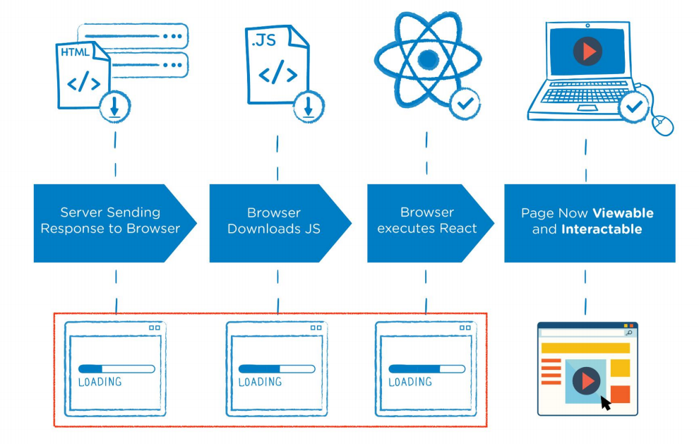
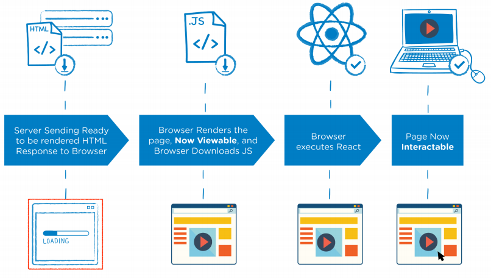
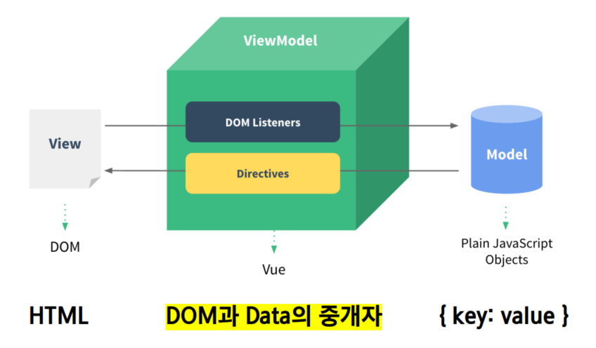
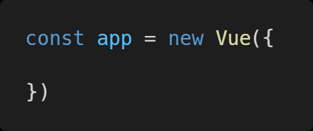
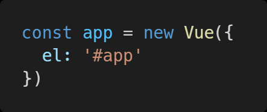
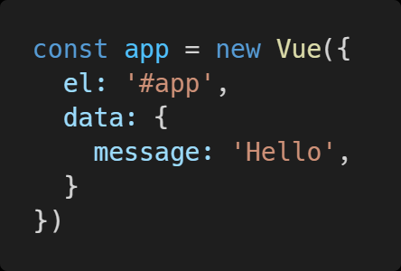
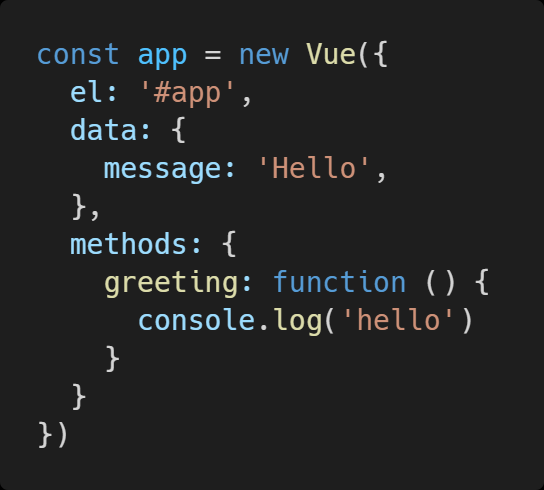
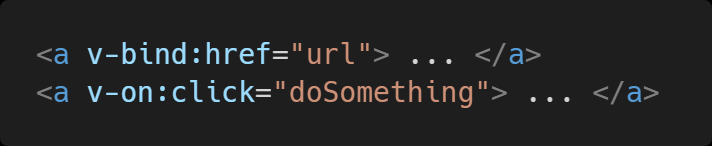
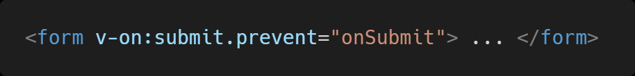

# 프론트엔드 개발

-  FrontEnd Development
  - 프론트엔드 개발은 HTML, CSS, 그리고 JavaScript를 활용해서 데이터를 볼 수 있게 만들어 줌
    - 이 작업을 통해 사용자는 데이터를 눈으로 볼 수 있고 데이터와 상호작용 할 수 있음
  - 대표적인 프론트엔드 프레임워크
    - Vue.js, React, Angular
- Vue.js
  - 사용자 인터페이스를 만들기 위한 프로그레시브 프레임워크
  - 현대적인 tool과 다양한 라이브러리를 통해 SPA(Single Page Aplication)를 완벽하게 지원

## SPA 와 CSR

### SPA

- SPA(Single Page Application)
  - 단일 페이지 애플리케이션
  - 현재 페이지를 동적으로 작성함으로써 사용자와 소통하는 웹 애플리케이션
  - 단일 페이지로 구성되며 서버로부터 처음에만 페이지를 받아오고 이후에는 동적으로 DOM을 구성
    - 즉, 처음 페이지를 받은 이후에는 서버로부터 완전한 새로운 페이지를 불러오지 않고
      현재 페이지를 동적으로 다시 작성함
    - 연속되는 페이지 간의 사용자 경험(UX)을 향상
    - 모바일 사용이 증가하고 있는 현재 트래픽의 감소와 속도, 사용성, 
      반응성의 향상은 매우 중요한 이슈이기 때문
  - 동작 원리의 일부가 CSR의 구조를 따름
- SPA 등장배경
  - 과거 웹 사이트들은 요청에 따라 매번 새로운 페이지를 응답하는 방식이었음
    - Multi Page Form (MPA)
  - 스마트폰이 등장하면서 모바일 최적화에 대한 필요성이 생김
    - 모바일 네이티브 앱과 같은 형태의 웹 페이지가 필요해짐
  -  이러한 문제를 해결하기 위해 Vue와 같은 프론트엔드 프레임워크가 등장
    - CSR, SPA의 등장
  - 1개의 웹페이지에서 여러 동작이 이루어지며 모바일 앱과 비슷한 형태의 사용자 경험을 제공

### CSR

-  CSR(Client Side Rendering)
  - 최초 요청 시 서버에서 빈 문서를 응답하고 이후 클라이언트에서 데이터를 요청해
    데이터를 받아 DOM을 렌더링하는 방식
  - SSR보다 초기 전송되는 페이지의 속도는 빠르지만,
    서비스에서 필요한 데이터를 클라이언트(브라우저)에서 추가로 요청하여
    재구성해야 하기 때문에 전제적인 페이지 완료 시점은 SSR보다 느림
  - SPA가 사용하는 렌더링 방식
-  CSR 장단점
   - 장점
     - 서버와 클라이언트 간의 트래픽 감소
       - 웹 애플리케이션에 필요한 모든 정적 리소스를 최초에 한번 다운로드
     - 사용자 경험 향상
       - 전체 페이지를 다시 렌더링하지 않고 변경되는 부분만을 갱신
   - 단점
     - SEO(검색엔진 최적화) 문제가 발생할 수 있음

### SSR 비교 

- SSR
  - Server Side Rendering
  - 서버에서 사용자에게 보여줄 페이지를 모두 구성하여 사용자에게 페이지를 보여주는 방식
  - 서버를 이용해서 페이지를 구성하기 때문에
    클라이언트에서 구성하는 CSR보다 페이지를 구성하는 속도는 늦지만
    사용자에게 보여주는 콘텐츠 구성이 완료되는 시점은 빨라짐
- SSR
  - 장점
    - 초기 로딩 속도가 빠르기 때문에 사용자가 컨텐츠를 빨리 볼 수 있음
    - SEO(검색엔진 최적화)가 가능
  - 단점
    - 모든 요청에 새로고침이 되기 때문에 사용자 경험이 떨어짐
      - • 상대적으로 요청 횟수가 많아져 서버 부담이 커짐

## SEO

- SEO

  - Search Engine Optimization (검색 엔진 최적화)

  - 웹 페이지 검색엔진이 자료를 수집하고 순위를 메기는 방식에 맞게

    웹페이지를 구성해서 검색 결과의 상위에 노출될 수 있도록 하는 작업

  - 인터넷 마케팅 방법 중 하나

  - 구글 등장 이후 검색엔진들이 컨텐츠의 신뢰도를 파악하는 기초 지표로 사용됨

    - 다른 웹 사이트에서 얼마나 인용되었나를 반영
    -  결국 타 사이트에 인용되는 횟수를 늘리는 방향으로 최적화

### SEO 문제 대응

- Vue.js 또는 React 등의 SPA 프레임워크는 SSR을 지원하는 SEO 대응 기술이 이미 존재
  - SEO 대응이 필요한 페이지에 대해서는 선별적 SEO 대응 가능
- 혹은 추가적으로 프레임워크를 사용하기도 함
  - Nuxt.js
    - Vue.js 응용 프로그램을 만들기 위한 Framework
    - SSR을 지원
  - Next.js
    - React 응용 프로그램을 만들기 위한 Framework
    - SSR을 지원

## SPA와 SSR을 함께 사용

- CSR과 SSR을 적절히 사용
  - 예를 들어, Django에서 Axios를 활용한 좋아요/팔로우 로직의 경우
    대부분은 Server에서 완성된 HTML을 제공하는 구조 (SSR)
  - 다만, 특정 요소(좋아요/팔로우)만 AJAX를 활용한 비동기요청으로 필요한 데이터를
    Client에서 서버로 직접 요청을 보내 받아오고 JS를 활용해 DOM을 조작 (CSR)

## Vue.js를 왜 사용해야하는가?

- 현대 웹 페이지는 페이지 규모가 계속해서 커지고 있으며
  그만큼 사용하는 데이터도 늘어나고
  사용자와의 상호작용도 많이 이루어짐

- 결국 Vanilla JS 만으로는 관리하기가 어려움
  예시) “페이스북의 친구가 이름을 변경했을 경우 변경되어야 하는 것들”
  타임라인의 이름, 페이스북 메시지 상의 이름, 내 주소록에서의 친구 이름 등

  → 페이스북이 React를 개발한 이유

# Vue 디자인 패턴

- MVVM 패턴
  - 애플리케이션 로직을 UI 로부터 분리하기 위해 설계된 디자인 패턴
  - 구성요소
    1. Model
       - Vue에서 Model은 JavaScript Object다.
       - JavaScript의 Object 자료 구조
       - 이 Object는 Vue Instance 내부에서 data로 사용되는데 이 값이 바뀌면 View(DOM)가 반응
    2. View
       - Vue에서 View는 DOM(HTML)이다
       - Data의 변화에 따라서 바뀌는 대상
    3. View Model
       - Vue에서 ViewModel은 모든 Vue Instance이다
       - View와 Model 사이에서 Data와 DOM에 관련된 모든 일을 처리
       - ViewModel을 활용해 Data를 얼마만큼 잘 처리해서 보여줄 것인지(DOM)를 고민하는 것

#  Vue 문법

- https://kr.vuejs.org/v2/guide/index.html

- Vue 함수 객체 내에서 vue 인스턴스를 가리킴
- 단, JavaScript 함수에서의 this 키워드는
  다른 언어와 조금 다르게 동작하는 경우가 있음
- 화살표 함수를 사용하면 안되는 경우
  - data
  - method 정의

## Vue 인스턴스

- 모든 Vue 앱은 Vue 함수로 새 인스턴스를 만드는 것부터 시작
- Vue 인스턴스를 생성할 때는 Options 객체를 전달해야 함
  - 여러 Options들을 사용하여 원하는 동작을 구현
- Vue Instance === Vue Component

### element  - el

- Vue 인스턴스에 연결(마운트) 할 기존 DOM 엘리먼트가 필요
- CSS 선택자 문자열 혹은 HTMLElement로 작성
- new 를 이용한 인스턴스 생성때만 사용

### data

- Vue 인스턴스의 데이터 객체
- Vue 앱의 상태 데이터를 정의하는 곳
- Vue template에서 interpolation을 통해 접근 가능
- v-bind, v-on과 같은 디렉티브에서도 사용 가능
  - v-bind 
    - 동적으로 하나 이상의 컴포넌트 속성 또는 표현식을 바인딩함
  - v-on
    - 엘리먼트에 이벤트 리스너를 연결
- Vue 객체 내 다른 함수에서 this 키워드를 통해 접근 가능
- 주의
  - 화살표 함수를 `data`에서 사용하면 안됨
  - 화살표 함수가 부모 컨텍스트를 바인딩하기 때문에, `this`는 예상과 달리 Vue 인스턴스를 가리키지 않음

### methods

- Vue 인스턴스에 추가할 메서드
- Vue template에서 interpolation을 통해 접근 가능
- v-on과 같은 디렉티브에서도 사용 가능
- Vue 객체 내 다른 함수에서 this 키워드를 통해 접근 가능
- 주의
  - 화살표 함수를 메서드를 정의하는데 사용하면 안됨
  - 화살표 함수가 부모 컨텍스트를 바인딩하기 때문에,
    `this`는 Vue 인스턴스가 아니며 `this.a`는 정의되지 않음

## Template Syntax

- 랜더링 된 DOM을 기본 Vue 인스턴스의 데이터에 선언적으로 바인딩할 수 있는 HTML 기반 템플릿 구문 사용
  - 보간법(Interpolation)
  - 직접법(Directive)

### 보간법(Interpolation)

- Text
  - `메시지: {{ msg }}`
- Raw HTML
  - ``
- Attributes
  - `

`
- JS 표현식
  - `{{ number + 1 }}`
  - `{{ message.split('').reverse().join('') }}`

### 디렉티브(Driective)

- v-접두사가 있는 특수 속성
- 속성 값은 단일 JS 표현식이 됨(v-for 예외)
- 표현식의 값이 변경될 때 반응적으로 DOM에 적용하는 역할을 함
- 전달인자(Arguments)
  - `:` (콜론)을 통해 전달인자를 받을 수도 있음

- 수식어(Modifiers)

  - `.` (점)으로 표시되는 특수 접미사
  - 디렉티브를 특별한 방법으로 바인딩 해야함을 나타냄

