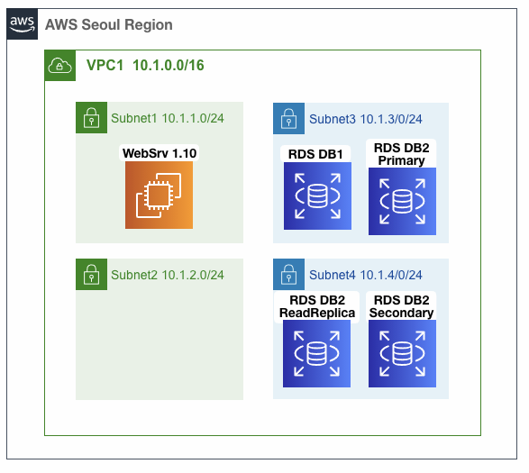
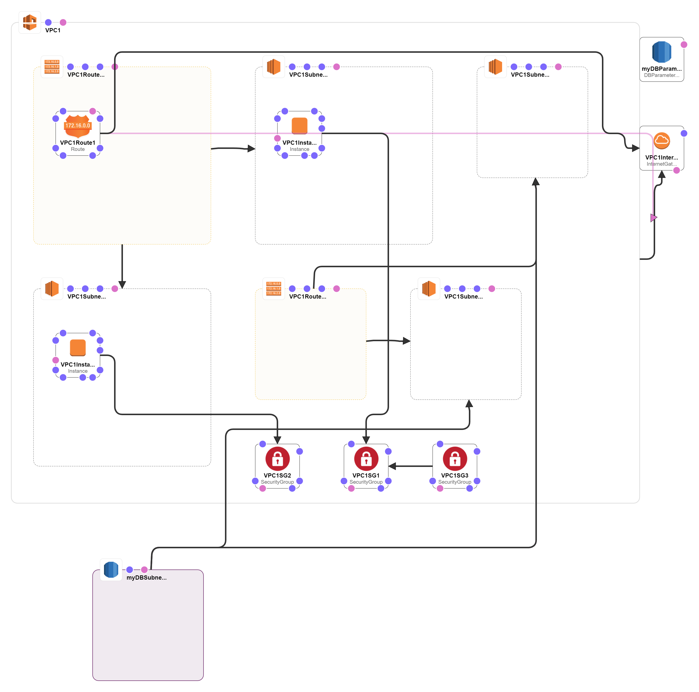
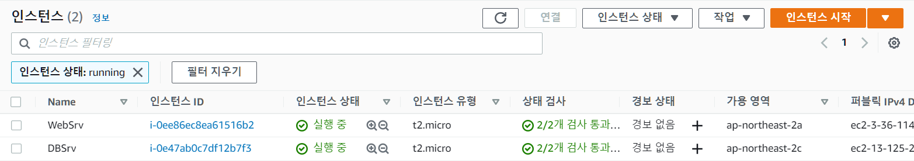
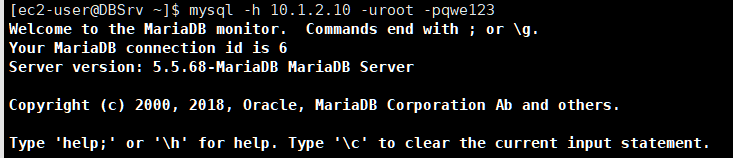
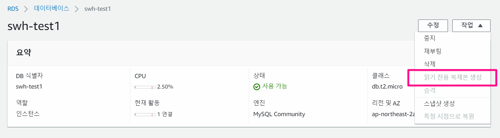

- 실습목표

  - EC2를 이용하여 웹서버랑 DB 서버를 배포
  - RDS를 통한 DB 배포
  - 개발/테스트 버전의 RDS 를 이용하여 2가지를 실험
    - Amazon RDS Multi-AZ 를 통한 내결함성
      - **내결함성**이란 시스템의 일부 구성 요소가 작동하지 않더라도 계속 작동할 수 있는 기능
    - Amazon RDS Read Replica 를 이용한 분산서비스



# 1. CloudFormation으로 배포

- 만들어진 내용
  - 하나의 VPC 안에
  - 4개의 Subnet
  - 그중 2개에 각각 EC2 서버설치
    - 하나는 WebSrv(웹서버)
      - subnet1 10.1.1.0/24
    - 하나는 DBSrv(데이터베이스 서버)
      - subnet2 10.1.2.0/24








# 2. WebSrv에서 DBSrv 접근

- 현재 EC2를 구성할 때,  DB서버에 접근을 용이할 수 있게 DBMS에 모니터링 툴이 이미 설치되어 있음

1. WebSrv에서 퍼블릭 IP로 Xshell로 열고 - DBSrv의 MySQL 접근하기

   ```bash
   # IP확인 및 DBSrv ping 테스트
   ip a
   ping 10.1.2.10
   
   # DBSrv 로 MySQL 접속 (계정 정보: root/qwe123)
   mysql -h 10.1.2.10 -uroot -pqwe123
   ```




1-1 (부록)DBSrv에서 MySQL 들어가는 법

```shell
# IP확인
ip a

# MySQL 접속 (계정 정보: root/qwe123)
mysql -uroot -pqwe123
```


2. SQL 문 사용해보기
   - 주의점 - 문법 끝날 떄 `;` 꼭 넣어주기 
   - 실습을 위해 만들어놓은 DB 3개
     - employees
     - sample
     - sqlDB

```shell
# MariaDB monitor 접속
Welcome to the MariaDB monitor.  Commands end with ; or \g.
...

# DB 서버의 상태 정보
MariaDB [(none)]> status;

# 데이터베이스(=스키마) 확인
SHOW DATABASES;

# employees 데이터베이스 선택 하기
USE employees;
MariaDB [(none)]> USE employees;
MariaDB [employees]>

# 테이블 확인
SHOW TABLES;

# 테이블 필드와 타입 등 정보 확인
DESC employees;

# employees 테이블 조회 하기
SELECT * FROM employees;
SELECT * FROM employees LIMIT 10;
SELECT * FROM employees LIMIT 100;

# 특정 열(컬럼=필드) 기준 오름/내림차순으로 정렬 조회 하기
# -- 공백이 있는 개체의 이름 사용 시는 백틱(backtick) `` 으로 묶어줘야 하나의 이름으로 인식함
SELECT * FROM employees ORDER BY `emp_no` DESC LIMIT 100;
SELECT * FROM employees ORDER BY `birth_date` ASC LIMIT 100;

# 특정 열(컬럼) 만 출력
SELECT first_name, last_name, gender FROM employees LIMIT 50;

# 특정 행(=로우=레코드)만 출력 - Mary 이름(first_name) , Baba 성(last_name)
SELECT * FROM employees WHERE first_name = 'Mary';
SELECT * FROM employees WHERE last_name = 'Baba';
```


# 2. RDS(mysql) 배포

1. RDS 검색 > 데이터베이스 생성  (첫번째 db 생성- 프리티어)

   - 데이터베이스 생성방식 선택 - 표준생성
   - 엔진유형 - MySQL
   - 템플릿 - 프리티어
   - 설정
     - DB 인스턴스 식별자 - `swh-test1`
     - 마스터사용자 이름 - root
     - 마스터 암호(암호확인) : qwe12345
   - DB 인스턴스 클래스 : 버스터블 클래스(t 클래스 포함) db.t2.micro
   - 스토리지 - 디폴트
   - 다중 AZ 배포
     - 프리티어 버전이라 선택이 안됨
   - 연결
     - VPC : DB-VPC1
     - 퍼블릭액세스 - 아니요
     - VPC 보안 그룹 : ##-VPC1SG3-## 포함된것 선택 , 기본 default 는 제거
       - Database 접근을 위해 만든 DB port(3306) 전용의 정책이 들어가있음
     - 가용 영역 : ap-northeast-2a

   - 추가 구성 : 클릭
     - 초기 데이터베이스 이름 : sample
     - DB 파라미터 그룹 : ##-mydbparametergroup-## 포함된것 선택
     - 백업 보존 기간 : 0일(백업을 하지 않겠다라는 의미)
     - 모니터링 - 활성화 X
     - 유지 관리 기간 : 선택 기간 → 일요일 , 01 :00 , 0.5시간
       - 지정하지 않으면 업무 중에 aws RDS가 재부팅이 되거나 혹은 업데이트를 받게될 수도 있음

   


2. RDS 검색 > 데이터베이스 생성  (두번째 db 생성 - 개발/테스트)
   - 데이터베이스 생성방식 선택 - 표준생성
   - 엔진유형 - MySQL
   - 템플릿 - 개발/테스트버전
   - 설정
     - DB 인스턴스 식별자 - `swh-test1`
     - 마스터사용자 이름 - root
     - 마스터 암호(암호확인) : qwe12345
   - DB 인스턴스 클래스 : 버스터블 클래스(t 클래스 포함) db.t2.micro (이전 세대 클래스 포함 체크)
   - 스토리지 - 디폴트
   - 다중 AZ 배포 - 스토리지 - 디폴트다중 AZ 배포
     - db를 복제해 사용하기 위해 사용함
   - 연결
     - VPC : DB-VPC1
     - 퍼블릭액세스 - 아니요
     - VPC 보안 그룹 : ##-VPC1SG3-## 포함된것 선택 , 기본 default 는 제거
       - Database 접근을 위해 만든 DB port(3306) 전용의 정책이 들어가있음
     - 가용 영역 : ap-northeast-2a
   - 추가 구성 : 클릭
     - 초기 데이터베이스 이름 : sample
     - DB 파라미터 그룹 : ##-mydbparametergroup-## 포함된것 선택
     - 백업 보존 기간 : 35일
     - 모니터링 - 활성화 X
     - 유지 관리 기간 : 선택 기간 → 일요일 , 01 :00 , 0.5시간
       - 지정하지 않으면 업무 중에 aws RDS가 재부팅이 되거나 혹은 업데이트를 받게될 수도 있음


# 3. WebSrv 와 RDS 연결하기

1. WebSrv 를 Xshell을 이용하여 접근하고, aws RDS 확인하기

```shell
# 변수 지정
RDS1=프리티어rds 엔드포인트
RDS2=개발/테스트버전RDS 엔드포인트

# 변수 지정 확인
echo $RDS1
echo $RDS2

# dig 질의 - 도메인 조회(subnet 주소 확인)
dig +short $RDS1
dig +short $RDS2

# mysql 접속 - exit로 나갈 수 있음
mysql -h $RDS1 -uroot -pqwe12345
mysql -h $RDS2 -uroot -pqwe12345

# 상태정보 및 데이터베이스 확인
status;
show databases;
```


2. WebSrv 의 index.php 수정 후 WebSrv 에서 AWS RDS1 DB 사용
   - 원래는 EC2로 배포한 DBsrv를 참조하고 있었지만, RDS로 바꾸는 것
   - WebSrv 의 Public IP로 접근하면 사용 DB가 rds로 바뀜

```shell
# 상태정보 및 데이터베이스 확인 - 다 바꾼 후 ctrl+x > Y > enter
sudo su - 
nano /var/www/html/index.php

## 아래 DB 주소와 암호를 변경
<?php
define('DB_SERVER', '자신의RDS1 엔드포인트 주소');
define('DB_USERNAME', 'root');
define('DB_PASSWORD', 'qwe12345');
define('DB_DATABASE', 'sample');
?>
```


# 4. RDS Multi-AZ


## 프리티어 RDS 에 적용하기

1. 백업(0일) 미사용 상태에서 '읽기 복제본 생성' 가능 확인
   - 만들 수 없는 것을 확인할 수 있음





2. DB수정 → '다중 AZ 배포' (대기 인스턴스 생성)클릭, 백업(35일) → 계속 → 즉시 적용 → DB 인스턴스 수정 클릭 ⇒ 17분 정도 시간 소요


## 개발/테스트 RDS 에 적용하기

1. WebSrv에서 index.php를 수정하여 WebSrv에서 AWS RDS2 DB를 사용하도록 수정
   - WebSrv 의 Public IP로 접근하면 사용 DB가 rds로 바뀜

```shell
# RDS 확인하기
[root@WebSrv ~]# RDS2=swh-test2.ckm3nprg4gom.ap-northeast-2.rds.amazonaws.com
[root@WebSrv ~]# echo $RDS2
swh-test2.ckm3nprg4gom.ap-northeast-2.rds.amazonaws.com
[root@WebSrv ~]# dig +short $RDS2
10.1.4.233

# 상태정보 및 데이터베이스 확인 - 다 바꾼 후 ctrl+x > Y > enter
sudo su - 
nano /var/www/html/index.php

## 아래 DB 주소와 암호를 변경
<?php
define('DB_SERVER', '자신의RDS1 엔드포인트 주소');
define('DB_USERNAME', 'root');
define('DB_PASSWORD', 'qwe12345');
define('DB_DATABASE', 'sample');
?>
```


2. 변경 조회를 위해 다른 콘솔창에 반복조회 돌려두기

```shell
# mysql 접속 후 데이터 확인 반복 → 아래 재부팅 시 동작 확인을 위함 (ctrl+c 로 탈출가능)
while true; do mysql -h $RDS2 -uroot -pqwe12345 -e "USE sample;SELECT * FROM EMPLOYEES;"; date; sleep 1; done

# (옵션) dig 조회 → IP 변경 확인을 위함
while true; do dig +short $RDS2; date; sleep 1; done
```


3. RDS2 재부팅하기
   - RDS2 → 작업 → 재부팅 → '장애 조치로 재부팅 (Check)' → 확인
     - 백업서버를 사용할 것이냐는 물음과 같음
   - 약 2분 20초 정도 장애로 접근이 안되고 난 후 다시 접근이 됨
     - 다른 AZ에 있는 백업본으로 자동으로 대체됨
     - 반복조회에서 ip가 변경되는 것을 확인할 수 있음


# RDS Read Replica

1. RDS2 작업 → 읽기 복제본 생성  ⇒ 10분 정도 시간 소요
   - DB 인스턴스 식별자 : *swh-test2-readonly* *(현재 AWS 리전에서 AWS 계정이 소유하는 모든 DB 인스턴스에 대해 유일, 각자 편하게 설정)* 
   - AWS 리전 : Asia Pacific (Seoul) 
   - 다중 AZ 배포 : 대기 인스턴스를 생성하지 마십시오
2. ReadReplia Endpoint 확인 및 mysql 접속 후 확인

```shell
RDS2=gasidards2.cb79jlim4dyq.ap-northeast-2.rds.amazonaws.com
RDS2Read=gasidards2-readonly.cb79jlim4dyq.ap-northeast-2.rds.amazonaws.com

# mysql 접속 후 데이터 확인
while true; do mysql -h $RDS2 -uroot -pqwe12345 -e "USE sample;SELECT * FROM EMPLOYEES;"; date; sleep 1; done
while true; do mysql -h $RDS2Read -uroot -pqwe12345 -e "USE sample;SELECT * FROM EMPLOYEES;"; date; sleep 1; done

# 마스터 DB에서 정보 확인 : 마스터 DB에 바이너리 로그를 이용하여 복제를 구현
mysql -h $RDS2 -uroot -pqwe12345 -e "show master status;"
+----------------------------+----------+--------------+------------------+-------------------+
| File                       | Position | Binlog_Do_DB | Binlog_Ignore_DB | Executed_Gtid_Set |
+----------------------------+----------+--------------+------------------+-------------------+
| mysql-bin-changelog.000010 |      156 |              |                  |                   |
+----------------------------+----------+--------------+------------------+-------------------+

# 읽기 복제본 DB에서 정보 확인
mysql -h $RDS2Read -uroot -pqwe12345 -e "show slave status\G"
                  Master_Host: 172.23.1.176
                  Master_User: rdsrepladmin
              Master_Log_File: mysql-bin-changelog.000010 ⇒ 마스터 DB의 바이너리 로그
          Read_Master_Log_Pos: 156
               Relay_Log_File: relaylog.000009
                Relay_Log_Pos: 277
        Relay_Master_Log_File: mysql-bin-changelog.000010 ⇒ 복제 동기화를 실행하는 바이너리 로그
             Slave_IO_Running: Yes
            Slave_SQL_Running: Yes
					Exec_Master_Log_Pos: 156
```


# 자원 삭제하기

1. RDS 삭제

   - 최종 스냅샷 생성 여부( 체크 해제)

   - 인스턴스 삭제 시 시스템 스냅샷 및 특정 시점으로 복구를 포함한 자동화된 백업을 더 이상 사용할 수 없다는 점을 인정합니다 ( 체크 )

2. CloudFormation 삭제

