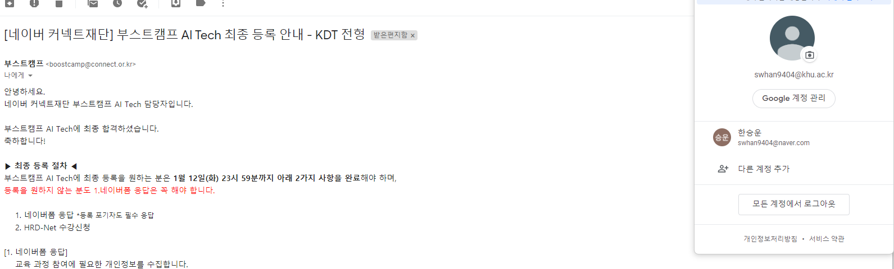

undefined

어렵지 않게 두개 다 합격이 되었다.
다만 두개가 다 되어버리니, 진짜 무슨 교육을 들어야하는가에 대해서는 정말 고민이 심한 상태이다.

# 내가 생각한 서로의 장단점이다
- ssafy
  - 취업컨설팅부터, 코딩까지 폭넓은 교육을 해준다.
  - 현재 5기로, 나름 괜찮은 프로그램이라고 소문이 많고, 5기까지나 진행이 되었기 때문에 대기업이나 기업에 갔을 때 SSAFY 출신의 사람을 만날 확률이 높아진다
  - 빼놓을 수 없는 월 100만원 지원금
  - 오프라인 기반 수업 - 정말 훌륭한 교육 시설을 가지고 있다.
  - 총 교육기간이 1년으로 기간이 길다
  
- BoostCampAI 
  - 엄청난 강사진(김성훈 교수 등 우리나라 내놓으라하는 인공지능 업계인들)
  - 처음으로 생긴 교육이기 떄문에 커리큘럼이나 이런 것이 어느정도 갖추어져 있는지 살짝 걱정이 된다.
  - 온라인 특화 수업 - 인공지능이란 꽤나 난이도 있는 분야를 공부하는데 온라인만으로 과연 해결이 될지 의문
  - 인공지능분야에 대한 인력을 뽑는 것이 기본적으로 석사부터인데, 네이버에서 주관하는 이 교육을 들으면 그나마 인공지능 취업을 할 수 있는 길이 학사에게 열리지 않을까 싶음
  
둘 다 너무 좋은 교육이기 때문에 너무 많은 고민이된다. 하지만 최종적으로 나는 SSAFY를 지원하기로 했다.

# 최종적으로SSAFY 선택 이유
  - 인공지능 분야를 원하지만, 연구직을 원하는 것이 아님, 내가 원하는 것은 실제로는 인공지능을 이용한 실시간 서비스 구현 쪽에 더 가까움
  - 만약에 내가 공부를 하다가 나하고 인공지능이 맞지 않다고 판단되거나, 학사 수준으로 도저히 내가 원하는 회사를 가기 힘들다고 판단될 경우 다른 분야로 넘어가는데 더 용이할 수 있다고 판단
  - 사실, 지금까지 취업을 실제로 시도한 기간이 너무나도 짧기 때문에 어떻게 기업을 찾아야하는지, 내가 찾은 기업을 어떻게 분석하고 접근해야하는지에 대해서 아무런 정보가 없었다. 근데 SSAFY 에서는 취업컨설턴트도 있고, 취업관련 특강들도 있어서 단지, 현재 취업뿐만 아니라 미래의 이직에도 도움이 될 것이라고 판단했다.
  - 오프라인 기반의 수업 - 나는 온라인 학습의 효과성에 대해 크게 의구심을 가지고 있다. 특히나 프로그래밍같이 협업이 굉장히 중요한 업무는 팀원간의 소통이나 친밀도를 올리는 것이 굉장히 중요하다고 생각하는데, 이러한 점에서 SSAFY가 BoostCampAI보다 나을 것이라 판단했다.
 
