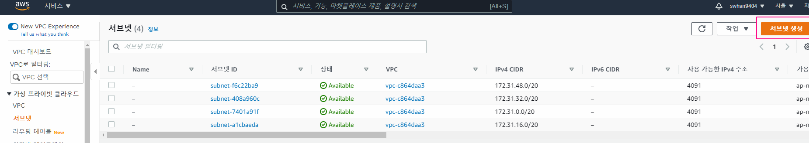

- 실습목표
  - 퍼블릭 서브넷을 통한 인터넷 연결
  - 프라이빗 서브넷을 통한 인터넷 연결
  - 2가지를 구현하고, 무엇이 다른지 차이를 경험해보는 것


# 실습


## 프라이빗 서브넷 생성

1. 서브넷 > 가상프라이빗 클라우드 > 서브넷> 서브넷 생성 버튼



2. 서브넷 설정 후 생성
   - VPC - 방금 만들었던 CloudNeta-VPC
   - 서브넷 이름 - CloudNeta-Private-SN
   - 가용영역 - 아시아 태평양 (서울) / ap-northeast-2c
   - IPv4 CIDR 블록 - 10.0.1.0/24


- 현재 상태
  - VPC 내에 public 서브넷과 private 서브넷이 존재
  - 프라이빗 서브넷은 아직 기본 라우팅 테이블 이용


## NAT 게이트웨이 만들기

> 주의 : Free Tier Plan 에서도 [NAT Gateway 사용 시간](https://aws.amazon.com/ko/vpc/pricing/)(1h $0.059) 비용 발생됨 → 실습 후 바로 삭제 확인 필요.

1. 서브넷 > 가상프라이빗 클라우드 > NAT 게이트웨이 >  NAT 게이트웨이 생성 버튼


2. NAT 게이트웨이 설정 후 생성

   - 이름 : CloudNeta-NAT

   - 서브넷 : CloudNeta-Public-SN

     - 프라이빗 서브넷으로 연결하게 되면 외부와 접근할 수 없는 형태가 되어버리기 때문에 public 서브넷으로 연결시켜주어야한다.
     - NAT 게이트웨이는 프라이빗 서브넷을 외부 인터넷 구간과 통신하게 해주는 역할이지만 위치상으로는 퍼블릭 서브넷에 배치 되어야한다.

   - 탄력 IP 할당 클릭

     

## 라우팅테이블 생성

1. 서브넷 > 가상프라이빗 클라우드 > 라우팅 테이블> 라우팅 테이블 생성 버튼
2. 라우팅테이블 설정 후 생성
   - 이름 : CloudNeta-Private-RT
   - VPC : CloudNeta-VPC

3. 서브넷 연결 - 서브넷 연결 편집
   - CloudNeta-Private-SN 연결 추가
4. 라우팅 - 라우팅편집 - 라우팅 추가
   - 0.0.0.0/0
   - CloudNeta-NAT 선택


## EC2 생성

1. AMI 선택

   - Amazon Linux 2 AMI : 64bit(x86) 선택

2. 인스턴스 유형 선택

   - t2.micro vCPU(1) MEM(1GiB)' 선택

3. 인스턴스 세부 구성

   - 네트워크 : CloudNeta-VPC
   - 서브넷 : CloudNeta-Private-SN
   - 퍼블릭 IP 자동 할당 : 비활성화
   - 사용자 데이터-  서버 실행시 자동 실행
     - 프라이빗 서브넷이기 때문에 외부에서 키를 통한 접근이 제약되어 있음
     - 접근을 용이하게 하기 위해 유저 데이터를 입력하는 것
     - PasswordAuthentication - 패스워드 인증을 사용하겠다
     - PermitRootLogin - 그 패스워드의 root를 사용하겠다
     - 비밀 번호는 qwe123 으로 설정한 것

   ```shell
   #!/bin/bash
   (
   echo "qwe123"
   echo "qwe123"
   ) | passwd --stdin root
   sed -i "s/^PasswordAuthentication no/PasswordAuthentication yes/g" /etc/ssh/sshd_config
   sed -i "s/^#PermitRootLogin yes/PermitRootLogin yes/g" /etc/ssh/sshd_config
   service sshd restart
   ```

   

   

4. 스토리지 추가 - 기본값

5. 태그추가

   - Name : Private-EC2

6. 보안그룹 - 기본값


## EC2 접근

- 아까 public 서브넷에 만들어놨던 EC2 가 연결되어 있는 상황에서 해야함

- `SSH root@10.0.1.27`
  - 뒤에 주소는 프라이빗 서브넷에 만든 EC2의 프라이빗IPv4 를 쓰면됨
  - 접근하게 되면 아까 사용자 데이터로 넣어놨던 비밀번호를 입력하면 됨


## 자원 삭제

1. EC2 인스턴스 종료 (EC2 → 인스턴스 → 인스턴스 선택 → 작업 → 인스턴스 상태 → 종료)

2. NAT 게이트웨이 삭제 (VPC → NAT 게이트웨이 → 작업 → NAT 게이트웨이 삭제)
   - NAT 게이트웨이 삭제될 때까지 기다립니다.
3. 탄력적 IP 삭제 (VPC → 탄력적 IP → Actions → 탄력적 IP 주소 **릴리스**)
4. VPC 삭제 (VPC → VPC → 작업 → VPC 삭제)


# 실습 내용 이해하기

## NAT 인스턴스(NAT 게이트웨이와 유사)를 통한 외부 접속 시 트래픽 흐름에 따른 동작 설명


①	내부 인스턴스(10.40.2.101)에서 외부 웹서버(60.1.1.1)로 HTTP 접속을 시도합니다. ‘프라이빗 서브넷 라우팅 테이블’에 따라서 NAT 인스턴스로 트래픽을 보내게 됩니다.

②	NAT 인스턴스는 IP masquerading 기능을 통해서 출발지 IP(10.40.2.101 → 10.40.1.100)와 포트 번호를 변환하고 정보를 기록합니다. 이후 ‘퍼블릭 서브넷 라우팅 테이블’에 따라서 인터넷 게이트웨이로 트래픽을 보내게 됩니다.

③	인터넷 게이트웨이는 프라이빗 IP와 탄력적 IP간의 IP 변환(NAT)을 수행합니다. 출발지 IP를 10.40.1.100에서 a.b.c.d로 변환하고 외부 인터넷으로 트래픽을 보냅니다.

④	외부 웹서버(60.1.1.1)에서 요청을 처리하고 응답 트래픽을 보냅니다.

⑤	인터넷 게이트웨이에 인입된 트래픽은 목적지 IP를 a.b.c.d에서 10.40.1.100으로 IP 변환(NAT)하여 VPC 내부로 보냅니다.

⑥	NAT 인스턴스는 ‘변환 정보’에 따라서 출발지 IP(10.40.1.100 → 10.40.2.101)와 포트 번호를 변환하여 프라이빗 서브넷으로 보냅니다.

⑦	최종적으로 응답 트래픽이 내부 인스턴스(10.40.2.101)로 도달하게 됩니다.