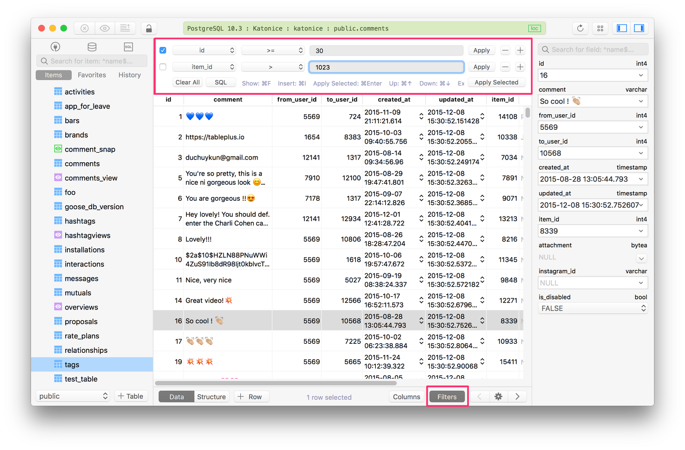

- 설치
  - https://tableplus.com/windows

- 장점

  - 이쁘다.
  - 탭 전환이나 데이터가 보여지는게 빨라서 가볍게 느껴진다. 그럼에도 불구하고 기능이 많다.
  - 쿼리 자동완성 기능도 있다.
  - 필터 기능이 있다.
  - 데이터 조회 Limit 걸기도 편하다.
  - 여러 종류의 저장소에 접속할 수 있다.(MongoDB, Redis, Cassandra 등..)

- 단점

  - 일부 기능은 유료다(특히 탭 3개 이상 못여는거..)

