- 실습 목표
  - 단일 퍼블릭 서브넷 VPC 실습환경을 단계적으로 구성
  - 단일 퍼블릭 서브넷에 속한 EC2 인스턴스가 외부 인터넷 구간으로 통신 되는 과정을 이해


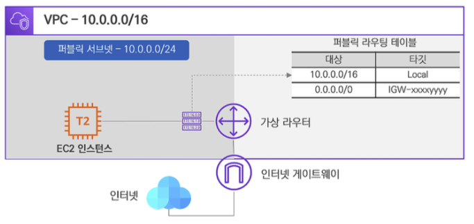


# 실습 내용


## VPC 생성하기

1. VPC > 가상프라이빗 클라우드 > VPC > VPC 생성 버튼

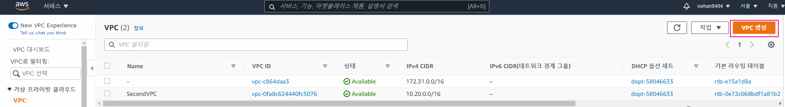

2. VPC 설정 후 생성
   - 이름 태그 : CloudNeta-VPC
   - IPv4 CIDR : 10.0.0.0/16


## 서브넷 생성하기

1. 서브넷 > 가상프라이빗 클라우드 > 서브넷> 서브넷 생성 버튼

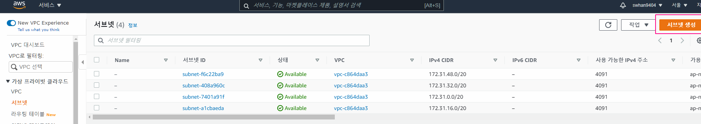

2. 서브넷 설정 후 생성
   - VPC - 방금 만들었던 CloudNeta-VPC
   - 서브넷 이름 - CloudNeta-Public-SN
   - 가용영역 - 아시아 태평양 (서울) / ap-northeast-2a
   - IPv4 CIDR 블록 - 10.0.0.0/24
     - VPC 내의 가용블럭 안에 들어가야함(?)

- 현재의 상황
  - VPC 에 퍼블릭 서브넷이 생성됨
    - 엄밀히 말하면 인터넷 게이트웨이가 아직 연결되지 않은 상황이라 프라이빗 서브넷이긴 함
  - 아직은 가상 라우터가 가지고 있는 기본 라우팅 테이블을 사용함


## 게이트웨이 생성

1. 서브넷 > 가상프라이빗 클라우드 > 인터넷 게이트웨이> 인터넷 게이트웨이 생성 버튼

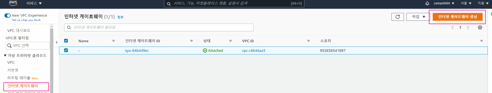


2. 게이트웨이 설정 후 생성

   - 이름 - CloudNeta-IGW

   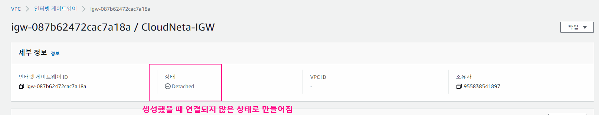


3. 게이트웨이 - VPC 연결
   - VPC - 방금 만들었던 CloudNeta-VPC 선택

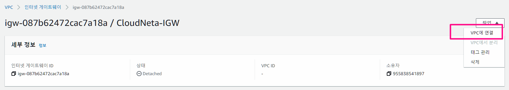


- 현재의 상황
  - 외부 인터넷 구간과 통신을 하기 위한 인터넷  게이트웨이를 생성하고 VPC 와 연결
  - 인터넷 구간으로 향하는 라우팅 경로가 없기 떄문에 외부 인터넷 통신은 불가능한 환경


## 라우팅 테이블 생성

1. 서브넷 > 가상프라이빗 클라우드 > 라우팅 테이블> 라우팅 테이블 생성 버튼

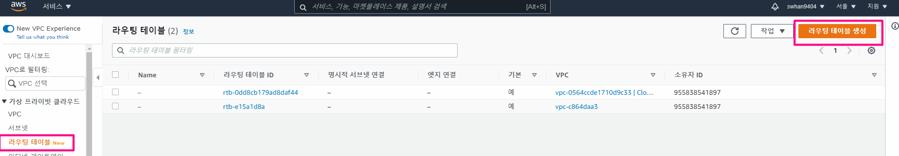


2. 라우팅테이블 설정 후 생성
   - 이름 : CloudNeta-Public-RT
   - VPC : CloudNeta-VPC


3. 라우팅 테이블에 서브넷 연결
   - CloudNeta-Public-SN 선택 후 연결 저장

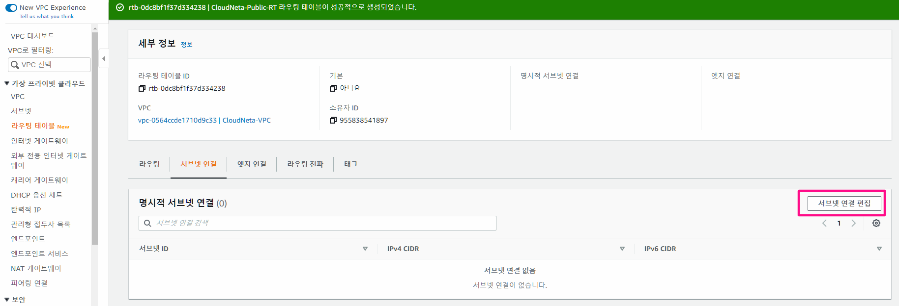


- 현재의 상황
  - 이제 퍼블릭 서브넷은 기본 라우팅 테이블이 아닌 새로 생성한 퍼블릭 라우팅 테이블을 사용


## 퍼블릭 라우팅 테이블 경로 추가

1. 서브넷 > 가상프라이빗 클라우드 > 라우팅 테이블> CloudNeta-Public-RT 선택 > 라우팅 > 라우팅 편집

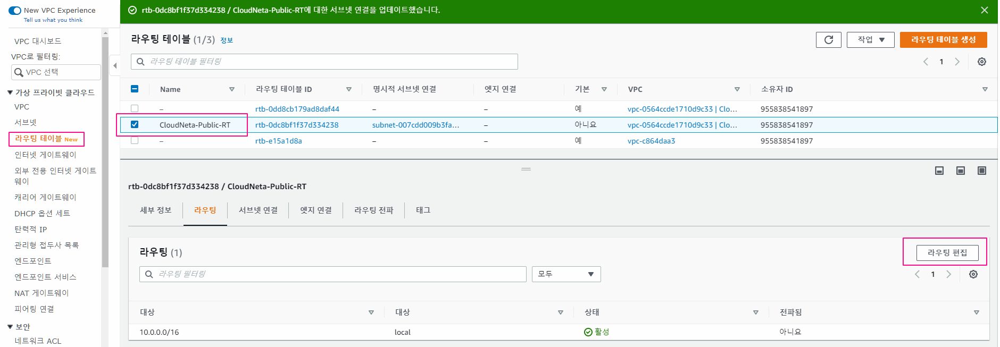


2. 라우팅 추가 후 저장

   - 대상 : 0.0.0.0/0
     - 모든 것
   - 대상 : cloudNeta-IGW
     - 아까 만든 인터넷 게이트웨이 연결

   

- 현재 상황
  - 라우팅 테이블에 외부 인터넷 구간과 통신할 수 있는 라우팅 경로 추가
  - 외부 인터넷 구간과 이제 통신이 가능한 상태


## EC2 만들기

1. AMI 선택
   - Amazon Linux 2 AMI : 64bit(x86) 선택
2. 인스턴스 유형 선택
   - t2.micro vCPU(1) MEM(1GiB)' 선택
3. 인스턴스 세부 구성
   - 네트워크 : CloudNeta-VPC
   - 서브넷 : CloudNeta-Public-SN
   - 퍼블릭 IP 자동 할당 : 활성화
     - 이 서브넷에 ip를 할당 받아야만 외부에 접근이 가능함
4. 스토리지 추가 - 기본값
5. 태그추가
   - Name : Public-EC2
6. 보안그룹 - 기본값


발급받은 프라이빗 key 파일을 이용해서 인스턴스 시작


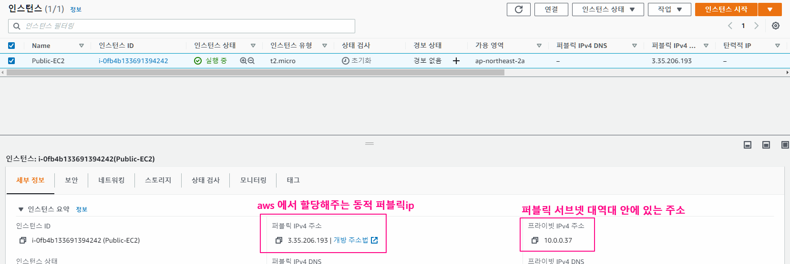
 

## EC2 접근해서 인터넷 연결 확인하기

1. Xshell을 켜서 
   - 호스트 : 퍼블릭ipv4 주소를 넣음


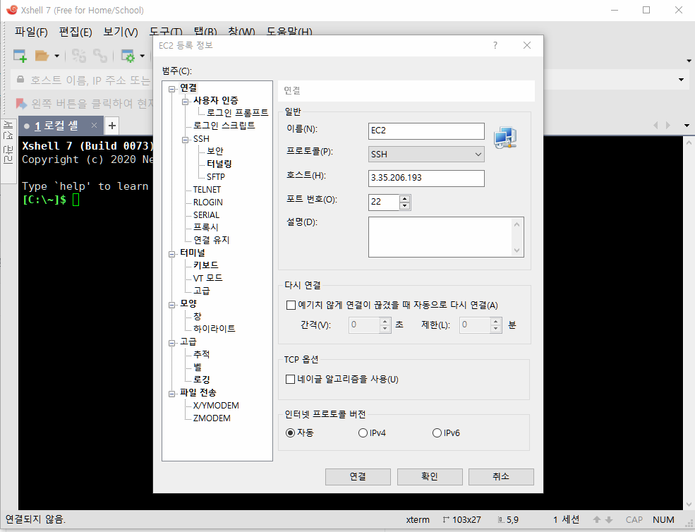


2. IP 정보확인

```shell
# 네트워크 인터페이스 정보 확인
ip a 혹은 ip -br -c addr show
ifconfig  ## 아재

# 라우팅 정보 확인
ip route list 혹은 ip route show
route -n 혹은 netstat -rn

# ARP 정보 확인
ip neigh show
arp -e

# DNS 서버 정보 확인
cat /etc/resolv.conf

# 외부 접속 시 공인IP 정보 확인
curl ipinfo.io
curl ipinfo.io/{IP입력} (예 curl ipinfo.io/18.139.223.56)
curl ipinfo.io/loc
## 카카오맵, 네이버맵, 구글 맵에서 위도경도로 대략 위치 확인 가능

(옵션) # 외부와 통신 경로 정보 확인
traceroute www.google.com
traceroute www.google.com -n
traceroute www.google.com -n -q 10

(옵션) # IP 에 대한 정보 확인
curl https://json.geoiplookup.io/{IP입력}
yum -y install jq
curl -s https://json.geoiplookup.io/13.125.27.235 | jq '.city'
"Seoul"
```

undefined
 

## EC2 중지 후 시작 

- 퍼블릭 ip 변경이 되는지 확인
  - 중지 전 : 3.35.206.193
  - 중지 후 재시작 : 52.79.93.145 
- ip가 변경된 것을 확인할 수 있음


# 실습 내용 정리

## 퍼블릭 서브넷 통신 흐름

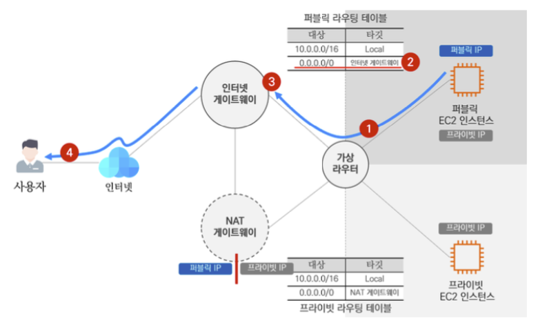

① 퍼블릭 서브넷의 퍼블릭 EC2 인스턴스가 외부 인터넷 구간과 통신하기 위해 데이터를 가상 라우터로 전달합니다. (퍼블릭 IP 사용)

② 가상 라우터는 퍼블릭 라우팅 테이블을 참고하여 인터넷 게이트웨이로 향하는 라우팅 경로를 확인합니다.

③ 가상 라우터는 인터넷 게이트웨이로 데이터를 전달하고 인터넷 구간으로 넘어갑니다.

④ 인터넷 구간을 통해 결국 사용자에게 전달합니다.


## 인터넷 게이트웨이를 통한 외부 접속 과정

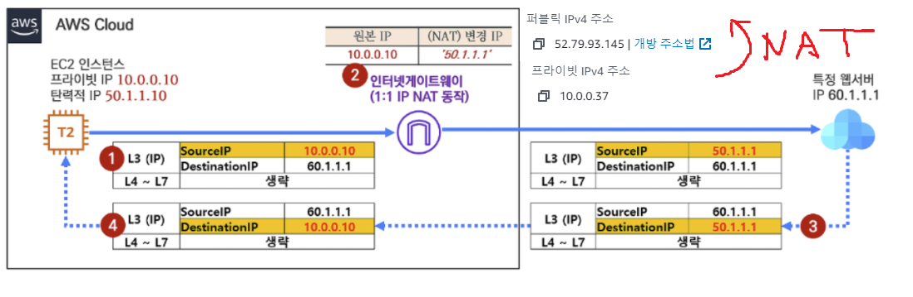

① 내부 인스턴스(10.0.0.10)에서 외부 웹서버(60.1.1.1)로 HTTP 접속을 시도합니다. 이때 출발지 IP를 10.0.0.10으로 하여 요청 트래픽을 생성하여 보내게 됩니다.

② 인터넷 게이트웨이는 출발지 IP를 확인하고 자신이 가지고 있는 NAT 정보에 의해서 출발지 IP를 50.1.1.1로 변경하는 NAT 동작을 수행합니다.

③ 외부 웹서버(60.1.1.1)에서 요청을 처리하고 응답 트래픽을 보냅니다. 되돌아오는 트래픽이므로 출발지 IP와 목적지 IP는 뒤바뀌게 됩니다.

④ 인터넷 게이트웨이는 다시 한번 NAT 정보에 의해서 목적지 IP를 50.1.1.1에서 10.0.0.10으로 변경하고, VPC 내부로 전달하여 최종적으로 내부 인스턴스(10.0.0.10)로 도달하게 됩니다.

