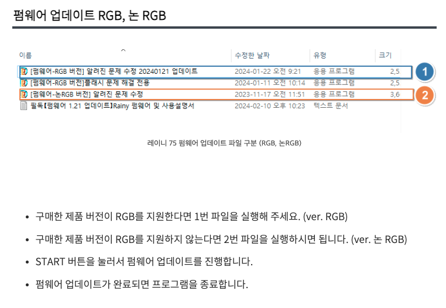
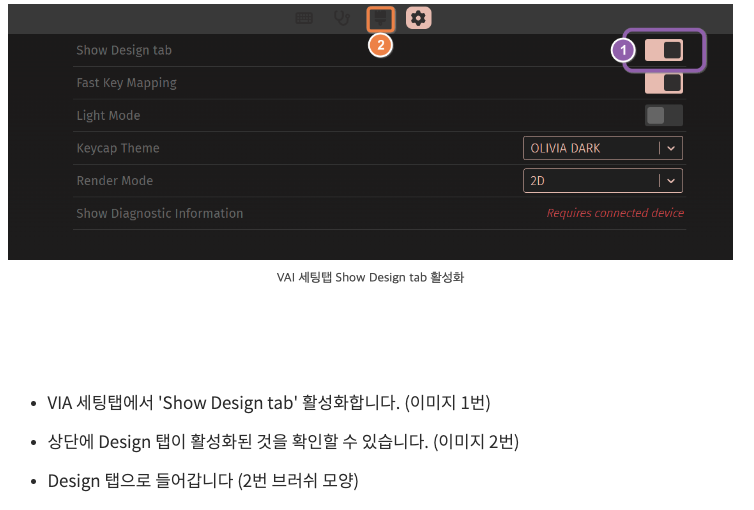
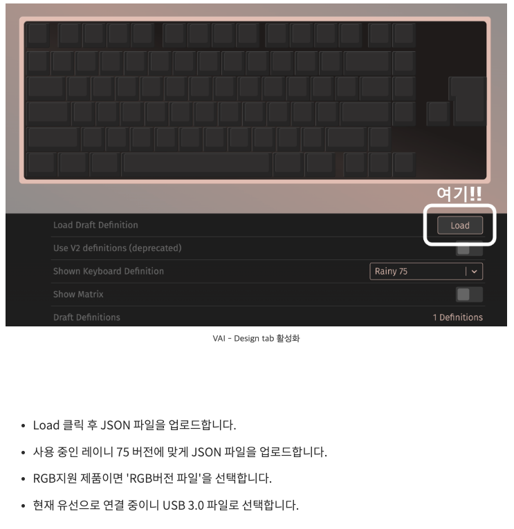
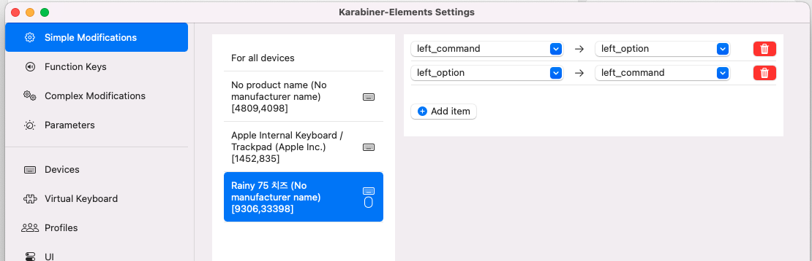

## Fn 키 기능

| 키조합 | 기능 |
|------|---|
| Fn+Tab| 연결모드 변경 ( ESC - 유선 / F1~F3 블루투스 /  F4 와이파이 ) |
| Fn+Win | win Key lock on/off |
| Fn+space | 배터리 잔여량 확인 |
| Fn+H | 초저지연모드 |
| Fn + Backspace | 키보드 백라이트 On/Off |
| Fn + \ | 백라이트 모드 변경 |
| Fn + Enter | 백라이트 컬러변경 | 
| Fn +  위 방향키 | 백라이트 밝기 증가 | 
| Fn +  아래 방향키 | 백라이트 밝기 감소 | 
| Fn +  왼쪽 방향키 | 백라이트 밝기 속도 감소 | 
| Fn +  오른쪽 방향키 | 백라이트 밝기 속도 증가 | 

## 블루투스 연결 방법

1. CapsLock 버튼을 벗겨내면 무선 기능 On/Off 스위치가 있음. 해당 스위치 ON
2. Fn+ F1~F3 (지정할 버튼으로) 길게 눌르면, 페어링 모드가 진입되었다고 빠르게 깜빡이는 것을 확인
3. 연결완료

## 펌웨어 업데이트
http://woblab.cn/col.jsp?id=109

- 키보드는 유선 연결이후 
JSON 파일 20140122.rar 다운로드 해주세요.
Rainy75 펌웨어 20140122.rar 다운로드 해주세요.

## VIA 세팅
https://usevia.app/
참고 : Right Alt = 한영키

## 나의 Karabiner 세팅

