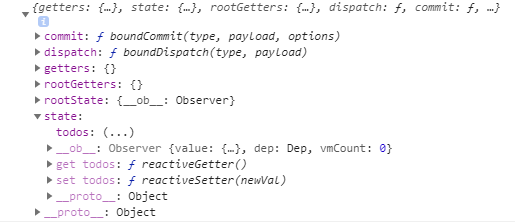
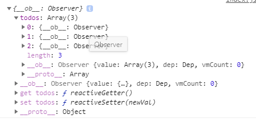

# 실습시작-  status 작성, 수정 

## vuex 설치

1. `vue add vuex`
   - vue CLI 라이브러리에 이미 포함되어 있음
   - 폴더 구조 변화 확인
     - store - index.js 생김


## 불필요한 요소 제거

1. `components > HelloWorld.vue` 제거
2. `App.vue`에서 HelloWorld(template, import, components)와 img 관련 요소 제거
3. vue 만들기
   - TodoForm.vue
   - TodoList.vue
   - TodoListItem.vue


## state 작성

- 위치 : `store > index.js > state `

```js
  state: {
    todos : [
      {
        title : '할일 1',
        completed : false,
      },
      {
        title : '할일 2',
        completed : false,
      },
    ]
  },
```

- 잘 들어갔는지 확인하는 법
  - vue tap 2번째 시계 돌아가는 모양 
    - Base state 클릭
    - 2개의 요소가 들어있는 리스트 찾을 수 있음


## state 값 불러오기 < mapState 사용>

- `$store.state.변수명`  형태로 store에서 값을 가져옴
  - script 안에서는 `this.$store.state.변수명` 형태
- mapState를 사용하여 computed 부분을 좀더 간결하게 사용

```vue
<template>
  <div>
    <!-- 이부분 -->
    <TodoListItem v-for="(todo, idx) in $store.state.todos" :key="idx" :todo="todo"/> 
    <!-- computed 를 사용하여 더 깔끔하게 바꾸기 -->
    <TodoListItem v-for="(todo, idx) in todos" :key="idx" :todo="todo" />
    
  </div>
</template>

<script>
import TodoListItem from "@/components/TodoListItem"
export default {
  name : 'TodoList',
  components : {
    TodoListItem,
  },
  computed : { //computed 를 사용하여 더 깔끔하게 바꾸기
   // todos : function(){
   //   return this.$store.state.todos
   // }
   ...mapState([ // 위의 주석과 같은내용
       'todos'
   ])
  }
}
</script>
```


## TodoListItem에서 내려받기

```vue
<template>
  <div>
    {{ todo.title }}
  </div>
</template>

<script>


export default {
  name : 'TodoListItem',
  props : {
    todo : {
      type : Object
    }
  }
}
</script>
```


## TodoForm 만들기

- local한 데이터는 data 에 생성

- keyup.enter 이벤트와 버튼클릭 이벤트 createTodo와 연결

  - todos 내용 추가

    - createTodo 에서 action에  dispatch(action의 createTodo로)

  - action에 createTodo 함수 만들고  context 받아옴

    ->  todos 내용을 수정하는 부분은 mutation쪽으로 commit (mutation의 CREATE_TODO)

  - mutation에 CREATE_TODO 만들고 state 받아옴 ->  todos에 요소 추가

    - mutations은 데이터를 조작하는 함수라고 명시해주기 위해 이름을 다 대문자(상수처럼)로 작성

```js
// TodoForm 부분

  methods : {
    createTodo : function(){
      const todoItem = {
        title : this.TodoTitle,
        completed : false,
      }
      this.$store.dispatch('createTodo', todoItem) // action에 넘겨주기 - dispatch
      this.TodoTitle = ""
    }
  }
```


### action 에 정의

- `store > index.js > actions`

```js
  actions: {
    createTodo : function(context, todoItem){
      context.commit("CREATE_TODO", todoItem) //  context 안에 commit 이 들어있음
      
    }
  },
```

- 아래는 context의 구성 (console.log로 출력한것)
  - commit 이 들어있음
  - state 가 들어있음
    - 여기서 바로 state 접근하여 정보를 바꿔도 되지만, 안할 뿐



#### Destructuring 사용

- 스트럭처링(Destructuring) 으로 context에서 commit만 받아 할당
- context.commit => commit 으로 바꿔 쓸 수 있게 됨

```js
  actions: {
    createTodo : function({ commit }, todoItem){ // 디스트럭처링(Destructuring) 으로 context를 commit과 state로 분해
      commit("CREATE_TODO", todoItem) //  context.commit => commit 으로 바꿔 쓸 수 있게 됨
    }
  },
```


###  mutation 에 정의

- `store > index.js > mutation`

```js
  mutations: {
    CREATE_TODO : function(state, todoItem){
      state.todos.push(todoItem) // state 수정
    }
  },
```

- 아래는 state의 구성(console.log로 출력한것)





# 실습이어서 - status 작성, 수정 반복

- 할 내용
  1. TodoListItem 삭제 기능 
  2. TodoListItem 수정 기능 - completed 토글
  3. 완료된 일 갯수 - getter 사용


## TodoListItem 삭제

### TodoListItem 버튼 추가 및 method 추가

```vue
<template>
  <div>
    <span>{{ todo.title }}</span>
    <button @click="deleteTodo">Delete</button>
  </div>
</template>

<script>
export default {
  name : 'TodoListItem',
  props : {
    todo : {
      type : Object
    }
  },
  methods : {
    deleteTodo : function(){ // 메서드 추가
      this.$store.dispatch('deleteTodo', this.todo)
    }
  }
}
</script>
```


### index.js 에서 action, mutation  추가

- indexOf - 배열의 지정된 요소를 찾을 수 있는 첫번째 인덱스를 반환하고 존재하지 않으면 -1을 반환
- splice - 배열의 기존 요소를 삭제 또는 교체하거나 새 요소를 추가하여 배열의 내용을 변경합니다.

``` js
  mutations: {
    DELETE_TODO : function(state, todoItem){
      // 1. todoItem이 첫번쨰로 만나는 요소의 index를 가져옴
      const index = state.todos.indexOf(todoItem)
      // 2. 해당 인덱스 1개만 삭제하고 나머지 요소를 토대로 새로운 배열 생성
      state.todos.splice(index, 1)
    }
  },
  actions: {
    deleteTodo : function({ commit }, todoItem){
      commit("DELETE_TODO", todoItem)
    }
  },
```


## TodoListItem 수정

### TodoListView 추가사항 < mapActions 사용>

- template

  - `:class="{ completed : todo.completed }"`
    - todo.completed가  true 라면 class에 completed 속성을 줌

- script

  - updateTodo 추가
  - mapActions를 사용하여 좀 더 간결하게 사용
    - template 쪽에서 todo 인자로 넣어주는 것 잊지 말것

- style

  - 클래스가 completed라면 취소선 그어지는 것 추가

    `text-decoration : line-through;`

```vue
<template>
  <div>
    <span 
      @click="updateTodo"
      :class="{ completed : todo.completed }"
    >{{ todo.title }}</span>
    <button @click="deleteTodo(todo)">Delete</button>
  </div>
</template>

<script>


export default {
  name : 'TodoListItem',
  props : {
    todo : {
      type : Object
    }
  },
  methods : {
    // updateTodo : function(){
    //   this.$store.dispatch('updateTodo', this.todo)
    // }
    ...mapActions([
      'deleteTodo',
      'updateTodo'
    ])
  }
}
</script>

<style>
  .completed {
    text-decoration : line-through; /*취소선*/
  }
</style>
```


### index.js 에서 action, mutation  추가

- mutations
  - spread Syntax 이용하여 내용물 수정
- actions
  - mutation에  commit

```js
  mutations: {
    UPDATE_TODO : function(state, todoItem){
      state.todos = state.todos.map((todo) => {
        if (todo === todoItem){
          return {...todo, completed : !todo.completed}
        }
        return todo
      })
    }
      
 actions: {
    updateTodo : function({ commit }, todoItem){
      commit("UPDATE_TODO", todoItem)
    },
  },
```


### spread Syntax의 활용

- python의 `*변수` 처럼 iterable 한 객체를 풀어서 쓰는 것
- 문법 : `...객체`
- 객체를 선언할 때 중복되면, 나중에 선언한 값이 덮어씌워지는 성질 이용하여 좀더 변수 수정하여 생성하는 것을 편하게 할 수 있음

```js
const todoItem = {
  todo: '첫 번째 할 일',
  dueDate: '2020-12-25',
  importance: 'high',
  completed: false
}

// completed 값만 변경한다고 가정
//1. 첫 번째 방법
const myUpdateTodo = {
  todo: '첫 번째 할 일',
  dueDate: '2020-12-25',
  importance: 'high',
  completed: true
}

console.log(myUpdateTodo)

//2. 두 번째 방법 - 객체를 선언할 때 중복되면, 나중에 선언한 값이 덮어씌워지는 성질 이용
const myUpdateTodo2 = {
  ...todoItem,
  completed : true,
}

console.log(myUpdateTodo2)

```


## 완료된 일 갯수 - getters 사용


### index.js  에서 추가

- getter는 state값을 기준으로 계산을 하기 때문에 매개변수로 state를 받는다.

```js
  getters : {
    completedTodosCount : function(state){
      return state.todos.filter((todo) => {
        return todo.completed === true
      }).length
    }
  },
```


### App.vue에서 출력 <mapGetters 사용>

- computed 에서 `this.$store.getters.completedTodosCount` 로 받아와서 쓰기
- mapState 사용
  - computed 부분을 좀더 간결하게

```vue
<template>
  <div id="app">
    <h2>완료된 일 갯수 : {{ completedTodosCount }}</h2>
    <TodoForm/>
    <TodoList/>
  </div>
</template>

<script>
import TodoForm from '@/components/TodoForm.vue'
import TodoList from '@/components/TodoList.vue'

export default {
  name: 'App',
  components: {
    TodoForm,
    TodoList
  },
  computed : {
    // completedTodosCount : function(){
    //   return this.$store.getters.completedTodosCount
    // }
    ...mapGetters([
      'completedTodosCount'
    ])
}
</script>


```