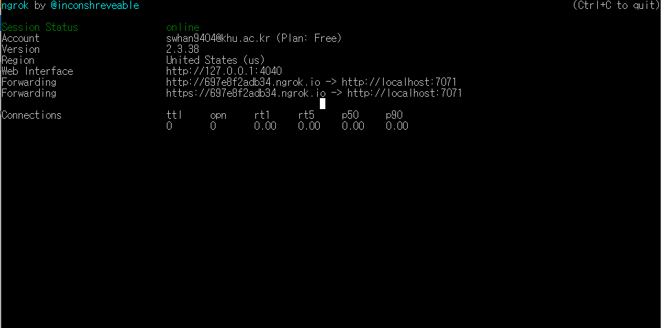
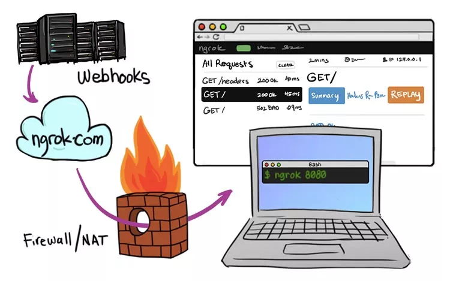

# 1. 세팅

- 설치
  - https://dashboard.ngrok.com/get-started/setup
- `c:\ngrok` 에 압축 풀기
- 토큰 연결
  - https://dashboard.ngrok.com/get-started/your-authtoken
  - 따라서 토큰 생성
  - 윈도우 유저 > ngrok2 폴더 > ngrok.yml 파일이 생김

# 2. 포트 열기

- exe 파일 실행
  - `ngrok http 7071 -host-header=localhost`
    - http  : HTTP 프로토콜로 들어오는 트래픽만을 검색
    - 7071 : 포트번호
    - `-host-header=localhost` :  옵션을 주어야 내 로컬 디버깅 환경으로 요청 데이터가 들어오는 것을 확인할 수 있다. 이 옵션이 없다면 ngrok 까지는 트래픽이 도착하지만, 내 디버깅 환경까지는 들어오지 못한다.
- 실행 화면
  - Forwarding 을 확인하면 외부에서 접근할 수 있는 링크가 주어짐

# 3. 여러 기능

## 3.1 리플레이

- [http://localhost:4040](http://localhost:4040/) 로 접근하면 현재까지 Forwarding 주소로 어떤 요청이 들어왔는지 모두 확인가능

# 4. 주의할 점

- ngrok 실행을 끝낸 이후 다시 실행시키면 해당 주소도 바뀔 뿐더러 기존의 히스토리는 남아있지 않음

  