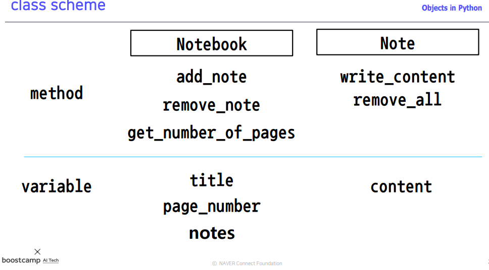
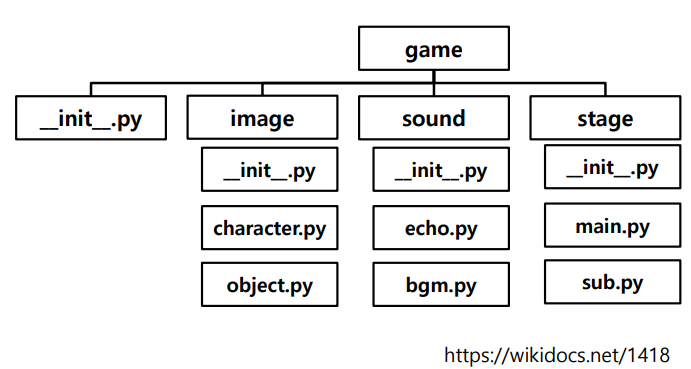

## 📄 Python Object-Oriented Programming(OOP)

**절차지향 프로그래밍**의 경우 **순차적인 전개** 로 과정 을 쉽게 파악할 수 있는 장점이 있지만 유지보수 및 코드의 재사용성은 어려움이 있을 수 있다. 이러한 문제를 해결하기 위해 기능별로 묶어 모듈화하고 모듈 재활용을 통해 코드의 재사용성을 높인 **객체지향 프로그래밍** 이 등장하게 되었다.

- 객체 : 속성(Attribute)와 행동(Action) 을 가짐
- 파이썬 역시 객체 지향 프로그램 언어

### ✏️ Class vs Instance

- **클래스는 객체를 정의하는 템플릿(설계도)** 이며, 

- **클래스(템플릿)을 바탕의 실제 구현체를 인스턴스** 라 한다.

### ✏️ Practice



```python
class Note:
    def __init__(self,content=None):
        self.content=content
    
    def write_content(self,content):
        self.content=content
    
    def remove_all(self):
        self.content=''
    
    def __add__(self,other): # Magic method
        return self.content+other.content
    
    def __str__(self): # Magic method
        return self.content
    
class NoteBook:
    def __init__(self,title):
        self.title=title
        self.page_number=1
        self.notes={}
        
    def add_note(self,note,page=0):
        if self.page_number<300:
            if page == 0:
                self.notes[self.page_number]=note
                self.page_number+=1
            else:
                self.notes[page]=note
                self.page_number+=1
        else:
            print('Page가 모두 채워졌습니다.')
    
    def remove_note(self,page_number):
        if page_number in self.notes.keys():
            return self.notes.pop(page_number)
        else:
            print('해당 페이지는 존재하지 않습니다.')
    
    def get_number_of_pages(self):
        return len(self.notes.keys())
 

note1=Note('첫번째 학습정리.')
note2=Note('두번째 학습정리.')
print(note1+note2) # __add__ ,첫번째 학습정리.두번째 학습정리.
print(note1) # __str__ , 첫번째 학습정리.

notebook=NoteBook('SSAFY')
notebook.add_note(note1,1) # note 를 page=1 에 추가, [1:note1]
notebook.add_note(note2,3) # note 를 page=3 에 추가, [3:note2]
print(notebook.notes[1]) # 첫번째 학습정리.
print(notebook.notes[3]) # 두번째 학습정리.
              
```

#### :mag_right: ​Magic Method

너무 길어서 따로 씀

https://velog.io/@swhan9404/0121-TIL-%ED%8C%8C%EC%9D%B4%EC%8D%AC-%EB%8D%94%EB%B8%94-%EC%96%B8%EB%8D%94%EC%8A%A4%EC%BD%94%EC%96%B4


### ✏️ Inheritance & Polymorphism & Visibility

#### 상속(inheritance)

- 부모클래스로부터 attribute, method를 물려받는 자식클래스 생성
- class ClassChild(ClassParent)
- super() 를 사용해 부모클래스의 속성들을 불러올 수 있음

```python
class Unit:
    # 생성자
    def __init__(self,name,power):
        # 인스턴스 변수(Attribute)
        self.name=name 
        self.power=power

    def attack(self): # 메서드(Action)
        print(f'{self.name} , 이(가) [공격력 : {self.power}] 공격합니다.')

    # 소멸자 
    def __del__(self):
        print(f'{self.name}, 이(가) 삭제되었습니다.')


class Monster(Unit):

     # 클래스 변수, 각 인스턴스들이 공유하는 변수
    count=0 

    def __init__(self,name,power,difficulty):
        super(Monster,self).__init__(name,power)
        self.difficulty=difficulty

    def show_info(self):  
        print(f'이름 : {self.name} / 공격력: {self.power} / 난이도 : {self.difficulty}')

    


monster1=Monster('몬스터1','20','초급')
Monster.count+=1 # 클래스 변수 
monster2=Monster('몬스터2','30','중급')
Monster.count+=1 # 클래스 변수 


monster1.attack()
monster1.show_info()
print('#############################')
monster2.attack()
monster2.show_info()

print(f'현재 생성된 몬스터 수 : {Monster.count}')

# 몬스터1 , 이(가) [공격력 : 20] 공격합니다.
# 이름 : 몬스터1 / 공격력: 20 / 난이도 : 초급
# #############################
# 몬스터2 , 이(가) [공격력 : 30] 공격합니다.
# 이름 : 몬스터2 / 공격력: 30 / 난이도 : 중급
# 현재 생성된 몬스터 수 : 2
# 몬스터1, 이(가) 삭제되었습니다.
# 몬스터2, 이(가) 삭제되었습니다.
```

#### 다형성(polymorphism)

- 같은 이름의 메소드의 내부 로직을 다르게 작성
- 파이썬 dynamic typing 특성으로, 같은 부모클래스의 상속에서 주로 발생
- 오버라이딩(Overriding) 또는 추상메서드(Abstract method)을 사용

```python
from abc import abstractmethod,ABCMeta

class Animal(metaclass=ABCMeta):

    def __init__(self, name): 
        self.name = name

    @abstractmethod
    def talk(self): # Abstract method, defined by convention only
        pass
        

class Cat(Animal):
        def talk(self):
            return 'Meow!'

class Dog(Animal):
    def talk(self):
        return 'Woof! Woof!'


animals = [Cat('Missy'),
        Cat('Mr. Mistoffelees'),
        Dog('Lassie')]


for animal in animals:
    print(f'{animal.name} : {animal.talk()}')

# Missy : Meow!
# Mr. Mistoffelees : Meow!
# Lassie : Woof! Woof!
```

#### 가시성(Visibility)

- 객체의 모든 정보를 파악할 필요는 없다. 만약 중요한 정보가 누군가에 의해서 값이 변경되어 기능에 큰 악영향을 끼친다면 문제가 생길것이다. 따라서 객체의 정보를 볼수 있는 레벨을 조절할 필요가 있다.
- Encapsulation , information hiding
  - 캡슐화 또는 정보 은닉 (Information Hiding)
  - Class를 설계할 때, 클래스 간 간섭/정보공유의 최소화
  - 캡슐을 던지듯, 인터페이스만 알아서 써야함
- `__variable` : private variable

```python
class Inventory:
    def __init__(self):
        self.__items = [] # private 변수로 

    #getter
    @property 
    def items(self):
        return self.__items
    #setter
    @items.setter
    def items(self,items):
        self.__items=items
    

my_inventory=Inventory()
items=my_inventory.items
items.append(4) # 리스트의 메모리 참조로 self.__items 값의 영향을 끼치게 되는 문제가 생깁니다.
print(items) # 4
print(my_inventory.items) # 4
```

위에서 private 변수를 통해 중요한 정보를 숨긴것 같지만, `my_inventory` 인스턴스의 `items`를 가져와서 바로 수정하게 되면 **메모리 참조** 로 리스트 변화가 영향을 끼치게 되어 의도치 않은 동작이 발생할 수 있다. **그래서 다음과 같이 `deepcopy` 를 통해 리스트 복사본을 넘겨주는것이 좋다.**

```python
from copy import deepcopy
class Inventory:
    def __init__(self):
        self.__items = [] # private naming convention

    #getter
    @property 
    def items(self):
        return deepcopy(self.__items)
    #setter
    @items.setter
    def items(self,items):
        self.__items=deepcopy(items)
    
        


my_inventory = Inventory()
items=my_inventory.items # getter
items.append(4)
my_inventory.items=items # setter
print(my_inventory.items) # [4]
items.append(5)
print(my_inventory.items) # [4]
```

**<참고>**
추가적으로 파이썬은 변수 자체를 `private` 속성으로 바꾸는 것이 아닌, 네이밍 컨벤션을 통해 외부에서 우연히 발견할수 없도록 이름을 **네임맹글링** 된것이다.

```null
my_inventory._Inventory__items  # 접근가능.
```

### ✏️ First-class objects

**일등함수 또는 일급객체라 불리며, 변수나 데이터 구조에 할당이 가능한 객체를 말한다. 즉, 파라미터 전달 + 리턴 값으로 사용이 가능하다. 한 예로 파이썬의 함수의 경우 일급함수이다.**

```python
def add_and_square(f,data1,data2): # parameter로 f 전달 
    return f(data1,data2)**2

def add(data1,data2):
    return data1+data2

print(add_and_square(add,2,3)) #(2+3)^2=25
```

### ✏️ Inner function & Closure

함수내에 또 다른 함수 선언할수 있다. inner function은 상위 부모함수에서만 호출이 가능하다. 즉, 부모함수를 벗어나 호출할 수 없다.

```python
def parent_function(msg):
    def child_function():
    	print(f'내부 함수입니다. 부모함수의 파라미터 "{msg}" 에 접근할수 있습니다.')
    child_function() 

parent_function('내부함수 작동.')
# 내부 함수입니다. 부모함수의 파라미터 "내부함수 작동." 에 접근할수 있습
니다.
```

그렇다면 nested function(inner function) 은 왜 사용하는 것일까?

1. **가독성**
   함수를 사용하는 이유중 하나는 반복되는 코드블록을 하나로 정의해서 효율적인 코드작성을 하기 위해서다. 마찬가지로 **중첩함수도 부모함수안에 반복되는 코드가 있다면 내부함수를 정의하여 코드를 효과적으로 관리하고 가독성을 높일수 있다.**
2. **Closure**
   **폐쇄** 의 의미를 가지는 closure 는 외부로부터 격리되어 사용되는 것을 의미한다. 즉, 부모함수가 자신의 내부에 함수나 변수를 가두어 사용하는것이다. 그리고 부모함수는 내부함수를 리턴함으로써 부모함수의 변수를 외부로부터 직접적인 접근은 격리하면서도 부모함수의 변수를 사용한 연산은 가능하게 해주는것이다.

```python
def generate_power(base_number):
    def nth_power(power):
    	return base_number**power
    return nth_power
    
calculate_power_of_two=generate_power(2) # base_number=2
print(calculate_power_of_two(7)) #2^7=128
```

### ✏️ Decorator

데코레이터 패턴은 자신의 방을 예쁜 벽지나 커튼으로 장식을 하듯이, **기존의 코드를 수정하지 않고도 여러가지 기능을 추가할 수 있게 한다.** 위에서 살펴본 **closure 와 아주 비슷한데, 차이점은 함수를 다른 함수의 인자로 전달한다는 점이다.**

```python
def decorator_function(original_function):
    def wrapper_function(*args,**kwargs):
        print (f'{original_function.__name__} 함수가 호출되기전 입니다.')
        return original_function(*args,**kwargs)
    return wrapper_function


def display():
    print ('display함수가 실행됐습니다.')


def display_info(name,age):
    print (f'display_info({name},{age}) 함수가 실행됐습니다.')

display_1 = decorator_function(display)  
display_2 = decorator_function(display_info)  

display_1()
display_2('lots-o','5')

# display 함수가 호출되기전 입니다.
# display함수가 실행됐습니다.
# display_info 함수가 호출되기전 입니다.     
# display_info(lots-o,5) 함수가 실행됐습니다.
```

파이썬에서는 다음과 같이 `@`을 사용하여 간단하게 데코레이터 구문을 제공한다.

```python
def decorator_function(original_function):
    def wrapper_function(*args, **kwargs):  #1
        print (f'{original_function.__name__} 함수가 호출되기전 입니다.')
        return original_function(*args, **kwargs)  #2
    return wrapper_function


@decorator_function
def display():
    print ('display함수가 실행됐습니다.')


@decorator_function
def display_info(name,age):
    print (f'display_info({name},{age}) 함수가 실행됐습니다.')

display()
display_info('lots-o', '5')

# display 함수가 호출되기전 입니다.
# display함수가 실행됐습니다.
# display_info 함수가 호출되기전 입니다.
# display_info(lots-o,5) 함수가 실행됐습니다.
```

```python
 def generator_power(exponent):
     def wrapper(f):
         def inner(*args):
             result = f(*args)
             return exponent ** result
         return inner
     return wrapper

 @generate_power(2)
 def raise_two(n):
     return n ** 2

 print(raise_two(7))    # 2 ** (7 ** 2)
```

------

## 📄 Module and Package

### ✏️ Module

- Module
  - 어떤 대상의 부분 혹은 조각
  - 프로그램에서는 작은 프로그램 조각들, 모듈들을 모아서 하나의 큰 프로그램을 개발함
  - 프로그램을 모듈화 시키면 다른 프로그램이 사용하기 쉬움
- Module 만들기
  - 파이썬의 Module == py 파일을 의미
  - 같은 폴더에 Module에 해당하는 .py 파일과 사용하는 .py을 저장한 후
  - import 문을 사용해서 module을 호출

- Module namespace
  - 모듈을 호출할 때 범위 정하는 방법
  - 모듈 안에는 함수와 클래스 등이 존재 가능
  - 필요한 내용만 골라서 호출 할 수 있음
  - from과 import 키워드를 사용함
  - Alias 설정하기 – 모듈명을 별칭으로 써서 : import ~ as ~
  - 모듈에서 특정 함수 또는 클래스만 호출하기 : from ~ import ~
  - 모듈에서 모든 함수 또는 클래스를 호출하기 : from ~ import *
- Built-in Modules
  - 파이썬이 기본 제공하는 라이브러리
  - 문자처리, 웹, 수학 등 다양한 모듈이 제공됨
  - 별다른 조치없이 import 문으로 활용 가능
  - 수 많은 파이썬 모듈은 어떻게 검색할 것인가?
    1) 구글신에게 물어본다
    2) 모듈을 import후 구글 검색 또는 Help 쓰기
    3) 공식 문서를 읽어본다

### ✏️ Package

- 하나의 대형 프로젝트를 만드는 코드의 묶음!이며, 

- 다양한 모듈들의 합,폴더로 연결된다.

- 다양한 오픈 소스들이 모두 패키지로 관리됨

- 패키지 만드는 법

  1) 기능들을 세부적으로 나눠 폴더로 만듦

  2) 각 폴더별로 필요한 모듈을 구현함

  3) 1차 Test – python shell

  4) 폴더별로 **init**.py 구성하기

  - 현재 폴더가 패키지임을 알리는 초기화 스크립트
  - 없을 경우 패키지로 간주하지 않음 (3.3+ 부터는 X)
  - 하위 폴더와 py 파일(모듈)을 모두 포함함
  - import와 **all** keyword 사용
    5) **main**.py 파일 만들기
    6) 실행하기 – 패키지 이름만으로 호출하기



주목할것은 **__init__.py** 인데, **현재 폴더가 패키지 임을 알리는 초기화 스크립트** 이다. 물론 3.3 버전 이상부터는 작성하지 않아도 패키지로 간주해주지만, 일반적으로 하위버전의 방식대로 작성한다.

```python
#game/__init__.py
__all__=['image','sound','stage']

from . import image
from . import sound
from . import stage
# game/image/__init__.py
__all__=['character','object']

from . import character
from . import object
# game/sound/__init__.py
__all__=['bgm','echo']

from . import bgm
from . import echo
# game/sound/echo.py
def echo_play():
    print('echo_play')
# game/stage/__init__.py
__all__=['main','sub']

from . import main
from . import sub
# game/__main__.py
from sound import echo
if __name__=="__main__":
    print('Hello game')
    echo.echo_play()
    
>>> python game
Hello game
echo
```

- Python Virtual Environment
  - 프로젝트 진행 시 필요한 패키지만 설치하는 환경
  - 기본 인터프리터 + 프로젝트 종류별 패키지 설치
  - 다양한 패키지 관리 도구를 사용함
  - 대표적인 도구 virtualenv와 conda가 있음

| **virtualenv + pip**             | **conda**                              |
| -------------------------------- | -------------------------------------- |
| 가장 대표적인 가상환경 관리 도구 | 상용 가상환경도구, miniconda 기본 도구 |
| 레퍼런스+패키지 개수             | 설치의 용이성, Windows에서 장점        |

- Package 설치
  - Windows에서는 conda
  - linux, mac에서는 conda or pip